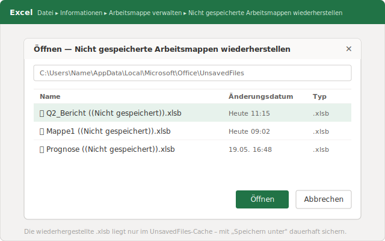
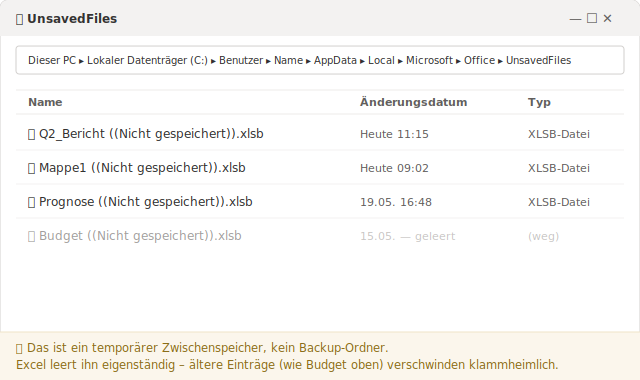

# Excel: nicht gespeicherte Datei wiederherstellen – warum der Trick beim zweiten Mal versagt

> Excel hält eine nie gespeicherte Arbeitsmappe in einem versteckten Cache vor – aber nur kurz und nur für genau einen Fehlerfall. Hier erfahren Sie, wann das reicht und wann Sie eine echte Versionsebene brauchen.

Es ist 11:15 Uhr in einem Ingenieurbüro in Augsburg. Die Kalkulation für die Ausschreibung steht seit dem frühen Morgen, drei Tabellenblätter, jede Position dreimal gegengerechnet. Dann fragt Windows nach einem Neustart wegen eines Updates, die Antwort kommt zu schnell, und auf die Rückfrage „Möchten Sie die Änderungen speichern?" rutscht der Klick auf „Nicht speichern". Die Datei ist zu. Vier Stunden Arbeit – scheinbar weg.

Wenn Sie das kennen, sind Sie nicht allein, und in den allermeisten Fällen ist die Lage besser, als sie sich anfühlt. Excel legt nämlich im Hintergrund eine Notkopie an. Aber dieser Notausgang funktioniert nur unter bestimmten Bedingungen, und er schließt sich von selbst wieder. Das versteht kaum jemand – und genau deshalb scheitert der zweite Versuch.

## Was tun Sie in den nächsten fünf Minuten, um die Datei zurückzuholen?

Öffnen Sie Excel neu und gehen Sie auf **Datei → Informationen → Arbeitsmappe verwalten → Nicht gespeicherte Arbeitsmappen wiederherstellen**. Excel öffnet einen versteckten Ordner mit temporären Notkopien. Suchen Sie die Datei mit dem passenden Zeitstempel, öffnen Sie sie und speichern Sie sie sofort an einem festen Ort. Handeln Sie zügig – der Cache bleibt nicht ewig erhalten.

Stürzt Excel ab, statt sauber geschlossen zu werden, ist der Weg sogar noch kürzer: Beim Neustart erscheint links der Bereich **Dokumentwiederherstellung** mit allen Versionen, die Excel sichern konnte. Wählen Sie die Version mit der spätesten Uhrzeit, prüfen Sie kurz den Inhalt – und speichern Sie sie unter einem klaren Namen ab. Dieser Bereich ist am verlässlichsten für Dateien, die Sie zuvor mindestens einmal gespeichert hatten. Eine komplett neue, nie gespeicherte Arbeitsmappe holen Sie dagegen sicherer über den oben genannten Weg „Nicht gespeicherte Arbeitsmappen wiederherstellen" zurück – dazu gleich mehr bei Problem A.

Ein Wort zur Reihenfolge: Speichern Sie zuerst, prüfen Sie danach. Solange die wiederhergestellte Datei nur geöffnet, aber nicht abgelegt ist, hängt Ihre ganze Arbeit weiter an einer temporären Kopie, die Excel jederzeit aufräumen darf.

## Warum ist die Datei beim nächsten Mal einfach nicht mehr da?

Weil der Notkopie-Ordner kein Archiv ist, sondern ein Zwischenspeicher. Excel legt nie gespeicherte Arbeitsmappen unter `%LocalAppData%\Microsoft\Office\UnsavedFiles` als temporäre `.xlsb`-Dateien ab und leert diesen Ordner eigenständig, nach eigenem Zeitplan, ohne nachzufragen.

Im Netz kursiert hartnäckig die „Vier-Tage"-Angabe. Vorsicht damit: In Microsofts offizieller [Anleitung zum Wiederherstellen einer früheren Version einer Office-Datei](https://support.microsoft.com/de-de/office/wiederherstellen-einer-fr%C3%BCheren-version-einer-office-datei-169cb166-e7e2-438e-8f39-9a8927828121) taucht diese Frist nicht als Zusage auf – die Seite zeigt nur den Weg dorthin, nicht, wie lange die Kopie bleibt. In der Praxis ist der Ordner oft schon früher leer: nach einem Neustart oder sobald genügend neuere Einträge nachrücken. Behandeln Sie eine wiederhergestellte Datei deshalb als temporär, bis Sie sie mit **Speichern unter** an einen festen Ort gelegt haben.

Wichtig für viele Büros in Deutschland: Wer aus gutem Grund lokal oder auf dem Netzlaufwerk arbeitet – Kanzleien, Steuerberater, kleine Ingenieur- und Architekturbüros, die ihre Mandanten- und Projektdaten aus Datenschutzgründen bewusst nicht in die Cloud legen – bekommt von diesem Cache keine dauerhafte Sicherheit. Der UnsavedFiles-Ordner ist ein Notbehelf für den Einzelfall, kein Ersatz für eine Versionshistorie.

## Warum scheitern so viele Anleitungen bei „nicht gespeichert"?

Weil „ich habe meine nicht gespeicherte Excel-Datei verloren" in Wahrheit zwei verschiedene Notfälle sind – und Excel beide durch dieselbe Tür schickt. Wer sie nicht trennt, greift zur falschen Rettung. Deshalb hier die saubere Unterscheidung, denn nur für einen der beiden ist der Cache überhaupt gedacht.

**Problem A – die Datei wurde nie gespeichert.** Sie haben eine neue Arbeitsmappe angelegt, eine Stunde getippt, dann stürzt Excel ab oder Sie klicken versehentlich auf „Nicht speichern". Es gibt keine Datei auf der Festplatte, nie gegeben. Hier ist der UnsavedFiles-Cache Ihre einzige Chance – und genau dafür wurde er gebaut. Der oben beschriebene Weg über **Arbeitsmappe verwalten** ist hier goldrichtig.

**Problem B – die Datei existierte längst, der Vormittag ist trotzdem weg.** Die Kalkulation lag seit Wochen auf dem Server. Heute haben Sie sie überarbeitet, aus Versehen einen falschen Stand darübergespeichert oder einen halben Tag Arbeit überschrieben. Die Datei ist da – nur in der falschen Fassung. Und hier hilft der Cache fast nie weiter: Er ist für nie gespeicherte Dateien zuständig, nicht dafür, Ihnen den Stand von 09:30 Uhr aus einer Datei zu fischen, die Sie seither dreimal gespeichert haben.

Genau das ist die Suche, die viele unter „überschriebene Datei wiederherstellen ohne Vorgängerversion" eintippen – nämlich dann, wenn der Windows-Dateiversionsverlauf für diesen Ordner gar nicht eingeschaltet war und die Liste der Vorgängerversionen leer bleibt. Für Problem B brauchen Sie keinen Notausgang. Sie brauchen eine dauerhafte Versionsebene, die mitschreibt, bevor etwas schiefgeht.

## Wie bekommen Sie eine Versionshistorie, die auch lokal greift?

Indem eine Ebene unter Ihren Speichervorgängen mitarbeitet, die nicht erst im Notfall einspringt, sondern durchgehend Zwischenstände festhält. Genau das macht [Keeply](https://keeply.work): Sie richten es einmal auf den Ordner, in dem Ihre Dateien liegen, und es hält im Hintergrund automatisch Versionen fest – nach einem Zeitplan, den Sie selbst bestimmen.

Den Takt stellen Sie ein: alle 15, 30 oder 60 Minuten, voreingestellt sind 30. Dazu gibt es einen manuellen Knopf **„Version speichern"**, mit dem Sie einen Meilenstein festhalten und mit einer einzeiligen Notiz versehen können – etwa „Stand vor Korrektur durch den Mandanten". Wenn dann der Vormittag verloren geht, fischen Sie nicht mehr im Cache herum. Sie öffnen die Zeitleiste der Datei und wählen die 11:15-Version aus.

Ein Punkt, der oft falsch verstanden wird: Keeply hängt sich **nicht** an Ihre Tastenkombination. Strg+S löst keine neue Keeply-Version aus, und Keeply ist kein Dienst, der bei jedem Speichern mithorcht. Es arbeitet nach dem eingestellten Zeitplan plus auf Knopfdruck – das ist alles. Wer lieber wissen will, was unter der Haube passiert: Keeply nutzt intern eine Git-Engine, jede festgehaltene Version ist unveränderlich abgelegt. Sie müssen dafür aber keinen einzigen Befehl tippen und nichts von Git verstehen – die Bedienung läuft komplett über die Zeitleiste.

## Wo hilft Keeply ausdrücklich nicht?

Eine ehrliche Versionshistorie ist kein Allheilmittel, und es gehört zur Wahrheit, die Grenzen klar zu benennen. In diesen drei Fällen rettet Sie Keeply nicht:

**Eine nie gespeicherte neue Datei in einem nicht überwachten Ordner.** Wenn Sie eine frische Arbeitsmappe öffnen, eine Stunde tippen und sie nie in den überwachten Ordner legen, kann Keeply nichts festhalten – es gibt für ihn nichts zu sehen. Das bleibt Problem A und damit Excels Cache-Aufgabe.

**Stille Dateibeschädigung.** Wird eine Excel-Datei nach und nach korrupt, ohne dass eine Fehlermeldung erscheint, hält Keeply den kaputten Stand brav mit fest – treu, aber wertlos. Eine Versionshistorie sichert, was Sie ihr geben; sie prüft nicht, ob der Inhalt heil ist.

**Dateien außerhalb des überwachten Ordners.** Der USB-Stick, den Sie nie hinzugefügt haben, das Netzlaufwerk eines Kollegen, der private Download-Ordner – was nicht unter Beobachtung steht, taucht in keiner Zeitleiste auf.

## Wann reichen Excels Bordmittel völlig aus?

Oft genug – und dann brauchen Sie gar keine zusätzliche Ebene. Für eine Wegwerf-Berechnung, die Sie ohnehin nach einer Stunde löschen, ist jeder Aufwand zu viel. Speichern Sie zwischendurch, fertig.

Auch wer konsequent in OneDrive oder SharePoint mit aktivem **AutoSpeichern** arbeitet, ist für viele Fälle gut abgesichert: Der eingebaute **Versionsverlauf** dort deckt das Zurückspringen auf frühere Stände solide ab. Drei Einschränkungen sollten Sie trotzdem kennen: Diese Historie hängt an der synchronisierten Cloud-Kopie, der gespeicherte Verlauf ist nach oben gedeckelt, und AutoSpeichern schreibt fortlaufend weiter, statt Sie zu fragen – ein falscher Stand wird also genauso brav übernommen wie ein richtiger. Für Büros, die aus Datenschutzgründen bewusst lokal bleiben, fällt dieser Weg ohnehin weg.

Die ehrliche Faustregel: Wenn der Verlust eines Vormittags für Sie verkraftbar ist, reichen die Bordmittel. Wenn ein verlorener Vormittag eine verpasste Ausschreibungsfrist oder eine peinliche Rückfrage beim Mandanten bedeutet, lohnt sich eine durchgehende Versionsebene.

## Häufige Fragen

**Wo finde ich nicht gespeicherte Excel-Dateien auf meinem Rechner?**
Nie gespeicherte Arbeitsmappen liegen unter `%LocalAppData%\Microsoft\Office\UnsavedFiles` als temporäre `.xlsb`-Dateien. Am einfachsten erreichen Sie den Ordner über **Datei → Informationen → Arbeitsmappe verwalten → Nicht gespeicherte Arbeitsmappen wiederherstellen**. Speichern Sie eine gefundene Datei sofort an einem festen Ort ab, denn Excel leert diesen Ordner eigenständig.

**Wie lange bewahrt Excel nicht gespeicherte Dateien auf?**
Microsoft nennt in seiner offiziellen Anleitung keine verbindliche Aufbewahrungsdauer. Die kursierende „Vier-Tage"-Angabe ist keine Zusage – die Notkopien können nach einem Neustart oder sobald neuere Einträge nachrücken auch früher verschwinden. Stellen Sie eine verlorene Datei deshalb so schnell wie möglich wieder her und speichern Sie sie dauerhaft.

**Kann ich eine überschriebene Excel-Datei zurückholen, wenn der Dateiversionsverlauf leer ist?**
Wenn der Windows-Dateiversionsverlauf für den Ordner nie eingeschaltet war, bleibt die Liste der Vorgängerversionen leer – dann hilft auch der UnsavedFiles-Cache meist nicht, weil er nur für nie gespeicherte Dateien zuständig ist. Für überschriebene Stände brauchen Sie eine Versionsebene, die mitschreibt, bevor der Fehler passiert.

**Hilft mir Keeply, wenn ich versehentlich den Stand von heute Morgen überschrieben habe?**
Ja, genau dafür ist es gedacht. Liegt die Datei in einem von Keeply überwachten Ordner, hält Keeply nach Ihrem eingestellten Zeitplan – alle 15, 30 oder 60 Minuten – automatisch Versionen fest. Sie öffnen die Zeitleiste der Datei und wählen den Stand von heute Morgen aus, statt im versteckten Cache zu suchen. Voraussetzung: Der Ordner muss vorher hinzugefügt worden sein.

**Reicht OneDrive mit AutoSpeichern nicht völlig aus?**
Für viele Fälle ja. Der Versionsverlauf in OneDrive und SharePoint deckt das Zurückspringen auf frühere Stände gut ab. Er hängt aber an der synchronisierten Cloud-Kopie, der gespeicherte Verlauf ist gedeckelt, und AutoSpeichern überschreibt fortlaufend, ohne nachzufragen. Wer aus Datenschutzgründen bewusst lokal oder auf dem Netzlaufwerk arbeitet, braucht eine Lösung, die auch dort greift.

## Weiterführend

- [Keeply – Versionshistorie für Ihre lokalen Dateien und Netzlaufwerke](https://keeply.work)
- [Microsoft-Support: Wiederherstellen einer früheren Version einer Office-Datei](https://support.microsoft.com/de-de/office/wiederherstellen-einer-fr%C3%BCheren-version-einer-office-datei-169cb166-e7e2-438e-8f39-9a8927828121)

---
*Von Ting-Wei Tsao, Gründer von Keeply, [LinkedIn](https://www.linkedin.com/in/ting-wei-tsao-b57480152)*
