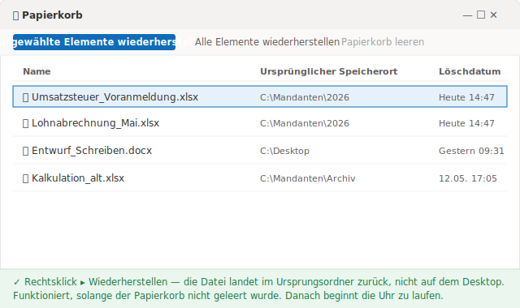

# Gelöschte Excel-Datei wiederherstellen: 5 Wege in der Reihenfolge der Zeit, die Ihnen bleibt

> Datei noch im Papierkorb? Fünf Sekunden. Schon geleert? Die Uhr läuft – und sie läuft gegen Sie.

Es ist 14:47 Uhr an einem Donnerstag in einem Steuerbüro in Münster. Sie haben den Mandantenordner aufgeräumt, ein ganzes Bündel alter Tabellen markiert und in einem Rutsch gelöscht, damit endlich Ordnung herrscht. Zwei Minuten später fällt es Ihnen auf: Mitten in dem Bündel war auch die Lohnabrechnung für den Monat, an der Sie den ganzen Vormittag gerechnet haben. Sie öffnen den Papierkorb. Leer – Sie haben ihn gleich mit geleert, ohne nachzudenken.

Ab hier entscheidet nicht die Frage, welche Methode Sie wählen. Es entscheidet, **wie viel Zeit Ihnen noch bleibt.** Eine Excel-Datei, die gerade erst im Papierkorb gelandet ist, holen Sie fast garantiert zurück. Eine endgültig gelöschte Datei ist eine andere Geschichte: Jede Minute, jeder neue Schreibvorgang auf der Festplatte drückt Ihre Chance eine Stufe tiefer.

Deshalb sortiert dieser Leitfaden die Wege nicht nach „leicht oder schwer". Er sortiert sie nach **Dringlichkeit**: Weg 1 ist für den Fall, dass die Datei noch da ist; Weg 4 für den Fall, dass fast nichts mehr übrig ist. Arbeiten Sie sich von oben nach unten durch.

## Weg 1: direkt aus dem Papierkorb wiederherstellen

Das ist der entspannte Fall, und hier endet die Mehrheit aller „aus Versehen gelöscht"-Geschichten gut. Wenn Sie die normale Entf-Taste drücken, löscht Windows die Datei nicht – es verschiebt sie nur in den **Papierkorb**. Dort bleibt die Excel-Datei vollständig erhalten, bis Sie den Papierkorb leeren oder er von selbst abläuft.

Öffnen Sie den **Papierkorb** auf dem Desktop, suchen Sie die Datei, klicken Sie mit der rechten Maustaste darauf und wählen Sie **Wiederherstellen**. Sie landet exakt im ursprünglichen Ordner zurück, nicht auf dem Desktop. Fertig.

Standardmäßig bewahrt Windows gelöschte Dateien hier auf, bis Sie den Papierkorb leeren oder sein Speicherplatz überschritten wird. Es gibt aber zwei Fallen, die den Papierkorb leer aussehen lassen, ohne dass Sie ihn geleert haben:

- Sie haben mit **Shift+Entf** gelöscht – diese Tastenkombination überspringt den Papierkorb und löscht direkt.
- Die Datei war größer als der maximale Papierkorb-Speicher, also hat Windows sie sofort entfernt, statt sie zu behalten.

Trifft einer dieser Fälle zu, hilft der Papierkorb nicht. Gehen Sie zum nächsten Weg.

## Weg 2: die Löschung rückgängig machen, wenn Sie gerade erst danebengegriffen haben

Wenn Sie eben gelöscht und seitdem nichts weiter getan haben, ist das die schnellste Abkürzung – schneller noch, als den Papierkorb zu öffnen. Drücken Sie im Datei-Explorer **Strg+Z**. Oder klicken Sie mit der rechten Maustaste auf eine freie Stelle in genau dem Ordner, der die Datei enthielt, und wählen Sie **Löschen rückgängig machen**. Windows legt die Datei sofort wieder an ihren Platz.

Das Gute an diesem Weg: Er setzt die Datei an die richtige Stelle zurück, selbst wenn sie schon im Papierkorb gelandet war. Das Schlechte: Er lebt nur ein paar Aktionen lang. Haben Sie ein paar weitere Fenster geöffnet, andere Dateien kopiert oder den Rechner ausgeschaltet, ist der Rückgängig-Verlauf weg.

Kurz gesagt: Strg+Z ist der Reflex der ersten zwei Minuten. Ist dieses Fenster zu, brauchen Sie einen anderen Weg.

## Weg 3: Vorherige Versionen wiederherstellen – wenn Sie das vorher eingeschaltet hatten

Hier wird die Grenze deutlich: Von diesem Weg an hängt das Gelingen davon ab, **was Sie vor dem Vorfall getan – oder zu tun vergessen – haben.**

Windows hat eine Funktion namens **Dateiversionsverlauf** (File History), die automatisch frühere Versionen der von Ihnen ausgewählten Ordner sichert. Ist sie eingeschaltet, klicken Sie mit der rechten Maustaste auf den Ordner, der die verlorene Datei enthielt, wählen **Vorherige Versionen wiederherstellen** und Windows listet die Sicherungspunkte nach Datum zum Auswählen auf. Genau diesen Weg beschreibt Microsoft in der Anleitung zum [Sichern und Wiederherstellen mit dem Dateiversionsverlauf](https://support.microsoft.com/de-de/windows/sichern-und-wiederherstellen-mit-dateiversionsverlauf-7bf065bf-f1ea-0a78-c1cf-7dcf51cc8bfc).

Und hier ist die Falle, die kaum eine Anleitung klar benennt: **Der Reiter „Vorherige Versionen" zeigt nur dann etwas, wenn der Dateiversionsverlauf schon vorher eingeschaltet war.** Microsoft schreibt selbst, dass die Funktion erst „nach der Aktivierung" Ihre Dateien überwacht. Haben Sie sie nie aktiviert, bleibt die Liste leer – es gibt nichts zum Wiederherstellen. Windows beginnt erst nach dem Einschalten aufzuzeichnen; die Vergangenheit rekonstruiert es nicht.

Auf einem privaten Rechner oder im PC eines kleinen Büros ohne IT – der Fall vieler Steuerberater, Anwälte und Ingenieurbüros – ist diese Funktion ab Werk fast nie eingeschaltet. Trifft das auf Sie zu, bleibt die Liste leer, und es bleibt Ihnen nur der letzte Weg.

Wer die Datei in OneDrive oder SharePoint liegen hatte, hat eine bessere Ausgangslage: Dort lässt sich über **Datei → Informationen** und [eine frühere Version einer Office-Datei wiederherstellen](https://support.microsoft.com/de-de/office/wiederherstellen-einer-fr%C3%BCheren-version-einer-office-datei-169cb166-e7e2-438e-8f39-9a8927828121), und der Cloud-Papierkorb fängt die gelöschte Datei zusätzlich auf – dazu unten mehr.

## Weg 4: Datenrettungssoftware – und hören Sie sofort auf, die Festplatte zu benutzen

Wenn Sie hier ankommen, wurde die Datei wirklich endgültig gelöscht und keine Ihrer Sicherungsebenen hat sie aufgefangen. Übrig bleibt, die physische Festplatte mit einer Datenrettungssoftware abzusuchen – etwa **Recuva** (kostenlos, leichtgewichtig) oder **Disk Drill** (kostenpflichtige Version, robuster). Diese Werkzeuge lesen die Festplatte und versuchen, Bereiche zu retten, die das System als „gelöscht" markiert, aber noch nicht neu beschrieben hat.

Bevor Sie irgendetwas installieren, ist eine Handlung wichtiger als die Software selbst: **Hören Sie sofort auf, die betroffene Festplatte zu benutzen.** Wird eine Datei endgültig gelöscht, verschwinden die Daten nicht augenblicklich – das System markiert den Platz nur als frei. Microsoft bestätigt das in der Dokumentation zur [Windows File Recovery](https://support.microsoft.com/de-de/windows/windows-file-recovery-61f5b28a-f5b8-3cc2-0f8e-a63cb4e1d4c4): „Im Windows-Dateisystem wird der von einer gelöschten Datei belegte Speicherplatz als freier Speicherplatz markiert, was bedeutet, dass die Dateidaten weiterhin vorhanden und wiederhergestellt werden können." Deshalb rät dieselbe Seite, um Ihre Chancen zu erhöhen, „minimieren oder vermeiden Sie die Verwendung Ihres Computers" – jeder neue Schreibvorgang kann genau auf dem landen, was Sie retten wollen.

Und hier ist der Teil, den die wenigsten kennen: **Auf einer SSD schließt sich das Zeitfenster viel schneller als auf einer HDD.** Microsofts eigene Seite warnt, „dass der freie Speicherplatz überschrieben wurde, insbesondere auf einem Solid State Drive (SSD)". Verantwortlich ist ein Mechanismus namens TRIM, der die als gelöscht markierten Blöcke von sich aus räumt, damit die SSD schnell bleibt. Ist TRIM einmal durchgelaufen – meist wenige Minuten nach dem Löschen –, findet selbst ein forensisches Werkzeug nichts mehr: Es durchsucht zwar, aber es gibt keine Daten mehr zu lesen. Auf einer HDD ist das Fenster größer, aber die Datei kann bereits teilweise überschrieben sein.

Daraus folgen zwei goldene Regeln: **Installieren Sie die Software nicht auf derselben Festplatte wie die verlorene Datei, und speichern Sie die geretteten Daten nicht auf diese Festplatte zurück** – beide Schritte riskieren, genau das zu überschreiben, was Sie zu retten versuchen.

## Wann Sie gar nichts wiederherstellen müssen

Haben Sie gemerkt, was die vier Wege gemeinsam haben? Je weiter unten, desto mehr hängt Ihre Chance von Glück und Tempo ab. Auf Weg 4 wetten Sie darauf, dass TRIM noch nicht gelaufen ist und die Festplatte noch nichts neu geschrieben hat – eine Wette, die oft teuer ausgeht.

Es gibt eine völlig andere Richtung, und sie liegt nicht in „schneller retten". Sie liegt darin, **dass ein versehentliches Löschen gar nicht erst zum Notfall wird.** Die Idee ist schlicht: Statt zu hoffen, eine Datei von der Festplatte zu fischen, nachdem sie schon weg ist, halten Sie vorab die Versionen eines ganzen **Ordners** fest. Dann verschwindet eine gelöschte Datei nicht – sie bleibt im Verlauf, und Sie holen sie mit einem Klick zurück.

Genau das macht [Keeply](https://keeply.work): Sie richten es einmal auf den Ordner, in dem Ihre Dateien liegen – auf dem Rechner oder auf einem Netzlaufwerk der Firma –, und es hält im Hintergrund Versionen dieses Ordners fest, in einem Takt, den **Sie** bestimmen: alle 15, 30 oder 60 Minuten, voreingestellt sind 30. Wird eine Excel-Datei aus dem überwachten Ordner gelöscht, bleibt sie vollständig in der Versions-Zeitleiste; Sie öffnen sie, suchen die letzte Version vor dem Löschen und stellen sie wieder her.

Der Unterschied, der alles trägt: Keeply löst **nicht** bei jedem Strg+S aus und hört auch **nicht** bei jedem Speichern mit. Es folgt seiner eigenen Uhr, immer im Hintergrund. Dazu gibt es einen Knopf **„Version speichern"**, mit dem Sie von Hand einen wichtigen Moment markieren und mit einer einzeiligen Notiz versehen können – etwa „vor dem Versand ans Finanzamt". Und weil die Versionen schon vor dem Löschen festgehalten werden, passiert die Wiederherstellung, **bevor** die Daten zu „überschreibbarem Speicher" werden – kein Wettlauf gegen TRIM, keine Wette auf eine Datenrettungssoftware.

Dieselbe Versionsebene deckt Sie gegen ein Risiko ab, das größer ist als das versehentliche Löschen: dass die **Festplatte selbst ausfällt.** Mit nur einer Platte verlieren Sie bei einem Defekt alles. Keeply hält Ihre Daten in einer 3-2-1-Anordnung – eine lokale Kopie, eine Hauptkopie und ein Spiegel an einem anderen Ort –, sodass eine defekte Platte nicht Ihre Arbeit mitnimmt. (Das ist der zweite Schutz; im Mittelpunkt steht hier weiterhin das Zurückholen einer versehentlich gelöschten Datei.) Unter der Haube wird jede festgehaltene Version unveränderlich abgelegt und nicht überschrieben – das ist interne Mechanik. Sie tippen dafür keinen einzigen Befehl und müssen die Technik dahinter nicht verstehen, damit es funktioniert.

## Wo Keeply ausdrücklich nicht hilft

Kein Werkzeug deckt alles ab, und so zu tun als ob, lässt Sie nur an der falschen Stelle vertrauen. Drei Situationen, in denen Keeply nicht die Antwort ist:

- **Eine Datei, die nie in einem überwachten Ordner lag.** Ist die gelöschte Datei nie durch den Ordner gelaufen, den Keeply beobachtet, gibt es keine Spur von ihr. Dann gelten die Wege 1 bis 4 von oben – und jede Minute zählt wieder.
- **Eine Datei, die vor der Installation von Keeply verloren ging.** Keeply hält ab dem Moment Versionen fest, in dem Sie ihm den Ordner übergeben. Eine letzte Woche endgültig gelöschte Datei, als noch keine Ebene da war, hängt weiter an der Datenrettungssoftware – mit allem Risiko, das dazugehört.
- **Stille Dateibeschädigung.** War die Excel-Datei bereits beschädigt, als eine Version festgehalten wurde, sichert Keeply treu die beschädigte Fassung. Versionieren ist nicht Reparieren.

Kurz: Keeply kümmert sich um die **Zukunft** – damit das nächste versehentliche Löschen kein Problem mehr ist. Eine Datei, die schon vorher verloren ging, gehört noch den vier Wegen weiter oben.

## Wann die Werkzeuge, die Sie schon haben, ausreichen

Es lohnt sich keine zusätzliche Ebene, wenn Ihre Dateien ohnehin gut geschützt sind. Liegen sie in **OneDrive** oder **SharePoint**, haben Sie zwei starke Schutzschilde gratis.

Der erste ist der **Cloud-Papierkorb**, der die gelöschte Datei recht lange aufbewahrt: Bei einem persönlichen Konto sind es **30 Tage**, bei einem Geschäfts-, Schul- oder Unikonto **93 Tage**, so die [Microsoft-Dokumentation zum Wiederherstellen gelöschter Dateien in OneDrive](https://support.microsoft.com/de-de/office/gel%C3%B6schte-dateien-oder-ordner-in-onedrive-wiederherstellen-949ada80-0026-4db3-a953-c99083e6a84f). Das ist ein deutlich größeres Fenster als beim lokalen Löschen.

Der zweite ist der **Versionsverlauf**, mit dem Sie zu älteren Ständen derselben Datei zurückspringen. Er hat aber eine klare Obergrenze: Bei einem persönlichen Microsoft-Konto rufen Sie nur die [letzten 25 Versionen](https://support.microsoft.com/de-de/office/wiederherstellen-einer-fr%C3%BCheren-version-einer-in-onedrive-gespeicherten-datei-159cad6d-d76e-4981-88ef-de6e96c93893) ab. Für eine Datei, die sich ständig ändert, decken 25 Versionen vielleicht nur die letzten Tage ab.

Dieser Cloud-Schutz ist großartig – aber er gilt nur für Dateien, die **wirklich** im mit der Cloud synchronisierten Ordner liegen. Für viele Selbstständige, Steuerberater oder Anwälte, die aus Datenschutzgründen bewusst lokal oder auf dem Netzlaufwerk der Kanzlei arbeiten – nichts synchronisiert, keine IT, die den Dateiversionsverlauf einschaltet –, kommen weder der Cloud-Papierkorb noch dieser Versionsverlauf zum Einsatz. Und genau dort zeigt eine Versionsebene im Hintergrund ihren Wert.

## Häufige Fragen

**Eine aus dem Papierkorb gelöschte (oder mit Shift+Entf entfernte) Excel-Datei – wohin geht sie, und lässt sie sich wiederherstellen?**
Wenn Sie den Papierkorb leeren oder mit Shift+Entf löschen, entfernt Windows die Daten nicht sofort – der belegte Speicherplatz wird nur als frei markiert. Laut Microsoft können die Dateidaten weiterhin vorhanden und wiederherstellbar sein, bis etwas Neues darübergeschrieben wird. Es besteht also eine Chance, aber sie sinkt mit jedem weiteren Schreibvorgang auf der Festplatte – auf einer SSD mit TRIM oft schon nach wenigen Minuten.

**Wie stelle ich eine endgültig gelöschte Excel-Datei wieder her, nachdem der Papierkorb geleert wurde?**
Versuchen Sie es in der Reihenfolge der Dringlichkeit: (1) wenn Sie gerade gelöscht haben, drücken Sie **Strg+Z** oder klicken Sie mit der rechten Maustaste in den Ordner und wählen Sie **Löschen rückgängig machen**; (2) klicken Sie mit der rechten Maustaste auf den Ursprungsordner und prüfen Sie **Vorherige Versionen wiederherstellen** – das listet aber nur etwas, wenn der **Dateiversionsverlauf** vorher eingeschaltet war; (3) zuletzt eine Datenrettungssoftware, und hören Sie dabei sofort auf, die betroffene Festplatte zu benutzen, damit die Datei nicht überschrieben wird.

**Stellt eine Datenrettungssoftware die Datei immer wieder her?**
Nein. Die Erfolgsquote ist hoch, wenn Sie früh handeln und die Festplatte noch nicht überschrieben wurde, sinkt aber mit der Zeit und mit jedem neuen Schreibvorgang stark. Auf einer SSD räumt der TRIM-Befehl die markierten Blöcke binnen Minuten weg – danach findet auch ein forensisches Werkzeug nichts mehr. Installieren Sie die Software nicht auf derselben Festplatte und speichern Sie die gerettete Datei nicht dorthin zurück.

**Wie lange bewahrt OneDrive eine gelöschte Excel-Datei auf?**
Laut Microsoft bleibt eine gelöschte Datei im OneDrive-Papierkorb **30 Tage** bei einem persönlichen Konto und **93 Tage** bei einem Geschäfts-, Schul- oder Unikonto. Zusätzlich hält der Versionsverlauf bei einem persönlichen Konto die **letzten 25 Versionen** jeder Datei vor. Beide Fenster gelten aber nur für Dateien, die tatsächlich im mit der Cloud synchronisierten Ordner liegen.

**Ist Keeply eine Datenrettungssoftware wie Recuva oder Disk Drill?**
Nein, das sind verschiedene Ebenen. Recuva und Disk Drill durchsuchen die physische Festplatte und versuchen, bereits als gelöscht markierte Bytes zu retten – eine Wette gegen die Zeit. Keeply hält intakte Versionen eines Ordners fest, schon bevor eine Datei gelöscht wird; die Wiederherstellung passiert also, bevor die Daten zu überschreibbarem Speicher werden. Keeply ist das Werkzeug, das dafür sorgt, dass Sie Recuva gar nicht erst brauchen.

## Weiterführend

- [Keeply – eine Versionsebene, die Ihre Ordner im Hintergrund festhält](https://keeply.work), auf dem Rechner oder dem Netzlaufwerk, damit eine versehentlich gelöschte Datei vollständig im Verlauf bleibt und mit einem Klick zurückkommt.
- [Sichern und Wiederherstellen mit dem Dateiversionsverlauf – Microsoft-Support](https://support.microsoft.com/de-de/windows/sichern-und-wiederherstellen-mit-dateiversionsverlauf-7bf065bf-f1ea-0a78-c1cf-7dcf51cc8bfc) – der vollständige Weg über Dateiversionsverlauf und Vorherige Versionen.
- [Windows File Recovery – Microsoft-Support](https://support.microsoft.com/de-de/windows/windows-file-recovery-61f5b28a-f5b8-3cc2-0f8e-a63cb4e1d4c4) – Kommandozeilen-Werkzeug für Dateien, die den Papierkorb schon verlassen haben, mit dem Hinweis zu Überschreiben und SSD.
- [Gelöschte Dateien oder Ordner in OneDrive wiederherstellen – Microsoft-Support](https://support.microsoft.com/de-de/office/gel%C3%B6schte-dateien-oder-ordner-in-onedrive-wiederherstellen-949ada80-0026-4db3-a953-c99083e6a84f) – Aufbewahrungsfristen im Cloud-Papierkorb (30 Tage persönlich / 93 Tage geschäftlich).

---
*Von Ting-Wei Tsao, Gründer von Keeply, [LinkedIn](https://www.linkedin.com/in/ting-wei-tsao-b57480152)*
