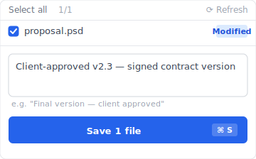
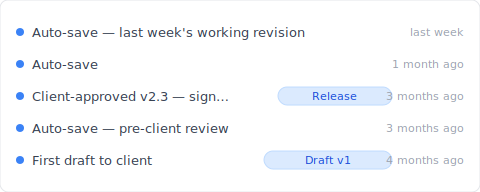
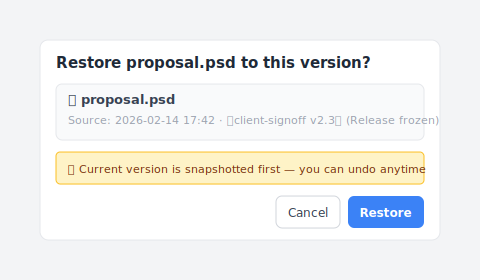

# 【2026 File Management】3-2-1 backup rule: spatial redundancy, not temporal

> The 3-2-1 rule hasn't changed in 20 years. What you're afraid of has.

In 2005, photographer **Peter Krogh** wrote his backup rule into existence: 3 copies, 2 different media, 1 stored offsite. He was protecting against tape decay, dropped hard drives, server-room fires.

Twenty years later, you're afraid of **overwriting the wrong version**. Of a teammate editing the shared folder wrong. Of a client calling three months later asking for the version they signed off back then.

The 3-2-1 rule never moved, but your real threat did — and the 3-2-1 design never addressed this new layer. This piece breaks down what 3-2-1 covers, what it misses, then shows you how [Keeply](https://keeply.work) handles 3-2-1 plus version history in one tool.

## TL;DR

The **3-2-1 backup rule** is necessary: three copies, two media types, one offsite. It protects against hardware failure, office fire, ransomware — the disasters. But it was never designed to handle **operator-error**: you overwriting your own version, cloud sync replicating the broken file to all three copies. This piece breaks down what 3-2-1 covers, what it misses, and how Keeply closes the gap.

## Contents

1. [Peter Krogh's 3-2-1 backup rule: 3 copies, 2 media, 1 offsite](#what-is-the-3-2-1-backup-rule)
2. [What does 3-2-1 protect against — and what doesn't it?](#what-does-3-2-1-protect-against-and-what-doesnt-it)
3. [Why you still lose files: "3" is spatial redundancy, not temporal](#why-does-3-2-1-still-let-you-lose-files)
4. [How Keeply does 3-2-1 + version history + Release freeze in one tool](#can-one-tool-handle-3-2-1-plus-version-history)
5. [Three scenarios where you don't need Keeply or similar](#when-not-needed)
6. [FAQ](#faq)

---

## Peter Krogh's 3-2-1 backup rule: 3 copies, 2 media, 1 offsite {#what-is-the-3-2-1-backup-rule}

The 3-2-1 backup rule means keeping **3 copies** of your data, on **2 different storage media**, with **1 copy stored offsite**. It comes from photographer Peter Krogh's [*The DAM Book* (O'Reilly, 2005)](https://www.oreilly.com/library/view/the-dam-book/9780596008550/), and [CISA still recommends it as the standard for backing up data](https://www.cisa.gov/audiences/small-and-medium-businesses/secure-your-business/back-up-business-data):

- **3 copies** of your data: the original plus 2 backups
- **2 storage media**: e.g. local drive plus cloud, or NAS plus external SSD
- **1 copy stored offsite**: physically separated from the rest

In 2005, the dominant media were tape, CD/DVD, and mechanical hard drives. Failure rates were high, media aged fast. The rule's design intent was clear: **make sure no single hardware failure, media degradation, or facility disaster can wipe out your files**.

Hardware is much more reliable in 2026. But 3-2-1 still saves the same thing — files going missing. The next scenario isn't in its design scope.

## What does 3-2-1 protect against — and what doesn't it? {#what-does-3-2-1-protect-against-and-what-doesnt-it}

3-2-1 protects against everything that makes a file *disappear* — hard drive failure, office fire, ransomware encryption (which [hit 59% of organizations in the past year, per Sophos's 2024 survey of 5,000 IT leaders across 14 countries](https://www.sophos.com/en-us/blog/the-state-of-ransomware-2024)). It doesn't protect against the file still being there but wrong — you overwriting your own version, a teammate editing the wrong shared folder, you needing the proposal from three months ago.

And that second category isn't an edge case. In [Handy Recovery's 2024 data-loss survey](https://www.handyrecovery.com/data-loss-statistics/), roughly three in four computer owners said they'd deleted important data by accident, and accidental deletion ranked as the single most common cause of data loss — ahead of hardware failure. 3-2-1 is silent on every one of those moments.

To see where 3-2-1 holds, look at what "losing a file" actually looks like:

| Scenario | Does 3-2-1 save you? | Why |
| --- | :---: | --- |
| Hard drive fails | ✅ | 3 copies on different media |
| Office burns down | ✅ | 1 copy is offsite |
| Ransomware encryption | ✅ (offsite copy untouched) | Offsite isolation |
| **You overwrite your own version** | ❌ | All 3 copies sync to the new version |
| **Teammate edits the wrong file** | ❌ | Same as above |
| **Need a version from 3 months ago** | ❌ | 3-2-1 isn't version history |

That's exactly the frustration. 3-2-1 protects "the file is gone." It doesn't address "the file is still there but wrong."

Sam is a designer. Monday morning, 10:32 AM, a client calls asking for the proposal version they signed off three months ago. Sam opens the NAS. 12 files — `proposal.psd`, `proposal_v2.psd`, `proposal_FINAL.psd`, `proposal_FINAL_FINAL.psd` — and three cloud copies of every one showing the current latest.

But Sam doesn't want the latest. He wants the version from three months ago.

3-2-1 dutifully protected the wrong version, three times.

## Why you still lose files: "3" is spatial redundancy, not temporal {#why-does-3-2-1-still-let-you-lose-files}

Here's a 20-year-old blind spot no one names plainly: **the "3" in "3 copies" is spatial redundancy, not temporal redundancy.**

In 2005, drive lifetimes were short and media was fragile. Multiple copies fought physical decay. "3" was a sensible answer.

In 2026, drives are reliable — [Backblaze's 2024 drive report put the annualized failure rate across its 300,000+ drives at 1.57%, down from 1.70% a year earlier](https://www.backblaze.com/blog/backblaze-drive-stats-for-2024/) — and cloud sync is instant. What does the "3" become? **It becomes the same mistake replicated to 3 places, in real time.**

Sam's last week was exactly this: he opened `proposal.psd` on the NAS, made edits, saved. Dropbox auto-synced. Backblaze synced. His Time Machine ran on the external drive before he went home. All three locations turned into the wrong version within 5 minutes.

The version he actually wanted — the one the client signed off three months ago — wasn't preserved anywhere. 3-2-1 protected the wrong version three times and overwrote the right one three times.

The problem isn't that 3-2-1 is broken. It's that 3-2-1 was never designed with a "time" dimension. It only has "space."

## How Keeply does 3-2-1 + version history + Release freeze in one tool {#can-one-tool-handle-3-2-1-plus-version-history}

How did Sam solve it? He switched to [Keeply](https://keeply.work).

After install, three things land naturally inside one tool:

The local copy lives on his machine, Keeply auto-syncs every change to the canonical store on his NAS, then from canonical to a backup location he picks (the external drive at home, or a cloud bucket). He doesn't set up three separate backup schedules — every location on the 3-2-1 chain gets its own timeline.

More importantly, the "time" layer comes with it. Every 30 minutes Keeply auto-saves in the background, and he can hit "Save version" at significant moments.

February 14th, the day the client signed off, Sam finished the last revision, hit the "Save version" button in Keeply's main window, the dialog popped up:

He wrote "Client-approved v2.3 — signed contract version" as the note, saved the version. Three months later when the client called, he opened the timeline:

"Client-approved v2.3 — signed contract version" gets its own row with his note. One click opens the exact version the client saw three months ago. No digging through 12 `_FINAL` files trying to guess which is which. Click to restore and Keeply prompts him first:

Before he hits "Restore", Keeply auto-saves the current state as a fresh snapshot — so even if he picked the wrong version, he can Undo right back. That "restore is itself versioned" layer means he doesn't have to triple-check before clicking. Any of the three 3-2-1 locations can be the restore source, all the same.

And there's the Release freeze layer — when he hit "Save version" on Feb 14 and labeled it "Client-approved v2.3 — signed contract version," that version got frozen into a separate snapshot that later saves can't overwrite. Three months later, even if he's saved over the working copy a hundred times, the Release snapshot stays put.

Three things, one tool:

- **Spatial redundancy**: local + canonical + backup (Keeply has 3-2-1 built into its location layer)
- **Temporal redundancy**: every version you save preserved in version history, you can attach notes
- **Release freeze**: mark a significant version as "Client v2.3" and it's never overwritten

The "offsite" principle is still on Sam to decide — if he keeps the local machine and the backup in the same office, a fire takes both. No tool fixes that. But he doesn't need two separate tools, one for spatial redundancy and one for temporal. One [Keeply](https://keeply.work), from his laptop to backup, from this second to last week's Release version, all visible and all retrievable.

## Three scenarios where you don't need Keeply or similar {#when-not-needed}

A few cases genuinely don't need this:

**Your files don't have version meaning.** Family photos, phone backups, home videos — these only need 3-2-1 spatial redundancy (cloud + external + NAS) and you're done, there's no "the version from three months ago" need.

**You're in an IT-managed corporate environment.** IT runs Veeam, Acronis, Backblaze for Business or another centralized backup system — that layer usually already covers 3-2-1. Keeply is a personal-workflow add-on; check your IT policy first.

**You need immutable archive for compliance.** SOX, HIPAA, GDPR — scenarios that require immutable archive (audit chain, encryption, retention period management) want Veeam, Acronis, industry-specific archive software. Keeply is for everyday working version control, not compliance.

## FAQ {#faq}

**Q1: What is the 3-2-1 backup rule?**

The 3-2-1 rule comes from photographer Peter Krogh's 2005 backup design — 3 copies of your data, 2 different storage media, 1 stored offsite. Its goal was to make sure no single hardware failure, media decay, or facility disaster could erase your files. It's spatial redundancy — the same wrong version, replicated dutifully to 3 places.

**Q2: What does 3-2-1 protect against, and what doesn't it?**

3-2-1 protects against drive failure, office fire, ransomware encryption — anything that makes the file disappear. It doesn't protect against operator error — you overwriting your own version, a teammate editing the wrong shared folder, cloud sync replicating the broken file to all three copies. For that layer you need version history (like Keeply).

**Q3: Why do you still lose files even with a 3-2-1 backup?**

The "3" in 3-2-1 is spatial redundancy, not temporal. In 2005 drives died often, so multiple copies fought physical decay. In 2026 cloud sync is instant — the "3" becomes the same mistake replicated to 3 places in real time. You don't just need more copies, you need a version history that lets you roll back to a point in time.

**Q4: Does cloud backup count as the "offsite" copy?**

Yes. But iCloud, OneDrive, and Google Drive are sync, not backup — if you delete or overwrite locally, the cloud syncs the same change in seconds, so they don't protect against operator error. The offsite requirement only solves physical isolation; version history is a separate layer. See [Keeply vs backup and cloud tools](/en/post/what-keeply-saves-vs-backup-cloud/) for the full comparison.

**Q5: Does NAS count as 2 media types?**

NAS plus a local drive counts as 2 media. But RAID isn't a backup — RAID protects against drive failure, not against you deleting the wrong file.

**Q6: How is 3-2-1 different from the 4-2-1-1-0 rule?**

4-2-1-1-0 extends 3-2-1 — one immutable backup added, zero verification errors required. It's still spatial redundancy at heart, so it doesn't solve the version-history problem.

**Q7: Do solo workers need 3-2-1 backups too?**

Depends on how much your files matter. The criterion is one question — would losing this hurt? It has nothing to do with individual vs enterprise. If yes, you need 3-2-1 — but 3-2-1 is necessary, not sufficient; operator-error scenarios need version history on top.

**Q8: Is Keeply already 3-2-1?**

Yes. Keeply builds 3-2-1 directly into its location layer (local work copy + canonical store + backup location), adds version history (the versions you save, plus optional auto-save every 15–30 min), and a Release freeze mechanism (mark a snapshot as "the version that went to the client" so it can't be overwritten by later saves). One tool covers spatial redundancy + temporal redundancy + release freeze.

## See also

The pillar [file version management complete guide](/en/post/file-version-management-complete-guide/) breaks down 4 structural reasons your tools weren't designed for keeping file history.

Side-by-side: [What Keeply saves vs backup and cloud tools](/en/post/what-keeply-saves-vs-backup-cloud/) — three different things, full comparison.

---

In 2005, Peter Krogh wrote 3-2-1 to protect against hard drives that drop on the floor.

You're not Peter Krogh in 2005. You're afraid of "I overwrote last week's version" and "the version the client signed off three months ago — I can't find it."

You don't need two tools — one for spatial redundancy, one for temporal. One [Keeply](https://keeply.work) covers all three layers.

---

> About the author: Ting-Wei Tsao, founder of [Keeply](https://keeply.work).
> [LinkedIn](https://www.linkedin.com/in/ting-wei-tsao-b57480152/)
