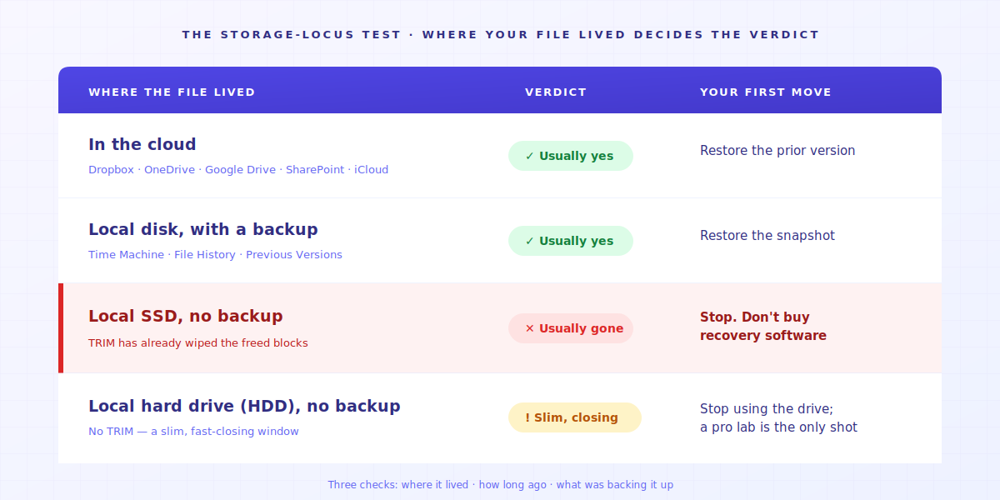
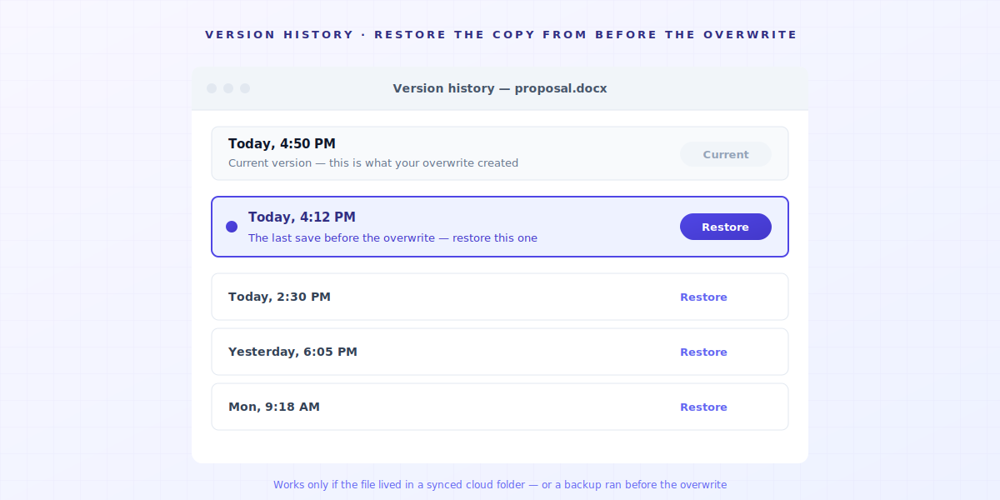
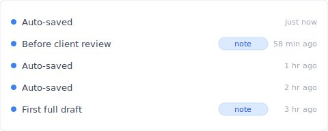

# 【2026 File Management】Recover an Overwritten File: When You Can, When You Can't, and What to Do Next

> Whether it's recoverable comes down to where the file lived, how long ago, and what was backing it up. The Storage-Locus Test reads your case in under a minute.

You saved over the file: the version your client already signed off on, gone in one keystroke. Before you download recovery software, you need to know one thing. In your exact situation, is it even still there to recover?

Most advice online jumps straight to recovery tools and skips the part that actually decides the outcome: where the file lived when you saved over it. So here's the test.

## Contents
1. [The Storage-Locus Test: where your file lived decides everything](#storage-locus-test)
2. [If it was backed up anywhere, restore the previous version](#backed-up)
3. [Can you recover an overwritten file on an SSD?](#ssd-no-backup)
4. [It's gone. Now what?](#now-what)
5. [Make "saved over" stop being a death sentence](#prevention)
6. [FAQ](#faq)

---

## The Storage-Locus Test: where your file lived decides everything {#storage-locus-test}

An overwritten file lands in one of three fates: **fully recoverable** if a prior version was backed up, **a slim, closing window** if it was a local hard drive caught fast, or **already gone** if it lived on a local SSD with no backup, because TRIM has wiped it. Which one is yours comes down to three things you can check in under a minute: **where the file actually lived**, how long ago you saved over it, and whether anything was backing it up. Call it the Storage-Locus Test, the test of *where the file actually lives*.

| Where the file lived | Verdict | Where to go next |
| --- | --- | --- |
| Cloud (Dropbox, OneDrive, Google Drive, SharePoint, iCloud) | ✅ Usually yes | Restore the prior version → [§2](#backed-up) |
| Local disk **with** a backup (Time Machine, File History, Previous Versions) | ✅ Usually yes | Restore the snapshot → [§2](#backed-up) |
| Local **SSD**, **no** backup | ❌ **Usually gone** | Check the app's own version history first; if nothing, stop → [§3](#ssd-no-backup) |
| Local **hard drive (HDD)**, no backup | ⚠️ Slim, closing fast | Stop using the drive now → [§3](#ssd-no-backup) |

Find your row, then read its section. The one that surprises people is the local SSD with no backup: the verdict nobody selling recovery software wants at the top of the page.

## If it was backed up anywhere, restore the previous version {#backed-up}

If a backup ran *before* you saved over it, you can restore the previous version, but only if the backup actually covered that location.

**Cloud version history does not extend to files that live on a local disk or a NAS.** That one line settles most cases: a file inside your synced Dropbox, OneDrive, or Google Drive folder is covered; a file sitting on your desktop, an external drive, or a company NAS is not.

For a **cloud** file, open its **Version history** (right-click, or the *⋯* menu) and restore the version from before the overwrite. Retention is finite: as Microsoft's [documentation](https://learn.microsoft.com/en-us/sharepoint/document-library-version-history-limits) explains, once a file's versions pass the limit your admin set, the oldest are permanently deleted and bypass the recycle bin. For a **local file with a backup**, restore the snapshot from just before the overwrite ([Time Machine](https://support.apple.com/en-us/HT201250) on a Mac; File History or *Properties → Previous Versions* on Windows), which only works if a snapshot predates it. The full step-by-step for both lives in [why post-event rescue is usually too late](/en/post/recover-overwritten-file/). (If you never saved the file at all, or it crashed before you could, that's [a different path](/en/post/word-unsaved-recovery/).)

## Can you recover an overwritten file on an SSD? {#ssd-no-backup}

Usually, no — but check one thing before you give up. Start with the app's own safety net: Word's *File → Info → Manage Versions*, the `.wbk` backup copy if "Always create backup" was on, or Excel's autosaved versions. For a pure overwrite these usually hold only the *new* content, but a `.wbk` or app version can occasionally hold the old one. If that comes up empty, here is the honest verdict the listicles bury at the bottom: if the file lived only on a local SSD, you overwrote it, and nothing backed it up, it is, in practice, unrecoverable. **For this exact case, stop spending money on recovery software.**

Here is the mechanism. When you overwrite a file, the operating system marks the old data's storage blocks as free. On a solid-state drive, the **TRIM** command then erases those freed blocks, often within minutes, so the cells can be reused at full speed. Recovery software works by scanning for data the drive hasn't reused yet, but TRIM has already zeroed it. There is nothing left to read. Even data-recovery vendors concede this: as R-Studio's own [page on overwritten data](https://www.r-studio.com/Recovery_Overwritten_Data.html) explains, once data is genuinely overwritten, software recovery is no longer possible.

One precise exception: an older spinning **hard drive** doesn't run TRIM, so there is a slim window where a professional lab might read the previous data. But every save and every minute of use shrinks it. If the file mattered that much and it was on an HDD, stop using the drive now and call a lab. On an SSD, that window doesn't exist. (For a minute-by-minute look at how fast it closes, see [excel-overwrite-postmortem](/en/post/excel-overwrite-postmortem/).)

## It's gone. Now what? {#now-what}

When the file is truly gone, stop trying to recover it and start rebuilding: find the nearest copy that escaped the overwrite, and have the honest conversation early.

Look for a version that lives somewhere the overwrite never touched. **An emailed attachment** you sent the client last week. **An exported PDF or PNG** of the deliverable. **A teammate's downloaded copy.** Even a **thumbnail or preview** the operating system cached can be enough to rebuild from. None of these is the original file, but any of them can rebuild most of the work in a fraction of the time.

【composite case】A designer overwrites a signed-off logo file on a Friday afternoon. The original is gone, but the approval email still has the exported PNG attached. She rebuilds the editable file from the PNG over the weekend and messages the client on Monday morning, not to confess a disaster but to confirm a small delay. That early, calm message is the part that protects the relationship. A file you can rebuild is a schedule problem; a file you hide is a trust problem.

## Make "saved over" stop being a death sentence {#prevention}

The reason this one hurt is that the file had no history of its own. An automatic version history at the file layer keeps earlier versions for you, so the next time you overwrite something, a recent copy is still right there and a normal save stops being a one-way door.

That is the gap I built [Keeply](https://keeply.work) to fill for the files the cloud doesn't watch. It keeps an automatic version history for files on your own disk or NAS, where Dropbox and OneDrive version history simply don't reach: it saves a version on a schedule (every 15, 30, or 60 minutes), lets you save a version by hand whenever you hit a milestone, and lets you add a note so you know which version is which. It runs alongside what you already use (your local files, your OneDrive or Dropbox folder, your company NAS), with no tool to swap and nothing to migrate.

One honest limit: this is prevention, not time travel. Keeply can only protect a file from the moment it starts watching it; it can't bring back a version you overwrote before you installed it. For everything you save *from here on*, though, the next "saved over" should be a non-event: a two-click restore, not a lost afternoon. If you want the bigger picture of how file version management fits together, start with the [complete guide](/en/post/file-version-management-complete-guide/).

## FAQ {#faq}

**Can I set up automatic version history so this never happens again?**
Yes. Keeply keeps an automatic version history for files on your own disk or NAS, where cloud version history doesn't reach. It saves a version on a schedule (every 15, 30, or 60 minutes) and lets you save one by hand whenever you hit a milestone, so a recent copy is always there to fall back on.

**Can you recover a file you saved over?**
It depends on where the file lived. If it was in cloud storage or covered by a backup that predates the overwrite, you can restore the previous version. If it lived only on a local SSD with no backup, it's usually gone, because TRIM erases the freed blocks soon after the overwrite.

**Does Windows keep previous versions of a file?**
Only if File History, a System Restore point, or a shadow copy was already running before the overwrite. Windows doesn't keep previous versions retroactively.

**Can you recover an overwritten file on a network drive (NAS)?**
Only if the NAS itself keeps snapshots (many Synology and QNAP units do, if enabled). Cloud version history from Dropbox or OneDrive doesn't extend to files on a NAS.

**Is an overwritten file gone forever?**
On a local SSD with no backup, usually yes, because TRIM zeroes the freed blocks soon after the overwrite. On an older hard drive there is a slim window, but it closes fast. Either way, check the app's own version history first.

---

*By [Ting-Wei Tsao](https://www.linkedin.com/in/ting-wei-tsao-b57480152), founder of Keeply. Keeply keeps an automatic version history for the files cloud tools don't watch.*

## Related reading
- [The complete guide to file version management](/en/post/file-version-management-complete-guide/)
- [Recover an overwritten file: why post-event rescue is usually too late](/en/post/recover-overwritten-file/)
- [A minute-by-minute postmortem of one overwrite](/en/post/excel-overwrite-postmortem/)
- [Word closed before you saved? That's a different path](/en/post/word-unsaved-recovery/)
