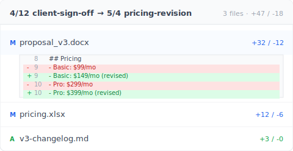

# 【2026 File Management】Word Saves Versions, Not the Memory of Which One You Sent 3 Months Ago

> Built-in version history is save-layer rescue. Recovering versions you delivered 3 months ago takes a tool layer.

It's Saturday night, 11:23 PM. Your client messages: "Can you resend that proposal version you sent in March?"

You open OneDrive version history. Only the last week is left. Word AutoRecover cleared when you closed the file. There are 7 `_v` files on your laptop, none lining up with what you delivered in March.

Three months ago you pressed ⌘+S on that version. The tools didn't remember.

From the conversations Keeply users share, this 11:23 PM message is the scenario that comes up most often.

## TL;DR

Microsoft Word's **version history**, AutoRecover, and OneDrive version snapshots are all **save-layer rescue mechanisms**. Designed for "I crashed mid-document" scenarios. Retention runs short: from cleared on file close, up to about 500 versions in cloud history. This is save-layer rescue, not delivery tracking. To recover the version you delivered three months ago, you need an independent always-on version history at the tool layer, plus a metadata stamp at delivery time.

## Contents

1. [What can Word's built-in version history actually do?](#what-can-words-built-in-version-history-actually-do)
2. [AutoRecover, OneDrive, Time Machine: how long does each retain?](#autorecover-onedrive-time-machine-how-long-does-each-retain)
3. [Why these mechanisms don't reach 3 months later](#why-these-mechanisms-dont-reach-3-months-later)
4. [Recovering the version you delivered 3 months ago](#recovering-the-version-you-delivered-3-months-ago)
5. [FAQ](#faq)

---

## What can Word's built-in version history actually do?

Word and the broader Office stack include three "**version recovery**" mechanisms:

- **AutoRecover**: rescues unsaved content during a crash. Saves a temp version every 10 minutes by default. Cleared once the file closes normally.
- **AutoSave** (OneDrive / SharePoint online Word): writes to the cloud as you type.
- **OneDrive version history**: keeps a snapshot of each save, retrievable for any timestamp. Microsoft's [SharePoint versioning docs](https://learn.microsoft.com/en-us/sharepoint/document-library-version-history-limits) note 500 major versions retained by default (personal Microsoft accounts: 25).

Excel's version history sits in the same design — see [the 4 Microsoft limits behind Excel's 1-2 version cap](/en/post/excel-version-history-limits/) for the spreadsheet shape of this same trap.

The design intent is consistent: handle "**I crashed mid-document**" or "**I just saved over something**". Short-term save accidents. They aren't designed for "**the client asks about version v3 from three months ago**."

## AutoRecover, OneDrive, Time Machine: how long does each retain?

To see whether these mechanisms hold, look at the retention numbers:

| Mechanism | Default retention | Prune trigger | Designed for |
| --- | --- | --- | --- |
| Word AutoRecover | Cleared on file close | File close, Word restart | Crash recovery |
| OneDrive AutoSave | Live writes | Live overwrite | Real-time co-editing |
| OneDrive version history | About [500 versions](https://learn.microsoft.com/en-us/sharepoint/document-library-version-history-limits) (25 on personal accounts) | Older drops once over 500 | Short-term rollback |
| Mac [Time Machine](https://support.apple.com/en-us/HT201250) | hourly 24h + daily 30 days + weekly until disk full | Disk full | System-level backup |
| Windows File History | Configurable | Configurable | System-level backup |

That's exactly the bind. Each mechanism has a ceiling. From cleared on close to about 500 versions. None of them reach across three months.

On construction sites, every file version decides what gets delivered in the end. Not finding the delivered version means testing the limits of a manager's memory.

When you do find both versions, the next question is "what actually changed between them?" Keeply lays them side by side so you don't have to read line by line:

Red and green columns make the pricing change unmistakable — you forward this screenshot to your client and skip the explanation paragraph.

## Why these mechanisms don't reach 3 months later

Here's the distinction nobody names plainly: **save layer** versus **tool layer**.

Built-in version history lives at the **save layer**. Its purpose is "if the last write fails, roll back". So retention is short. The reference point is "how often the average user looks back within a month." Anything past three months isn't in the design target. Pruning is intentional.

Sam is a consultant. Saturday at 11:23 PM, his client asks for the March version of a report. He opens OneDrive version history; the oldest entry is April 28. AutoRecover was disabled long ago. He has 8 `_v`-prefixed `.docx` files locally; none of the file timestamps line up with that March delivery week.

Here's the worst part. Sam remembers afterward: in March, he sent the client a PDF exported that day, not the `.docx`. The original `.docx` was overwritten weeks ago. The PDF is in the client's inbox. **He just can't get back to that `.docx` version to keep editing.**

## Recovering the version you delivered 3 months ago

You need two layers:

- **Always-on version history**: every version you save is preserved, never pruned. Independent of Word's or OneDrive's retention policy.
- **Delivery-note metadata**: when you export a file, the metadata for "who, when, which underlying version" is embedded. Drop the file back into the tool three months later, see the full origin.

[Keeply](https://keeply.work) provides both layers.

Lisa has used Keeply for half a year. Monday morning, her client asks for the April version of a deck. She finds the attachment in her client's email and drops the `.pdf` into Keeply. Keeply surfaces "**This is the v3 deck from 2026-04-12**, the original `.docx` is still in your version history, tagged 'client-approved'." She clicks "go to this version" and three seconds later Word opens that exact April 12 version, ready to edit.

That said, Keeply doesn't replace AutoRecover. If Word crashes mid-document, AutoRecover is still your first line. Keeply also can't rewrite history retroactively: it has to be in use at delivery time for the metadata to embed. For deliveries before you installed Keeply, this article doesn't help. For every delivery from today onward, Keeply will.

That's the part that should let you breathe.

## FAQ

**Q1: Can Word AutoRecover be turned off?**

It can be, but it's on by default. Path: "File → Options → Save → Save AutoRecover information every 10 minutes." Note that AutoRecover clears when the file closes normally. It isn't long-term retention.

**Q2: Do OneDrive Personal and Business retain the same number of versions?**

Not exactly. OneDrive Personal retains about 500 versions by default. OneDrive for Business (Microsoft 365) also defaults to 500 but admins can adjust the limit. Once the cap is reached, the oldest version is pruned.

**Q3: Is Time Machine a backup or a version manager?**

Time Machine is a system-level backup, not a per-file version manager. It snapshots the whole disk, not "every save of proposal.docx." Recovering a specific version of a single file is technically possible but cumbersome.

**Q4: How long does Google Docs keep revisions?**

Google doesn't publish a clear retention number. Their [official docs](https://support.google.com/docs/answer/190843) note that "older revisions may be merged" to save space. In practice, revisions older than three months are often merged or pruned automatically.

**Q5: Is Keeply in the same category as Git?**

No. Git is a version-control tool built for software engineers — its interface is a black terminal, and you have to learn a vocabulary (branch, merge, commit) to use it. Keeply is built for non-engineers from day one: the interface is a file window, the words you see are "save a version / work copy / sync to project location," and there's no engineering jargon. Both solve a similar problem (keeping file history), but the audience, interface, and mental model are different.

---

That 11:23 message will come again. You don't know when.

But you know this: your version from 5 minutes ago and your version from 3 months ago. The tool can't treat them the same.

For every delivery from today onward, can you let the tool remember that one for you?

---

> About the author: Ting-Wei Tsao, founder of Keeply.
> [LinkedIn](https://www.linkedin.com/in/ting-wei-tsao-b57480152/)
