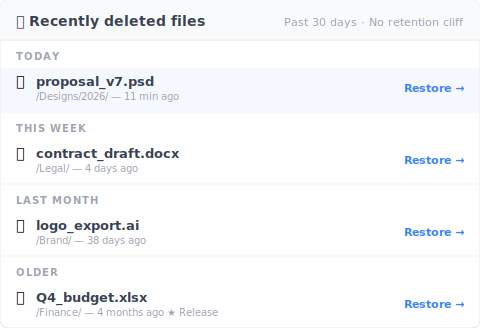

# 【2026 File Management】Before comparing iCloud vs Dropbox: all 4 clouds share the same version history cliff

> Storage and price are the wrong axis. Retention is where every comparison article stops being useful.

Friday 4:23 PM. Your client emails: "Can you send the v3 proposal from the round we did two months ago? Just need the version before we changed the pricing."

You open Dropbox. Version history goes back 30 days. The version they want is 60 days deep.

Gone.

This isn't a one-cloud problem. It's a four-cloud problem the comparison articles never bothered to tell you.

## The version history table no comparison article shows you

Storage, sharing, monthly fee — that's where every "iCloud vs Dropbox vs OneDrive vs Google Drive" article lands. None of them put the retention rules side by side. Here are the four, in one place.

| Cloud | General-file version history | Retention shape | Effective cap |
|---|---|---|---|
| **iCloud Drive** | ❌ Not exposed for non-Apple files | Recently Deleted folder only | 30 days for deletes; no version history surface for PSD / Word / PDF |
| **Dropbox** | ✅ Yes | Time-based | [30 days (Basic / Plus / Family) / 180 days (Pro / Business) / 365 days (Enterprise)](https://help.dropbox.com/files-folders/restore-delete/version-history-overview) |
| **OneDrive** | ✅ Yes | Count-based + delete window | [500 major versions kept](https://learn.microsoft.com/en-us/sharepoint/document-library-version-history-limits); Recycle Bin 30 days personal / 93 days business |
| **Google Drive** (non-native files) | ✅ Yes | Time + count (whichever first) | [30 days OR 100 versions](https://support.google.com/drive/answer/2409045), unless you click "Keep forever" |

Look at the table for ten seconds. They're not the same shape. You can't compare them apple-to-apple even if you wanted to.

## Three different "retention" mechanisms, one shared blind spot

The three clouds that do expose version history each use a fundamentally different cap.

**Time-based (Dropbox)** — you get a window. 30 / 180 / 365 days. After the window, the version is gone regardless of how few or how many versions you have. A file you touched once two months ago is the same as a file you touched fifty times two months ago: both are gone.

**Count-based (OneDrive)** — you get a slot count. 500 major versions kept. After 500, the oldest version is deleted to make room for the new one. That could be 500 versions spread across two years. Or 500 versions all made in a single week, with the file you opened back in January already gone by February.

**Hybrid (Google Drive)** — whichever cap hits first. 30 days OR 100 versions. A quietly-edited PSD might lose history at the 30-day mark with only 15 versions. A heavily-edited document might lose history at version 100 within a fortnight. Google offers a "Keep forever" override per version — but you have to remember to mark it at save time.

**The fourth, iCloud Drive** — different problem entirely: **no general-file version history surface**. Pages, Numbers, and Keynote files have native version browsers (Apple inherits this from the macOS document architecture). Word, PSD, PDF, anything else in iCloud Drive: only the latest version syncs. Older versions are not preserved. Apple has never published a clear retention policy for non-Apple file types because there isn't a policy to publish.

The shared blind spot across all four: **every cloud has a cap. The shape of the cap differs. The comparison articles tell you nothing about which shape fits your work.**

## Why don't comparison articles cover retention?

Retention is hard to display in a spec table.

Storage is one number: GB. Price is one number: $/month. Sharing UX is a screenshot.

Retention is a tree of conditions: plan tier, file type, version count, time elapsed, manual overrides like "Keep forever." So review sites skip it. It doesn't fit the format.

This is the buyer's blind spot: comparison-article shopping for cloud retention is like shopping for cars by trunk size only. You'll get a trunk. You won't get the right car.

The version you need isn't priced into the comparison. The version you need shows up two months after you've already chosen.

## The version-history layer that isn't a cloud feature

Here's the reframe: you don't switch clouds to fix this. Your cloud is fine for sync. The missing piece is a **separate layer** above it — file-level version history, time-uncapped — the versions you save (manually, or via optional auto-save every 15–30 min).

Concretely:

- **Cloud (any of the 4)** handles sync + offsite copy
- **Version-history layer (Keeply or similar)** keeps the versions you save (manual + optional auto-save), no time cap, no count cap, no "Keep forever" decision at save time

You're not replacing Dropbox or iCloud. You're adding a layer that the cloud was never designed to be.

Works with iCloud Drive, Dropbox, OneDrive, Google Drive, Synology and QNAP NAS, plain Finder folders — you don't migrate, you add a layer above what's already there.

[Keeply](https://keeply.work) is the reference implementation of this layer: the versions you save kept locally with no time or count cap, plus a "Release" snapshot mechanism — mark a version as "this is what went to the client" and that snapshot survives forever, even after fifty later saves. Two-month-old version recovery in about two clicks.

```
Keeply timeline — proposal.psd
────────────────────────────────
● 2026-05-12 14:23   (current)
● 2026-04-15 09:11   ◀ 27 days ago
● 2026-03-08 17:42   ◀ 65 days ago  ★ Release: client-signoff
● 2026-02-14 11:30
```

The Release mark on that 65-day-old version means it stays accessible after the 500-version cap, after the 30-day window, after the 100-version count — because Keeply doesn't apply caps the way clouds do.

Deletion works the same way. Cloud recycle bins clear out on a 30-day clock, but Keeply's "Recently deleted" panel doesn't have that timer — kept locally:



That `logo_export.ai` in "Last month" was deleted 38 days ago — the cloud's 30-day window is long gone, Dropbox returns 410 Gone, OneDrive returns 410 Gone. It's still in Keeply's panel; click restore and it's back. The Q4 budget under "Earlier" was deleted 4 months ago as a Release-frozen version — no cloud retention can save it, Keeply still has it.

## When this article isn't enough

This piece doesn't solve every retention scenario. Three boundaries to call out:

**Just delete recovery, not deep history**: If your worry is "I accidentally deleted a file," the 30-day Recycle Bin every cloud offers is fine. You don't need the layer this article describes.

**Regulated archival (GDPR, SOX, HIPAA)**: Version history isn't immutable archive. If compliance requires "the original cannot be modified," you need proper archive tooling — Veeam, Acronis, or your industry's certified provider. Keeply and similar tools are work-in-progress version layers, not archive systems.

**Cloud-native solo workflow (Pages / Numbers / Sheets)**: If your work lives entirely in Apple's native formats or Google's native Docs / Sheets, the built-in version history might cover you. The cost is file-type lock-in — you can't open a Pages file in Word without conversion. Worth it for some, not for others.

## See also

The full pillar [file version management complete guide](/en/post/file-version-management-complete-guide/) breaks down 4 structural reasons your tool wasn't designed for keeping file history.

[3-2-1 backup rule](/en/post/3-2-1-backup-rule/) covers the spatial redundancy half — three copies, two media, one offsite. This article is the temporal half: what stays accessible over time.

[What Keeply saves vs. backup and cloud tools](/en/post/what-keeply-saves-vs-backup-cloud/) compares Keeply to backup tools and cloud storage as three different layers, not three competing products.

---

The comparison-article framing keeps you in a loop: bigger storage, better sharing, more features. The thing that actually breaks for you — the version from 60 days back — never appears in the spec sheet.

Pick whichever cloud fits your sharing and price needs. Then add the layer that closes the cliff.

Two months from now when the client asks, the answer is "yes, I have it" — not "let me check, hmm, gone."

---

> About the author: Ting-Wei Tsao, founder of Keeply.
> [LinkedIn](https://www.linkedin.com/in/ting-wei-tsao-b57480152/)
