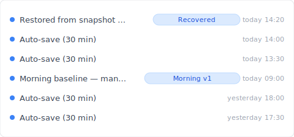
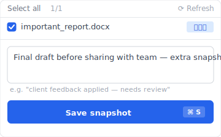

You delete a file, open the Recycle Bin — and it's not there.

"Wait, I right-clicked Delete, didn't I?" you mutter, scrambling to remember whether your finger was on the Shift key, whether the bin was already full. Something quietly tightens in your chest.

Take a breath. In most cases, the file is still on the disk. "Gone from the Recycle Bin" and "gone forever" are two different stories. The real issue is that Windows, macOS, and OneDrive each have a different way of producing a "skipped-the-bin" deletion — and once you've pinpointed which one bit you, the odds of getting the file back are actually pretty good.

But before you do anything, there are four things you absolutely must not do. Identify which of the five causes below applies to you, then move on to the recovery methods. The order matters.

## 5 reasons your deleted file isn't in the Recycle Bin

Files vanish from the Recycle Bin for roughly five reasons. Each comes from a different mechanism, so the first step toward recovery is figuring out which one you're dealing with.

If you've got something like Keeply running quietly in the background as an always-on version-history tool, any of these five causes still leaves the file's past versions intact on Keeply's timeline. That said, understanding which cause hit you still matters — it shapes what to do next.

### 1. You deleted with Shift+Delete (Windows default behaviour)

On Windows, holding `Shift` while pressing `Delete` bypasses the Recycle Bin entirely — the file is removed immediately. Even an accidental tap on the Shift key is enough to leave zero trace in the bin.

The underlying file data usually still lives in the disk's unallocated region, so recovery software has a real shot at it. The catch: if anything else writes new data to that region, your file is overwritten and gone for good. Read the next section on "what not to do" before you try anything else.

### 2. The Recycle Bin's size limit kicked in and auto-purged it

Windows' Recycle Bin has a configurable maximum size — about 5 % of the drive's capacity by default. When the bin exceeds that limit, the oldest items are permanently deleted automatically. If you delete a large file and then immediately delete a few more, that first large file may be silently auto-purged without you ever knowing.

You can see the Recycle Bin's max size by right-clicking the bin on your desktop and choosing Properties.

### 3. You deleted from a network share or a USB drive

Files deleted from a file server, NAS, USB stick, or SD card — anything that isn't a local C: drive — never enter the Recycle Bin in the first place. By Windows design, deletions from anything other than a local NTFS drive are immediate permanent deletions.

This catches people out constantly: someone deletes a file off the company file server, and only the next day notices "the Recycle Bin doesn't have it." It's one of the most common questions corporate IT support gets.

### 4. OneDrive or SharePoint synced the deletion

Files deleted from a OneDrive- or SharePoint-synced folder don't go into the local Recycle Bin. Instead, the deletion syncs up and the file lands in OneDrive's cloud-side bin. That's why opening the local bin shows nothing.

OneDrive Personal keeps deleted items for 30 days; SharePoint / OneDrive for Business holds them for 93 days ([Microsoft documentation](https://learn.microsoft.com/en-us/sharepoint/retention-and-deletion)). Past those windows, the cloud bin purges them too.

### 5. The Recycle Bin's retention period expired

On Windows 10 / 11, "Storage Sense" automatically purges items from the Recycle Bin 30 days after they land there — once it's turned on. Per [Microsoft's documentation](https://support.microsoft.com/en-us/windows/manage-drive-space-with-storage-sense-654f6ada-7bfc-45e5-966b-e24aded96ad5), it's actually off by default, but plenty of machines have it switched on (OEM presets, or a past disk cleanup) — so that file you deleted a month ago may have been quietly wiped. Check or disable it under Settings → System → Storage → Storage Sense.

## Four things you must NOT do before trying to recover

When a file disappears, the instinct is to download recovery software immediately. Understandable. But that very action can tank your recovery odds. The four steps below should be the things you avoid between "identifying the cause" and "actually recovering."

These four don'ts assume you don't have any pre-existing backup. If you're running Keeply with always-on snapshots, the deleted version is already on the timeline — so most of the pressure these four rules create simply doesn't apply. Still worth knowing, in case you do end up reaching for recovery software.

### 1. Do not write new data to the drive the file was on

The deleted file's contents are usually still sitting in the disk's unallocated region. But if anything new gets written to that region, your file is overwritten and irretrievably gone.

That means opening a browser, downloading something, sending an email — anything that triggers a write — risks overwriting the very file you want back. Beyond identifying the cause, keep the machine's activity to an absolute minimum.

### 2. On an SSD, TRIM may have already wiped the traces

SSDs have a feature called TRIM: when the OS deletes a file, it notifies the SSD that the region is no longer in use, and the SSD physically clears that region internally. On HDDs, deleted data tends to linger; on SSDs, once TRIM has run, even recovery software usually can't help.

When you Shift+Delete on an SSD, TRIM typically runs within seconds to minutes — so recovery difficulty is dramatically higher than on an HDD.

### 3. Do not install recovery software on the same drive the file was on

This is the most common rookie mistake. You panic-download a recovery tool, click through the installer with default settings — which puts it on C: — and the installer itself ends up writing into the unallocated region holding your file. You've just overwritten the thing you were trying to save.

If you're going to use recovery software, use a portable version on a USB stick, or install it on a different drive.

### 4. Do not reboot or reset the PC

"Maybe restarting will fix it" or "maybe a reset will bring things back" are exactly the wrong reflexes for deleted-file recovery. Rebooting triggers system-file writes; a factory reset writes entirely new data across the drive in question.

If there's a file you want back, keep the machine at minimum activity, identify the cause, and pick the right recovery method — then act.

## 4 ways to recover the file yourself

Once you've identified the cause and understood the don'ts above, here are four recovery options to try, in order of safety.

All four of these are "after-the-fact recovery" approaches — they assume you'd already enabled the relevant feature *before* the deletion happened. If you hadn't set anything up, the Keeply "save-before-loss" approach in the next section might be the more practical answer.

### 1. Windows File History (Windows 10 / 11)

Windows has a built-in backup feature called File History. If it was enabled before the deletion, you can restore prior versions of specific folders (Documents, Desktop, Pictures, etc.).

In File Explorer, open the relevant folder and click "History" on the ribbon menu. If File History was already turned on, you can roll the folder back to a specific point in time.

The catch is "if it was enabled before." It ships disabled by default, so most users only discover File History exists after they need it. Turn it on now as future insurance.

### 2. macOS Time Machine

Macs come with Time Machine — a time-series backup tool that, given an external SSD or network drive, automatically captures periodic snapshots.

Click the Time Machine icon in the menu bar → "Enter Time Machine." Browse back to the version of the folder you want, select your file, and click "Restore" to bring it back to the current folder.

Time Machine requires both prior setup and an attached storage device, so if you've never connected an external drive, this option isn't available.

### 3. OneDrive bin and version history

If the file was in a OneDrive or SharePoint sync folder, check OneDrive's web bin. OneDrive Personal retains deleted files for 30 days; SharePoint for 93 days ([Microsoft documentation](https://learn.microsoft.com/en-us/sharepoint/retention-and-deletion)).

OneDrive Web → Recycle bin in the left menu → select the file → Restore. The file returns to its original folder.

If the file itself still exists but its contents got corrupted, OneDrive's "Version history" can roll it back to an earlier version. Per [Microsoft Learn](https://learn.microsoft.com/en-us/sharepoint/document-library-version-history-limits), this stores up to 500 versions by default.

### 4. Recovery software (Recuva, Disk Drill, etc.)

If none of the above applies, dedicated recovery software is the next step. The mainstream choices are [Recuva](https://www.ccleaner.com/recuva) (free) and [Disk Drill](https://www.cleverfiles.com/recover-deleted-files.html) (free trial available).

Success rates vary wildly with conditions:

- HDD, recent deletion → 70 – 90 % success
- SSD after TRIM → drops to 10 – 30 %
- Fragmented files → drops further

Recovery software is the last resort, not a system that fundamentally prevents loss.

## The "never lose it in the first place" design: always-on version history as an option

By this point you may have noticed something: calling recovery software, hiring a specialist, keeping the PC idle to maximise recovery odds — these are all conversations about *after* the file is gone.

But what we actually need is a design where a copy was already taken *before* anything went wrong.

Windows File History and Time Machine are right in spirit. The problem is that most users don't know they exist, and by the time they find out, it's too late.

Keeply is a tool that goes all-in on the "a copy was already being taken, even when you weren't paying attention" design.

The mechanism is simple:

- Every 30 minutes (or 15 / 60 — your choice), Keeply automatically takes a snapshot of every file in the folders you've selected
- At any moment you can press "Save" manually to tag and name a specific snapshot
- When something gets deleted, overwritten, or saved corrupted, you can roll back from the timeline

When you want to lock in a particular point — say, the version you're about to share with the team — you can take a manual snapshot.

So whether the file disappears from the Recycle Bin, gets Shift+Deleted, or syncs out of OneDrive — the version Keeply independently saved is untouched. This is "save before loss," not "recover after loss."

There are things Keeply doesn't solve:

- Physical hardware failure (HDD head failure, SSD chip failure) is outside its scope
- Those cases need a dedicated data recovery specialist

Keeply covers user-triggered mishaps (accidental deletion, accidental overwrite, corrupted saves) — it doesn't pretend to cover hardware failure. The boundary is deliberate.

## Frequently asked questions

### Q1. Can Keeply's auto-save bring back files that were deleted?

Yes. Keeply saves a snapshot of every file in your chosen folders every 30 minutes (or 15 / 60 minutes — you pick). A deleted file can be restored from the most recent snapshot, with no dependency on the Recycle Bin. Works on both Windows and macOS.

### Q2. Can files emptied with Shift+Delete still be recovered?

By Windows design they skip the Recycle Bin, so standard OS tools can't bring them back. File History or Time Machine — if enabled in advance — can restore an older version. Otherwise, recovery software is the last resort, and on SSDs the success rate drops sharply due to TRIM. The safer path is to have an always-on history tool like Keeply running before the deletion.

### Q3. Is recovery software safe to use?

Recuva (from the CCleaner family) and Disk Drill are widely used, mainstream tools — the software itself is safe. The catch: if you install them on the same drive as the deleted file, the installer can overwrite the very file you're trying to recover. Always install on a separate drive or use a portable USB version.

### Q4. Is it true that SSDs have a lower recovery success rate than HDDs?

Yes. SSDs use a feature called TRIM, which tells the controller that deleted regions are no longer needed — and the SSD then physically clears them internally. On an HDD the deleted data tends to linger in the unallocated region; on an SSD, post-TRIM, recovery is almost impossible.

### Q5. How much does professional data recovery cost?

For logical damage (accidental deletion, etc.) it's typically $200 – $700; for physical damage (HDD head failure, etc.) it's $700 – $3,500. Many specialists work on a no-recovery-no-fee basis, so a free diagnosis is the safest first step.

---

**Author**: Ting-Wei Tsao｜Founder, Keeply
[LinkedIn](https://www.linkedin.com/in/ting-wei-tsao/)｜[Keeply](https://keeply.work/)

Keeply is a desktop tool we're building so that file history is always being kept — quietly, in the background. Without depending on the Recycle Bin, without depending on Cmd+Z, you should be able to step back to any point in time. That ordinary experience is what we want to make available to everyone who works with files.

Related articles:

- [When the deleted file is gone from view: the "Recently Deleted" list iOS and Outlook have, that Finder and Explorer don't](/en/post/deleted-files-recovery-list/)
- [The complete guide to file version management: Mac, Windows, cloud, and Keeply](/en/post/file-version-management-complete-guide/)
