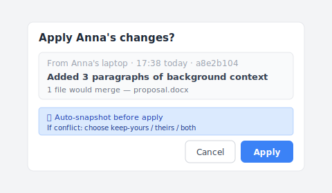
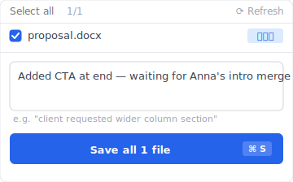
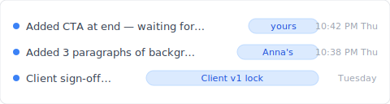

Thursday night, 10:30 PM. You and your colleague Anna are both editing the same proposal in a shared Dropbox folder. She added 3 paragraphs. You added the closing CTA at the same time. You both pressed Cmd+S. Open the folder the next morning, there's an extra file: `Proposal (Anna's conflicted copy 2026-05-02).docx`. Her edits aren't in yours. Yours aren't in hers. You spend an hour merging them by hand and another 30 minutes checking nothing got lost.

This isn't a bug. It's the result of Dropbox having no conflict-detection layer. Let's look at the real mechanism behind conflicted copy, then three sync designs that actually fix it.

## Contents

- [When conflicted copies appear](#when-it-happens)
- [Why Dropbox designed it this way](#why-dropbox-design)
- [Manually merging two files is symptom treatment](#why-manual-merge-fails)
- [Three sync designs that actually fix this](#three-designs)
- [When this isn't the right tool](#boundaries)

## When conflicted copies appear {#when-it-happens}

Pull "conflicted copy keeps appearing" apart and you find four completely different scenarios, each one triggers it:

| # | Scenario | Mechanism |
|---|---|---|
| 1 | **Two people editing simultaneously** | Both press Cmd+S, Dropbox doesn't know the file was already changed |
| 2 | **Edit offline, then sync** | You edit on the train, sync on Wi-Fi, version doesn't match cloud |
| 3 | **Switching across devices** | Laptop mid-edit, switch to phone to continue, laptop syncs later, collision |
| 4 | **Cross-OS sync delay** | Mac vs Windows clocks off by seconds, Dropbox flags collision |

It's not obvious until you've hit one: just one of these triggers a conflicted copy. **Your usual workflow probably triggers at least two.**

## Why Dropbox designed it this way {#why-dropbox-design}

Dropbox uses **last-writer-wins + save the older version separately**: two people edit, the later upload wins, the earlier version is preserved as `(conflicted copy)`.

It's not that conflict detection is technically hard. It's a commercial trade-off:

- **Real-time experience first**: sync can't block you. Popping "please pick a merge strategy" every time would make Dropbox feel clunky.
- **Conflict resolution pushed to the user**: saving the other version means "I kept it for you, you decide."
- **The designer's choice**: nobody loses work, but you do the work.

Yeah, that's the frustrating part. Dropbox pushes what the tool should be doing (conflict-detection layer) onto the user's discipline. And discipline never wins against automation.

I ran into this with Dropbox hundreds of times myself before building Keeply, and only later did I figure out that it's not a matter of being more careful — Dropbox is just designed that way.

## Manually merging two files is symptom treatment {#why-manual-merge-fails}

The fix Dropbox Help Center teaches: "Open both files, compare differences, merge into the main file by hand, delete the conflicted copy." Sounds reasonable.

But this fix **doesn't change the mechanism**. Next week you'll sync collision again, generate a new conflicted copy, manually merge again. A month from now you've done this 4-5 times.

You're not bad at merging. You're using a tool **designed not to block conflicts**. The fix is to change the sync mechanism, not to train yourself to merge faster.

Compared to Google's top 3 (Dropbox Help / EaseUS / Wondershare): all symptom-treatment guides. Nobody comes from the mechanism angle. This article does.

## Three sync designs that actually fix this {#three-designs}

Three design patterns sync can use. Each one solves different collision scenarios:

### Design A: Detect and prompt (sync asks you first)

Two ends edit the same file, sync detects a collision and prompts the user: keep A, keep B, or merge both changes. **Example**: developer version-control tools work this way. **Keeply** brings the same detection into office tooling — when a collision happens, it asks you in plain language ("Anna's version" / "your version" / "combine both") instead of throwing engineering terminology at you.

Here's what it looks like in practice. Anna pushed a version into the project vault; Keeply pops a dialog so you can decide whether to apply her change to your local copy:

Before you click Apply, Keeply auto-snapshots your current version (so even a wrong click is undoable). If both sides edited the same paragraph, a second prompt asks: keep yours / use Anna's / keep both. **Solves scenarios #1 + #2.**

### Design B: File locking (whoever opens first gets it)

You open the file, the tool auto-locks it. Your colleague opens it and sees "Anna is editing", they can't change it and have to wait. **Examples**: SharePoint, Adobe Creative Cloud Files, Bentley ProjectWise (a project management system used in construction/engineering). **Solves scenarios #1 + #3 + #4**, trade-off: colleague has to wait.

### Design C: Local copy + manual push (Keeply's model)

Your working version lives on your machine, sync is an active push you trigger (not Dropbox's real-time mirror). Collisions are detected at push time and surfaced in a plain-language UI. **Keeply** takes this route: edit locally, eyeball the diff, then push up to your NAS / SharePoint / shared folder once you're sure — no surprise overwrites.

After you finish your closing CTA, you click "Save version" in Keeply's main window and this dialog appears:

Write a one-liner like "Added closing CTA — waiting for Anna's merge" and save the version. Anna does the same on her side. Both versions land separately in the shared vault timeline, neither overwriting the other:

Two versions side by side, each with a note explaining what changed. You decide how to merge them — no silent `(conflicted copy)` filename, no surprise three weeks later. **Solves scenarios #1-#4**, trade-off: not as instant as Dropbox.

You'll notice scenario #4 (cross-OS clock drift) is the hardest, it's a pure clock problem. Designs A and C can detect it, but resolution still needs the user.

## When this isn't the right tool {#boundaries}

Keeply doesn't solve every Dropbox scenario:

- **Large-file real-time sync**: Premiere project edit-while-sync, Keeply's Local Clone model isn't a fit (push takes minutes).
- **Mobile device access**: Keeply is desktop-first, Dropbox app on phone is much smoother.
- **External share links**: Dropbox's "Share link" has no Keeply equivalent.
- **Ultra-high collaboration frequency** (multiple edits within an hour): Keeply UX is slower than Dropbox, use Google Docs co-edit for that.

## Before you see `(conflicted copy)` next time

Next time a `(conflicted copy)` filename shows up in your folder, you won't spend an hour merging by hand. You'll know it's a mechanism problem, and you have other options.

Want to see how Keeply handles sync conflicts? [Read the complete guide to file version management.](/en/post/file-version-management-complete-guide/)

---

> About the author: Ting-Wei Tsao, founder of Keeply.
> [LinkedIn](https://www.linkedin.com/in/ting-wei-tsao-b57480152/)
