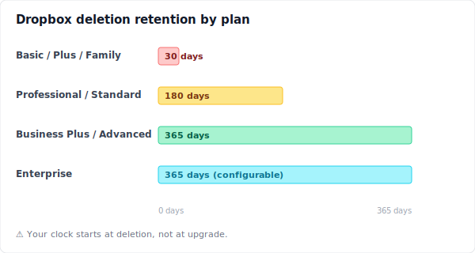
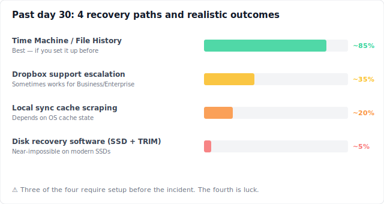
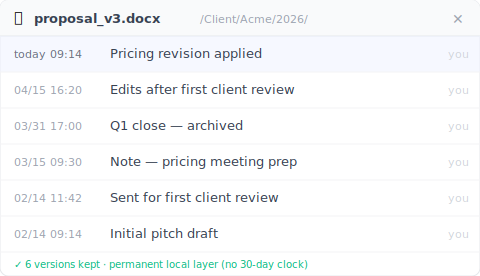
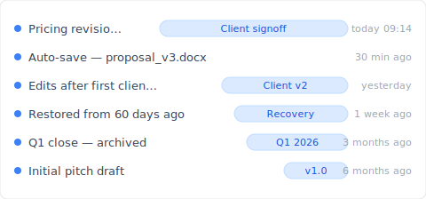

# 【2026 File Management】Dropbox recovers deleted files — until day 31

> Dropbox's 30-day window saves yesterday's mistakes. Not the version your client emails about on day 60. Here's what survives day 31 — and what doesn't.

This isn't a recovery guide. It's three people at three different points on Dropbox's 30-day clock, and what each of them can still do.

Their names are made up. The situations are composite — drawn from the patterns in [Dropbox Community](https://community.dropbox.com/) threads about deleted-file recovery. The mechanics of what they discover are real.

## Sarah — five minutes ago

> 【Synthetic example】Sarah is a freelance designer. It's 11:14 AM Wednesday. She just hit Delete on `proposal_v3_FINAL.docx`, thinking it was the older duplicate. The newer one was `proposal_v3_FINAL_FINAL.docx`. She paused. Wait — was it?

She opens dropbox.com and clicks **Deleted files** in the left sidebar. Her file is there, dated 11:14 AM. Three clicks: **⋯** → **Restore**. Done. The file reappears at its original path. Her laptop syncs it back. Her phone catches up two minutes later.

Sarah's recovery was easy because she was inside the window. On Basic, Plus, or Family plans, Dropbox keeps deleted files for 30 days. Source: [help.dropbox.com on recovering deleted files](https://help.dropbox.com/delete-restore/recover-deleted-files-folders). Within those 30 days, restoration is a three-click affair on the web client.

What Sarah doesn't realize: her recovery worked despite three things she did right by accident.

She used dropbox.com, not her desktop file manager. If `proposal_v3_FINAL.docx` had been in a folder excluded by [Selective Sync](https://help.dropbox.com/sync/selective-sync-overview) — Dropbox's option to keep certain folders off your machine to save disk space — the deletion would have happened cloud-side without ever passing through her local Trash. People miss this every day; they look locally first, see nothing, and assume the file was never there.

She also restored a file, not a specific version. If Sarah had wanted the `proposal_v3` from three Tuesdays ago — not today's version — she'd have needed version history, which is a separate tree from deletion history. Restoring brings back the file as it was at the moment of deletion. The three earlier saves she made yesterday are baked in.

And she'd never seen a conflicted copy in this folder. If she had — `proposal (Marco's conflicted copy 2026-04-15).docx`, a marker Dropbox creates during [sync collisions](../dropbox-conflicted-copy/) — and her teammate had deleted it thinking it was redundant, she'd be searching for the wrong filename in Deleted files.

Sarah doesn't think about any of this. She gets her file. She has lunch. Her afternoon is fine.

## Marco — thirty-five days ago

> 【Synthetic example】Marco is a B2B consultant on Dropbox Plus. Today his client emailed asking for the proposal "from before we changed the pricing — about a month ago." Marco opens Deleted files. Empty. He sorts by date. Nothing in the last month either. He checks his sent folder, his email drafts, his desktop. Then he remembers: he tidied this folder five weeks ago. He must have deleted what he now needs.

Marco opens a support ticket. Forty-eight hours later he gets a reply: Dropbox cannot recover files beyond the 30-day window on Plus accounts. The agent suggests upgrading to Professional for a 180-day window going forward. Marco upgrades anyway, hopeful. He checks. The file is still gone.

This is the part of the Dropbox retention story that the marketing doesn't lead with. The retention window for your plan applies to the plan you were on **at the moment of deletion**. Plus deletion = 30-day window, no matter what plan you're on a week later. The clock that started counting at deletion ignores subsequent upgrades. User accounts of this pattern appear repeatedly in [Dropbox Community threads](https://community.dropbox.com/en/discussion/477149/can-i-recover-files-deleted-more-than-30-days-ago-if-i-upgrade-my-account).

Marco's three real options:

The first is Dropbox support escalation. For Business and Enterprise customers within a few days past the window, support sometimes finds a way. Per Dropbox's official policy, this is case-by-case, not a guarantee. Marco is on Plus. The ticket is closed politely.

The second is to check whether the file was synced to his old laptop. If a local copy still exists in his OS sync cache — and if the OS hasn't reclaimed the cache space — he might find a shadow of it there. He digs through `~/Dropbox/.dropbox.cache/` and `~/Library/Application Support/`. Nothing useful. The cache was cleared when he restarted.

The third is what Marco actually does next: he rewrites the pricing-revision section from memory and from emails he sent during that week. It's not the same proposal. The client notices. The signoff slips three days.

Below is the retention story across all Dropbox plans, condensed:

The numbers come from the same source pages [version history](https://help.dropbox.com/files-folders/restore-delete/version-history-overview) and [data retention policy](https://help.dropbox.com/account-settings/data-retention-policy). Marco's recovery window was 30 days because his plan was Plus when he deleted. None of the upgrades after that change the past.

## Linh — seventy-five days ago

> 【Synthetic example】Linh is a PhD researcher writing her thesis. Her advisor emails: "I want to look at the methodology section from the version you sent me in mid-February — the one before we narrowed the cohort." That was two and a half months ago. Linh deleted that draft six weeks ago when she finalized chapter 4. She's on a Dropbox Family plan because she shares it with her partner. 30-day window. Long gone.

Linh has run out of Dropbox-side options. What's left is local.

She opens [Recuva](https://www.ccleaner.com/recuva) (free) on her Windows machine and scans her SSD. Hundreds of file fragments appear; none match the date she needs. She tries [Disk Drill](https://www.cleverfiles.com/) (89 USD trial) for a deeper forensic scan. Same result. The reason isn't the software. It's TRIM.

TRIM is a feature of modern SSDs. The operating system tells the SSD controller, in advance, which blocks have been deleted, and the SSD proactively erases those blocks ahead of new writes. [Microsoft Learn documents the API](https://learn.microsoft.com/en-us/windows/win32/w8cookbook/new-api-allows-apps-to-send--trim-and-unmap--hints-to-storage-media): "TRIM hints notify the drive that certain sectors that previously were allocated are no longer needed by the app and can be purged." macOS enables TRIM by default on Apple SSDs since OS X 10.10.4; on third-party SSDs you enable it with `sudo trimforce enable`. The result: once TRIM has run on a sector — typically within minutes of deletion — recovery software has nothing to find. Linh's thesis draft was wiped at the silicon level six weeks ago. No tool reaches it.

The chart below shows the four paths Linh investigated, ranked by realistic outcome:

Three of the four require a setup that exists **before** the deletion. The fourth — running Recuva or Disk Drill after the fact — is the path everyone tries first and the one that almost never works on a modern laptop.

Linh emails her advisor that she'll reconstruct the methodology section from her notes and earlier drafts. It takes her a Saturday she didn't plan to lose.

## Why all three landed here

Sarah, Marco, and Linh had different jobs, different files, different time stamps. The thing they had in common was treating Dropbox's deletion recovery as if it were a version history layer. It isn't. It's a **last-chance net**, designed to catch the file you deleted yesterday and threw away the wrong duplicate.

Last-chance nets have to expire. Storage costs money. A cloud that kept every deletion forever would either charge differently or silently cap accounts. The 30-day window isn't a bug; it's the product working as designed. The marketing emphasises what gets caught. It doesn't emphasise what doesn't.

The thing that catches what last-chance nets don't is a version history layer that lives somewhere else — somewhere that isn't trying to be a sync engine, isn't trying to be cheap, isn't trying to do twelve things at once. A layer that exists for one job: keeping every save, indefinitely, on your own drive, where storage is cheap and time isn't an enemy.

## A parallel universe

> Now rewind. Same Sarah, same Marco, same Linh. Each of them installed Keeply on the same day they signed up for Dropbox.

Sarah hits Delete on the wrong duplicate. Her recovery is the same — Dropbox catches it inside 30 days, three clicks, done. Keeply was running in the background; she didn't need it this time.

Marco's client emails 35 days after the pricing-revision draft is gone from Dropbox. Marco opens Keeply's file-history panel for that proposal. The version from five weeks ago is sitting there, with a note he wrote at the time: "Pricing revision applied." He copies it out. Eleven seconds.

Linh's advisor emails about the pre-narrowed-cohort version. Linh opens Keeply's project-wide timeline. She finds the entry tagged "Initial methodology — full cohort" from mid-February. Restore. Done. Her Saturday is hers again.

The mechanism is the same in all three cases. Keeply runs upstream of Dropbox — every local save kept in a permanent history, with the message you wrote at the time as the searchable label. Dropbox still handles cross-device sync, share links, offsite copy. None of that changes. What changes is that the 30-day clock never decides whether the version you need is still around. It's on your drive. It's always there.

**Works alongside your existing cloud.** Keeply is upstream of Dropbox, OneDrive, Google Drive, iCloud, or any folder you sync. You don't migrate. You don't pick a side. The local layer keeps history; the cloud keeps sync. Same story across every comparison-shopper's [cliff](../cloud-version-history-cliff/).

## What Keeply doesn't do (and what to do today)

Honest list of what Keeply doesn't solve:

- **Real-time cross-device sync** is Dropbox's job, not Keeply's.
- **Mobile access to historical versions** isn't a Keeply feature; it's a desktop app.
- **External share links** for sending the latest to a client — Dropbox.
- **Team admin dashboards and audit logs** — Dropbox Business.
- **Offsite redundancy** if your drive dies — keep Dropbox running for that.

Keeply isn't a Dropbox replacement. It's the layer beneath Dropbox: every local save kept, permanently, so the 30-day clock isn't deciding whether the proposal you'll need in 60 days survives.

If you're past day 30 right now, your options are the ones Linh tried; none are likely to work. The version you can still save is the next one. The day to install a local history layer is the one before you need it. Two minutes from now is also fine.

---

**About the author**: Ting-Wei Tsao builds [Keeply](https://keeply.work), a local version history layer for people who don't want to learn Git. [LinkedIn](https://www.linkedin.com/in/ting-wei-tsao/).
