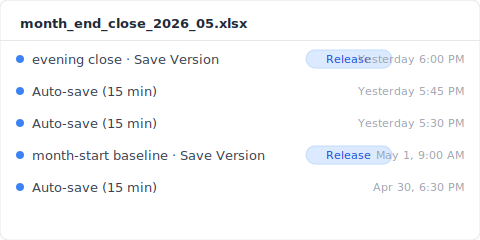
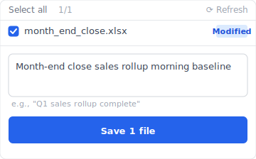

> 9:14 AM, Tuesday. Chen, an accountant (composite case), hit Ctrl+S. The month-end close file `month_end_close_2026_05.xlsx` vanished in that single overwrite. She didn't notice. The OneDrive sync indicator was still a green check. Excel didn't pop up anything. She only caught it at 9:16, when she went to close the file. Ctrl+Z was dead, she'd already closed once. The AutoRecover folder was empty.

Search "recover overwritten excel files" and you get a wall of articles. Microsoft explains features, recovery vendors sell themselves, how-to blogs list "Method 1 / 2 / 3." Nobody walks you through it minute by minute, from the moment of impact to thirty days later, telling you exactly when each layer of defense closed its window. This is the record I put together.

## 9:14: what happened in that second {#h2-1-the-incident}

9:14:03 AM, Chen hit Ctrl+S. Excel wrote new bytes to `month_end_close_2026_05.xlsx`. The previous day's 6 PM "correct sales rollup" was gone. AutoRecover wouldn't keep a copy. The OneDrive sync icon stayed green. Excel never asked "are you sure you want to overwrite?"

What happened next:

- **9:14:03**: Excel wrote new content to disk.
- **A few seconds later**: OneDrive sync engine detected the change and pushed it to the cloud.
- **About 15 seconds later**: The cloud copy of the previous day's 6 PM version was overwritten by the new one.
- **9:16**: Chen closed the file. Any AutoRecover temp files vanished in that moment.
- **9:23**: She tried to open next week's sheet and noticed one tab's formulas were returning blank.

Why didn't Excel warn her? Because in Microsoft's design, "Save" always means "confirm the current state." It is not treated as "replace the previous state." That's the spec, not a bug.

Here's what happened next.

## T+0 to ~15 seconds: OneDrive AutoSave's race condition {#h2-2-onedrive-autosave}

When OneDrive AutoSave is on, there's a window of a few to fifteen seconds between when you save locally and when the change reaches the cloud. During those seconds, if another device of yours has the same file open, or if your network drops, you might still grab the previous version. Chen didn't know any of this. Fifteen seconds later, the cloud copy was overwritten too.

How fast OneDrive syncs depends on your network and file size ([Microsoft Learn: Sync files with OneDrive in Windows](https://support.microsoft.com/en-us/office/sync-files-with-onedrive-in-windows-615391c4-2bd3-4aae-a42a-858262e42a49)). SharePoint Online keeps up to 500 major versions in history ([SharePoint version history limits](https://learn.microsoft.com/en-us/sharepoint/document-library-version-history-limits)). But that means "synced versions get logged" — not "the pre-incident version is guaranteed to be there."

It comes down to 9:13. If SharePoint logged it as a discrete version, you can pull it back. If not, this path is dead. And this is only the beginning.

## T+15 minutes: why "Previous Versions" was empty {#h2-3-previous-versions-empty}

At 9:29, Chen opened Excel's File → Info → Version History. The screen said "No previous versions available." Sync was clearly running. AutoSave was clearly on. Yet empty.

The reason is simple: Windows "Previous Versions" and SharePoint Version History are two completely different things.

- **"Previous Versions"** (the right-click option in File Explorer) relies on Windows Shadow Copy. Microsoft 365 Personal and Business defaults don't keep Shadow Copy permanently on. Even if a file sits in your OneDrive folder, that's Windows's decision — OneDrive is not involved.
- **Excel's "Version History" button** calls SharePoint. Files written continuously by AutoSave don't get every intermediate state logged as a major version.
- **Local Excel files** (not synced via OneDrive) get neither. SharePoint doesn't know they exist.

Chen's company runs OneDrive for Business. She skipped Excel's UI and opened SharePoint directly to check version history — the pre-9:14 version wasn't there. AutoSave had written a stream of small versions, and 9:13, the moment she thought "saved," was never logged as its own.

## T+24 hours: Time Machine's 1-hour gap {#h2-4-time-machine-gap}

The next day at 9:14, Chen's IT colleague said: "Time Machine should be able to grab yesterday's version, right?"

But Apple Time Machine snapshots every 1 hour by default ([Apple Support: Back up your files with Time Machine on Mac](https://support.apple.com/en-us/104984)). 9:14 was the incident. 9:15, sync completed. 10:00, Time Machine finally snapshotted — and what it captured was the already-overwritten file. The 10 AM snapshot was a photograph taken 46 minutes after the scene was cleared.

Why do these three defense layers fail in the same incident? Because each has a "tens of minutes or more" gap.

- **AutoRecover** is for crashes — every 10 minutes by default.
- **OneDrive sync** is for keeping cloud and local in agreement — depends on network.
- **Time Machine** is for periodic rollback — every 1 hour by default.

Three different design goals. All three missed the 2-minute window between 9:14 and 9:16.

Time lost so far: 14 hours 46 minutes.

## T+30 days: why the recovery software found nothing {#h2-5-recovery-software}

Thirty days later, Chen bought an annual recovery software subscription. It scanned the entire SSD and found nothing from before 9:14.

Why? Windows and macOS run TRIM on SSDs. Sectors that are deleted or overwritten get physically zeroed out immediately ([NIST SP 800-88r1: Guidelines for Media Sanitization](https://nvlpubs.nist.gov/nistpubs/SpecialPublications/NIST.SP.800-88r1.pdf)). "Scan the disk right after overwrite" worked in the HDD era. On an SSD, the old bits are physically gone.

The high success rates that recovery vendors advertise assume "just deleted + HDD + filesystem not yet overwritten." All three together. Modern work PCs are mostly SSD. The moment overwrite happens, the SSD has already wiped the old bits. EaseUS, Recoverit, iMyFone, AOMEI all hit the same physical limit. Software choice doesn't change it.

What Chen got for her subscription fee was a confirmation. The file isn't coming back.

## Parallel timeline: what would happen at 9:14 if Keeply were on that PC {#h2-6-keeply-counterfactual}

If Keeply had been on Chen's machine, the Keeply vault would already contain a snapshot named "2026/05/17 18:00 evening close" at the moment of the 9:14 incident.

Keeply does two things:

1. Auto-saves in the background (you choose the interval: 15, 30, or 60 minutes; default 30; Chen's machine is set to 15)
2. Lets you manually hit "Save Version" before closing Excel

Each snapshot is stored separately in the vault. No overwriting. The 9:14 Ctrl+S happens inside Excel — Keeply watches from outside and isn't affected.

9:14:16. You realize "wait, I just clobbered it." What you do:

1. Open Keeply.
2. In the left timeline, click yesterday's 6 PM evening close version of `month_end_close_2026_05.xlsx`.
3. Hit "Restore this version."

Keeply doesn't overwrite your current file. It pulls a copy out of the vault under a new filename (`month_end_close_2026_05_RESTORED_5-17.xlsx`). You open it, check the contents are right, then decide whether to replace the original. Whole thing takes 30 seconds.

The interface uses no git terminology. Two things to remember: it auto-saves in the background every 15 to 60 minutes (you choose), and you can hit "Save Version" yourself at important moments.

## Limits: three overwrites Keeply also can't catch {#h2-7-limits}

Keeply is not magic. There are three situations where Keeply also won't save you.

1. **Incident happens before Keeply's first auto-save runs after install** (your interval setting: 15 to 60 min). On install day, manually hit "Save Version" once at the start of work as a baseline. This blind spot closes.
2. **Excel files on a shared network drive**. Keeply runs on your personal computer. It doesn't watch what others do on a shared drive. For shared drives, the team needs a separate Keeply mirror vault.
3. **Excel is still open and someone overwrites the cloud copy from another device**. Keeply tracks local changes on your machine. A colleague overwriting the same SharePoint file from a different PC needs SharePoint's own version history.

The forensic record ends here. I'll cover preventing this next time in a separate piece.

---

**Author**: [Ting-Wei Tsao](https://www.linkedin.com/in/ting-wei-tsao-b57480152), Founder of Keeply. Building your file management guardian.

## FAQ {#faq}

**Q. How does Keeply close the gap these 4 recovery layers leave?**

A. By putting the version history layer in place before the incident, not after. Keeply auto-saves in the background (15 / 30 / 60 minute interval, your choice) + you can hit "Save Version" manually at important moments + each snapshot lives in its own vault without overwriting the others. When an incident happens, open Keeply, pick the previous version, hit "Restore this version" — 30 seconds. The four layers above (AutoRecover / OneDrive Version History / Time Machine / recovery software) are all post-event rescue; each fails in its own interval gap by design. Keeply is pre-event defense, not another post-event option.

**Q. Can I recover the previous version after overwriting an Excel file?**

A. It depends. If it's a OneDrive for Business synced file with a discrete save point before the incident, you can recover from SharePoint version history. For local Excel files (not OneDrive), it's only partially possible if Windows Shadow Copy is on AND you're not on an SSD. The longer you wait, the worse the odds.

**Q. Can Excel AutoRecover restore the version I overwrote?**

A. No. AutoRecover is designed for Excel crashes. The moment a file closes normally, AutoRecover temp files are deleted. AutoRecover does not help after an overwrite-then-close. To rescue the pre-overwrite version, you need an independent version vault in place before the incident; that's the layer Keeply fills.

**Q. Can recovery software recover overwritten Excel files?**

A. Very unlikely on SSDs (per NIST SP 800-88r1). You need "HDD + just overwritten + filesystem not yet overwritten" simultaneously. Most work PCs are SSD, so in practice, don't count on it. Keeply keeps the version layer at the application level, above the SSD-write path — sidestepping the TRIM physical limit, so the previous version's bytes stay intact in the vault.

**Q. How do I view old versions of a OneDrive-synced Excel file?**

A. Open OneDrive in a browser, right-click the file, choose "Version History." Going through Excel's in-app "Version History" button shows less than what you see from SharePoint directly.

**Q. Can Time Machine save Excel files overwritten within an hour?**

A. Not at the default 1-hour interval. The overwrite happens between the incident and the next snapshot, which captures the already-clobbered file. Unless you set Time Machine to local snapshots at high frequency, or you take manual snapshots, default Macs from IT won't help. Keeply's auto-save interval goes as short as 15 minutes — much tighter than Time Machine's default 1-hour. The 9:14 incident has a 9:00 snapshot sitting right there in the Keeply vault.

## Related

- 📚 Pillar: [File version management: the complete guide to why most tools miss it](/en/post/file-version-management-complete-guide/)
- 🔁 Sibling: [The limit of overwritten file recovery: when AutoRecover isn't enough](/en/post/recover-overwritten-file/)
- 📊 Sibling: [Why Excel's version history button is greyed out: 4 conditions you don't meet](/en/post/excel-version-history-limits/)

## Sources

1. [Microsoft Learn: Sync files with OneDrive in Windows](https://support.microsoft.com/en-us/office/sync-files-with-onedrive-in-windows-615391c4-2bd3-4aae-a42a-858262e42a49)
2. [SharePoint version history limits: Microsoft Learn](https://learn.microsoft.com/en-us/sharepoint/document-library-version-history-limits)
3. [Apple Support: Back up your files with Time Machine on Mac](https://support.apple.com/en-us/104984)
4. [NIST SP 800-88r1: Guidelines for Media Sanitization (SSD TRIM behavior)](https://nvlpubs.nist.gov/nistpubs/SpecialPublications/NIST.SP.800-88r1.pdf)
