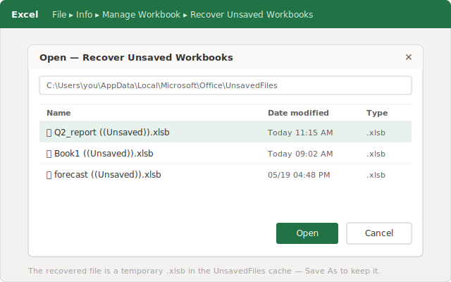
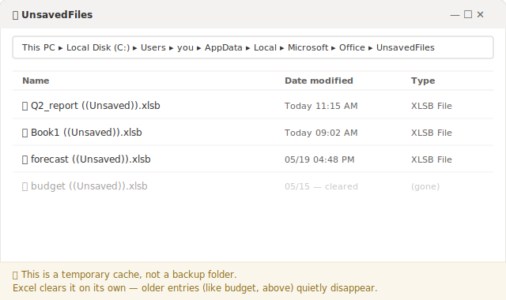
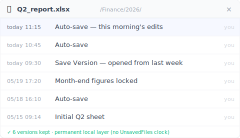

# 【2026 File Management】How to Recover an Unsaved Excel File, and Why It Can Disappear Again

*Excel's "Recover Unsaved Workbooks" pulls a never-saved file out of a hidden `UnsavedFiles` cache, stored as a temporary `.xlsb` that Excel purges on its own schedule. That's why a file you rescued can be gone days later. The fix isn't faster recovery; it's a version layer that doesn't sit in that cache at all.*

You recovered the unsaved sheet on Tuesday and breathed out. By the weekend it was gone. Excel didn't lose it. That recovery cache was always on a timer.

If you just closed Excel without saving and your stomach dropped, start here. The rescue is real, and it takes about thirty seconds. But it pays to know *where* the file you're about to recover actually lives, because that's the same reason it can vanish again.

## Get the file back right now: Recover Unsaved Workbooks {#h2-1}

Do this first, before you touch anything else:

- **File → Info → Manage Workbook → Recover Unsaved Workbooks.** (Or **File → Open → Recover Unsaved Workbooks**, the button at the bottom of the recent-files list.)
- A folder opens. You'll see files with cryptic names ending in `.xlsb`. Those are your unsaved workbooks.
- Open the one with the right timestamp, then immediately **Save As** with a real name and location.

That `.xlsb` list isn't coming from some recovery wizard. Excel is reading a folder on your own drive: `%LocalAppData%\Microsoft\Office\UnsavedFiles`. That's where Excel quietly tucks a copy of work you never saved, so it has something to hand back when you close without saving or it crashes.

Got your file? Good. Now here's the part nobody tells you.

## Why the file you just rescued can be gone by the weekend {#h2-2}

That `UnsavedFiles` folder is a holding area, not a vault. Excel manages it for you, which means Excel also clears it for you, on its own schedule, without asking.

**Microsoft's support pages don't commit to how long an unsaved file stays there**. And the widely repeated "four days" figure isn't something Microsoft documents either. [The official walkthrough](https://support.microsoft.com/en-us/office/recover-an-earlier-version-of-an-office-file-169cb166-e7e2-438e-8f39-9a8927828121) shows you how to open Recover Unsaved Workbooks, then stops. It never promises the file will still be there tomorrow. In practice, people find the cache cleared within a few days, after a restart, or once Excel has enough newer entries to keep.

So "I recovered it" and "I kept it" are two different events. If you opened the recovered workbook, glanced at it, and closed it again without doing **Save As** to a real folder, you didn't save it. You just looked at a temporary copy that's still on the clock. Come back Friday and it may be gone, and this time there's nothing in the folder to recover.

The recovery step solves the next ten minutes. It doesn't solve next week.

## Two different "unsaved" disasters Excel handles with one cache {#h2-3}

The reason this trips people up is that "I lost my unsaved Excel file" is actually two different problems wearing the same words, and Excel funnels both through the same Recover Unsaved Workbooks door.

**Problem A. You never saved it once.** Brand-new workbook, three hours of formulas, then a crash or a stray "Don't Save." There was never a real file on disk, so the `UnsavedFiles` cache is genuinely your best and only shot. That's exactly what it's for, and step one above usually gets it back.

**Problem B. You saved it before, then lost the changes you made since.** This is the month-end report you've opened a hundred times. You worked on it all morning, didn't save, and closed it. The file still exists. It's just the *last few hours* that are gone. Here the cache often has nothing useful, because Excel was tracking your edits as a recoverable session, not as a permanent version of the file.

Picture it concretely. `Q2_report.xlsx` has sat in `/Finance/2026/` for weeks. This morning you reconciled the totals, added two tabs, worked through to a little after eleven. Then closed it on autopilot and clicked straight past the prompt. Excel reopens. The file is right there, last saved yesterday at 5:14. The morning opened *from* that saved copy and never made it back into it. Nothing is lost except the part you actually did today.

Problem B has a few cousins, and the cache can't reach any of them: you opened the file on a **different computer**, where that local cache doesn't exist; or OneDrive AutoSave quietly wrote over the synced copy (a separate trap with its own fix. See [what happens when co-edited Excel data vanishes](/en/post/excel-data-vanished-postmortem/)). Different surface, same root: the thing that was supposed to save you was temporary, local, or both.

A cache built to survive a crash was never built to be the history of your file.

## The layer that doesn't live in a temporary cache {#h2-4}

For Problem B, the answer isn't a faster way to dig through `UnsavedFiles`. It's having the file's own history somewhere Excel can't sweep clean. A version layer that watches the folder your spreadsheets actually live in, holding timestamped copies of the file as you go, not in a buffer Excel recycles.

It's the gap [Keeply](https://keeply.work) is built for. Point it at the folder where your spreadsheets live, and it keeps a version in the background on a schedule you set. Every 15, 30, or 60 minutes, 30 by default. Plus a manual **Save Version** button, with a one-line note to mark a milestone. When this morning's edits are gone, you don't go fishing in a cache that may have already purged; you open the file's timeline and pick the 11:15 version.

The `UnsavedFiles` cache is Excel's short-term safety net for files in flight. A version timeline is the file's long-term memory. One expires. One doesn't. If you want the full picture of how these layers fit together, the [complete guide to file version management](/en/post/file-version-management-complete-guide/) walks through where each one starts and stops.

## Where a version layer still can't save you {#h2-5}

It would be dishonest to pretend this covers everything, so here's where it doesn't:

- **A brand-new workbook you never saved into a tracked folder.** If the file was never written to the folder being watched, there's no version of it to keep. That's still Excel's `UnsavedFiles` cache job (Problem A), and still on its short clock.
- **Silent corruption.** If a file quietly goes bad and a clean-looking version gets saved over a good one, a timeline faithfully keeps the broken copy too.
- **Files that live outside the watched folder.** A version layer only knows about the folders you point it at. The spreadsheet on a USB stick you never added isn't covered.

A version timeline solves "I had it and lost my changes." It doesn't conjure a file that was never saved anywhere.

## When Excel's built-ins are enough {#h2-6}

You don't always need another layer. Skip it when:

- It's a throwaway calc you'd happily redo.
- **Your files live in OneDrive or SharePoint with AutoSave on.** That covers a lot. Cloud version history catches most overwrites as you edit. Just know what it doesn't do: it's tied to the synced copy, the stored history is capped, and AutoSave overwrites as you go rather than asking first. If you've read those limits and they don't bite you, you don't need another layer.
- Losing a morning's work is an annoyance you can absorb, not a deadline you'd miss.

If that's you, learn the Recover Unsaved Workbooks path, save early so a file exists, and get on with your day. The extra layer earns its place only when the work in that spreadsheet is the kind you can't cheerfully rebuild.

## FAQ {#faq}

**I saved my Excel file before, worked on it all morning without saving, then closed it. Can I get the morning back?**

Often not from Excel's cache. Recover Unsaved Workbooks is built for files you never saved at all; once a file has been saved, your unsaved session changes aren't reliably kept there. Getting back "the last few hours of an existing file" is what a persistent version layer (like Keeply) is for. It keeps timestamped versions of the file itself, so you open its timeline and pick the late-morning copy.

**How long does Excel keep unsaved files?**

Microsoft doesn't publish a fixed retention period. The unsaved copies sit in a temporary cache that Excel clears on its own. Many people find them gone within a few days, after a restart, or once newer entries pile up. Treat a recovered file as temporary until you Save As to a real folder.

**Where are unsaved Excel files stored?**

In Excel's UnsavedFiles cache at %LocalAppData%\Microsoft\Office\UnsavedFiles, saved as files ending in .xlsb. You reach them via File → Info → Manage Workbook → Recover Unsaved Workbooks.

**I recovered the file but it disappeared a few days later. Why?**

Because Recover Unsaved Workbooks reads a temporary cache, not a permanent copy. If you opened the recovered file without doing Save As to a real location, it stayed in the cache and was later cleared. Always Save As immediately after recovering.

**Does turning on AutoSave fix this?**

AutoSave (OneDrive/SharePoint) helps for cloud-stored files, but it overwrites as you go and its version history has its own limits. It doesn't cover files you keep locally, and it isn't the same as a browsable, retained version timeline of the file.

## Related reading {#related}
- [The complete guide to file version management](/en/post/file-version-management-complete-guide/) (pillar)
- [Recovering an unsaved Word document. And the 5 cases AutoRecover can't help](/en/post/word-unsaved-recovery/)
- [Excel version history: the Microsoft limits nobody mentions](/en/post/excel-version-history-limits/)
- [When co-edited Excel data vanishes](/en/post/excel-data-vanished-postmortem/)

---
*By Ting-Wei Tsao, founder of Keeply ,  [LinkedIn](https://www.linkedin.com/in/ting-wei-tsao-b57480152)*
