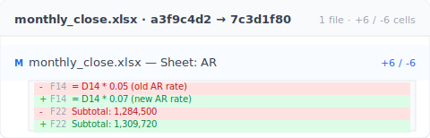

Friday afternoon, 5:47 PM. You're working on the month-end close in Excel. You just deleted a formula to try a different approach, turns out it was wrong. Cmd+Z hits the undo limit. You can't get back. You open File > Info > Version History. Grayed out. Then you realize: this spreadsheet is on your desktop, not OneDrive. Thirty minutes of formula work, gone.

This isn't a one-off. It happens to everyone working in Excel. It's the result of Microsoft designing version history as cloud subscription bait. Let's look at the four limits you keep hitting, then three tool designs that actually solve them.

## Contents

- [Why Excel version history is grayed out](#why-grayed-out)
- [Four limits Microsoft AutoSave doesn't mention](#four-limits)
- [Why Microsoft designed it this way](#why-microsoft)
- [Three tool designs that actually solve this](#three-designs)
- [When this isn't the right tool](#boundaries)

## Why Excel version history is grayed out {#why-grayed-out}

The "File > Info > Version History" button **only works when all four conditions are met**: (1) the file is on OneDrive or SharePoint (2) AutoSave is on (3) you have a commercial license (4) you're on desktop, not web. Miss any one and the button is grayed out.

It's not obvious until you've hit it: your normal workflow probably misses **all four conditions**, saved on the desktop (local files have no AutoSave; [AutoSave only applies to OneDrive/SharePoint files, where it's on by default](https://support.microsoft.com/en-us/office/what-is-autosave-6d6bd723-ebfd-4e40-b5f6-ae6e8088f7a5)), personal license, switching between desktop and web. So grayed out is the default state, not something you did wrong.

## Four limits Microsoft AutoSave doesn't mention {#four-limits}

Pull "Excel version history isn't enough" apart and you find four invariant limits that no setting tweak will get you around:

| # | Limit | Consequence |
|---|---|---|
| 1 | **Desktop AutoSave only goes back 1-2 versions** | Made a mistake 30 minutes ago = unrecoverable |
| 2 | **OneDrive/SharePoint version history is capped + thinned** | Default max [500 versions](https://learn.microsoft.com/en-us/sharepoint/document-library-version-history-limits); older ones get thinned and eventually dropped — not kept forever |
| 3 | **Local files have zero version history** | Saved on desktop for privacy = no history |
| 4 | **No cell-level diff** | Can't say "keep the new column but recover the old formula" |

Number 4 is the one that stings most. Excel version history hands you whole-file rollback only — it never tells you what changed in cell F14. Keeply's diff view shows the cell-level delta right there:

See F14 went from 5% to 7% and you immediately know "ah, the receivables rate got bumped" — no need to open two Excel windows side by side and scan with your eyes. Each of these limits is something Microsoft **deliberately doesn't fix**, not something they can't. The next section is why.

## Why Microsoft designed it this way {#why-microsoft}

A complete file history layer is technically straightforward. Apple has shipped Time Machine on every Mac since 2007 — it snapshots automatically every hour and lets you recover a file from any point in the past two months in two clicks, for free. The whole industry has seen it work for nearly two decades. Microsoft can do this. Microsoft chose not to.

The reason is commercial design: version history is a OneDrive subscription differentiator. If desktop Excel had complete history on its own, local files had it too, no time limits, OneDrive subscriptions would lose a lock-in reason.

Yeah, that's the frustrating part. What you're hitting isn't a bug, it's a paywall. Microsoft just doesn't frame it that way. Version history to the user is a **safety net for files**; to Microsoft it's a **subscription hook**. Two roles in the same feature, and the person deciding the behavior isn't you.

## Three tool designs that actually solve this {#three-designs}

Three design patterns the tool can use. Each one solves some of the four limits above.

### Design A: Automatic version snapshots, no cloud dependency

The tool preserves the previous version every time you press Cmd+S, no matter where the file lives. **Examples**: macOS Time Machine (system-level, whole disk), Keeply (file-layer, scoped to the working folder you choose). **Keeply's difference**: each version is preserved in full with no count cap, unlike [OneDrive's 500-version limit](https://learn.microsoft.com/en-us/sharepoint/document-library-version-history-limits) that thins old versions. **Solves limits #1 + #2 + #3.**

### Design B: Automatic milestones (freezing at month-end / quarter-end)

You actively flag "this version is month-end close v3" or "this version is Q2 close." Once flagged, no matter how the file changes, the milestone stays put. **Example**: GitHub Releases (a developer feature for freezing a code snapshot as a named milestone). **Keeply** has a "Release" feature that does the same job without developer terminology — pick a version from history, click "freeze as release," and that version stays recoverable forever. **Solves the extended-timeline part of #2**: quarterly reviews can still find the version that existed at the time.

### Design C: Version content search

Search content across any historical version (not just filenames). **Keeply** lets you search inside past file contents — useful for "which version was the last one that contained that $100 number." **Solves part of #4**: not cell-level diff, but a way to locate the version where a specific value lived.

You'll notice that limit #4 (cell-level diff) is the real boundary. The next section is honest about why.

## When this isn't the right tool {#boundaries}

Keeply doesn't solve every Excel scenario:

- **Cell-level diff**: Keeply shows "whole file v3 → v4," not "cell B7 went from 100 to 105." For cell diff you still want Microsoft 365 co-editing or a spreadsheet diff tool.
- **Formula logic errors**: Keeply restores "the previous formula," not "the formula itself was wrong." The latter is what an Excel debug tool is for.
- **Multi-person collaborative editing**: Microsoft 365 real-time collaboration beats Keeply (different scenario).
- **File size still bound by disk**: 100 × 50MB models = 5GB on Keeply too.

## Before you press Cmd+S next time

Next time Excel grays out on you, you won't blame yourself anymore. You'll know it's Microsoft's deliberate design, and you have other options.

Want to see how Keeply handles Excel versioning? [Read the complete guide to file version management.](/en/post/file-version-management-complete-guide/)

---

> About the author: Ting-Wei Tsao, founder of Keeply.
> [LinkedIn](https://www.linkedin.com/in/ting-wei-tsao-b57480152/)
