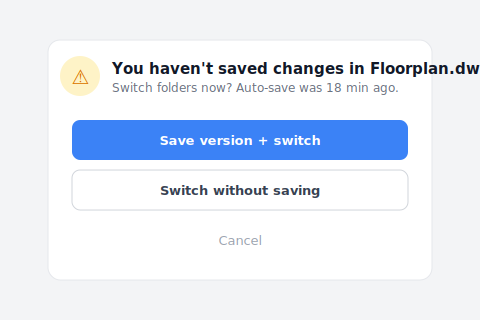

# 【2026 File Management】Shared folder file versioning: don't let _v8 steal your team's 83 hours a year

> Thursday, 5:30 p.m. You've finished the drawing but your hand is hovering on the filename. The cost of shared folders + manual v1/v7/FINAL naming: 83 hours of defensive tax per year. Why naming rules always collapse, and what automatic version control takes over.

Thursday, 5:30 p.m. The office quiets down. You've actually finished the courtyard floor plan; you could have left on time for a real dinner. But your hand hovers over the mouse, staring at the folder on the screen.

Inside sit `Floorplan_v6.dwg`, `Floorplan_v7_Client.dwg`, and a `Floorplan_v7_FINAL_do_not_touch.dwg`.

You take a deep breath, right-click the file you just saved, and carefully rename it to `Floorplan_v8_for_review_0423.dwg`. Then you open Line and message the colleague across from you: "Hey... I just saved v8. If you're editing the elevation, grab this one, don't save over mine."

You aren't saving a file, you're buying insurance. And the cost of that insurance is your focus and your evening hours, slowly worn down each day.

## Table of contents

- [The invisible bill, paid in anxiety](#anxious-bill)
- [Why shared-folder naming rules always collapse](#naming-failure)
- [Shared folder automatic version control: make _v8 disappear](#auto-versioning)
- [Are you designing, or guarding files?](#designer-or-guard)

---

## The invisible bill, paid in anxiety {#anxious-bill}

According to Asana's [Anatomy of Work](https://asana.com/resources/why-work-about-work-is-bad) study, knowledge workers spend 83 hours a year on "work about work": confirming, re-confirming, chasing progress, looking for the latest version. The broader tab runs higher still — [McKinsey's Social Economy study found employees burn about 1.8 hours a day, nearly a fifth of the workweek, just searching for and gathering information](https://www.mckinsey.com/industries/technology-media-and-telecommunications/our-insights/the-social-economy). But these are cold numbers; they can't describe the feeling.

The real cost is that **persistent micro-panic**.

It's when you've sent drawings to the contractor and a chill runs down your back: you rush back to the folder, "Wait, was that `v7_FINAL` or `v7_real_final`?" It's when your boss asks "is this the latest version," and you can't nod immediately; you say "let me check" and play guessing games with suffix words.

It isn't a management problem. It isn't your team being lazy. It's that the tools you use offload the responsibility of protecting your work onto your fragile memory.

---

## Why shared-folder naming rules always collapse {#naming-failure}

Every time someone's drawing gets overwritten, the company launches a "folder cleanup initiative" demanding everyone strictly follow `Date_Project_Version_Name`.

I tried this route myself at my old studio. For the first two weeks, the whole department behaves. By week six, someone in a deadline crunch quickly saves a `_NEW`; a downstream colleague uses the wrong version for production and spends an evening reworking it. Three months in, the folder is a junkyard again. Looking at those messy filenames, you might even feel guilty, like you haven't managed your team well enough.

Don't blame yourself, this fights human nature. When your brain is full of piping layouts, code reviews, and design changes, your hand just types `_FINAL` out of fear of being overwritten. Naming rules dress up a **mechanism problem** as a **discipline problem**: discipline gets crushed under deadlines, mechanism doesn't.

You have a second layer of problem too: as soon as one person on the team slacks off and saves a `_NEW`, the entire downstream chain of references breaks. `.dwg`, `.psd`, `.indd`, `.xlsx`, cross-file references all point wrong. One person slips, the whole team reworks.

---

## Shared folder automatic version control: make _v8 disappear {#auto-versioning}

Tomorrow morning you open the folder and it only contains a clean `Floorplan.dwg`, `Brand_Brief.psd`, `Budget.xlsx`. No `_v7_FINAL_do_not_touch` suffix.

You open the file, edit, save, close. No hesitation, no renaming, no desktop backup, no group-chat announcement. The system has quietly remembered every change underneath. If a subcontractor accidentally overwrites yesterday's design, you don't have to panic. You open the timeline and pull the version back in three seconds.

When you switch out of the current project folder before saving, Keeply nudges you so the afternoon's work doesn't sit on an 18-minute-old auto-save alone:

You hit "Save a version then switch", which freezes the afternoon's edits as a named version instead of leaving them at the mercy of the next auto-save.

Lay the methods your team currently uses side by side, and you see they each cover a completely different layer:

| Method | What it solves | What it doesn't | Right fit for a team? |
|---|---|---|---|
| Strict naming rules (`Date_Project_v1_Name.dwg`) | Keeps a form of versions | Fights human nature, someone slips by week 4 | Short-term yes, long-term no |
| Sync tools (Dropbox / OneDrive / Google Drive) | Real-time sharing, files don't disappear from local | A colleague overwrites your version, no notification | Half |
| Cloud Office track-changes (Word / Google Docs) | Who changed which sentence in text files | Design files (.dwg / .psd / .indd) entirely unsupported | OK for text, not for design |
| Tool-layer automatic versioning ([Keeply](https://keeply.work)) | Every save kept, who-when-what changed visible | Whole-disk physical failure (pair with [3-2-1 backup rule](/en/post/3-2-1-backup-rule/)) | Yes |

Each tool has its right context. The problem is team collaboration **simultaneously** needs "the versions you keep, kept without manual filing" + "cross-file references don't break", and no traditional tool is designed specifically for that layer.

- ✅ **Trust signal**: a week after installing Keeply, your folder shows only `Floorplan.dwg`, `Brand_Brief.psd`, `Budget.xlsx`, no `_v8_FINAL_really_last` suffix. The version from last week is one click away in the timeline.
- ❌ **Failure point**: a week in and you still don't dare delete the `_v6 _v7 _final` suffix files. That means Keeply hasn't built your confidence that "you can get it back." The tool or your workflow isn't a fit.

The software industry built "let the tool keep every version automatically" into its workflow over a decade ago; but that layer never made it to construction, architecture, design, or research industries. We're still manually adding `_v7` to fight disasters. Building Keeply was about filling that gap.

That said, I have to be honest: Keeply doesn't replace the [3-2-1 backup rule](/en/post/3-2-1-backup-rule/). An entire SSD dying, an office fire, a cloud account locked, those scenarios belong to backup tools, not version-history tools. Keeply is "version guard during daily work," not "disaster recovery."

---

## Are you designing, or guarding files? {#designer-or-guard}

This 83 hours of defensive tax per year — you've paid enough years of it. The next time your hand instinctively reaches for `_v8`, stop and ask:

**Am I designing, or guarding files?**

---

Remember Thursday 5:30 p.m., the hand hovering over the filename? You don't need to guard files anymore. **Keeply: the guardian of your file history**, remembering every change for you. Version history lives inside the folders you already use, no migration, no switching tools.

[Get to know Keeply →](https://keeply.work)

## Further reading

The pillar [Complete Guide to File Version Management](/en/post/file-version-management-complete-guide/) unpacks the 4 structural reasons tools simply aren't designed for what you actually need.

---

## Sources

- [Asana, Anatomy of Work — Why Work About Work Is Bad](https://asana.com/resources/why-work-about-work-is-bad)
- Further reading: [IDC, The High Cost of Not Finding Information (2012)](https://computhink.com/wp-content/uploads/2015/10/IDC20on20The20High20Cost20Of20Not20Finding20Information.pdf) · [McKinsey Global Institute, The Social Economy (2012)](https://www.mckinsey.com/industries/technology-media-and-telecommunications/our-insights/the-social-economy)

---

> About the author: Ting-Wei Tsao, founder of Keeply.
> [LinkedIn](https://www.linkedin.com/in/ting-wei-tsao-b57480152/)
