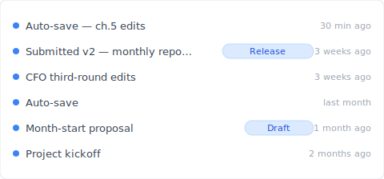
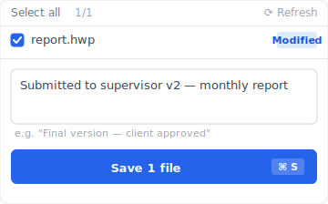

# 【2026 File Management】한글 (HWP) file recovery: 3 mechanisms + Keeply timeline layer

> Hancom Hangul has 3 recovery mechanisms built in. Readers confuse all three as "version history" — each only solves one problem.

"The night before a paper deadline, 한글 crashes without saving — you open 한글, see an 'auto-recovery' popup, and 80% of your 3 hours of work comes back. But the version from 3 weeks ago for that proposal? You dig through `~AutoSave/` — gone."

This is the real limit of 한글's 3 built-in recovery mechanisms (Autosave / Temp save / Backup file): **they solve crashes + last-version rollback, not time-based history**. This article unpacks the differences between the three + how [Keeply](https://keeply.work) fills the timeline gap as a cross-tool layer.

## Contents

1. [How Keeply makes HWP files "the version from 3 weeks ago is still there"](#keeply-timeline)
2. [HWP 3 recovery mechanisms: Autosave / Temp save / Backup file — what each one does](#three-mechanisms)
3. [Autosave: crash recovery, not version history](#autosave)
4. [Temp save .bak: 1-version backup, overwritten by next save](#bak)
5. [Backup file: configurable in Preferences, still 1-2 version limit](#backup-file)
6. [The real scenario where all 3 fail: overwrote old version + want 3 weeks back](#failure-scenario)
7. [Keeply fills the gap: cross-tool timeline + Release freeze](#keeply-fills)
8. [3 HWP scenarios where you don't need Keeply](#when-not-needed)
9. [FAQ](#faq)

---

## How Keeply makes HWP files "the version from 3 weeks ago is still there" {#keeply-timeline}

Here's what happens. Jiyeong is a civil servant. She writes her monthly report `report.hwp` in 한글 — 100+ saves accumulated over 6 months. Today her supervisor suddenly asks: "Can you show me that section from the version you sent 3 weeks ago?" She opens 한글's "Recent files" — only goes back to last week. Opens `~AutoSave/` — only crash-recovery temp files. Opens `report.hwp.bak` — only the most recent 1 version. **All 3 recovery mechanisms fail to retrieve the 3-week-old version**.

In [Keeply](https://keeply.work), it's different. Same `report.hwp` looks like this in the Keeply timeline:

"Submitted to supervisor v2 — monthly report" gets its own row with a Release tag — that's Jiyeong three weeks ago, after submitting to her supervisor, hitting "Save version" in Keeply's main window and writing a note:

Write "Submitted to supervisor v2 — monthly report", save the version. Three weeks later, scrolling Keeply's timeline, the tag is right there — **not bound by 한글's limited temp folder**.

Two actions, total:

1. **Save** — Ctrl+S in 한글 as usual. 한글 writes `.hwp` to the folder. Keeply polls in background within 30 min, sees the change, auto-saves a version to **its own timeline**.
2. **Mark milestone** — at significant moments (supervisor signoff / client approval / month-end seal), hit "Save version" in Keeply's main window and write a note.

Below: unpack 한글's three mechanisms — why all three fall short.

## HWP 3 recovery mechanisms {#three-mechanisms}

When 한글 says "file recovery," it's actually three different things blended:

| Mechanism | What it is | Limit | Trigger |
|---|---|---|---|
| **Autosave** | Crash-recovery temp file | Default every 10 min, 1 copy to `~AutoSave/` | 한글 actively writes; only useful on crash / force-quit |
| **Temp save .bak** | Last-version backup | **1 version** (overwritten by next save) | Auto-generated every save |
| **Backup file** | Configurable auto-backup in settings | Usually 1-2 versions | Every save (if configured) |

Three different things — confused as one, you'll look in the wrong layer. "Can't find the version from 3 weeks ago" might be autosave temp already deleted, .bak already overwritten by a new save, or backup file not enabled. **Each mechanism only solves one scenario.**

## Autosave: crash recovery, not version history {#autosave}

한글 [Preferences → Autosave](https://help.hancom.com/hoffice/multi/ko_kr/hwp/file/options/options(autosave).htm) saves a copy every 10 min by default to `~AutoSave/` (path configurable).

**Only useful in**:

- 한글 crash (application error)
- Force-quit (terminate from Task Manager)
- System power-off / forced restart
- Closing without saving — "Recover?" prompt on next open

**Completely separate** from version history: autosave doesn't keep multiple versions (just the most recent 1 temp), can't find "the version from 3 weeks ago."

See [Photoshop autosave isn't version history](/en/post/photoshop-autosave-not-version-history/) — Adobe has the same autosave-confusion pattern.

## Temp save .bak: 1-version backup {#bak}

Every time you save an HWP file, a `<filename>.bak` copy is auto-generated in the same folder — the version just before the last save.

**Key limits**:

- **Only 1 version**: each save overwrites the old `.bak`, no version stacking
- **Solves "saved this one wrong" scenario**: can't go back further
- **Optional in settings**: can be disabled in Preferences (default on)

Reader misconception: ".bak is version history" ❌. Actually just "most recent 1 version" record.

## Backup file: configurable in Preferences {#backup-file}

한글 Preferences → Backup file / Temp save can enable automatic .bak generation. For users who have it enabled, same mechanism as the previous .bak section (just different setting location).

**Still 1-2 version limit**, not true version history. Doesn't help with "the version from 3 weeks ago" need.

## The real scenario where all 3 fail {#failure-scenario}

Jiyeong's scenario analysis:

| Scenario | Autosave solves? | .bak solves? | Backup file solves? |
|---|:---:|:---:|:---:|
| 한글 crash, didn't save | ✅ | ❌ | ❌ |
| Saved this version wrong, want last version | ❌ | ✅ | ⚠ depends on settings |
| **Find supervisor-submission from 3 weeks ago** | ❌ | ❌ | ❌ |
| **Find proposal initial version from last month** | ❌ | ❌ | ❌ |
| Client asks for "the version confirmed Feb 14" | ❌ | ❌ | ❌ |

The bottom 3 ❌s are "time-dimension" needs — none of the 3 HWP built-in mechanisms cover this layer.

## Keeply fills the gap: cross-tool timeline + Release freeze {#keeply-fills}

How does Jiyeong solve "find the version from 3 weeks ago"? Switch to [Keeply](https://keeply.work). Three things in one tool:

- **Cross-tool timeline**: Keeply watches the folder, after each Ctrl+S saves 1 version to **its own timeline** — not dependent on 한글's limited `~AutoSave/`. Six months of saves = six months of version history (not 1-2 versions)
- **Release freeze**: 3 weeks ago when submitting to supervisor, Jiyeong hit Keeply "Save version" with tag "Submitted to supervisor v2" — this version is frozen as a separate snapshot, **not overwritten by subsequent saves**, preserved permanently
- **Per-file note**: each version carries 1-2 lines of notes ("Supervisor submit v2", "Client requested ch.3 revision"), three weeks later just scroll the timeline and find the tag instantly

Runs alongside HWP's own autosave / .bak — no conflict. 한글 handles crashes + last-version rollback, Keeply handles time history + important-version freeze.

## 3 HWP scenarios where you don't need Keeply {#when-not-needed}

Honest list:

**Locked-down environment / government / education**. If you're a civil servant or teacher using an IT-issued locked-down PC (no external software allowed) — don't force this. Follow your IT department's centralized backup policy (Veeam / Acronis). Keeply is for personal PCs / SMB / SOHO, not compliance archive.

**Only using 한글 viewer to read others' files**. If you don't actively edit and only open 한글 viewer for received `.hwp` files — no version management need, skip Keeply.

**Single file, 1-2 saves then submit**. One-off short documents (official letter reply / 1-page notice) saved 1-2 times — no timeline need, HWP built-in .bak is enough.

## FAQ {#faq}

**Q1: Where does HWP autosave save?**

Default `~AutoSave/` (path changeable in 한글 Preferences → Autosave). Default every 10 min, only useful on crash / force-quit, prompt on next open. Not version history, can't find 3-week-old version.

**Q2: HWP .bak vs autosave?**

.bak is last-version backup (auto-overwritten every save), keeps 1 version. Autosave is crash temp file, completely different layer from version history.

**Q3: Is HWP backup file reliable?**

Still 1-2 version limit, not true version history. Insufficient for "3-week-old version" need.

**Q4: All 3 fail, how to find 3-week-old version?**

HWP built-in can't recover. Need external tooling for continuous version backup — e.g. [Keeply](https://keeply.work) cross-tool timeline.

**Q5: Keeply vs Hancom Office?**

No conflict, runs alongside. 한글 handles crash / last-version, Keeply adds unlimited timeline.

**Q6: Civil servant / teacher, can't install external software?**

Locked-down environment follows IT centralized backup policy (Veeam / Acronis), Keeply personal tool not suitable.

## See also

The pillar [file version management complete guide](/en/post/file-version-management-complete-guide/).

Side-by-side:
- [Photoshop autosave isn't version history](/en/post/photoshop-autosave-not-version-history/) — Adobe's same autosave ≠ version history confusion
- [Excel version history limits](/en/post/excel-version-history-limits/) — Office's parallel mechanism gap pattern
- [What Keeply saves vs backup and cloud tools](/en/post/what-keeply-saves-vs-backup-cloud/)

---

Jiyeong submits her monthly report at month-end. 한글 crashes 3 times, autosave rescues each time's work.

But the supervisor suddenly asks for "the version from 3 weeks ago" — autosave / .bak / backup file all fail to recover.

Hancom has the 3 mechanisms in its docs. You don't need 한글 to be different — you need a tool that catches the time history when 한글's mechanisms run out.

---

> About the author: Ting-Wei Tsao, founder of [Keeply](https://keeply.work).
> [LinkedIn](https://www.linkedin.com/in/ting-wei-tsao-b57480152/)
