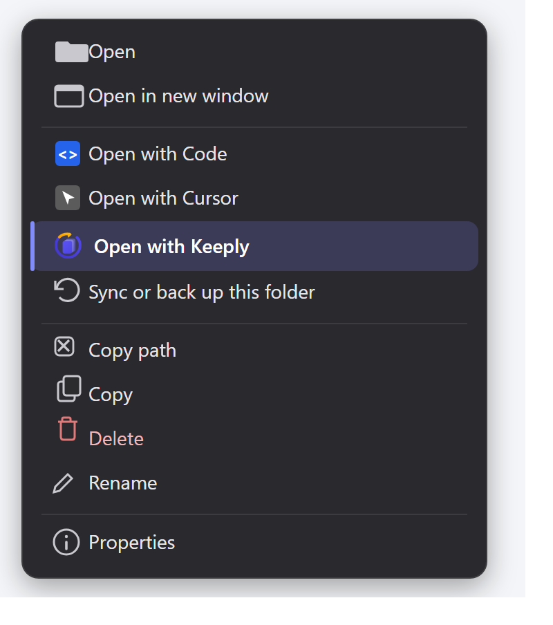

From 1.0.10 to 1.0.12, we put the focus on teams — and folded in a round of stability and security along the way.

Keeply opens to the folder view you already know: your files and folders in a grid, a version timeline down the left. Because it looks like a folder, the new things in 1.0.12 barely need learning — right-click a folder to open it, invite a teammate as easily as sharing a link.

## 🆕 New

### Right-click "Open with Keeply"

Before, you had to open the Keeply window first, then go hunting for the folder's path. Not anymore: in File Explorer or on the desktop, right-click any folder and there's "Open with Keeply." Two steps gone — protect a folder straight from the right-click menu.

### Team invites, from code to join

We rebuilt the whole invite flow.

On your end (admin): when you generate an invite code you can enter the person's name, pick their role (member or admin), and set an expiry (24 hours, 7 days, or never). You get both a **short code** and an **invite link** to share. You can also see who has used theirs, who hasn't joined yet, and which codes expired — and revoke any of them in one click.

On their end: they click the link, see a "You're about to join ◯◯'s team" confirmation, and they're in — no hunting for where to paste a code.

Also landing in this release:

- **Ctrl + S / Cmd + S quick save** — inside the Keeply window, use the save shortcut you already know to save a version instantly (the same as clicking "Save version").
- **Free teammates can be invited in** — they don't have to buy a license first; once invited, they inherit the team's permissions and start collaborating.
- **You can see the people on your team** — members now have a name and a title, so the panel shows who's who instead of a string of IDs.
- **The paid badge jumps straight to the team panel** — no digging through settings.
- **Team role permissions (foundation)** — you can start splitting permissions by role. Honestly, this is a first step; fuller permission settings are still on the way.

## ✨ Improved

- Joining is unified around invite codes; we removed the old "add member manually" entry for a clearer flow.
- Cleaned up location cards and other UI, so there's less clutter.
- When you report a problem, Keeply now attaches fuller diagnostics, so we can find the cause and fix it faster.
- License fingerprint drift now self-heals, so a new machine or a changed environment won't lock you out by mistake.

## 🛡️ Fixed & secure

- A routine update of underlying components and a batch of known security patches, including certificate validation on the file-sync connection.
- Fixed a series of bugs in the team and invite flows, including a leftover timer when switching pages.

## ⬇️ Download & upgrade

Grab 1.0.12 at [keeply.work](https://keeply.work); if you have Keeply installed already, the update arrives automatically.

We're only halfway down the team road, and what comes next depends a lot on your feedback. Got thoughts after using it? Tell us straight from "Report a problem" inside Keeply — I read them.

---

> About the author: Ting-Wei Tsao, founder of [Keeply](https://keeply.work). [LinkedIn](https://www.linkedin.com/in/ting-wei-tsao-b57480152/)
