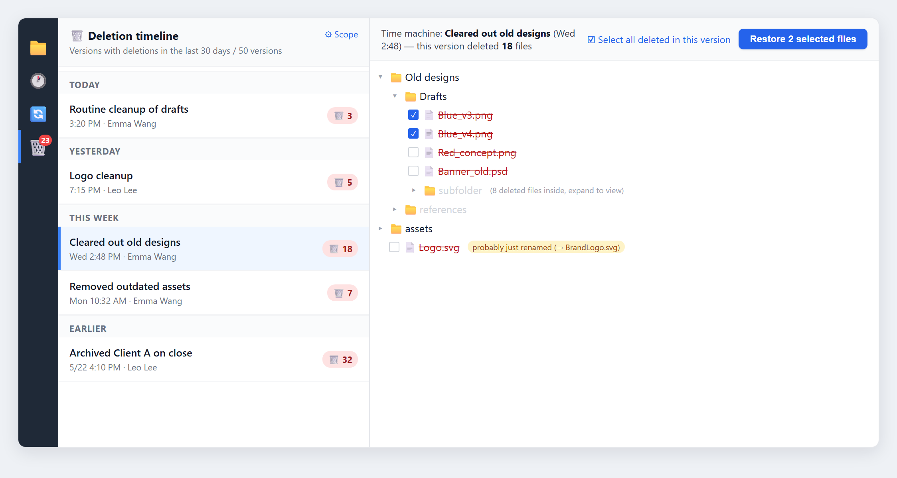

From 1.0.12 to 1.0.13, we put most of our energy into one thing: turning "get back the file I deleted by accident" into a panel you can actually trust. We've also been working on team collaboration for a long time, and it's getting close — so this release gives you an early look.

Open Keeply and you land on the folder view you already know: a grid of files and folders, with a timeline down the left side that records every version you've saved. The new stuff in this release follows the same logic — click a file to see its history, or pull a deleted file back from the timeline.

## 🆕 New features

### Deletion time machine: get accidentally deleted files back

Until now, if a file got deleted by mistake and was already gone from the Recycle Bin, you were mostly out of luck. This release adds a dedicated panel: click the 🗑️ in the left toolbar and you'll see a "deletion timeline," grouped by Today / Yesterday / This week / Earlier. Each entry is tagged "🗑️ N" on the right — how many files that round deleted.

Click an entry and the right side expands like a time machine into the file tree as it looked at that moment, jumping straight to where the deleted file used to be. Files that were actually deleted are marked with a red strikethrough; if a file was simply renamed, a small note next to it says "probably just renamed" so you don't go hunting for nothing.

Check the files you want (you can select everything that round deleted at once), hit "Restore N selected files," pick a folder to drop them in (Desktop by default), and Keeply restores them in their original folder structure. If a filename collides, it adds a `_restored` suffix by default so nothing of yours gets overwritten.

### Click a file to see just its version history

The timeline has always shown versions for the whole folder. But often you just want to know "this one file — which versions did it actually change in?" Now you can single-click that file and the main timeline on the left narrows to just that file's history. When you're done, click "Back to all versions" to return to the full timeline.

### A file explorer that's easier on the eyes and easier to use

- **See at a glance what changed**: in the "Changes" tab, untouched files are dimmed and modified ones stand out, so you don't have to compare them one by one.
- **Folders as cards, with selection states**: folders now use a card-style icon, and selecting one gives a clear highlighted state.
- **Consistent right-click menu**: whatever view you're in, and whether you right-click a file or a folder, the menu is the same.
- **Refresh with F5**: just like you'd expect — press F5 to refresh the current view.

## 🔭 Coming soon: team collaboration (sneak peek)

To be clear up front: team collaboration is **not yet available in this release**. We wanted to show you where things are headed. It's the area we invested the most in internally for 1.0.13 — we've built the whole collaboration flow into one complete path, and once it's polished we'll open it up to everyone.

Here's what's coming:

- **From review to merge, end to end**: a member sends their working copy to a manager for review with a note; the manager leaves comments file by file and approves or sends it back (with a reason); once approved, it merges and the member wraps up with one click. Review records sync across machines, so they don't stay stuck on one computer.
- **Task assignment and tracking**: managers assign work and members start it with one click; tasks can be broken into checkable subitems to track progress; sending for review, approving, or returning automatically updates the task status.
- **A "metro map" of team activity**: a diagram like a subway map, where the trunk line is the main version and each member's working copy branches off — so you can see at a glance who's active, which branches have merged, and which are still in review.
- **Turn an existing folder into a "team original"**: any folder you're already managing in Keeply can be set as the team original, and members inherit access when they join — no need for everyone to buy in separately.

We haven't set a release date yet, and we'll let you know when it's ready. If team collaboration is exactly what you've been waiting for, use "Report a problem" to tell us which part you want first.

## ✨ Experience improvements

- Saving versions, syncing, and restoring now run in the background, so the screen doesn't freeze while you work.
- Notification-style alerts moved to a floating panel in the bottom-right corner instead of crowding the main view.
- The timeline's filter labels dropped the technical jargon in favor of plain language anyone can follow.
- When you report a problem, Keeply now attaches the correct version number automatically, so we can pinpoint which release you're on faster.

## 🛡️ Fixes and security

- Fixed a batch of issues caught from real-world use after the delete feature shipped.
- Backup location: when a drive letter is converted to a network path, we fixed a "stuck at the limit" hang and a false red-error warning when an old location no longer exists.
- Tighter safeguards for safe version saving: when the pre-save snapshot genuinely fails, Keeply now aborts the risky operation instead of forcing it through.
- Routine updates to underlying components, patching a batch of known security vulnerabilities.

## 🔒 About privacy

This release adds an "anonymous usage statistics" consent setting: only if you opt in, it sends usage signals that contain no personal data, helping us learn which features people actually use. It's off by default, you can turn it off anytime in settings, and it **won't actually go live until July 15, 2026** — before then, we'll post a notice in the app 30 days in advance. Nothing starts silently.

## ⬇️ Download and upgrade

Head to [keeply.work](https://keeply.work) to download 1.0.13; if you already have Keeply installed, the update will arrive automatically.

This release also adds **Intel Macs**: alongside Apple Silicon, Macs with Intel processors now have a matching installer.

Deletion recovery and per-file timelines are already in your hands, and team collaboration isn't far behind. A big part of what we build next depends on your feedback. If you have any thoughts while using Keeply, tell us straight from "Report a problem" inside the app — I'll see it.

---

> About the author: Ting-Wei Tsao, founder of [Keeply](https://keeply.work). [LinkedIn](https://www.linkedin.com/in/ting-wei-tsao-b57480152/)
