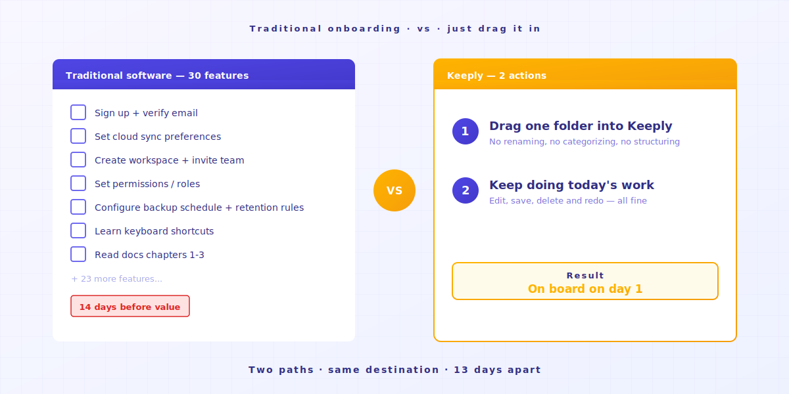
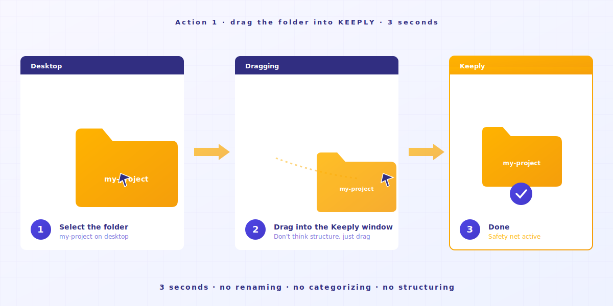
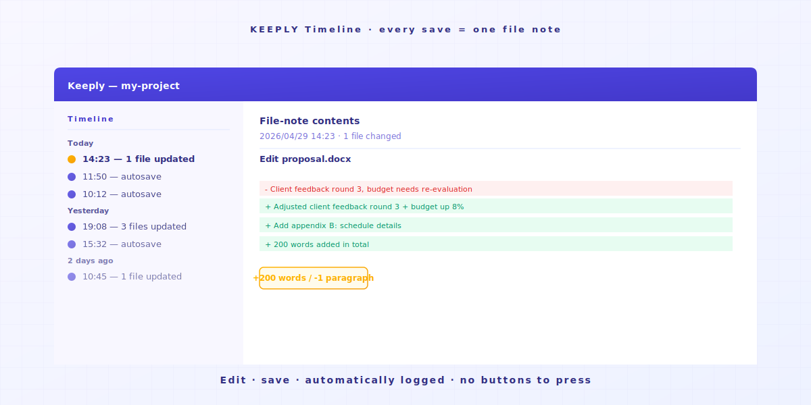
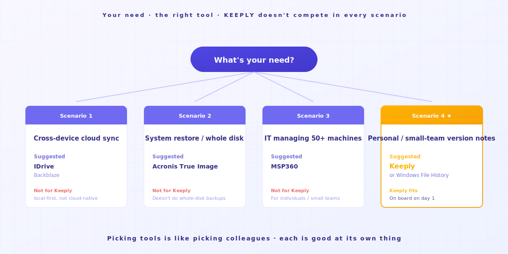

# 【2026 File Management】How to use Keeply: skip 30 features, get on board with 2 actions

> You don't need to become an expert first. Drag a folder in, keep working. Version history is already running.

## Table of contents

1. [Why do you push back on new tools?](#why-resist-new-tools)
2. [Why do you give up on a tool?](#why-give-up-a-tool)
3. [So what are the 2 actions?](#what-are-the-two-actions)
4. [Let me tell you what you'll experience](#first-week-natural)
5. [When Keeply isn't right for you](#when-keeply-isnt-right)

---

Mr. A juggles a lot of projects, and he uses a notebook every day to track what he's done. He just heard Keeply is a great file-note software. He opens the homepage and sees "Get started in 3 steps" and "7-day free trial." The last tool he tried, he was still lost on day 14. Patience ran out before any value showed up. **This time he wants 10 minutes to decide.**

It's not that you're slow. It's that traditional software's learning curve assumes you're willing to drop everything today and become a student for 14 days.

---

## Why do you push back on new tools? {#why-resist-new-tools}

You push back on new tools because most of them assume you can stop your current work today and become a student for 14 days. But you've got a project shipping tomorrow. You don't have a 14-day gap to spend on anything.

You tried installing a tool yesterday. The docs are 50 pages. There are 30 new terms. You're shipping a project tomorrow.

You think: "I'll come back to this next week and take my time." Then you never open it again.

Most software companies treat "learn it in 14 days" as the natural order. [Industry research](https://userpilot.com/blog/time-to-value-benchmark-report-2024/) shows users who finish less than half of onboarding churn within 14 days at **3 times** the rate of users who finish the whole thing.

In other words: the software assumes you have 14 free days. It assumes your work can wait until you've learned it.

Your next project is nowhere in that 14-day assumption.

---

## Why do you give up on a tool? {#why-give-up-a-tool}

Learning a new tool usually takes about 14 days — and most of those days are still spent feeling around.

Halfway through that phase, most people will want to close the tab.

Before I built Keeply, I tried plenty of new tools myself. A lot of them felt like a hassle on day 1, and I'd quietly fall back to my old way of doing things.

Later I realized: the tools I actually stuck with had one thing in common — **they were intuitive enough to just use**.

One time I was using AI to write code, and the AI went off the rails. I'd already lost track of where it had gotten to. **Thankfully I had been keeping file notes the whole time.**

Open the history. **Back to a state I could control.**

That's when I understood: a good tool isn't the one with the most features, it's **the one simple enough to get the hang of**. I hadn't learned a single feature, and just by quietly catching that file, the tool had already paid for itself.

The tool isn't the problem. **This category of software just shouldn't be designed around "learn first, use later."**

---

## So what are the 2 actions? {#what-are-the-two-actions}

There are only two: **drag a folder into Keeply, then save a version when it matters**. No commands to learn, no 30-page docs. Saving a version is one click — Keeply's "save version" button (or Cmd+S inside Keeply) — and if you'd rather not think about it, switch on auto-save and Keeply captures changes every 15–30 min.

### Action 1: Drag a folder into Keeply

You literally just drag it in. **Don't rename, don't categorize, don't think about structure.**

### Action 2: Save a version when it matters

Do whatever you were going to do today. When you finish a section, when a client signs off on a version, before a big risky change — click Keeply's "save version" and add a one-line note (e.g. "client-approved"). That moment lands in the Timeline on the left.

Don't want to remember to click? Switch on auto-save and Keeply captures your changes every 15/30/60 min (your choice) — your manual saves carry your notes, the auto ones are timestamped, both on the same timeline.

You don't have to rename your files either. That `_v3_actually_final.docx` keeps its name. Keeply doesn't touch your habits.

End of day 1, you've got 1 day of file notes. **End of day 7, you've got a full week.**

Intuitive use, that's the whole trick.

---

## Let me tell you what you'll experience {#first-week-natural}

### Day 1

Drag a project in. Save.

### Day 2-3

Edit 200 words in an existing file. Save.

Through the Timeline you watch your own file notes start piling up. **Click into a note, see what you deleted and what you added.**

### Day 4-7

You're stacking more and more file notes.

One day you'll notice — **I'm glad I have this software**.

---

## When Keeply isn't right for you {#when-keeply-isnt-right}

Keeply doesn't fight for every scenario. In 4 cases, another tool is the better call.

- **If you need cross-device cloud sync**: pick [IDrive](https://www.idrive.com/) or [Backblaze](https://www.backblaze.com/). Keeply lives on your computer. It's not cloud-native. ([What Keeply actually saves vs. backup and cloud tools.](/en/post/what-keeply-saves-vs-backup-cloud/))
- **If you need system restore or full disk backup**: pick [Acronis True Image](https://www.acronis.com/). Keeply doesn't do that.
- **If you're an IT pro managing 50+ machines**: pick [MSP360](https://www.msp360.com/). Keeply is for individuals and small teams.
- **If you just don't want to lose personal documents**, Windows File History is built in and good enough. You don't need to install anything.

Picking a tool is like picking a coworker. Each one has its strong scenario. Be honest about it, and you'll burn fewer 14-day trials.

---

## Wrapping up

You want to try a new tool, and you don't want to lose 14 days to it. That's fair.

Drag a folder into [Keeply](https://keeply.work/). Keep doing today's work.

On day 7, open the Timeline and take a look. **You'll get it.**

---

## Further reading

- [The complete guide to file version management](/en/post/file-version-management-complete-guide/) (PILLAR 1, why version management matters)
- [Your first week with Keeply: a 7-day field journal](/en/post/keeply-first-week-workflow/) (what to actually do after the install)
- [What Keeply actually saves vs. backup and cloud tools](/en/post/what-keeply-saves-vs-backup-cloud/) (Keeply vs Dropbox / Time Machine — the practical difference)
- [Vibe coding overshot? One move to roll back to the last working version](/en/post/vibe-coding-rollback/) (the classic AI-broke-my-file use case)

---

> About the author: Ting-Wei Tsao, founder of Keeply.
> [LinkedIn](https://www.linkedin.com/in/ting-wei-tsao-b57480152/)
