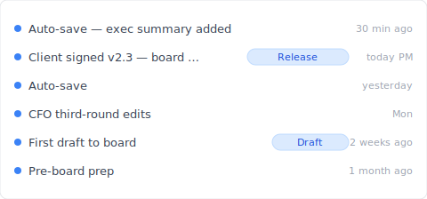
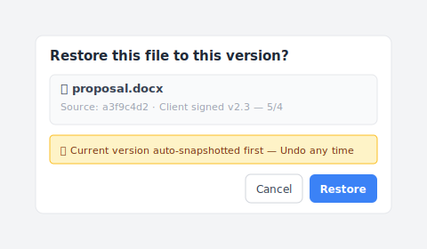

# 【2026 File Management】OneDrive version history isn't unlimited — 500 cap + 30-day window in Microsoft's own docs

> Microsoft Learn says it plainly: 500 + 30 days. But 90% of how-to articles teach the feature, not where it breaks.

"OneDrive saved you 200 times. Then on the 501st, it quietly deleted your oldest version — without telling you."

This isn't a bug. It's the 500 major-version cap [Microsoft Learn](https://learn.microsoft.com/en-us/sharepoint/document-library-version-history-limits) has stated all along. But 90% of OneDrive version history tutorials teach you **how to use it**, not **where it breaks**. This piece fills that gap — three OneDrive mechanisms (version history 500 cap / Recycle Bin 30-day window / AutoRecover) often mistaken as one, then how [Keeply](https://keeply.work) catches the post-cap scenarios.

## Contents

1. [How Keeply keeps OneDrive history from disappearing on the 501st save](#keeply-timeline)
2. [OneDrive's three mechanisms: 500 / 30-day / AutoRecover — different things](#three-mechanisms)
3. [The 500-version cap: Microsoft's own number and when you hit it](#500-cap)
4. [Recycle Bin 30 / 93 days: a delete-time window, not version history](#recycle-bin)
5. [AutoRecover: Office crash buffer, completely separate from version history](#autorecover)
6. [Keeply fills the gap: Release freeze + per-file note after the cap](#keeply-fills)
7. [3 scenarios where you don't need Keeply with OneDrive](#when-not-needed)
8. [FAQ](#faq)

---

## How Keeply keeps OneDrive history from disappearing on the 501st save {#keeply-timeline}

Here's what happens. Tina is a consultant. She stores `proposal.docx` on OneDrive — 200+ versions accumulated over six months. The client signs off today. Next March she wants to look back at the original proposal version — is OneDrive going to have it?

In [Keeply](https://keeply.work), this project's timeline looks like this:

"Client signed v2.3 — board approved" gets its own row with a Release tag — that's her this afternoon, after the client signed off, hitting "Save version" in Keeply's main window and writing a note:

Write "Client signed v2.3 — board approved", save the version. Next March when she pulls up the timeline, the tag is right there — unaffected by OneDrive's 500 cap, never auto-deleted.

Two actions, total:

1. **Save**—Ctrl+S in Word as usual. OneDrive syncs to cloud (as before). Keeply polls in background within 30 min, sees the change, auto-saves a version to its own timeline.
2. **Mark milestone**—after the client signs off, hit "Save version" in Keeply's main window, write a one-line note.

Now let's unpack OneDrive's three mechanisms — why version history disappears on the 501st save.

## OneDrive's three mechanisms: different things, often confused {#three-mechanisms}

When OneDrive says "version history," it's actually three different things blended into one term. **Pull them apart**:

| Mechanism | What it is | Limit | Trigger |
|---|---|---|---|
| **Version History** | Each version of a cloud file | **500 major versions** ([MS Learn](https://learn.microsoft.com/en-us/sharepoint/document-library-version-history-limits)) | Auto on every save |
| **Recycle Bin** | Window after file deletion | 30 days personal / 93 days work or school ([MS Support](https://support.microsoft.com/en-us/office/restore-deleted-files-or-folders-in-onedrive-949ada80-0026-4db3-a953-c99083e6a84f)) | Manual / sync delete |
| **AutoRecover** | Office client crash buffer | Default 10-min interval | App crash / force-quit |

Three different things — confused as one, you'll look in the wrong layer. "I can't find my file from 6 months ago" might be the Version History 500-cap kicking in, might be the Recycle Bin 30-day window expired, might be AutoRecover overwritten ages ago. Different problems, different solutions.

## The 500-version cap: Microsoft's own number {#500-cap}

[Microsoft Learn](https://learn.microsoft.com/en-us/sharepoint/document-library-version-history-limits) states it clearly: SharePoint / OneDrive document libraries keep up to **500 major versions** per file (with major/minor versioning enabled, up to 511 minor versions on top).

**What happens after**: the oldest version is automatically deleted to make room for the new one. No notification. No cancellation option.

**Who hits the cap**:

- **Consultants** — 3 saves/day on a proposal × 22 working days = ~66 versions/month → cap in **7-8 months**
- **Designers** — 5-8 saves/day on a design file → cap in **3-4 months**
- **Writers / lawyers** — 10+ saves/day on a manuscript → cap in **under 3 months**

High save frequency + multi-month project = high chance of hitting the cap. Microsoft doesn't warn you. The UI doesn't flag it. You find out when you go looking.

## Recycle Bin 30 / 93 days {#recycle-bin}

The Recycle Bin is a **delete recovery window**, not an extension of version history. Common confusion: "I have 30 days to recover deleted files" ≠ "I can roll back to a version from 6 months ago."

Per [MS Support](https://support.microsoft.com/en-us/office/restore-deleted-files-or-folders-in-onedrive-949ada80-0026-4db3-a953-c99083e6a84f):

- **Personal account**: 30-day retention
- **Work or school account**: 93-day retention

After expiration, items are permanently deleted from the second-stage Recycle Bin.

Version History and Recycle Bin are **two separate systems**. Modify `proposal.docx` from v200 to v201 — old version goes into Version History (not Recycle Bin). Delete `proposal.docx` — entire file goes into Recycle Bin (along with its version history). The former hits the 500 cap; the latter hits the 30/93-day cap.

## AutoRecover ≠ version history {#autorecover}

AutoRecover saves `.asd` temporary files in Word / Excel / PowerPoint desktop clients — default **10-minute interval** — only useful in:

- App crash (blue-screen / hang)
- Force-quit / system power-off
- Closing without saving, then a "do you want to recover?" prompt on next open

Completely separate from OneDrive cloud version history. The "we found an unsaved version" prompt is AutoRecover, not cloud history.

For details on a related pattern, see [Photoshop autosave isn't version history](/en/post/photoshop-autosave-not-version-history/) — Adobe's parallel confusion in the design space.

## Keeply fills the gap — after the OneDrive cap {#keeply-fills}

Tina's `proposal.docx` hit the 500 cap. The client suddenly wants the 8-month-old proposal version — OneDrive doesn't have it anymore.

In [Keeply](https://keeply.work), three things land in one tool:

- **Release freeze**: on Feb 14 when the client signed off, Tina hit "Save version" and tagged it "Client signed v2.3" — that version becomes a separate snapshot, never overwritten by the next 500 saves, kept forever. The OneDrive 500-cap doesn't apply.
- **Per-file note**: every version can carry a one-line note. Three months later, Tina scrolls the timeline and sees "CFO third-round edits," "Client signed," "Pre-board prep" — no need to dig through 12 `_FINAL` files trying to guess which is which.
- **Cross-tool portability**: Keeply doesn't depend on OneDrive. Switch to Dropbox / NAS / a new laptop — the timeline still lives locally + in Keeply's own backup location. No cloud vendor's cap locks you in.

When the client email lands, Tina opens the Keeply timeline, finds the Feb 14 "Client signed v2.3" row, and right-clicks to restore — this dialog comes up:

She clicks Restore. Three seconds and `proposal.docx` is back to its Feb state; the current version is auto-snapshotted, so Undo is always one click away. OneDrive keeps doing what it's strong at (collaborative sync). Keeply gives you unlimited per-file version history.

## 3 scenarios where you don't need Keeply with OneDrive {#when-not-needed}

To be straight — Keeply isn't for everyone:

**Enterprise compliance archive.** SOX, HIPAA, GDPR require audit chain + encryption + retention period management — go with [Microsoft 365 Backup](https://www.microsoft.com/en-us/microsoft-365/business/microsoft-365-backup), Veeam, or Acronis. Keeply is for daily version management, not compliance.

**Contract signing / legal audit.** Need signatures + immutable records — use DocuSign or Adobe Sign. Keeply tracks version trails but doesn't certify signatures.

**Less than 1 save per day, personal use.** If your `notes.docx` gets edited once a week — you'll never hit OneDrive's 500 cap in 10 years. Keeply isn't urgent.

## FAQ {#faq}

**Q1: How many versions does OneDrive keep?**

500 major versions ([Microsoft Learn](https://learn.microsoft.com/en-us/sharepoint/document-library-version-history-limits)). Oldest auto-deleted after that, no notification.

**Q2: How long does OneDrive keep version history?**

Version history itself has no time limit (bounded by 500 cap). Time-limited is the Recycle Bin: 30 days personal, 93 days work.

**Q3: Is OneDrive version history the same as AutoRecover?**

No. Version history is OneDrive's cloud-side per-version preservation. AutoRecover is Office desktop crash buffer (10-min interval). Different storage layers.

**Q4: Why can't I find my OneDrive file from 6 months ago?**

Two possibilities: (a) exceeded 500-cap, auto-deleted; (b) you searched Recycle Bin instead, 30-day window closed. Heavy users hit cap in 7-8 months.

**Q5: What happens after exceeding 500 versions?**

OneDrive silently deletes the oldest. No warning. To solve, need a tool without a cap — [Keeply](https://keeply.work) Release freeze for example.

**Q6: Does Keeply conflict with OneDrive?**

No. Runs alongside. OneDrive for collaboration sync, Keeply for unlimited per-file version history + notes + Release freeze.

## See also

The pillar [file version management complete guide](/en/post/file-version-management-complete-guide/) — 4 structural reasons your tools were never designed for keeping file history.

Side-by-side:
- [Excel version history limits](/en/post/excel-version-history-limits/) — Excel's parallel 500-mechanism + sibling scenarios
- [What Keeply saves vs backup and cloud tools](/en/post/what-keeply-saves-vs-backup-cloud/) — three different things, full comparison
- [The client asked which version is the final](/en/post/client-asked-which-version/) — Word version history + the "client wants that version" scene

---

Tina's `proposal.docx` hit the 500 cap on OneDrive. The client wants the 8-month-old proposal next month — by Microsoft's own rule, auto-deleted, gone.

But in Keeply she tagged "Client signed v2.3" as a Release. Half a year later, the client asks — three seconds to find it.

Microsoft has the 500 number in the docs. You don't need OneDrive not to age — you need a tool that catches you when it does.

---

> About the author: Ting-Wei Tsao, founder of [Keeply](https://keeply.work).
> [LinkedIn](https://www.linkedin.com/in/ting-wei-tsao-b57480152/)
