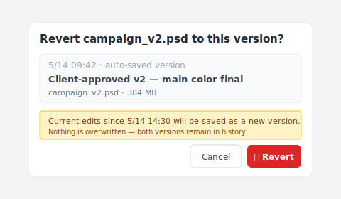

You hit Cmd+S. The cursor blinked once.

Then it hit you — that was the version the client wanted.

The brief said v2, with the colors from v3. You were on v2. You picked the v3 swatches. You saved.

Game over.

The layer you just wrote over is the only v2 you have. You frantically Google "photoshop autosave location," sure that Photoshop has secretly stashed a copy somewhere. You open the autosave folder. There's a file from last Tuesday. Nothing from today.

You opened the right folder. What it does just isn't what you thought it does.

## Open the folder. There's nothing there.

The autosave folder isn't hiding your file. It never had it in the first place.

Faced with the empty folder, most designers do the same two things: Google "photoshop autosave location" one more time, then stare at the folder for ten minutes. Both come up dry, because autosave has always been a different mechanism — Photoshop's emergency parachute for itself, packed for a very specific kind of fall. Photoshop is the one standing under the parachute, not your version history.

What does this parachute actually do? Photoshop watches for **abnormal exits** — crashes, force quits, kernel panics. When those happen, it writes the in-memory working state to a `.psb` recovery file; the next time you launch Photoshop, a dialog asks whether you want to restore it.

That's where its job ends. A normal Cmd+S overwriting your own previous save is a different situation entirely — the program is running fine, the user voluntarily executed a save command, the autosave mechanism doesn't even fire. No crash, nothing to recover, nothing gets written to the recovery folder.

Want to verify by digging through the folder yourself? [Adobe's docs list the exact platform paths](https://helpx.adobe.com/photoshop/using/auto-save-recovery-background-save.html): `~/Documents/Adobe/AutoRecover/` on Mac, `%AppData%/Adobe/Adobe Photoshop {version}/AutoRecover/` on Windows. Old `.psb` files from previous sessions may still be sitting there, but today's work was never written there, so there's nothing to bring back.

So why are there thousands of articles teaching you "where the autosave folder is"?

## Photoshop's autosave was built for crashes — and only crashes

Honestly, this is the distinction nobody on Google's first page bothers to make:

| Mechanism | Trigger | What it saves | Built into Photoshop? |
|---|---|---|---|
| **Autosave** | Photoshop detects abnormal exit | In-memory working state at crash time | ✅ |
| **Version history** | Every Cmd+S | A complete snapshot of every saved version, kept permanently | ❌ |

**Crash recovery** is autosave's job — the program died, your file wasn't saved, get me back to where I was. One job, one slot. You can set the interval in Adobe `Preferences > File Handling` (5, 10, 15, or 30 minutes), but no matter which you pick, it's always the same single overwriting slot; new writes replace old, no history, just "the most recent recovery point."

**Oops recovery** belongs to a different mechanism — version history, the thing Photoshop doesn't ship. Cmd+S writes new content right over the old. "Save As..." gives you a new file, but the original is also already at whatever state you last saved it to, so the old content is gone the same way. The History panel? You'll see in a moment — it can't do this job either.

Back to that "thousands of articles" question — they answer an easier question than yours. "Where's the autosave folder" is a technical FAQ; "how do I get back the version I just saved over" is a design problem. The first has an answer. The second, inside Photoshop, doesn't.

The funniest part: Adobe itself doesn't pretend otherwise. The official name for the feature is "**Background Save and Auto-Recovery**." Adobe calls it *recovery*; we read it as *history*. That's where the gap opens.

## And no, the History panel won't save you either

Since autosave isn't history, the next thing most designers try is the History panel — it sounds the most like version history.

You open it, scroll through, see twenty steps from this morning. Nothing from yesterday.

The History panel is **in-session undo memory**. It lives in the running Photoshop process, in RAM; close the file (or quit Photoshop) and the entire trail evaporates. Open the same PSD the next morning and the History panel shows a single line: "Open." Every brush stroke, every layer adjustment, every move from yesterday — gone from history. The pixels are in the file. The path you took to get there is not.

"But I have the History panel!" That's the instinctive answer. And while you're working, sure, it covers you — but yesterday's trail vanishes the moment the file closes. It's closer to a sticky note than a history: use it once, throw it away.

By default Photoshop keeps 50 steps; you can raise this in `Preferences > Performance`. That number doesn't matter for your problem — this history dies on file close, no matter how high you set the limit.

The History panel is, technically, an **operation log** — "you did these things in this order." It records actions, not file states. Cmd+S leaves no mark on it, because it was never designed to.

So you're holding three things that look like they should rescue you: autosave (built for crashes), the recovery folder (where autosave parks its emergency dumps), and the History panel (in-session undo, vanishes on close).

There is no fourth thing. **File-level version history isn't built into Photoshop.** That missing layer is what brought you to this article.

## What you actually need: file-level version history

The missing layer lives outside Photoshop — a separate process watching every Cmd+S, sitting one layer up from the application itself.

Pin down what you need. Every time you save the PSD, something quietly preserves that complete byte-exact snapshot, and never overwrites it. Save twenty times today, you have twenty snapshots stacked up. Overwrite the v2 the client wanted tomorrow? Roll back to the snapshot from 30 minutes ago — your current file stays, and an earlier version comes back next to it.

Why doesn't Photoshop ship this layer? Adobe positions itself as a drawing tool. "What this file looked like on disk over time" is a filesystem-layer question, an OS question, or a third-party tool question — so Adobe leaves that layer to someone else.

More than one tool is trying to fill the gap. Apple's Time Machine takes a swing at it — but Time Machine is hourly system snapshots, not per-save snapshots; if you saved the v2 over an hour ago you might catch it, or you might catch a moment when you'd already overwritten it. Pure luck of timing. OneDrive and SharePoint offer version history with a [500-major-version default cap](https://learn.microsoft.com/en-us/sharepoint/document-library-version-history-limits), and older versions get auto-pruned once you hit the limit (personal Microsoft accounts are stricter — capped at 25 versions). Google Drive is tighter still: [100 revisions per file](https://developers.google.com/workspace/drive/api/guides/manage-revisions), with anything older than 30 days auto-purged unless manually marked "Keep Forever" (also capped at 200). [We've broken down in detail elsewhere](/post/client-asked-which-version/) why this layer doesn't reach the "client asks three months later" use case. These are partial answers.

What remains, Keeply tries to fill. The logic is simple: every Cmd+S on a PSD inside a Keeply folder, Keeply quietly preserves the exact version at that moment, separately from the live file — your current work isn't touched. Even the heaviest PSDs (the 500MB-single-file kind) get handled gracefully in the background; Keeply uses underlying large-file storage so your disk doesn't bloat. There's no save interval to configure, no "snapshot now" button to push — you work in Photoshop the way you always did, and it records every save behind you.

When you realize you've overwritten the v2 the client wanted, you open Keeply, scroll to the "client-confirmed version" row, and click restore. The dialog looks like this:

Notice the line under the red "Restore this version" button — anything you edited after 5/14 14:30 won't be wiped, it's saved as a new version. Old and new both live in the timeline, nothing gets lost. You compare the two visually, copy the v3 colors onto the restored v2, and that hour of redoing layer work compresses into 30 seconds of clicks.

One more thing: Keeply runs alongside Adobe Creative Cloud, Time Machine, whatever cloud sync you already use — it doesn't replace any of them. It fills the one gap none of them address: persistent file-level version history for binary creative files, watched on every save.

That gap is also the part designers feel hardest in [the broader file version management problem](/post/file-version-management-complete-guide/) — PSDs are big, edits are destructive, and clients change their mind about which v2 they meant.

## What this won't fix

Now that the feature side's covered, the boundaries deserve to be named too. Keeply can't bring back what's no longer there. A few honest limits:

**Hard drive failure — that's not our territory.** Dying disks, corrupted sectors, a busted `.psd` extension — that's EaseUS, Disk Drill, Stellar Phoenix country. Keeply assumes your file is still on the disk, just with content you don't want; if the file itself is gone, you need disk recovery, not version history.

**Files saved over before Keeply was installed** also can't be helped. Keeply isn't a time machine — it starts recording versions from the moment you install it. If you saved over the v2 the client wanted yesterday and only install Keeply today, there's no history to roll back to. I'll admit that sounds dumb, but it's the nature of any version-history tool — it records the timeline going forward; the time before it knows nothing about.

**Crashes that Photoshop's autosave was built for** also aren't Keeply's beat. Photoshop crashes mid-edit and you hadn't pressed Cmd+S in 20 minutes? That unsaved working state still needs Photoshop's recovery dialog to catch.

Keeply records what happens after Cmd+S; Photoshop's autosave records the moment before. Two different mechanisms running side by side.

## What to do before your next Cmd+S

Back to the opening scene. Client wanted v2 with v3's colors; you're on v2, you pick v3's swatches, you hit Cmd+S. If there's file-level version history running in the background, you open it, find the v2 from 30 minutes ago (before you touched the colors), and restore it as a separate file. Both are in front of you now: the colorless v2 the client referenced, and the v3-colored v2 you just saved. Compare, decide, ship.

The whole panic dissolves.

Autosave isn't bad design — at the job it was actually built for (getting you back from a crash), it works fine. It just shouldn't be expected to solve a problem nobody set out to solve there. Version history is a separate layer's work, done by a separate tool.

To add that layer to your PSDs before the next Cmd+S happens, [install Keeply on Mac or Windows](/post/install-keeply-windows-mac/).

---

*Written by [Ting-Wei Tsao](https://www.linkedin.com/in/ting-wei-tsao-b57480152), Keeply founder. Keeply is a file version history tool for designers, architects, and knowledge workers who need to roll back individual files without learning Git.*
