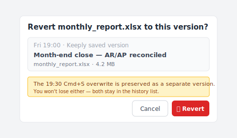

# 【2026 File Management】The limit of overwritten file recovery: when AutoRecover isn't enough

> AutoRecover is built for crash rescue. What you need after an overwritten save is upstream prevention.

It's Friday night, 19:30. You're working on month-end accounting in Excel and accidentally save over the previous sheet.

Ctrl+Z is gone (you closed the file already). The AutoRecover file is gone too.

You have until Monday morning to restore it. But will you make it in time?

## TL;DR

Most people searching for "**recover overwritten files**" want post-event rescue. But Microsoft AutoRecover is for crash recovery, and data recovery software's success window is minutes after overwrite. None of these reach the "overwrote after a normal save" scenario. **Post-event rescue isn't the answer. Upstream prevention is.** With an always-on version history at the tool layer, an overwrite save stops being a destructive action.

## Contents

1. [What is AutoRecover actually for?](#what-is-autorecover-actually-for)
2. [AutoRecover / Previous Versions / recovery software: what each can save](#autorecover--previous-versions--recovery-software-what-each-can-save)
3. [Why "after the overwrite save" is too late](#why-after-the-overwrite-save-is-too-late)
4. [Beyond post-event rescue: the always-on version history option](#beyond-post-event-rescue-the-always-on-version-history-option)
5. [FAQ](#faq)

---

## What is AutoRecover actually for?

Microsoft Office has three "**version recovery**" mechanisms built in:

- **AutoRecover**: rescues unsaved content during a crash. Default 10-minute auto-save interval. **Cleared once the file closes normally.**
- **Previous Versions** (Windows): rolls back to past snapshots via shadow copies. Requires prior setup.
- **OneDrive version history**: snapshots of every save. The [Microsoft documentation](https://learn.microsoft.com/en-us/sharepoint/document-library-version-history-limits) notes a default of 500 major versions retained (personal Microsoft accounts: 25).

The design intent is clear: these three are for "**crash rescue**" or "**recent save mishaps**". Not for the "**realized I overwrote it after closing the file**" scenario.

## AutoRecover / Previous Versions / recovery software: what each can save

To see where each mechanism's boundary lies, compare them side by side:

| Mechanism | Saves you in… | Doesn't save you in… | Notes |
| --- | --- | --- | --- |
| AutoRecover | Crash mid-document | Overwrite after normal close | Cleared on file close |
| OneDrive [version history](https://learn.microsoft.com/en-us/sharepoint/document-library-version-history-limits) | Within ~500 prior versions (25 on personal accounts) | Beyond 500, local-only files | Cloud save required |
| Windows Previous Versions | If shadow copy exists | No setup, SSD environments | Setup needed |
| Data recovery software | Right after overwrite, sectors untouched | Hours later, after SSD TRIM | Success rate environment-dependent |
| Mac [Time Machine](https://support.apple.com/en-us/HT201250) | Recent snapshot | Within snapshot interval | Separate setup |

That's exactly the bind. None of these mechanisms structurally reaches the typical "overwrote after a normal save" scenario.

What Keeply users most often report is almost always this exact scenario.

## Why "after the overwrite save" is too late

Here's a distinction nobody names plainly: **save layer** vs **tool layer**.

These mechanisms live at the **save layer**. The design goal is "if the most recent write fails, roll back". So retention runs short. The "500 versions" or "30 days" reference points are based on "how often the average user looks back within a month." Three months past that window isn't in scope; pruning is intentional.

Sam is an accountant. Friday night at 19:30, he saves over the month-end report in Excel by mistake. He goes looking for the AutoRecover file but can't find it. He tries data recovery software; it returns "the sector has already been overwritten." Sixty hours until Monday morning.

Here's the real problem. Sam realizes only afterward. If he had overwritten it earlier in the day, the AutoRecover 30-minute interval might have caught it. **But by the time he noticed, it was already too late. Post-event rescue depends on noticing in time. Upstream prevention doesn't depend on noticing at all. Every save already preserves a version.**

## Beyond post-event rescue: the always-on version history option

Surpassing the limit of post-event rescue means **upstream prevention**. Placing an always-on version history at the tool layer.

Every save = one version preserved. No pruning. Independent of Word's or OneDrive's retention policy.

[Keeply](https://keeply.work) does this in the background on the working folder you point it at: every press of Save adds a timestamped version to the history — two clicks to open the one you want. An "overwrite save" stops being a **destructive action**; the previous version is always preserved.

Lisa has used Keeply for half a year. Monday morning, she notices the month-end report has been overwritten with the previous sheet. She opens Keeply. Friday's 19:00 sheet, 19:15 sheet, the 19:30 overwritten sheet, all retained as versions. She clicks "go to the 19:00 sheet" and the restore dialog looks like this:

Note the blue hint line — the 19:30 overwrite isn't discarded, it's kept as its own version in the history. Three seconds later Excel opens Friday's 19:00 sheet. No need to pull an all-nighter rebuilding the report before Monday morning.

That said, Keeply doesn't replace AutoRecover. Mid-document crash rescue is still AutoRecover's first line. Keeply also can't rewrite history retroactively: it has to be running at the time the overwrite happens. For overwrites before you installed Keeply, this article won't help. For every save from today onward, it can.

That's the part that should let you breathe.

## FAQ

**Q1: Is AutoRecover on by default?**

Yes. Path: "File → Options → Save → Save AutoRecover information every 10 minutes." But AutoRecover clears when the file closes normally. It isn't long-term retention.

**Q2: How effective is data recovery software?**

It can succeed in the minutes right after the overwrite, but on SSDs (most modern PCs), TRIM erases the overwritten sectors immediately, so success rates are lower than HDDs. Even on HDDs, success drops sharply after a few days.

**Q3: Do OneDrive Personal and Business retain the same number of versions?**

Not exactly. OneDrive Personal defaults to about 500 versions. OneDrive for Business (Microsoft 365) also defaults to 500, but admins can adjust the limit. Once the cap is hit, the oldest version is pruned.

**Q4: What about Time Machine?**

Mac's Time Machine is system-level backup. Overwrites that happen between snapshot intervals (default 1 hour) aren't caught. It also isn't per-file version management. Recovering a specific point in time of a single file is cumbersome.

**Q5: Is Keeply a replacement for AutoRecover?**

No. AutoRecover handles crash rescue; Keeply handles version retention after a normal save. The two are complementary. Keeply has to be running ahead of time (no retroactive recovery).

---

The "Oh no, I just overwrote it" moment at 19:30 will come again. You don't know when.

But here's what you should know: post-event rescue has limits. Upstream prevention doesn't depend on noticing in time.

For every save from today onward. Can you let the tool keep that version for you?

---

> About the author: Ting-Wei Tsao, founder of Keeply.
> [LinkedIn](https://www.linkedin.com/in/ting-wei-tsao-b57480152/)
