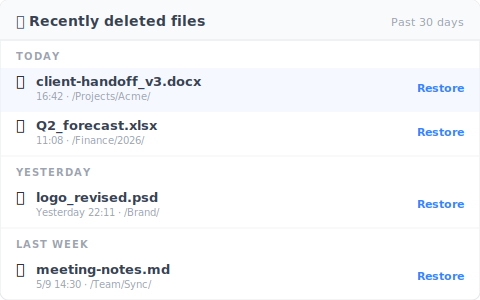

# 【2026 File Management】Recover deleted file from Windows 10: 4 cases recovery software fails

> Hit Delete and the Recycle Bin is empty? Break down SSD TRIM and the recovery-software dead zone, and see why prevention beats forensics every time.

## Table of contents

- [The killshot recovery software won't admit: SSD + TRIM](#trim)
- [4 cases the trash bin never had your file](#scenarios)
- [Real recovery lives at the file layer](#file-layer)
- [Honest limits: what Keeply doesn't do](#limits)

---

You hit Delete. You open the Recycle Bin. It's empty.

You Google "file recovery," and the first page tells you to download Recoverit or Disk Drill. Wait a second. Before I built Keeply I bought a copy of Recoverit too, trying to save family photos I'd nuked by accident. Skip ahead to the conclusion: in most situations, that $60 license isn't going to bring your files back.

Most of the time, the OS has no recovery trace to work with. And this isn't some rare mishap — in [Handy Recovery's 2024 survey, accidental deletion was the single most common cause of data loss, ahead of even hardware failure](https://www.handyrecovery.com/data-loss-statistics/).

---

## The killshot recovery software won't admit: SSD + TRIM {#trim}

What recovery software does is "sector scanning" — sweep the disk for uncovered bytes and try to reassemble files. That made sense ten years ago in the HDD era. On modern computers, the road is mostly closed.

Most modern computers run SSDs (solid-state drives) — [by 2024 the notebook SSD attach rate hit roughly 100%, meaning virtually every new laptop now ships with one (TrendForce)](https://www.trendforce.com/presscenter/news/20251107-12774.html) — and Windows 7+ has TRIM enabled by default. When you delete a file, the OS immediately sends a TRIM command telling the SSD to mark that block as free for reuse.

That means when the recovery software scans, it sees zeros. The data recovery firm Hetman put it bluntly: "If a recovery company claims they can pull deleted files off a TRIM-enabled SSD, they're either incompetent or lying to the customer." ([Hetman's own writeup](https://hetmanrecovery.com/recovery_news/data-recovery-is-impossible-ssd-cloud-and-online-services.htm)) I've since talked with several recovery engineers myself; they all said the same thing.

Layer on Windows Update, cloud sync, and browser cache writing to sectors every minute. Every hour you wait after deletion, the chance that your sectors got overwritten climbs. If your disk also has BitLocker encryption enabled, the recovery probability is essentially zero.

---

## 4 cases the trash bin never had your file {#scenarios}

Beyond the hardware limits, there are four everyday scenarios where your file bypasses the Recycle Bin entirely and just vanishes:

1. **The shared-drive trap**: You deleted the file on a NAS, SharePoint, or company network drive. The system wipes it directly — it never lands in your local Recycle Bin ([Microsoft docs](https://learn.microsoft.com/en-us/windows/win32/shell/recycle-bin)). The classic team disaster: "I thought I could recover it from the trash; IT told me it was just gone from the NAS."
2. **You slipped onto Shift+Del**: This is the OS's native design. Hit the shortcut and it's a hard delete with no trace.
3. **Cloud trash expired**: OneDrive 30 days by default, Google Drive 30 days, Dropbox Basic 30 days. Past the window, the cloud endpoint clears it too ([OneDrive docs](https://support.microsoft.com/en-us/office/restore-deleted-files-or-folders-in-onedrive-949ada80-0026-4db3-a953-c99083e6a84f)).
4. **You emptied the trash yesterday**: As far as the OS is concerned, the cleanup command finished and the file is no longer tracked.

Bottom line: recovery software works in the narrow window of "old HDD + just deleted + no new writes happened." That isn't what you actually face in the office.

---

## Real recovery lives at the file layer {#file-layer}

Stop chasing after-the-fact "disk forensics." The real answer is layering a quiet "version log" on top of the filesystem itself.

That's where Keeply sits. It doesn't rely on the cloud or external drives — every time you hit save, it quietly keeps a version in the background.

- **Survives shared drives**: Even when you're working on NAS or SharePoint, history sticks.
- **Offline-first**: No always-on sync required.
- **No 30-day cliff**: No harsh cloud retention ceiling; the version from three months ago is still on the timeline.

Beyond version history, Keeply also keeps a separate "recently deleted" panel — every file you've removed in the last 30 days, grouped by when you deleted it:

No need to first remember when you deleted something — open the panel, scan the names, hit "Restore" on the right and the file is back in its original spot. Compared to digging through the system trash, this path catches you before you panic-hit Cmd+S over something else.

For the deeper theory of version history design, see the [pillar: complete guide to file version management](/en/post/file-version-management-complete-guide/).

---

## Honest limits: what Keeply doesn't do {#limits}

Same as always, I have to be honest about Keeply's limits:

- **Doesn't recover SD cards or phone photos**: Different domain; find a specialized app.
- **Doesn't protect against whole-disk physical failure**: That's the job of backup tools — buy an external drive and follow the [3-2-1 backup rule](/en/post/3-2-1-backup-rule/).
- **Doesn't recover files deleted before install**: Keeply is a prevention tool, not forensics software. Anything deleted before you installed it is beyond reach.

Before the next Delete causes a disaster, [install Keeply today](/en/post/install-keeply-windows-mac/).

---

> About the author: Ting-Wei Tsao, founder of Keeply.
> [LinkedIn](https://www.linkedin.com/in/ting-wei-tsao-b57480152/)
