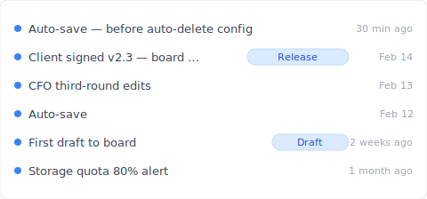
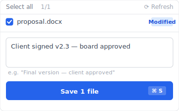
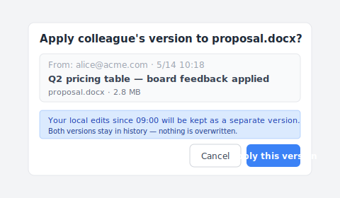

# 【2026 File Management】SharePoint version history: 500-version cap + auto-delete hidden cost

> Microsoft 2024 gave IT admins a storage-saving button. Know what you lose before you press it.

"You just set SharePoint auto-delete to 100 yesterday. Today the client asks for the version from three months ago. Open the history — only 100 versions left. The other 250 are gone. Microsoft already deleted them for you."

This isn't a bug. It's the mechanism [Microsoft Learn](https://learn.microsoft.com/en-us/sharepoint/document-library-version-history-limits) has stated clearly: 500-major-version cap + the auto-delete settings (500 / 100 / 50 / cutoff in 4 tiers) launched in late 2024. This article unpacks the 3 SharePoint version history mechanisms + **what you lose after enabling auto-delete**, then how [Keeply](https://keeply.work) catches the post-cap scenarios.

## Contents

1. [How Keeply keeps SharePoint history from getting eaten by auto-delete](#keeply-timeline)
2. [SharePoint version history 3 mechanisms: 500 major + 511 minor + auto-delete](#three-mechanisms)
3. [500-major cap: Microsoft's official number, easy-to-miss details](#500-cap)
4. [Auto-delete 4 tiers: 500 / 100 / 50 / cutoff real cost](#auto-delete)
5. [SharePoint storage quota: how much does 100 actually save?](#storage-quota)
6. [Keeply fills the gap: Release-freeze + per-file note across SP storage tiers](#keeply-fills)
7. [3 scenarios where you don't need Keeply with SharePoint](#when-not-needed)
8. [FAQ](#faq)

---

## How Keeply keeps SharePoint history from getting eaten by auto-delete {#keeply-timeline}

Here's what happens. James is the part-time IT admin at a small business. A 5-person team uses SharePoint Online to collaborate on `proposal.docx`. Over six months they've accumulated 200+ versions, SharePoint storage quota is at 80%, and he just set auto-delete to 100 in admin center — next month the quota will drop back to a safe range.

But today the client suddenly asks for the version "from Feb 14 — the one the board signed off on." James opens the SP version history. Only the last 100 versions are there. The Feb 14 version is already gone, auto-deleted.

With [Keeply](https://keeply.work) it wouldn't happen. Same `proposal.docx` looks like this in Keeply's timeline:

"Client signed v2.3 — board approved" gets its own row with a Release tag — that's James on Feb 14, after the board signed off, hitting "Save version" in Keeply's main window and writing a note:

Write "Client signed v2.3 — board approved," save the version. Six months later, scrolling Keeply's timeline, the tag is right there — **unaffected by SP auto-delete, never auto-deleted**.

Two actions, total:

1. **Save** — Ctrl+S in Word as usual. SharePoint syncs to the cloud (normal). Keeply polls in background within 30 min, sees the change, auto-saves a version to **its own timeline**.
2. **Mark milestone** — at significant moments (board signoff / client signoff / ship), hit "Save version" in Keeply's main window and write a note.

Below: unpack SharePoint's 3 mechanisms — why 250 versions vanish when you set auto-delete to 100.

## SharePoint version history 3 mechanisms {#three-mechanisms}

SharePoint says "version history" but it's actually three different things blended together:

| Mechanism | What it is | Limit | Trigger |
|---|---|---|---|
| **Major version** | Full version per save | **500** ([MS Learn](https://learn.microsoft.com/en-us/sharepoint/document-library-version-history-limits)) | Auto on every save (default) |
| **Minor version** | Draft state (requires major/minor versioning enabled) | 511 (additional pool) | Draft saves |
| **Auto-delete setting** | IT admin sets a stricter cap | 500 / 100 / 50 / time cutoff | Admin center setting |

Three different things — confused as one, you'll look in the wrong layer. "Can't find the version from 3 months ago" might be hitting the 500 cap, might be the auto-delete set to 100 / cutoff, might be the admin moved the file off-site entirely. **First check what auto-delete your site is set to — then you know which layer to debug.**

## 500-major cap: Microsoft's official number {#500-cap}

[Microsoft Learn](https://learn.microsoft.com/en-us/sharepoint/document-library-version-history-limits) states it clearly: SharePoint Online document libraries keep up to **500 major versions** per file. With major/minor versioning enabled, up to 511 minor versions on top.

**Easy-to-miss details**:

- **Not "500 of any kind"** — it's **500 major + 511 minor** (two independent pools)
- **Overage auto-deletes the oldest, no notification** — same mechanism as OneDrive (see [OneDrive version history breakdown](/en/post/onedrive-version-history/))
- **Per-file count** — not "site collection shares 500"
- **Pre-2024-Q4 every site was 500 by default**, after that IT admins can set lower in admin center

**Who hits the 500 cap**:

- 5-person team rotating edits on a proposal, 3 saves/day = ~66 versions/month → cap in **about 7-8 months**
- IT admin doing cleanup pressing the cap down to 100 = cap hit 5× faster

## Auto-delete 4 tiers: 500 / 100 / 50 / cutoff real cost {#auto-delete}

Microsoft launched the [version history auto-delete settings](https://learn.microsoft.com/en-us/sharepoint/document-library-version-history-limits) in late 2024. IT admins pick from:

| Tier | Versions kept | Best for | What you lose |
|---|---|---|---|
| **500 (default)** | Last 500 | Ample storage, full history | After 501st save, lose oldest 1 |
| **100** | Last 100 | Storage tight, low-edit team | After 101st save, oldest auto-deleted |
| **50** | Last 50 | Storage stressed, light version needs | Large history loss (brutal for high-frequency saves) |
| **Time cutoff (custom days)** | Anything past N days deleted | Compliance retention scenarios | Pre-cutoff versions unrecoverable (Recycle Bin can't help) |

**Real storage savings**: per [a Japanese IT case study](https://note.shiftinc.jp/n/n4eaa1ebddd34), after enabling auto-delete that tenant's storage quota usage dropped from 85% to 35%. The cost: pre-cutoff versions permanently deleted.

**The risk no one writes about**: auto-delete is a site-collection level setting. After IT admin sets it, end users don't see it and aren't notified. Three months later when they can't find a version, end users blame SP for being broken.

## SharePoint storage quota: how much does 100 actually save? {#storage-quota}

SharePoint storage quota is tenant level + site collection level combined:

- **Microsoft 365 Business Standard**: 1 TB / tenant + 10 GB / user
- **Microsoft 365 Business Premium**: same
- **Enterprise E3/E5**: 5 TB / tenant + extra per-user storage

`proposal.docx` averages 1.5 MB × 500 major versions = 750 MB per file. 500 active documents × 750 MB = 375 GB → hitting the 1 TB tenant cap.

**After auto-delete 100**: 1.5 MB × 100 = 150 MB/file → 500 files × 150 MB = 75 GB → 7.5% tenant utilization. Yes, 5× storage savings.

**But**: you've lost 80% of the history. The version the board signed off on three months ago might be in the 400-version range that just got deleted.

## Keeply fills the gap: Release-freeze across SP storage tiers {#keeply-fills}

James's situation: 5-person team + SP storage tight + wants cleanup but afraid of losing important versions.

[Keeply](https://keeply.work) gives him three things in one tool:

- **Release freeze**: on board-approval day, James hits Keeply "Save version" with tag "Client signed v2.3" — that version is frozen on **local + Keeply's own backup location**, unaffected by SP auto-delete, preserved permanently
- **Per-file notes**: each version carries a 1-2 line note. Three months later scrolling the timeline, "CFO third-round edits," "board signed," tags by date — no guessing which of 100 SP versions is which
- **Cross-tool portability**: Keeply doesn't depend on SP. Even if James switches to Dropbox / NAS, the timeline lives locally + in Keeply's backup location, not locked by any cloud vendor's cap

SP keeps doing team collaboration sync + storage compressed to 100, Keeply gives unlimited per-file version history + important version freeze. **Two parallel tools, each doing what it does best.**

Another move that comes up often in 5-person collaboration: a colleague has edited the same `proposal.docx` on SP, and you want to apply their version on top of your locally edited copy. Keeply's "apply colleague's version" dialog looks like this:

Note the blue hint line — your local edits after 09:00 aren't overwritten, they're saved as a separate version, both kept in the history. No more emailing "latest_version.docx" back and forth, no fear of clobbering your own edits with the wrong copy.

## 3 scenarios where you don't need Keeply with SharePoint {#when-not-needed}

Honest list:

**Enterprise compliance archive**. SOX, HIPAA, GDPR need audit chain + encryption + retention period management — use [Microsoft 365 Backup](https://www.microsoft.com/en-us/microsoft-365/business/microsoft-365-backup) / Veeam / Acronis. Keeply is for daily version management, not compliance.

**Under 500 versions + no auto-delete needed, small team**. If your storage quota isn't even at 50%, you don't need auto-delete — SP's default 500 is plenty, Keeply is overkill.

**100% mobile-only workflow**. Keeply is desktop-first, light on mobile. If your team is 90% Office mobile + SharePoint mobile editing, Keeply isn't in the main view, value isn't visible.

## FAQ {#faq}

**Q1: How many versions does SharePoint keep per file?**

500 major versions ([Microsoft Learn](https://learn.microsoft.com/en-us/sharepoint/document-library-version-history-limits)). With major/minor versioning, up to 511 minor on top. Oldest auto-deleted past that, no notification.

**Q2: What is SharePoint auto-delete?**

Late 2024 Microsoft feature — IT admin sets 500 / 100 / 50 / time cutoff in admin center. Storage cost vs history completeness trade-off.

**Q3: Same as OneDrive version history?**

Same underlying storage (SP document library) + same mechanism. Difference: use case (personal vs team) + admin setting controllability.

**Q4: What to do if a version from 6 months ago is gone after auto-delete?**

Pre-cutoff versions permanently deleted, even Recycle Bin can't recover. Avoid by using external tools to preserve key versions — e.g. [Keeply](https://keeply.work) Release-freeze.

**Q5: Storage quota tight, don't want auto-delete?**

3 options: (1) pay for more storage; (2) enable auto-delete and accept history loss; (3) external tools moving key versions outside SP.

**Q6: Does Keeply conflict with SharePoint?**

No, runs in parallel. SP for sync collaboration, Keeply for unlimited per-file version history + Release-freeze.

## See also

The pillar [file version management complete guide](/en/post/file-version-management-complete-guide/).

Side-by-side:
- [OneDrive version history: 500 cap + 30-day window](/en/post/onedrive-version-history/) — same MS family, personal cloud counterpart
- [Excel version history limits](/en/post/excel-version-history-limits/)
- [What Keeply saves vs backup and cloud tools](/en/post/what-keeply-saves-vs-backup-cloud/)

---

James set auto-delete 100 in SP admin center. Next month storage drops back to safe.

But today the client asks for the version the board signed off on — SP has deleted it for him.

Microsoft has the trade-off in the docs. You don't need SharePoint not to age — you need a tool that catches the history when SP starts compressing storage.

---

> About the author: Ting-Wei Tsao, founder of [Keeply](https://keeply.work).
> [LinkedIn](https://www.linkedin.com/in/ting-wei-tsao-b57480152/)
