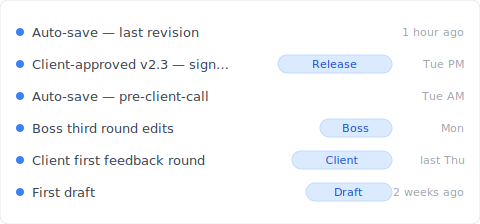
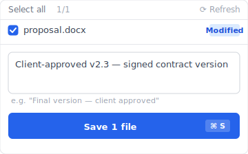
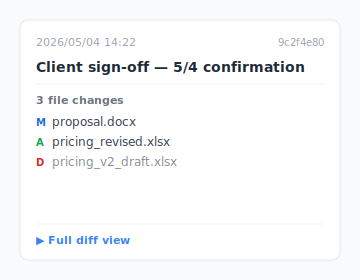

Thursday night, 11:47 PM. You're on your desktop looking for the version your client signed off on this afternoon. Eleven files named `Proposal_v*_FINAL.docx` sit there — which one is the signed copy, which one has your annotations, which one is the IM-revised draft. You're afraid to delete any. Keeping them all means you can't find the one you need.

This isn't a one-off. It happens to everyone working with Cmd+S (or Ctrl+S). Let's start by showing you what document version control looks like when the tool actually carries the naming weight — then unpack why you're not — then look at the 3 design patterns that solve it.

## Contents

1. [What document version control looks like with Keeply (no naming arms race)](#keeply-timeline)
2. [Why you end up naming files `_v3_FINAL`](#why-naming)
3. ["Too many versions" is actually 4 different pains](#four-types)
4. [You're doing the right thing — the tool just didn't pick up the baton](#tool-side)
5. [3 tool designs that solve this (Keeply does all 3)](#three-designs)
6. [3 scenarios where Keeply isn't the right tool](#boundaries)

---

## What document version control looks like with Keeply (no naming arms race) {#keeply-timeline}

Before we dissect the four-pain knot, let me show you what the same `proposal.docx` looks like inside a document version control system that does the bookkeeping for you. Same draft-to-client-signoff arc, same Cmd+S habit — in [Keeply](https://keeply.work), this project's timeline looks like this:

"Client-approved v2.3 — signed contract version" gets its own row with a "Release" tag. That's me Tuesday afternoon, after the client signed off, hitting "Save version" in Keeply's main window and writing a one-line note. No `_v3_FINAL.docx` renaming, no folder-cleanup ritual at midnight.

Two actions, total:

1. **Save**—Ctrl+S in Word as usual. Keeply polls in background within 30 min, sees the change, auto-saves a version to the timeline. You don't rename anything.
2. **Mark milestone**—at significant moments (client signoff / ship / release), hit "Save version" in Keeply's main window. Dialog pops up, you write a one-line note:

Write "Client-approved v2.3 — signed contract version," save. Three months later when the client calls, the tag in the timeline gets you there in 3 seconds.

No `_FINAL`, no `_FINAL_v2`, no `_REAL_FINAL`. The filename stays `proposal.docx`. The history is on Keeply's side, indexed and searchable.

Below: why you've been doing the naming arms race in the first place, and which of the 4 pains you're actually solving (without realizing it).

---

## Why you end up naming files `_v3_FINAL` {#why-naming}

Cmd+S is a permanent action. The moment you press it, the previous version is overwritten. There's no "the version from thirty minutes ago" button waiting for you. PSDs for designers, contract `.docx` files for lawyers, [dissertations for grad students](/en/post/thesis-single-point-of-failure/), same story everywhere. **If you don't name it, you lose it.** So you append `_v3`, `_FINAL`, `_REAL_FINAL` to the filename.

Yeah, that's the frustrating part. What you're doing isn't compulsive. It's a survival reflex against an OS that never gave you an undo button.

## "Too many versions" is actually 4 different pains {#four-types}

Pull "too many versions" apart and you find four completely different problems. Each one needs a different solution.

| # | Pain type | Typical scene |
|---|---|---|
| 1 | **User overwrite** | Press Cmd+S, then realize "wait, the version from thirty minutes ago was the right one" |
| 2 | **Client feedback loop** | `Contract_v3_client_notes.docx` / `Proposal_v5_boss_wants_changes.docx` ping-ponging back and forth |
| 3 | **Cloud sync conflict** | Dropbox / OneDrive: both ends edit, you get `Proposal (Bill's conflicted copy).docx` |
| 4 | **Software auto-save residue** | Word `.asd` / Premiere `.bak` / PSD `.psb` autosave files scattered everywhere |

You think you're solving one thing, but it's actually four. Type 1 needs automatic version preservation. Type 2 needs milestone freezing. Type 3 needs sync conflict resolution. Type 4 needs tool training. **Diagnose which one you have before chasing a fix.**

## You're doing the right thing — the tool just didn't pick up the baton {#tool-side}

Appending `_v3_FINAL` to a filename is logically correct — you need to mark the meaning of each version. The mistake isn't yours; it's that the tool layer never provided "automatic checkpoints" or "automatic milestones," so it dumps the responsibility back onto the filename. You use the only tool you have — the filename — because that's all that's available.

Productivity blogs will tell you to "have a naming convention," circulate a 14-page naming standards PDF, get the team to memorize prefix orders. It sounds reasonable. In practice, it lasts three days.

The problem: **rules push version-management responsibility onto human discipline.** And discipline never wins against automation. Today you remember `2026-05-04_Proposal_v3_signed.docx`. Tomorrow you're rushed and it becomes `Proposal_v3_FINAL.docx`. The day after, the client sends another round and it's `Proposal_v3_FINAL_v2.docx`.

You're doing the right thing. Naming `_v3_FINAL` is a reasonable survival reflex. It's just that this survival reflex shouldn't have been necessary.

## 3 tool designs that solve this (Keeply does all 3) {#three-designs}

Three design patterns the tool can use. Each one solves one of the four pain types above.

### Design A: Automatic checkpoints (the versions you save are kept)

You press Cmd+S, the tool quietly preserves the previous version. You don't have to name anything. **Examples**: macOS Time Machine ([Apple's built-in tool that snapshots every hour](https://support.apple.com/en-us/104984)), Word AutoSave ([only goes back 1-2 versions](/en/post/excel-version-history-limits/)), [Dropbox 30-day version history](https://help.dropbox.com/delete-restore/version-history-overview). **Keeply** runs this in the background on your working folder: text files only store what changed, design and image files each keep a full snapshot — so large files don't blow out your disk. **Solves Type 1.**

How do you find one of those quiet checkpoints later? Hover over any row in the timeline and Keeply pops up a card showing exactly which files changed in that save — no need to open anything to compare:

Click in for the full diff, or right-click to restore. No more naming files `_v3_FINAL_v2_final.docx` to mark which version was which.

### Design B: Named milestones (you mark "client signed" or "shipped")

You actively flag "this version got signed" or "this version went live" — from then on, no matter how the file changes, the milestone stays put. **Example**: GitHub Releases (a feature engineers use to freeze a code snapshot as a named milestone — developer-only territory). **Keeply** has a "Release" feature that does the same job without you having to learn any developer terminology: pick a version from history, click "Save version" with a note like "Client-approved v2.3," and that version stays recoverable forever (this is the dialog you saw above). **Solves Type 2.**

### Design C: Single-file restore (pull one file out of history)

Restore a **single file** from any historical version, without rolling back the whole folder. **Examples**: Dropbox single-file restore, Time Machine single-file restore. **Keeply** adds version-content search — if you remember "I changed something last week," you can search inside past changes, locate the version, and pull just that one file back. **Solves Type 1+2 combined scenarios.**

Of the four pain types, only Type 4 (software auto-save residue) takes a different path: it's a tool-training problem (learn to clear caches), not a version-management one. Type 3 (cloud sync conflict) is its own animal — see [Dropbox conflicted copy](/en/post/dropbox-conflicted-copy/) for the conflict-resolution piece.

## 3 scenarios where Keeply isn't the right tool {#boundaries}

Keeply doesn't solve every scenario:

- **Raw video footage**: Tens of GB of Premiere footage piling up daily. Disk simply isn't enough. Keeply isn't a cold-storage solution — use LTO tape or Backblaze B2 archive.
- **Folders with 1M+ files**: Keeply onboarding is designed for hundreds to thousands of files. Engineering source-control repos with millions of objects belong on git / Perforce.
- **Pure legal signing workflows**: For signature collection + audit chain + compliance retention, use DocuSign / Adobe Sign / industry-specific archive software. Keeply tracks version history, it doesn't certify signatures.

## Before you press Cmd+S next time

Next time you press Cmd+S, you won't worry "what if this is the wrong version" — because the "what if" doesn't exist anymore. Every version is still there. The filename stays clean. The history is on Keeply's side.

Want the bigger picture? [The complete guide to file version management](/en/post/file-version-management-complete-guide/) unpacks why your existing tools were never designed for keeping file history.

---

> About the author: Ting-Wei Tsao, founder of [Keeply](https://keeply.work).
> [LinkedIn](https://www.linkedin.com/in/ting-wei-tsao-b57480152/)
