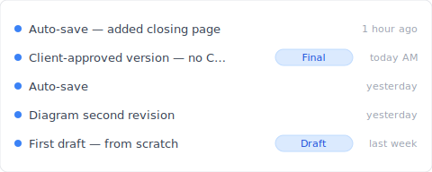
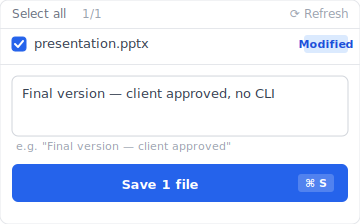
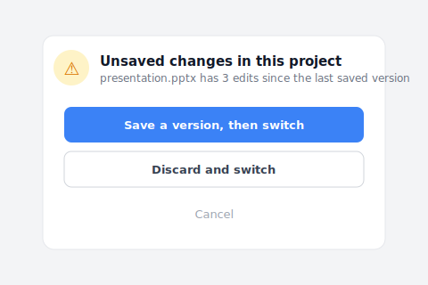

You searched "document version control." What came back: git, svn, Mercurial tutorials. CLI commands, terminal screens, commit/push/merge. Five minutes of reading, then you give up. You're not a dev, you're a designer, an admin, a freelancer. All you wanted was a document version control tool with a UI where you can see the file.

This isn't a one-off. It's the result of Google treating "version control" as a 100% dev query, even when you put "document" in front. Let's look at why, then three non-developer alternatives.

## Contents

- [What document version control looks like with Keeply (no CLI)](#keeply-timeline)
- [Why document version control searches return only git](#why-only-git)
- [Four design requirements non-developers actually need](#four-requirements)
- [The key: hide git mechanism behind the UI](#hide-git-key)
- [Three non-developer alternatives](#three-options)
- [When this isn't the right tool](#boundaries)

---

## What document version control looks like with Keeply (no CLI) {#keeply-timeline}

Let me show you the now. Same `presentation.pptx`, draft to client signoff — here's what this presentation project's timeline looks like in [Keeply](https://keeply.work):

"Final version — client approved, no CLI" gets its own row with a "Final" tag — that's me this morning, after the client signed off, hitting "Save version" in Keeply's main window and writing a note. No `git commit -m "client approved"`, no `HEAD~3` to understand.

Two actions, total:

1. **Save**—Ctrl+S in PowerPoint. Keeply polls in background within 30 min, sees the change, auto-saves a version to the timeline.
2. **Tag a milestone**—at significant moments (client signoff / release version), hit "Save version" in Keeply's main window, write a one-line note in the dialog:

Write "Final version — client approved, no CLI", save the version. Three months later, scrolling the timeline and spotting the tag gets you there.

No `git commit`, no `branch / merge / checkout`, no black-and-white terminal. Keeply uses a git engine underneath (the technology is fine), but the UI has zero engineer terminology — the interface uses everyday words like "Save version / History / Restore".

Even the one layer that engineer tools force you to learn — `git stash` — gets skipped here. When you've been editing this project without saving a version and you try to jump to another client's folder, Keeply stops you with a plain-language question:

"Save a version, then switch" is exactly the `git stash` + `git checkout` you'd type in the engineer world — collapsed into two everyday buttons.

Now let's unpack why Google doesn't surface this layer for you, and why traditional tools don't meet non-developer needs.

---

## Why document version control searches return only git {#why-only-git}

The "version control" search intent is actually **mixed**: half is dev (wants to compare git/svn/Mercurial), half is non-developer looking for document version control (wants a UI where files are visible).

But Google's SERP **shows 100% of the dev half**: Atlassian, GitHub, Stack Overflow occupy the top. Non-developer demand is invisible.

It's not obvious until you've hit it: you're not finding anything because the tools you need are pushed into the SERP corner, not because you're searching wrong.

## Four design requirements non-developers need from document version control {#four-requirements}

Pull "what should document version control do" apart and you find four requirements git/svn doesn't meet:

| # | Requirement | Why git/svn doesn't meet it |
|---|---|---|
| 1 | **File-level UI** | git is commit/blob unit, doesn't map directly to files |
| 2 | **No CLI required** | git is CLI-first (GUI wrappers exist but the learning curve is steep) |
| 3 | **Binary file support** | git is text-optimized, struggles with PSD/DWG/MP4 (LFS requires separate setup) |
| 4 | **Intuitive restore UI** | git's checkout/reset/revert concepts are confusing |

git was **designed for text code**. Designer / admin file-management use cases mismatch it from the start.

## The software industry solved version control 20 years ago — why didn't it cross over? {#hide-git-key}

The software industry solved version control 20 years ago: an engineer presses save, the whole project's history is preserved cleanly. The problem is that layer of tooling never crossed over to non-developers.

It's not that the technology can't be applied. It's that the design assumptions never made it across. The vocabulary (branch, merge, HEAD), the default workflow (commit before switching), the UI (black terminal screen) — all assume the user is already an engineer. If you're not, the toolset has nothing to say to you.

What non-developers actually need is **version control designed for them from day one**, not engineer tools with a different color palette. Keeply takes this route: doesn't assume you know git, doesn't teach you git, designs version history from the file-level perspective from scratch.

That's the frustrating part. Atlassian, GitHub, Stack Overflow all talk to devs. Nobody answered the obvious question — what would version control look like if it had been built for non-developers in the first place?

## Three document version control picks for non-developers {#three-options}

Three non-developer options, each with trade-offs:

### Option A: macOS Time Machine (built into Mac)

Apple's built-in tool since 2007: plug in an external drive, it [automatically snapshots your whole disk every hour](https://support.apple.com/en-us/104984), opening a 3-month-old file takes two clicks. **Pros**: free, file-level UI, no CLI, works with anything. **Cons**: Mac only, restore timeline animation is slightly clunky, no "freeze as milestone" feature. **Fit for**: Mac individuals, occasional recovery.

### Option B: Dropbox version history (30-day limited)

[Versions auto-preserved up to 30 days](https://help.dropbox.com/delete-restore/version-history-overview), restore via right-click "Previous versions" on the file. **Pros**: cross-platform, easy sharing. **Cons**: gone after 30 days, no cell-level diff, conflicted copy problem ([see other article](/en/post/dropbox-conflicted-copy/)). **Fit for**: collaborative editing within 30 days.

### Option C: Keeply

Built for non-developers from day one: every save automatically kept as a version, version history shown as "date + what changed," zero engineering terminology in the UI. **Pros**: file-level UI, no CLI, large files handled, no time limit, you can freeze a version as a "Release" so later saves can't overwrite it. **Cons**: desktop-first (weaker on mobile), instant sync isn't its strength, not for real-time multi-person editing. **Fit for**: designers, grad students, freelancers, small teams, long-term version needs, design-file-heavy work.

Pick by use case: (1) just ad-hoc restore → Time Machine, (2) team collab within 30 days → Dropbox, (3) long-term + individual + design files → Keeply.

## When this isn't the right tool {#boundaries}

Honestly, Keeply isn't for everyone:

- **Real developers**: want CLI access, want to see git history graph, Keeply hides too much
- **Enterprise**: no SSO / Active Directory integration
- **Mobile-first**: Keeply is desktop-first
- **Real-time collaboration**: Microsoft 365 co-editing / Google Docs is stronger

## Before you search "document version control" next time

You won't get burned by git tutorials. You're not a dev, and that's fine — document version control tools for non-developers exist, Google just doesn't surface them for you.

Want the full map? [Read the complete guide to file version management](/en/post/file-version-management-complete-guide/).

---

> About the author: Ting-Wei Tsao, founder of Keeply.
> [LinkedIn](https://www.linkedin.com/in/ting-wei-tsao-b57480152/)
