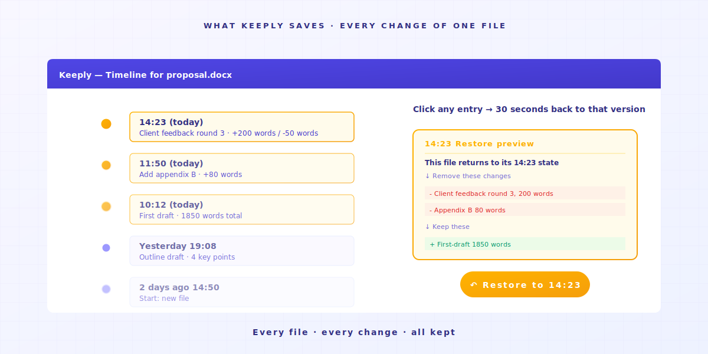
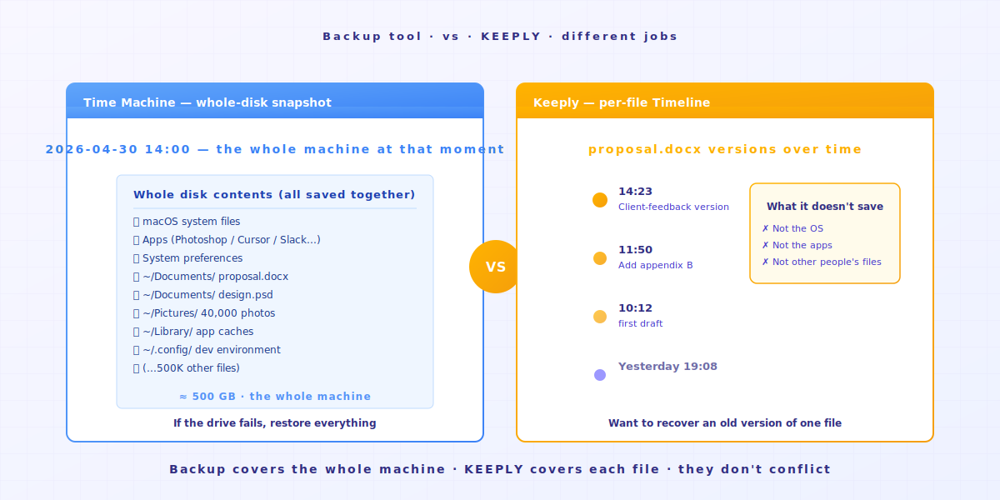
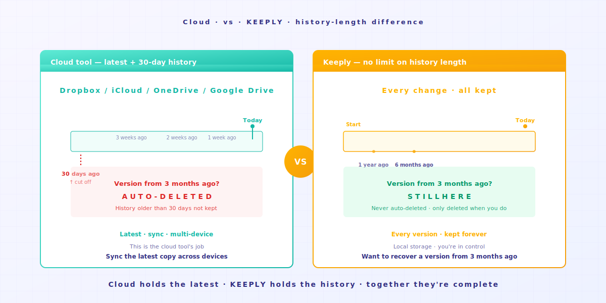
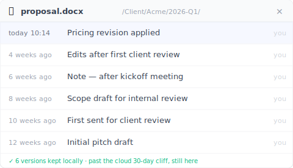

# 【2026 File Management】What Does Keeply Actually Save? How It's Different from Backup and Cloud Tools

> Backup tools cover the whole disk. Cloud tools cover the latest copy. Keeply covers the history of every change. Three different jobs.

## Contents

1. [What does Keeply save?](#what-keeply-saves)
2. [What do backup tools save?](#what-backup-saves)
3. [What do cloud tools save?](#what-cloud-saves)
4. [How many do you need?](#how-many-do-you-need)

---

Engineer A just finished installing Keeply. His coworker B walks over and asks: "How is this different from the Time Machine that comes with my Mac?"

Engineer A freezes. He knows it's different, but he can't put his finger on where.

Here's the difference: **backup, cloud, and Keeply are three different jobs**. Their work doesn't overlap, which is why they have three different names.

---

## What does Keeply save? {#what-keeply-saves}

Keeply saves **every change to every file**.

You edit `proposal.docx` twice today, you save it twice. The Timeline shows two file notes. You want to go back to the version from your first save? Click that entry. 30 seconds and you're there.

When you hit "Save version" manually, a dialog pops up so you can attach a note — "after the meeting," "client-approved draft," whatever you want to remember six months from now:

It doesn't save someone else's Google Doc. It doesn't save your computer's app settings. It only saves **how every file on your computer changes over time**.

If your need is "I want to go back to the version before Thursday's edits," this is its job.

---

## What do backup tools save? {#what-backup-saves}

Tools like Time Machine, Acronis True Image, and Backblaze save **a snapshot of the whole disk at a point in time**.

Their job isn't to rescue a single file. They save **what your entire computer looked like that day**. OS, apps, settings, every folder, all together.

If your hard drive dies or your whole computer goes missing, a backup can restore everything. **That's the real reason they exist**.

But if you just want to find the version of `proposal.docx` from before the 10:23 Thursday edit, a backup can do it, but you have to restore the whole snapshot first to pull that one file out. **That's not the problem it was designed to solve**.

---

## What do cloud tools save? {#what-cloud-saves}

Tools like Dropbox, iCloud, OneDrive, and Google Drive save **the latest version of a file, plus cross-device sync**.

You edit a file on Computer A, Computer B automatically pulls the latest copy. **Their job is to sync "the latest copy" to all your devices**.

They do have version history. But they typically **only keep 30 days**, Dropbox's standard plan, Google Drive, and OneDrive all follow this rule. Past that, it's gone.

If your need is "I want the latest copy on every computer I use," that's their job. But for the version from 3 months ago, the cloud usually no longer has it.

Keeply does — that 3-month-old draft is still sitting in the file history panel, with the note you wrote when you saved it:

---

## How many do you need? {#how-many-do-you-need}

| Your scenario | Main tool |
|---|---|
| Want to recover an old version of a file | **Keeply** (Timeline, click and restore) |
| Whole computer broke, need to recover data | **Backup tools** (Time Machine / Acronis / Backblaze) |
| Sync the latest version across multiple devices | **Cloud** (Dropbox / iCloud / OneDrive) |

In practice, **using all three is the most complete setup**.

Keeply covers the history timeline of every file. Backup covers the snapshot of the whole computer. Cloud covers cross-device sync. Three jobs that complement each other, not compete.

This is what the Timeline looks like for one file across a few months — manual saves with notes sit alongside the automatic background versions:

If you can only pick one, **look at which scenario you hit most often**: you often want to find old versions? Keeply. You're worried about a dead drive? Backup. You work across multiple computers? Cloud.

---

## Closing

Back to what Engineer A says to coworker B:

"It's different from Time Machine. Time Machine covers the snapshot of the whole computer. Keeply covers the history timeline of every file. **I use both**."

If you also want to try Keeply for that history timeline, drag a folder into [Keeply](https://keeply.work/). It remembers the rest on its own.

---

## Further reading

- [How to Use Keeply, the File-Note App: 2 Actions, No 30-Feature Curriculum](/en/post/keeply-getting-started-from-zero/) (PILLAR 3, complete Keeply onboarding guide)
- [The Complete Guide to File Version Management](/en/post/file-version-management-complete-guide/) (PILLAR 1, why version management matters)

---

> About the author: Ting-Wei Tsao, founder of Keeply.
> [LinkedIn](https://www.linkedin.com/in/ting-wei-tsao-b57480152/)
