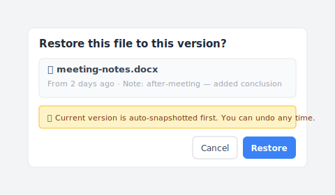

# 【2026 File Management】Windows file history vs backup: 3 different things

> Three Windows features answer to "backup." They aren't interchangeable. You probably have one of them.

You set up File History when you got the laptop. You feel covered. Three months later, you overwrite a document with the wrong edit and look for yesterday's version.

The dialog opens. It offers you a copy from last Tuesday. That's not what you wanted.

You assumed "backup" was one thing. It was three things, and you had the wrong one running for this particular need.

## What Windows means when it says "backup"

Three features Microsoft ships in Windows go by names that all sound like backup. They aren't.

| Feature | What it actually is | What it's for |
|---|---|---|
| **File History** | Scheduled snapshot of user folders to an external drive | Recovering an older copy of a document — at hourly granularity |
| **Windows Backup** (Backup and Restore) | Point-in-time system image | Restoring a whole machine after disk failure or system rot |
| **Version history** (via OneDrive / cloud sync) | Per-file save history in cloud | Walking back individual file changes within a retention window |

Three different shapes. Three different jobs. The thing they share is the word "backup," which is why people get one of them running and assume the others are covered too.

## The three different axes

It's easier to see when you map them as three axes of protection.

**Axis 1 — Disk/system level.** When your drive dies or Windows refuses to boot, you need a system image — the whole machine, restorable to a known good state. Windows Backup does this. File History does not. OneDrive does not.

**Axis 2 — Folder level over time.** When a folder exists and you want a copy of it from earlier this month, you need scheduled folder snapshots. File History does this. Windows Backup is too coarse (full image, not folder versions). OneDrive does it for files synced to OneDrive, capped by retention plan.

**Axis 3 — Per-file save events.** When you want the specific save you made yesterday at 2:47 PM — the one before you broke the formula — you need per-save versioning. None of File History, Windows Backup, or OneDrive cleanly does this. File History gives you the closest scheduled snapshot (which might be hours off, or days off, if the drive was disconnected). OneDrive version history can do it for cloud-synced files only and only within the retention window. There's no general per-save layer in Windows.

The pattern: each tool answers one axis well, struggles with the others, and the third axis is essentially unaddressed by anything Microsoft ships by default.

## What each one actually saves you from

Concrete scenarios, mapped to the three Windows features:

| Scenario | File History | Windows Backup | OneDrive version history |
|---|---|---|---|
| SSD physically fails | ❌ | ✅ | ✅ for synced files |
| Windows won't boot | ❌ | ✅ | ❌ (no system state) |
| Ransomware encrypts everything | ⚠️ if drive was offline | ✅ if image is offline | ⚠️ depends on sync timing |
| Overwrote a Word doc, want yesterday's version | ⚠️ closest hourly snapshot if drive connected | ❌ too coarse | ✅ if file is in OneDrive, within retention |
| Want the version from 3 months ago | ⚠️ only if File History was running and drive online that day | ❌ image is whole-system | ❌ usually past retention |
| Accidentally deleted file 2 weeks ago | ✅ if you remember it was in a watched folder | ✅ if image taken | ✅ Recycle Bin if within 30 days |

The takeaways you can't see if you only know one:

- A reader with **only File History**: covered for the "yesterday's draft" case (mostly), exposed when the drive dies or Windows breaks.
- A reader with **only Windows Backup**: covered for catastrophic failure, exposed for everyday overwrites and edits.
- A reader with **only OneDrive**: covered for cloud-synced files in retention, exposed when files are local-only, when retention has passed, and for system-state restore.

The article on [iCloud vs Dropbox version history](/en/post/cloud-version-history-cliff/) walks the cloud retention side in depth; this piece is the Windows-native side.

## The fourth axis nobody ships by default

Look at the table again. The bottom-right corner — "the specific version I deliberately saved" — has no clean tick mark.

File History gives you a scheduled snapshot, not your save. Windows Backup gives you the disk, not a file. OneDrive gives you cloud history, but only for cloud-synced files and only within the retention window.

An intent-driven version history layer — every version you save becomes a recoverable point, locally, no time cap — is the missing axis.

[Keeply](https://keeply.work) is one implementation. It watches the folders you point it at and keeps the versions you save as their own versions (plus an optional timer), without an external-drive schedule and without a retention cap. Pull yesterday's draft at 2:47 PM, not the closest scheduled snapshot.

After a meeting, you hit "Save version" and the dialog opens — you attach a note like "post-meeting conclusions added" and save:

Six months later, the Timeline shows each save as its own line — automatic background saves plus the manual ones with the note you wrote at the time:

When you do need to restore a specific version, the dialog is more direct than the Windows File Explorer "Previous Versions" tab — note preview, source timestamp, and an auto-snapshot safety net before the swap:

This isn't a replacement for File History or Windows Backup — those still cover their axes. Keeply adds the axis Windows doesn't ship.

Cluster sibling: [I asked Windows File History for yesterday's draft. It gave me a file from 2019.](/en/post/windows-file-history-wrong-version/) — the narrative version of why the third axis matters.

## When this article isn't your fix

A few situations where the three-axis frame doesn't help:

**You're in a managed enterprise environment.** IT is running SCCM, Veeam, or another centralized backup. Your three axes are decided by policy. Talk to IT before adding personal layers.

**You're on Windows Home with no external drive.** File History wants an external drive or network location. Without one, the only thing running is OneDrive (if signed in). Buy an external drive, or accept that you have one axis only.

**You need immutable archive for compliance.** Backups in this article aren't compliance archives. SOX / HIPAA / GDPR retention needs proper archive tooling (Veeam, Acronis, industry-specific). The three-axis frame is workflow protection, not regulatory.

## See also

The pillar [file version management complete guide](/en/post/file-version-management-complete-guide/) covers the four structural reasons your tool wasn't designed for keeping file history — useful background to why these three Windows features split the way they do.

Sibling article: [I asked Windows File History for yesterday's draft. It gave me a file from 2019.](/en/post/windows-file-history-wrong-version/) walks one specific failure mode in detail.

Mac parallel: [Time Machine vs Dropbox: backup, sync, and the third axis neither of them is](/en/post/time-machine-vs-dropbox/) — same three-axis frame, different OS.

---

The word "backup" pulls three things into one bucket. You set up one, you feel covered, and the other two are quietly missing. Three months later something fails on an axis you weren't watching.

Pick what to run on each axis. Then know which one you don't have.

---

> About the author: Ting-Wei Tsao, founder of Keeply.
> [LinkedIn](https://www.linkedin.com/in/ting-wei-tsao-b57480152/)
