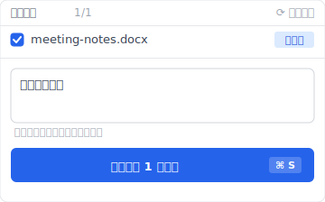
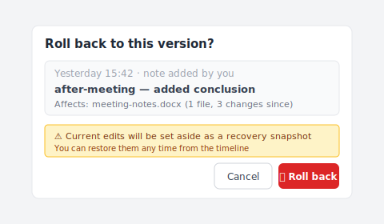

# 【2026 File Management】Windows File History wrong version: yesterday's draft missing

> File History didn't break. It returned what it had. The question was the wrong shape for the tool.

Tuesday evening. I needed yesterday's draft of a Word document — the one with the conclusion I wrote during the meeting, before the revision tonight that I'm not sure I like.

Right-click → Restore previous versions. The dialog opens.

The most recent version available is from 2019.

There was a year-and-a-half gap I didn't notice. The external drive holding my File History snapshots had been disconnected since the laptop trip last summer. File History had nothing to give me from yesterday. It gave me what it had — the snapshot from when the drive was last plugged in. The drive was last plugged in just before I bought the new laptop.

It wasn't broken. I was asking it a question it wasn't built to answer.

## Why File History gave me 2019

File History takes snapshots on a schedule. Default: every hour. The snapshots only happen when the external drive (or network location) is reachable.

When the drive is unplugged — laptop traveling, drive borrowed by another machine, drive simply forgotten — no new snapshot gets written. File History keeps running internally, but with nothing to write to. The catalog of versions stops growing.

When the drive comes back, File History resumes from where it left off. A new snapshot replaces the running queue. But there's no backfill for the days the drive was missing.

So when I asked for "yesterday," File History walked back through its catalog and offered the most recent snapshot it had: the one before the drive went offline. Eighteen months earlier.

This isn't a bug. It's exactly what the mechanism is built to do. The bug was my assumption that "yesterday" was a question File History could answer.

## Schedule-driven vs intent-driven

The distinction nobody explained when I set File History up:

**Schedule-driven** — the system decides when to capture. File History is schedule-driven. Time Machine on Mac is schedule-driven. Cloud sync that runs every N minutes is schedule-driven. The system says "every hour" or "every 10 minutes" or "every change detected," but the unit is time or change-detection — not your intent.

**Intent-driven** — your decision marks the capture, not the clock. You explicitly hit "Save a version" with a note (or the tool catches your save shortly after via a short polling window), and that moment becomes a recoverable point with whatever context you wrote. Cloud-sync version history is sort of intent-driven (each save creates a version, capped by retention). Tools like Keeply are intent-driven by design — the tool gives you a "Save a version" button you press at meaningful moments, plus a 30-minute background polling that catches in-progress work; it doesn't fire on every Cmd+S.

The mismatch: when I think "yesterday's draft," I mean "the version I deliberately saved yesterday after I added the conclusion." That's an intent-driven question. File History is schedule-driven. The closest match it can give me is "the disk state at the next snapshot point," which may or may not include my deliberate save, depending on timing and drive availability.

File History will give you a near approximation of yesterday — if everything went right. When everything didn't go right (drive was offline), it falls back to the nearest snapshot it has, which can be arbitrarily old.

## What File History is built to do well

Worth being fair to File History — it has a real job, and does it.

It's continuous folder-level backup to an external drive. If your laptop's SSD dies, File History gives you back your Documents, Pictures, Desktop, and other watched folders, restored to the most recent snapshot. That's a complete and useful job.

It's good when:

- You want a recent (hours-old) copy of a file after the original gets corrupted or lost
- The watched folders cover what matters to you
- The external drive is reliably connected (desktop machine, always-on dock, NAS share)
- You don't need precise per-save versions, just "the most recent good copy"

It struggles when:

- You travel with a laptop and the drive doesn't follow
- You need a specific version you saved at a specific time
- You expect "every save" to be captured (it's not — it's every snapshot)
- You're hoping for years-deep retention with precision

The article isn't a complaint about File History. It's a clarification of what shape of question it actually answers.

## Adding an intent-driven layer

If your common loss scenario is "I made a save at 2:47 PM yesterday and want exactly that version," File History won't reliably give it to you. You need a different layer.

[Keeply](https://keeply.work) runs locally and captures every Cmd+S as its own version, regardless of schedule or drive connection. The captures live with the project, not on a separate external drive that might be offline. When you ask for "yesterday's draft," Keeply walks back through saves, not through scheduled snapshots, and returns the one you actually made.

When you hit "Save version" manually, a dialog opens so you can attach a one-line note — "after meeting" or "client-approved" — that you'll actually recognize months later:



The Timeline then looks like this — the manual save with the note sits on its own row, alongside the automatic background versions, across two days:


```
Keeply timeline — meeting-notes.docx

May 13 — Tuesday
─────────────────────────────────
● 19:42   meeting-notes.docx   (tonight's revision)
● 14:47   meeting-notes.docx   ★ "After meeting" — conclusion added
● 09:30   meeting-notes.docx   (morning draft)

May 12 — Monday
─────────────────────────────────
● 17:15   meeting-notes.docx
● 14:22   meeting-notes.docx
```

Each save is its own line. "Yesterday's draft" maps to a specific line, not a calendar lookup against unreliable snapshots.

When you decide to roll back, you don't re-guess a timestamp — you click the row with the note you wrote and revert directly. Keeply takes an auto-snapshot of the current state first, so a misclick is still recoverable:



Keeply isn't a replacement for File History. Keep File History for what it does — continuous folder backup to external drive. Add Keeply for the save-level granularity. The two answer different question shapes.

The cluster sibling — [You think you're backed up. "Backup" means three different things in Windows.](/en/post/windows-file-history-vs-backup/) — walks the three-axis frame in full.

## When File History is enough

A few situations where adding a per-save layer is overkill:

**Your work is short-cycle.** If you don't need to recover saves from more than a few hours ago, File History's hourly cadence will catch most of what you need. No upgrade required.

**Your drive is reliably connected.** Always-on dock, NAS share, dedicated backup drive that never leaves the desk — File History rarely has gaps in this setup, and its scheduled snapshots will line up close enough to your saves.

**Cloud sync covers your important files.** If everything important lives in OneDrive / Dropbox / Google Drive and you're within their retention windows, you already have a sort of intent-driven layer in the cloud version history (though capped — see [the version history cliff](/en/post/cloud-version-history-cliff/)).

If none of those apply — laptop user, drive sometimes offline, work matters past 30 days — that's when adding an intent-driven layer pays off.

## See also

The pillar [file version management complete guide](/en/post/file-version-management-complete-guide/) breaks down 4 structural reasons your tool wasn't designed for keeping file history.

Sibling article: [You think you're backed up. "Backup" means three different things in Windows.](/en/post/windows-file-history-vs-backup/) — the three-axis comparison frame.

Mac parallel: [Time Machine vs Dropbox: backup, sync, and the third axis neither of them is](/en/post/time-machine-vs-dropbox/) — same schedule-vs-intent distinction on Mac.

---

File History didn't fail me. It returned what it had. The 2019 file was a fact about my drive's connection history, not a defect.

The lesson is to know what shape of question each tool answers. Hourly snapshot to external drive, when present, is one shape. The save you made at 2:47 PM yesterday is a different shape. The tool that answers the second one isn't shipped in Windows by default.

You can keep using File History. Just don't ask it questions it can't see.

---

> About the author: Ting-Wei Tsao, founder of Keeply.
> [LinkedIn](https://www.linkedin.com/in/ting-wei-tsao-b57480152/)
