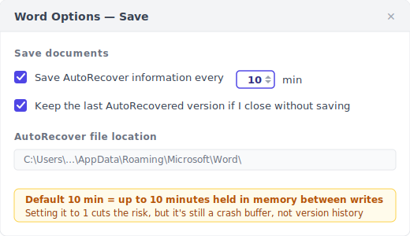
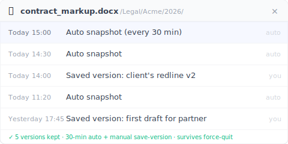

AutoRecover is a crash buffer, not version history. Word ships only the buffer.

> 3 p.m. Friday. You wrote ninety minutes of contract markup for a 5 o'clock meeting. Word froze. You waited three minutes and force-quit.
>
> You reopen Word. The Document Recovery pane appears. You click it, hopeful ,  **and it's blank**.
>
> Ninety minutes, gone. The client is reading it at 5.

That's not bad luck. AutoRecover was never designed to save that file.

The five cases below are reverse-engineered from Microsoft's own docs, from the rescue threads people post when AutoRecover lets them down, and from how the mechanism actually works. Each one breaks a different assumption you didn't know you were making.

---

## Case 1: You Never Pressed Ctrl+S {#case-1-never-saved}

You open a fresh Word document, click "Blank document," type for thirty minutes, and the machine crashes. You reopen Word. The Document Recovery pane is empty.

This isn't a bug. **For AutoRecover to track a document, that document needs a file name and a path.** Never pressed Ctrl+S = no name = no path = AutoRecover has nowhere to write its temp file.

Microsoft's own [support article](https://support.microsoft.com/en-us/office/recover-your-office-files-dc01156a-be1c-43e6-b3f1-bd4a01a93cf9) says it plainly: AutoRecover needs the file to have been saved at least once before it starts keeping .asd snapshots.

New document → thirty minutes of typing → crash. In that sequence, AutoRecover was never invoked, not once.

> **Habit worth building:** the first thing you do with a new document is Ctrl+S → name it → *then* start writing. Thirty seconds buys you out of this whole category.

---

## Case 2: Word Froze and You Force-Quit {#case-2-force-quit}

This is the contract-markup scenario from the top. Word didn't actually crash and trigger a recovery dialog. It hung, unresponsive, and **you** chose to force-quit.

By default, AutoRecover writes an .asd snapshot **every 10 minutes**. In the gap between writes, everything you type lives in memory. Force-quit = memory contents never reached the .asd = the most you can recover is whatever was last written to disk.

That "last write" might be nine minutes old or one minute old, depending on where you happened to be in the 10-minute cycle. Worst case: you write a big paragraph at 9:59, Word hangs at 10:00, and that paragraph never made it into the .asd.

The 10-minute default is Microsoft's trade-off between disk-write overhead and data-loss risk. For you, that 10 minutes of latency means up to 10 minutes of work exposed at any moment.

You can shorten it: File → Options → Save → "Save AutoRecover information every X minutes," set it to 1. The cost is more disk activity; an older laptop may notice.

> AutoRecover doesn't save "the eight minutes you just typed." It saves "the version from eight minutes ago that already reached disk." Small difference. Decides who survives.

---

## Case 3: Document Recovery Opened. And It Was Blank {#case-3-blank-recovery}

This is the one that breaks people. Word genuinely shows the Document Recovery pane, you click it full of hope. And **the file is empty** or full of garbled characters.

Here's what happened underneath: AutoRecover packs the current state into an .asd file and writes it to disk, and that write takes time. If the power cuts mid-write, or the program dies partway through packing, you get a half-written .asd sitting on disk that can't be parsed. Word sees the .asd exists, so it offers the recovery pane. But parsing fails on open, so you get a blank or garbage.

Microsoft's own forum has a thread for exactly this: ["My recovered unsaved word document is entirely blank."](https://learn.microsoft.com/en-us/answers/questions/5285105/my-recovered-unsaved-word-document-is-entirely-bla) Their own support community is asking about it. This isn't an edge case. It's common.

> The recovery pane appearing doesn't mean recovery succeeded. AutoRecover promises an *attempt*, not a guarantee.

---

## Case 4: You Opened It on a Different Computer {#case-4-cross-machine}

You wrote a document on the office desktop yesterday. Today you open it on your laptop at home and find it's only at last Saturday's manually-saved version. **Yesterday's eight hours of edits are gone.**

AutoRecover's .asd files live on the local machine:

- **Windows:** `%LocalAppData%\Microsoft\Office\UnsavedFiles` and `%AppData%\Microsoft\Word`
- **macOS:** `~/Library/Containers/com.microsoft.Word/Data/Library/Preferences/AutoRecovery`

**These paths don't sync to OneDrive, Dropbox, or iCloud Drive.** They're a local cache by design.

You might ask, "isn't my Word tied to OneDrive?" It might be. But OneDrive syncs the *file itself*, not AutoRecover's .asd buffer. Even with AutoSave on (which needs a Microsoft 365 subscription and the file living in OneDrive), AutoSave pushes the file body to the cloud while AutoRecover writes a local .asd buffer. **Two systems, side by side, that don't talk to each other.**

Open the file on a new machine, and the new machine can't read the old machine's .asd.

> The .asd is AutoRecover's local cheat-sheet for that one machine. It doesn't travel.

---

## Case 5: You Clicked "Don't Save" {#case-5-dont-save}

Closing Word, you get the "Save changes?" dialog and click "Don't Save" without thinking. Because you assumed you'd already saved. Three seconds later you remember you changed an important paragraph and didn't save it.

Clicking "Don't Save" is a deliberate user action. Word reads it as "the user has explicitly chosen to discard this session's changes." **AutoRecover is designed to immediately clear that file's .asd buffer**. Because keeping it would override what you just asked for.

The English result ranked #8 for this is a small site, [integrisit.com/accidentally-clicked-dont-save](https://integrisit.com/accidentally-clicked-dont-save/) (domain authority just 41). Why does a site with that little authority crack the top ten? Because this case is one **Microsoft's own docs won't cover**. Admitting "you clicked Don't Save, so we wiped the buffer instantly" cuts against the product's own story.

> "Don't Save" isn't a typo. It's a "confirm discard + wipe buffer now" double instruction inside Word.

---

## The Other Layer: A Persistent Version History {#keeply-fills-gap}

Five cases in, you can see AutoRecover is a net of one specific design. It catches "you're typing, you're between writes, Word genuinely crashes," and misses the other five. The common thread: AutoRecover's buffer is **used and cleared**. Cleared on a clean close, cleared on Don't Save, possibly never finished writing on a force-quit.

What fills the gap is a layer that **doesn't get cleared**: a version history where every version is a complete saved file, kept permanently, untouched by force-quits and Don't Save. It comes from two sources ,  **a background snapshot every 30 minutes**, plus **a "Save version" button you click yourself, with a one-line note** to mark a milestone (like "this is the one the client signed off on").

Run the five cases against this layer:

| Case | AutoRecover | Persistent version history (30-min auto + manual save) |
|---|---|---|
| 1. Never saved | No baseline = no record | Also can't help. The file never reached disk, so this layer can't see it (see limits) |
| 2. Force-quit | Buffer may be blank or half-written | The latest auto-snapshot or manual save opens cleanly (you lose at most 30 min, but you get back a complete file, not a blank) |
| 3. Blank recovery pane | Buffer half-written, corrupt | Every version is a complete saved snapshot, not a half-buffer |
| 4. Different computer | Local .asd doesn't sync | Versions sync to the cloud, openable across machines |
| 5. Clicked Don't Save | Buffer wiped instantly | The last auto-snapshot/manual save is already written; Don't Save only drops the unsaved changes after it |

Keeply is one implementation of this layer. Once installed, it watches your Word folder and takes a background snapshot every 30 minutes; you can also hit "Save version" anytime to record one immediately with a note. The version sidebar shows each version's timestamp and restores any one of them in a click.

**The point isn't "more frequent"**. 30 minutes is actually coarser than AutoRecover's 10. The point is **permanent + opens cleanly + untouched by force-quit and Don't Save**. AutoRecover may still hold newer content for the narrow "typing, before the next write, sudden crash" window, so Keeply **doesn't replace** AutoRecover. It's the layer underneath it.

---

## Where Keeply Can't Save You Either {#limits}

To be clear about the edges:

**1. A file that never reached disk, Keeply can't save either.** Keeply watches a folder on disk. The file has to have been saved once, written into that folder, before Keeply can see it and start keeping versions. A brand-new document you never saved is as invisible to Keeply as it is to AutoRecover. So that habit from earlier. First action on a new document is save-and-name. Holds for both.

**2. A corrupt .docx only restores to the last healthy version.** If the file was already corrupt at the moment a snapshot or saved version recorded it (rare, but it happens), that's what Keeply kept. The history can't reach back to a healthy state on its own; you restore an earlier, intact version instead.

**3. An unsynced file on another machine stays on that machine.** Keeply writes versions to a local store, and cloud sync is a separate step. If you wrote for eight hours on a laptop with the network down and never synced, the desktop won't see those eight hours. That's not a Keeply failure, the sync chain just didn't finish.

These three are more honest than AutoRecover's five cases: you can check each one. Did I save it, is the file corrupt, was the network down. Without reverse-engineering a mechanism.

---

## When You Don't Need Keeply for Word {#when-not-needed}

Not everyone needs this layer.

**1. Short sessions (a reply or memo under 10 minutes).** AutoRecover's 10-minute interval hasn't even fired, and Keeply's next snapshot hasn't either. The built-ins are enough for lightweight work.

**2. You already save every five minutes and keep files in OneDrive.** OneDrive's 25 versions / 30-day retention plus your high-frequency saving already approximate a version-history layer. Keeply only adds value when you want to reach back past 30 days. Like a client asking three months later, "is that v2 still around?"

**3. Your company runs SharePoint with Version History.** SharePoint keeps versions longer, with admin control and an audit trail. A personal tool like Keeply supplements rather than replaces it. You stay on SharePoint.

Keeply is for the person who's been bitten by one of the five cases and doesn't want to be bitten again. If you haven't been bitten, or your company already has this covered, you're fine as you are.

---

## FAQ {#faq}

**Q1. If I install Keeply on my Word folder, will it fight with AutoRecover?**

No. They're two different layers. Keeply watches the .docx on disk (after you've saved it once into the folder it's watching) and takes a snapshot every 30 minutes; AutoRecover writes its own .asd into `%LocalAppData%`. Neither touches the other's storage.

**Q2. Can I set Word's AutoRecover interval to 1 minute?**

Yes. File → Options → Save → "Save AutoRecover information every X minutes," set it to 1. A shorter interval means fresher content recoverable after a crash, at the cost of more disk activity an older laptop may feel. But it's still a crash buffer. Cleared on a clean close or Don't Save. If you want a persistent version history that survives crashes and Don't Save, that's a different path: a tool like Keeply that snapshots every 30 minutes in the background plus a manual save-version button, independent of the AutoRecover interval.

**Q3. Why doesn't the Document Recovery pane appear when I close Word normally?**

Because a clean close = no crash = AutoRecover assumes "the user saved" = it wipes the .asd buffer. Next time you open Word, there's nothing left to recover. That's by design: AutoRecover only retains the .asd after an abnormal exit.

**Q4. Will OneDrive AutoSave replace AutoRecover?**

No. AutoSave syncs the file body to the cloud (you need a Microsoft 365 subscription and the file in a OneDrive path); AutoRecover writes a local .asd buffer. AutoSave solves "real-time sync across devices," AutoRecover solves "the last few minutes before a crash." They coexist without talking. Underneath both you can add a third layer: a persistent version history (like Keeply), 30-minute background snapshots plus manual saves, independent of cloud-sync state.

**Q5. Can Keeply recover a Word file I deleted that I'd never saved?**

No. Keeply's starting point is the file's first save to disk (you save and name it). Make it a habit: new document → save and name it first → then write. Once the file is in the folder Keeply watches, it snapshots every 30 minutes in the background, and you can hit "Save version" anytime.

---

## Related reading

- [Excel version history only goes back 1-2 versions. That's a Microsoft design, not a bug](/en/post/excel-version-history-limits/)
- [Saved over the old version of a Word/Excel/PPT file? The recovery mechanism gap](/en/post/recover-overwritten-file/)
- [Photoshop's autosave saves you from crashes, not from saving over the wrong version](/en/post/photoshop-autosave-not-version-history/)
- [The complete guide to file version management](/en/post/file-version-management-complete-guide/)

---

*By [Ting-Wei Tsao](https://www.linkedin.com/in/ting-wei-tsao-b57480152/). Founder of Keeply, building file version management for people who aren't engineers.*
