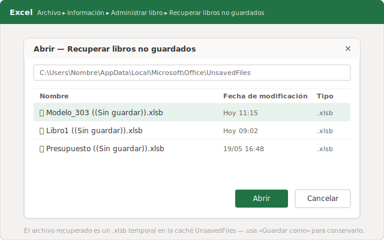
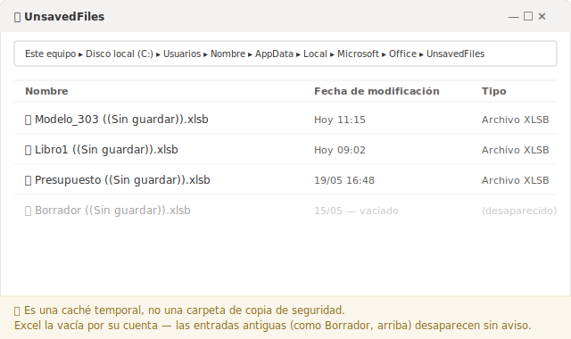
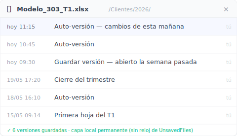

# Recuperar un archivo de Excel no guardado: la guía honesta (2026)

**Excel guarda lo que nunca llegaste a guardar en una carpeta oculta. El problema es que esa red de seguridad solo cubre la mitad de los sustos.**

Son las 11:15 de un martes. Llevas toda la mañana cuadrando el modelo 303 de un cliente en una asesoría pequeña, sin nadie de informática al otro lado del pasillo. El portátil se reinicia solo por una actualización que no pediste. Vuelves a Excel y el libro aparece tal cual lo abriste a las nueve: en blanco lo de hoy. Tres horas de conciliación de IVA, evaporadas. *[ejemplo compuesto]*

Lo primero, la buena noticia: hay una salida y se tarda cinco minutos. Lo segundo, la incómoda: depende mucho de cuál de los dos desastres te ha pasado, y casi ningún tutorial te lo cuenta claro. Vamos a ello.

## Recuperar un archivo de Excel no guardado en cinco minutos

Abre Excel y ve a **Archivo → Información → Administrar libro → Recuperar libros no guardados**. Se abre una carpeta con los libros que cerraste sin guardar, como copias temporales. Abre el que tenga la fecha y la hora que buscas y **guárdalo enseguida** con un nombre tuyo, en una ruta normal.

Esa es la vía oficial y suele bastar cuando el archivo **nunca llegó a guardarse**: lo abriste nuevo, escribiste un buen rato y Excel se cerró antes de que pulsaras Guardar por primera vez. Microsoft documenta esta ruta en su [guía oficial de recuperación de versiones de Office](https://support.microsoft.com/es-es/office/recuperar-una-versi%C3%B3n-anterior-de-un-archivo-de-office-169cb166-e7e2-438e-8f39-9a8927828121).

Hay un atajo previo que mucha gente se salta. Si Excel se cerró de golpe, al reabrirlo aparece a la izquierda el panel **Recuperación de documentos** con una o varias versiones, cada una con su hora. Mira esa hora antes que nada: si una marca las 11:10, ábrela primero. Es lo más cerca que vas a estar de tu trabajo de esta mañana.

## ¿Dónde guarda Excel los archivos que no guardé?

Excel deja esas copias temporales en una carpeta oculta del sistema: **%LocalAppData%\Microsoft\Office\UnsavedFiles**. Cada archivo es un `.xlsb` temporal con un nombre poco amistoso. Pegas esa ruta en la barra del Explorador de Windows y entras directo, sin pasar por el menú de Excel.

El detalle que cambia todo: **esa carpeta no es un archivo permanente.** Excel la vacía por su cuenta, según su propio calendario y sin avisarte. Tras un reinicio o cuando entran trabajos más nuevos, las copias viejas desaparecen. Circula mucho por internet la cifra de "cuatro días" de retención, pero **Microsoft no garantiza ningún plazo fijo** en su documentación oficial, así que no te fíes de un número concreto. En la práctica puede borrarse mucho antes.

La consecuencia operativa es sencilla: si abres la carpeta y ves tu archivo, recupéralo y guárdalo **ahora**, no "luego cuando termine el café". Es una papelera con temporizador que tú no controlas.

## Los dos sustos distintos que Excel mete por la misma puerta

Aquí está el malentendido que arrastra casi toda la SERP. Bajo la etiqueta "no guardado" conviven **dos problemas diferentes**, y la carpeta de caché solo resuelve uno:

- **Problema A — el archivo nunca se guardó.** Empezaste un libro nuevo, trabajaste, y un cuelgue o un "No guardar" se lo llevó antes del primer guardado. No existe ningún archivo en el disco. Para esto está pensada exactamente la caché de **Recuperar libros no guardados**: es tu única opción, y suele funcionar.
- **Problema B — el archivo ya existía y perdiste los cambios de la mañana.** El presupuesto del cliente está en tu carpeta desde marzo. Lo abriste, trabajaste tres horas, algo salió mal y ahora tienes el archivo de ayer. El archivo está; lo que faltan son las últimas horas. Y aquí la caché **casi nunca te sirve**: como ese libro sí estaba guardado, Excel no lo trató como candidato de la carpeta de no guardados.

El segundo caso es el que más duele a quien trabaja con Excel en local o en una unidad de red, porque las herramientas integradas se quedan cortas justo donde más lo necesitas. Para no perder la mañana de un archivo que ya existía hace falta otra cosa: una **capa de versiones persistente** que vaya guardando estados a lo largo del día, independiente de que tú pulses Guardar o no.

## ¿Cómo recupero un Excel que perdió los cambios de la mañana pero el archivo sigue ahí?

Necesitas una herramienta que haya estado guardando versiones del archivo en segundo plano, para volver a la de las 11:15. Las funciones de Excel no lo hacen en local: solo guardan lo no guardado o sobrescriben sobre la marcha. Para el Problema B, lo que recupera la mañana es un historial de versiones persistente del archivo concreto.

Ese es justo el trabajo de [Keeply](https://keeply.work). Le indicas **una carpeta** —donde tienes tus libros de Excel, ya sea en el disco local o en una unidad de red— y a partir de ahí guarda versiones por su cuenta según el calendario que tú decidas: cada **15, 30 o 60 minutos** (30 por defecto). No hay que recordar nada ni cambiar tu forma de trabajar.

Conviene aclarar un punto, porque es donde mucha gente se equivoca al imaginar cómo funciona: **Keeply no se dispara con Ctrl+S.** No es un servicio que escuche cada vez que guardas. Trabaja con su propio reloj, en segundo plano. Además del guardado por calendario, tienes un botón manual de **Guardar versión** con una nota de una línea, para marcar un hito —"entregado a Hacienda", "cerrado el trimestre"— y encontrarlo después sin rebuscar entre horas.

Cuando se pierde la mañana, no hurgas en ninguna carpeta oculta del sistema: abres la **línea de tiempo** del archivo y eliges la versión de las 11:15. Por dentro, Keeply usa un motor Git: cada versión guardada es inmutable, no se pisa ni se corrompe con la siguiente. Pero eso es fontanería interna —no tienes que teclear ni un solo comando, ni saber qué es Git. Tú ves fechas, horas y notas; eliges una y listo.

## Dónde NO te ayuda Keeply (y conviene saberlo)

Ninguna herramienta lo cubre todo, y vender lo contrario sería mentirte. Hay tres situaciones en las que Keeply no es la respuesta:

- **El archivo nuevo que nunca guardaste en una carpeta vigilada.** Si abres un libro en blanco, escribes y se cierra antes de guardarlo por primera vez en una carpeta que Keeply controla, no hay nada que versionar todavía. Eso sigue siendo el Problema A, terreno de la caché de Excel. Por eso vale la pena guardar pronto, aunque sea con un nombre provisional, dentro de tu carpeta vigilada.
- **La corrupción silenciosa.** Si el archivo se daña y se guarda dañado, Keeply guardará esa versión con total fidelidad… incluido el daño. Una capa de versiones protege de perder cambios, no de un fichero que se rompe por dentro sin que nadie lo note a tiempo.
- **Lo que está fuera de la carpeta vigilada.** El Excel de un USB que nunca añadiste, o de una carpeta que no le indicaste, no existe para Keeply. Solo cuida lo que le pones a cuidar.

Saber esto no resta; ayuda a montar tu red de seguridad sin agujeros que creías tapados.

## ¿Cuándo basta con las herramientas de Excel?

A veces no necesitas nada más, y está bien reconocerlo. Las herramientas nativas son la opción correcta en varios casos, y montar más capas encima sería complicarse sin motivo.

Te basta con Excel y OneDrive cuando:

- **Es un cálculo desechable.** Cuatro celdas para una estimación rápida que no vas a volver a abrir. Si lo pierdes, lo rehaces en dos minutos.
- **Trabajas en OneDrive o SharePoint con Autoguardado activo.** El **Autoguardado** (la nube de Microsoft) cubre mucho, y hay que decirlo con honestidad. Pero ojo a tres matices: va ligado a la copia sincronizada en la nube, el historial guardado tiene un tope, y sobrescribe sobre la marcha en vez de preguntarte —no es lo mismo que elegir tú una versión concreta de una línea de tiempo.
- **Perder una mañana es asumible.** Si el coste de rehacer el trabajo es bajo, la **Autorrecuperación** de Excel —que [por defecto guarda una copia cada 10 minutos, configurable entre 1 y 120 en Archivo → Opciones → Guardar](https://support.microsoft.com/es-es/office/help-protect-your-files-in-case-of-a-crash-551c29b1-6a4b-4415-a3ff-a80415b92f99)— es más que suficiente.

La pregunta honesta no es "¿qué herramienta es mejor?", sino "¿cuánto me dolería rehacer lo de esta mañana?". Si la respuesta te encoge el estómago, ahí es donde una capa de versiones persistente paga su precio.

## Preguntas frecuentes

**¿Cuánto tiempo guarda Excel los archivos no guardados?**
Microsoft no publica un plazo de retención fijo en su documentación oficial. La caché de archivos no guardados se vacía según el propio calendario de Excel: tras un reinicio o cuando entran trabajos más nuevos, las copias antiguas desaparecen sin aviso. La cifra de "cuatro días" que circula no está garantizada, así que recupera y guarda en cuanto encuentres tu archivo.

**¿Por qué no aparece mi archivo en "Recuperar libros no guardados"?**
Lo más probable es que tu caso no sea de los que cubre esa función. "Recuperar libros no guardados" solo lista archivos que nunca llegaron a guardarse. Si tu archivo ya existía y perdiste los cambios de hoy, Excel no lo trató como candidato de esa carpeta; ahí necesitas un historial de versiones, no la caché.

**¿Keeply funciona si guardo mis Excel en una unidad de red (NAS) en local?**
Sí. Le indicas la carpeta donde están tus libros —en el disco local o en una unidad de red— y Keeply guarda versiones en segundo plano cada 15, 30 o 60 minutos (30 por defecto), más un botón manual de Guardar versión con nota. Cuando pierdes la mañana, abres la línea de tiempo del archivo y eliges la versión de las 11:15, sin rebuscar en carpetas ocultas del sistema. No depende de la nube ni de que pulses Ctrl+S.

**¿Recuperar un archivo sobrescrito sin versión anterior es posible?**
Si no tenías ninguna capa de versiones activa y el archivo se guardó encima del bueno, las opciones se reducen mucho: a veces el Historial de archivos de Windows o las **Versiones anteriores** del archivo (clic derecho → Propiedades → Versiones anteriores) salvan el día, pero sin eso no hay garantías. Por eso la versión que de verdad recupera trabajo es la que ya existía antes del susto —de ahí que activar un historial *antes* del problema marque la diferencia.

**¿Autoguardado y Autorrecuperación son lo mismo?**
No. El **Autoguardado** guarda en tiempo real los archivos que tienes en OneDrive o SharePoint. La **Autorrecuperación** es local: guarda una copia cada 10 minutos por defecto (ajustable entre 1 y 120 en Archivo → Opciones → Guardar) para rescatar tu trabajo tras un cuelgue, pero no sustituye a guardar manualmente ni te ofrece elegir una versión concreta a voluntad.

## Más información

- [Keeply — un historial de versiones para tus carpetas de trabajo](https://keeply.work)
- [Guía oficial de Microsoft: recuperar una versión anterior de un archivo de Office](https://support.microsoft.com/es-es/office/recuperar-una-versi%C3%B3n-anterior-de-un-archivo-de-office-169cb166-e7e2-438e-8f39-9a8927828121)

*Por Ting-Wei Tsao, fundador de Keeply, [LinkedIn](https://www.linkedin.com/in/ting-wei-tsao-b57480152)*
