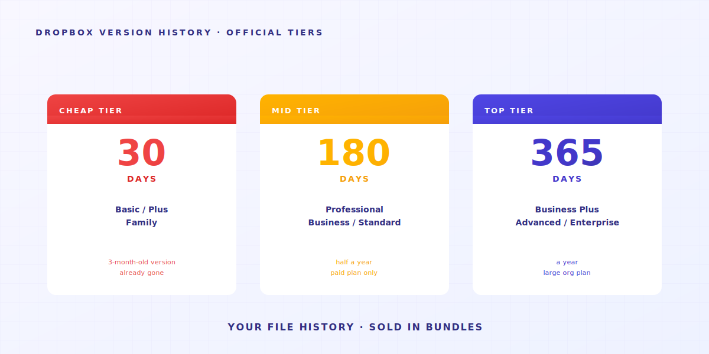

> Ce n'est pas toi qui manques de discipline. Ton outil n'a jamais été conçu pour ça.

Trois personnes. Regarde.

**Personne A** est graphiste indépendante. Son bureau contient `_v3_final_FINAL.psd`.
**Personne B** travaille dans un cabinet d'avocats. Son disque dur contient `contrat_v7_versionclient_2025-04-15.docx`.
**Toi qui lis ça** — tu as peut-être en ce moment même un `memoire_chapitre3_apres-correcteur_vraiment-final-v2.docx` ouvert quelque part.

Des métiers différents. Des noms de fichiers différents. **Le même symptôme**.

Pas parce qu'elles ont toutes une obsession du contrôle. Mais parce que si tu ne fais pas ça, **tes fichiers deviennent le bordel**. Et sur un NAS, ce qui est supprimé est perdu pour toujours. Alors tu te retrouves avec un dossier `old/` qui accumule toutes les anciennes versions.


---

> **TL;DR** — Les dossiers partagés, Dropbox et les NAS **n'ont jamais été conçus pour gérer l'historique de tes fichiers**. Ils ont 4 lacunes structurelles, et chacune te repousse le travail. Cet article les démonte une par une — et reconnaît lesquelles Keeply résout, et lesquelles non.

## Plan de l'article

1. [Le bouton « version précédente » n'a jamais existé](#reason-1)
2. [L'historique sur 30 jours a des conditions](#reason-2)
3. [L'historique dit quand, pas pourquoi](#reason-3)
4. [Les conventions de nommage déversent la mémoire sur les gens](#reason-4)
5. [Quand Keeply n'est pas la réponse](#limitations)

---

## 1. Le bouton « version précédente » n'a jamais existé {#reason-1}

Tu veux retrouver la version d'hier de ce fichier de design.

Tu ouvres Dropbox ou Google Drive — tout est à jour. L'historique des versions est enfoui trois menus plus loin. Tu ne le saurais pas si personne ne te l'avait dit.


Tu ouvres le NAS de l'entreprise — ces numéros de version en pagaille qui traînent là, *c'est* ton historique de versions.


**Ces outils n'ont jamais été conçus pour gérer l'historique de fichiers.**

Ce qui intéresse un disque dur cloud, c'est que tes fichiers soient identiques sur tes trois appareils.
Cet objectif entre en conflit avec « garder toutes les anciennes versions ».

Alors les outils ont choisi la synchronisation. **Ils ne te montrent pas la chronologie des modifications.**

> En 2015, Will Styler, doctorant en linguistique à l'UCSD, a perdu les fichiers de sa thèse. Il avait 7 plans de sauvegarde différents. Chacun a échoué. Il a documenté l'incident pour les futurs doctorants. Dernière ligne : « Redundancy doesn't prevent stupidity. » (La redondance ne protège pas de la bêtise.) [Incident complet](https://wstyler.ucsd.edu/posts/lost_dissertation_files.html)

→ À lire aussi : [Pourquoi ta thèse sur un seul ordinateur, c'est un pari que personne ne t'a signalé](/en/post/thesis-single-point-of-failure/)

---

## 2. L'historique sur 30 jours a des conditions {#reason-2}

Bien. Tu as découvert que Dropbox a vraiment un historique de versions. Soulagé ?

Attends, y'a pire. La prochaine mauvaise nouvelle arrive : **une limite à 30 jours**.



Traduit en pratique quotidienne : tu veux retrouver le brief client du trimestre dernier ? Sauf si tu paies le plan Enterprise, **il n'existe plus**.

La limite à 30 jours n'est pas une contrainte technique — c'est un choix commercial. L'historique de versions est devenu une raison de passer à l'offre supérieure.
(Chez Keeply, l'historique de tes fichiers est gratuit, pour toujours.)

> Avril 2026, Hacker News. L'utilisateur julianozen publie : son père a écrasé un fichier qu'il n'avait pas touché depuis 2 ans. Deux jours plus tard, il a voulu le récupérer — impossible. Explication de Dropbox : en dehors de la fenêtre de rétention de 30 jours. Réaction de julianozen : « C'est pas ce que ça veut dire, un historique sur 30 jours. » Un commentaire de lazide : « Which is bonkers. » [Thread complet](https://news.ycombinator.com/item?id=47772260)

La fenêtre de 30 jours a été pensée pour « j'ai accidentellement écrasé le fichier d'hier ».
Pour « mon client veut récupérer la proposition du trimestre dernier la semaine prochaine » — **utiliser le mauvais outil te donne rarement ce que tu veux**.

→ À lire aussi : [Le coût caché des dossiers partagés](/en/post/hidden-cost-shared-folders/)

---

## 3. L'historique dit quand, pas pourquoi {#reason-3}

Supposons que tu aies réglé les deux premiers problèmes : l'historique est activé, 30 jours suffisent.
Il y a un problème plus profond qui t'attend.

L'historique de versions dit « modifié le 2025-04-15 à 14h23 ».
**Il ne te dit pas ce qui a changé à 14h23. Il ne te dit pas pourquoi.**


Pour certains métiers, c'est acceptable. Pour d'autres, c'est fatal :

- **Un graphiste** a modifié l'opacité d'un calque à 30 %. L'historique dit « modifié ». Il ne dit pas quel calque.
- **Un avocat** a changé « doit » en « peut » dans une clause contractuelle. Un seul mot. L'historique dit « modifié ». Il ne dit pas lequel.
- **Un étudiant en master** a transformé « mais cet argument reste limité » en « cet argument est clairement établi » — d'une formulation prudente à une affirmation assertive. L'historique dit « modifié ». Il ne dit pas que le sens s'est inversé.

> Janvier 2025, Legal Cheek a publié le témoignage anonyme d'un avocat stagiaire : « J'ai envoyé le mauvais testament à la mauvaise famille endeuillée en pièce jointe. » Le problème n'était pas « aucune version sauvegardée » — c'était « je ne savais pas quelle version était en cours ». [Histoire complète](https://www.legalcheek.com/2025/01/courtroom-etiquette-email-blunders-and-document-mix-ups-lawyers-share-their-most-embarrassing-mistakes/)

C'est là où la plupart des gens se trompent.

**Sauvegarder, c'est garder le fichier.**
**Gérer les versions, c'est garder le fichier *plus* une trace de ce que tu as changé et pourquoi.**

**La sauvegarde te donne le premier. La gestion te donne le second.**

Alors tu commences à fourrer l'intention dans les noms de fichiers : `contrat_v7_demande_client_clause3.docx`.
Le nom de fichier n'a plus de place. Tu ouvres un tableur. Le tableur ne suit plus. Tu crées un canal Slack.
**Au final, ton « système de gestion de versions » c'est noms de fichiers + tableur + Slack + ta mémoire.** Qu'une seule pièce lâche, et tout s'effondre.
Trois mois plus tard, tu ouvres tes notes et tu réalises que tes vieilles habitudes ne correspondent plus à tes habitudes actuelles.

---

## 4. Les conventions de nommage déversent la mémoire sur les gens {#reason-4}

Après avoir buté sur ces trois problèmes, chaque entreprise réagit de la même façon — **elle rédige un PDF de 14 pages sur les conventions de nommage**.

Ça ressemble généralement à ça :

```text
[AAAA-MM-JJ]_[CodeProjet]_[TypeDoc]_[Statut]_[Auteur].ext
```

Très propre.


Six mois plus tard, personne ne la suit. Hein ?

Ce n'est pas parce que tes collègues sont paresseux.
**C'est qu'on essaie de contrôler une population de créatures incontrôlables — et la fin s'écrit d'elle-même.**

> Forum Asana, juin 2023, un fil sur les « ratages épiques de nommage de fichiers ». Becky_Caday : « Plusieurs versions du même fichier parce que quelqu'un ne savait pas qu'il pouvait ouvrir et modifier l'original — il a juste mis un mot en majuscules. `List 2.0` est devenu `LIST 2.0`. » Arndt_Dienstbier : « Ils utilisaient les espaces comme système de versionnage » (plusieurs fichiers `Document.docx` distingués uniquement par des espaces en fin de nom). [Thread complet](https://forum.asana.com/t/share-your-epic-file-naming-fails-and-lets-laugh-together/462366)

Chaque membre de l'équipe, à chaque sauvegarde, doit se souvenir + avoir envie + avoir le temps de suivre la règle. Que l'une de ces conditions fasse défaut, **félicitations — te revoilà dans le bordel**.

Se souvenir d'une convention de nommage, c'est quelque chose **qu'un outil devrait faire tout seul**.
Pas quelque chose à déléguer à la discipline de chacun.

→ À lire aussi : [Quand l'équipe AutoCAD a chargé la mauvaise version](/en/post/autocad-wrong-version-crew/)

---

## 5. Quand Keeply n'est pas la réponse {#limitations}

On a construit Keeply pour combler ces 4 lacunes structurelles.
Mais il y a des situations **où Keeply n'est pas la réponse** :

- **Notes de réunion en collaboration temps réel** → utilise Notion / Google Docs. Keeply est une mémoire de versions à long terme pour les individus et les petites équipes, pas un outil de collaboration en temps réel.
- **Rushes vidéo de 50 Go et plus** → utilise Frame.io / PostHaste. La logique de versions de Keeply (enregistrer les différences à chaque sauvegarde) n'est pas économique pour les gros fichiers binaires.
- **Signature légale inter-organisations** → utilise DocuSign / Adobe Sign. Si un contrat doit passer entre 10 cabinets extérieurs, Keeply n'est pas dans ce cadre de conformité.

Pour les 80 % restants des situations de travail de la connaissance — **graphistes, assistants juridiques dans les cabinets, comptables, étudiants en master, équipes PM, freelances** — ces 4 lacunes structurelles te toucheront.
C'est pour ça qu'on est là.

---

Revenons à la question du début : pourquoi tous ceux qui ont utilisé un dossier partagé finissent-ils par inventer leur propre système de nommage ?

Parce que **ce qu'ils voulaient vraiment, c'est une structure propre — pour ne pas prendre de décisions sur la base d'informations périmées**.
Alors ils ont mis les versions dans les noms de fichiers, dans des tableurs, dans leur mémoire.

Déléguer la mémoire organisationnelle à la discipline humaine, c'est une **conception dont on sait qu'elle va casser**.

**La question n'est pas comment mieux faire respecter les conventions de nommage.
C'est si ton outil peut faire ce travail à ta place.**

Que ton outil fasse ce travail à ta place.

---

> À propos de l'auteur : Ting-Wei Tsao, fondateur de Keeply.
> [LinkedIn](https://www.linkedin.com/in/ting-wei-tsao-b57480152/)
