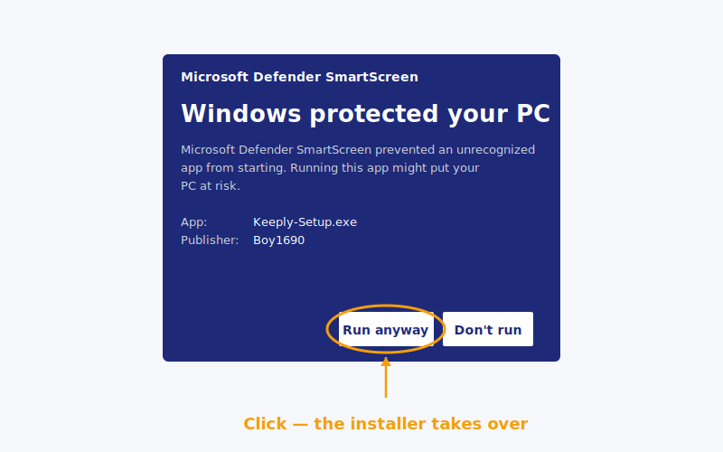

> « J'ai double-cliqué, l'écran bleu est apparu, j'ai supposé que c'était un virus et j'ai fermé. »
>
> — Une graphiste qui venait d'entendre parler de Keeply, qui m'a répondu le même après-midi.

Elle n'est pas la première. L'écran bleu sur Windows arrête probablement plus de gens que ceux qui finissent par installer.

Voici tout le chemin du début à la fin : **pourquoi l'écran bleu apparaît → trois manières plus propres d'installer → ouvrir ton premier projet juste après**.

## Sommaire

1. [Pourquoi l'écran bleu apparaît (ce n'est pas un problème Keeply)](#why-smartscreen)
2. [Trois chemins — choisis celui qui te convient](#three-paths)
3. [Windows chemin 1 : une commande winget (recommandé)](#path-winget)
4. [Windows chemin 2 : télécharger le .exe](#path-exe)
5. [Installation macOS : l'étape clic-droit qu'on ne peut pas sauter](#path-macos)
6. [Après l'installation : dépose ton premier projet](#first-project)
7. [Bloqué ? 5 erreurs courantes](#troubleshoot)

## Pourquoi l'écran bleu apparaît (ce n'est pas un problème Keeply) {#why-smartscreen}

Cet écran s'appelle [SmartScreen](https://learn.microsoft.com/en-us/windows/security/operating-system-security/virus-and-threat-protection/microsoft-defender-smartscreen/). Il ne décide pas « ce logiciel est-il malveillant ? » — il décide « assez de gens l'ont-ils déjà utilisé ? ».

Vois ça comme ça : un nouveau restaurant sans avis Google n'est pas de la mauvaise cuisine. C'est juste de la cuisine que personne n'a encore notée.

SmartScreen traite les nouveaux logiciels de la même façon. Il construit la confiance avec **volume de téléchargement + temps**, et chaque nouvelle version repasse par cette période d'observation. Keeply tape là-dedans à chaque fois qu'il livre une mise à jour. Rien à voir avec la sécurité du logiciel lui-même.

Alors pourquoi ça fait peur aux gens ? Parce que l'écran ne te donne qu'un énorme bouton « Ne pas exécuter ». Pour exécuter quand même, tu dois cliquer sur un petit lien appelé **Informations complémentaires** sur le côté. Visuellement ça ne se lit pas comme un avertissement — ça se lit comme un mur.

Mais tu n'as pas à t'en occuper. **Keeply est publié dans le [dépôt de paquets winget de Microsoft](https://github.com/microsoft/winget-pkgs)**, et ce chemin ne déclenche pas du tout l'avertissement.

Donc le sujet n'est pas comment contourner l'avertissement. C'est comment prendre un chemin où l'avertissement n'apparaît jamais.


## Trois chemins — choisis celui qui te convient {#three-paths}

| Chemin | Idéal si tu | Temps | Écran bleu ? |
| --- | --- | --- | --- |
| **A. Commande winget** (Windows) | n'es pas dérangé de coller une ligne dans PowerShell | 2 min | Non |
| **B. Téléchargement .exe officiel** (Windows) | ne veux pas ouvrir un terminal noir | 5 min | Oui — on te guide |
| **C. Téléchargement .dmg officiel** (macOS) | es sur un Mac | 3 min | Non, mais clic-droit obligatoire |

Tu en as choisi un ? Saute à la section correspondante. Passe les autres.

## Windows chemin 1 — une commande winget (recommandé) {#path-winget}

**winget** est le « gestionnaire de paquets » intégré de Windows — en gros un Microsoft Store mais en ligne de commande. Il est intégré à Windows depuis la version 10 1809. Tu n'as rien d'extra à installer.

Ouvre PowerShell (cherche « PowerShell » dans le menu Démarrer), colle cette ligne, appuie sur Entrée :

```powershell
winget install Boy1690.Keeply
```


Environ 30 secondes et c'est fait. Pas d'écran bleu. Pas de petits caractères « Informations complémentaires ».

Pourquoi ce chemin est-il aussi propre ? Parce que pour être listé dans winget, Keeply doit passer [la revue officielle de Microsoft sur GitHub](https://github.com/microsoft/winget-pkgs) : ils vérifient la source de l'installeur, les signatures de fichiers et le comportement d'installation. Ça ne sort que quand tout est validé.

Autrement dit : quand tu lances cette commande, Microsoft a déjà fait un tour de vérification pour toi. Le contrôle de SmartScreen est redondant sur ce chemin, donc il n'apparaît juste pas.

Chemin court et chemin de confiance, en une ligne.

## Windows chemin 2 — télécharger le .exe {#path-exe}

Pas envie de toucher à PowerShell ? OK. Va sur keeply.work, clique sur télécharger, prends le `.exe`, double-clique dessus.

L'écran bleu SmartScreen va apparaître. **C'est normal** ([pourquoi, voir plus haut](#why-smartscreen)). Pour continuer :

1. Clique sur **Informations complémentaires** (le petit texte souligné dans l'avertissement)
2. Un bouton **Exécuter quand même** apparaît
3. Clique dessus. L'installeur prend le relais à partir de là.



Tout le détour ajoute peut-être 3 minutes — la plupart psychologiques, pas en clics réels. À partir d'ici, ce chemin et le chemin 1 convergent.

## Installation macOS — l'étape clic-droit qu'on ne peut pas sauter {#path-macos}

Pas d'écran bleu sur Mac. Mais tu ne peux pas double-cliquer au premier lancement — [Gatekeeper de macOS](https://support.apple.com/en-us/102445) le bloquera.

Bon flux :

1. Télécharge le `.dmg`, glisse Keeply dans ton dossier Applications
2. Ouvre Applications, trouve Keeply
3. **Clic-droit → Ouvrir** (pas double-clic)

   

4. Une boîte de dialogue apparaît — clique sur « Ouvrir »

   

C'est tout. **Seul le premier lancement requiert ça** — le double-clic fonctionne normalement après.

Pourquoi le détour la première fois ? Gatekeeper bloque le lancement par double-clic pour toute app qu'il n'a pas vue notarisée. Clic-droit → Ouvrir est la façon d'Apple de dire « je sais ce que j'installe, laissez-moi passer ».

Ce n'est pas une bizarrerie de Keeply. Toute nouvelle app Mac qui n'a pas encore été sur ta machine se comporte de la même façon au premier lancement.

## Après l'installation — dépose ton premier projet {#first-project}

Installé n'est pas terminé. Ton premier projet protégé le jour même — ça, c'est terminé.

Ouvre Keeply, clique sur **Nouveau projet**, choisis un dossier sur lequel tu travailles activement.

**Quoi déposer en premier** : ce que tu tiens en ce moment et que tu ne peux pas te permettre de perdre, et que tu continues à éditer. Une proposition, un contrat, un fichier de design, un deck — n'importe lequel marche. Ne choisis pas un dossier que tu n'as pas touché depuis six mois. La valeur de ce dossier est dans l'archivage, pas dans la protection. Autre histoire.

Le premier scan prend 1 à 2 minutes. Après, Keeply surveille le dossier en arrière-plan et **enregistre les versions automatiquement à chaque sauvegarde**. Pas de bouton « point de sauvegarde » manuel à appuyer.

Un exemple inventé mais typique : un graphiste dépose son dossier de pitch Q2 juste après installation. Premier scan : 2 minutes. Trois jours plus tard, il réalise qu'il a échangé une couleur de logo de travers samedi dernier — récupérer la version précédente depuis l'historique prend 20 secondes.

Les gens qui utilisent leur premier projet le jour de l'installation restent bien plus longtemps que ceux qui attendent une semaine.

## Bloqué ? 5 erreurs courantes {#troubleshoot}

| Symptôme | Solution |
| --- | --- |
| Commande `winget` introuvable | Ça veut dire que ton Windows n'a pas encore App Installer. Utilise le chemin 2 (télécharger le .exe) — ne te bats pas |
| Win 11 dit « nécessite un administrateur » | Rouvre PowerShell avec **Exécuter en tant qu'administrateur** |
| Mac dit « ne peut pas être ouvert car il provient d'un développeur non identifié » | Clic-droit → Ouvrir (pas double-clic). Voir la section macOS plus haut |
| Le réseau d'entreprise bloque le téléchargement | Utilise plutôt la commande winget — elle passe par le CDN de Microsoft et passe en général |
| Installé mais ne s'ouvre pas | Redémarre une fois. Toujours rien ? Email à [support@keeply.work](mailto:support@keeply.work) |

## La seule chose à retenir

Une seule chose :

**L'écran bleu n'est pas un verdict — c'est juste de la réputation en construction.**

Tu n'as pas besoin de contourner l'avertissement. Tu as juste besoin de prendre le chemin winget où l'avertissement n'apparaît jamais.
