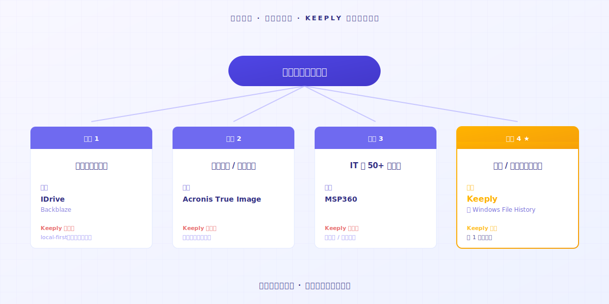

# Comment utiliser Keeply : passe sur 30 fonctionnalités, embarque avec 2 actions

> Tu n'as pas besoin de devenir expert d'abord. Glisse un dossier, continue à travailler — l'historique de versions tourne déjà.

## Sommaire

1. [Pourquoi tu rejettes les nouveaux outils ?](#why-resist-new-tools)
2. [Pourquoi tu abandonnes un outil ?](#why-give-up-a-tool)
3. [Alors c'est quoi, les 2 actions ?](#what-are-the-two-actions)
4. [Laisse-moi te dire ce que tu vivras](#first-week-natural)
5. [Quand Keeply n'est pas pour toi](#when-keeply-isnt-right)

---

M. A jongle avec beaucoup de projets, et il utilise un carnet tous les jours pour suivre ce qu'il a fait. Il vient d'entendre que Keeply est un super logiciel de notes de fichiers. Il ouvre la page d'accueil et voit « Démarre en 3 étapes » et « Essai gratuit de 7 jours ». Le dernier outil qu'il a essayé, il était encore perdu au jour 14. Sa patience s'est épuisée avant qu'aucune valeur ne se montre. **Cette fois il veut 10 minutes pour décider.**

Ce n'est pas que tu es lent. C'est que la courbe d'apprentissage des logiciels traditionnels suppose que tu es prêt à tout lâcher aujourd'hui et à devenir étudiant pendant 14 jours.

---

## Pourquoi tu rejettes les nouveaux outils ? {#why-resist-new-tools}

Tu as essayé d'installer un outil hier. La doc fait 50 pages. Il y a 30 termes nouveaux. Tu livres un projet demain.

Tu te dis : « Je reviens là-dessus la semaine prochaine et je prends mon temps. » Puis tu ne le rouvres jamais.

La plupart des éditeurs de logiciels traitent « apprends-le en 14 jours » comme l'ordre naturel. [La recherche du secteur](https://userpilot.com/blog/time-to-value-benchmark-report-2024/) montre que les utilisateurs qui terminent moins de la moitié de l'onboarding désertent en 14 jours à un taux **3 fois** supérieur à ceux qui le terminent en entier.

Autrement dit : le logiciel suppose que tu as 14 jours libres. Il suppose que ton travail peut attendre que tu l'aies appris.

Ton prochain projet n'est pas dans cette supposition.

---

## Pourquoi tu abandonnes un outil ? {#why-give-up-a-tool}

Un nouvel outil prend en général environ 14 jours à apprendre. Les 13 premiers sont la phase d'exploration.

À la moitié de cette phase, la plupart des gens veulent fermer l'onglet.

Avant de construire Keeply, j'ai essayé pas mal de nouveaux outils moi-même. Beaucoup donnaient l'impression d'être une corvée dès le jour 1, et je revenais discrètement à ma vieille façon de faire.

Plus tard j'ai réalisé : les outils auxquels je m'étais réellement tenu avaient un point commun — **ils étaient assez intuitifs pour qu'on les utilise simplement**.

Une fois j'utilisais l'IA pour écrire du code, et l'IA est partie en vrille. J'avais déjà perdu le fil de où elle en était arrivée. **Heureusement j'avais gardé des notes de fichiers tout du long.**

Ouvre l'historique. **Retour à un état que je pouvais contrôler.**

C'est là que j'ai compris : un bon outil n'est pas celui qui a le plus de fonctionnalités, c'est **celui qui est assez simple pour qu'on s'y mette**. Je n'avais appris aucune fonctionnalité, et juste en attrapant discrètement ce fichier, l'outil avait déjà été rentabilisé.

L'outil n'est pas le problème. **Cette catégorie de logiciels ne devrait simplement pas être conçue autour de « apprends d'abord, utilise ensuite ».**

---

## Alors c'est quoi, les 2 actions ? {#what-are-the-two-actions}

### Action 1 : Glisse un dossier dans Keeply

Tu le glisses littéralement. **Ne renomme pas, ne classe pas, ne pense pas à la structure.**

### Action 2 : Continue à travailler

Ce que tu allais faire aujourd'hui, fais-le.

Édite un fichier, sauvegarde, restaure la version précédente, supprime et refais. **Keeply enregistre automatiquement dans la Timeline à gauche et crée une note de fichier.** Tu n'appuies sur aucun bouton. Tu ne mémorises aucun raccourci.

Tu n'as pas non plus à renommer tes fichiers. Ce `_v3_vraiment_final.docx` garde son nom. Keeply ne touche pas à tes habitudes.

Fin du jour 1, tu as 1 jour de notes de fichiers. **Fin du jour 7, tu as une semaine complète.**

L'utilisation intuitive, c'est tout le truc.

---

## Laisse-moi te dire ce que tu vivras {#first-week-natural}

### Jour 1

Glisse un projet. Sauvegarde.

### Jours 2-3

Édite 200 mots dans un fichier existant. Sauvegarde.

À travers la Timeline tu regardes tes propres notes de fichiers commencer à s'empiler. **Clique dans une note, vois ce que tu as supprimé et ce que tu as ajouté.**

### Jours 4-7

Tu empiles de plus en plus de notes de fichiers.

Un jour tu vas remarquer — **c'est génial que j'aie ce logiciel**.

---

## Quand Keeply n'est pas pour toi {#when-keeply-isnt-right}

Keeply ne se bat pas pour chaque scénario. Dans 4 cas, un autre outil est le meilleur choix.

- **Si tu as besoin de synchronisation cloud entre appareils** : choisis [IDrive](https://www.idrive.com/) ou [Backblaze](https://www.backblaze.com/). Keeply vit sur ton ordinateur. Il n'est pas cloud-natif.
- **Si tu as besoin de restauration système ou de sauvegarde disque complète** : choisis [Acronis True Image](https://www.acronis.com/). Keeply ne fait pas ça.
- **Si tu es un pro IT qui gère 50+ machines** : choisis [MSP360](https://www.msp360.com/). Keeply est pour les individus et les petites équipes.
- **Si tu veux juste ne pas perdre des documents personnels**, l'Historique des fichiers de Windows est intégré et largement suffisant. Tu n'as rien à installer.

Choisir un outil c'est comme choisir un collègue. Chacun a son scénario fort. Sois honnête là-dessus, et tu brûleras moins d'essais de 14 jours.

---

## Pour conclure

Tu veux essayer un nouvel outil, et tu ne veux pas y perdre 14 jours. C'est légitime.

Glisse un dossier dans [Keeply](https://keeply.work/). Continue le boulot d'aujourd'hui.

Au jour 7, ouvre la Timeline et jette un œil. **Tu vas piger.**

---

## À lire aussi

- [Le guide complet de la gestion des versions de fichiers](/fr/post/file-version-management-complete-guide/) (PILLAR 1, pourquoi la gestion des versions compte)

---

*Auteur : Ting-Wei Tsao, fondateur de Keeply | [LinkedIn](https://www.linkedin.com/in/tingwei-tsao/)*
