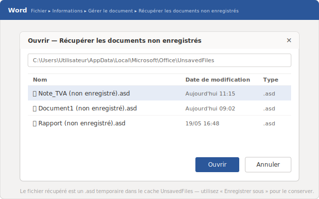
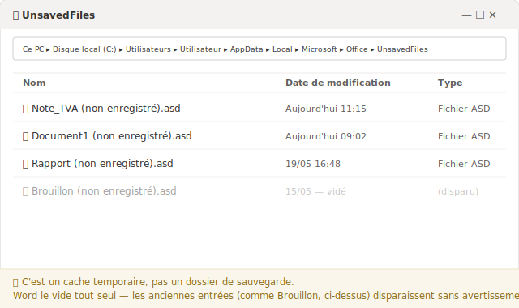
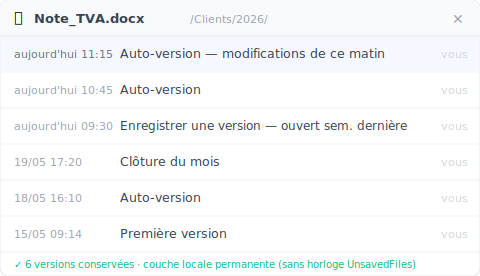

> Word a planté avant l'enregistrement ? Rouvrez-le et commencez par le volet « Récupération de documents ». Mais si vous avez perdu le travail d'une matinée sur un fichier qui existait déjà, ce n'est pas le même problème — et la plupart des guides confondent les deux.

Mardi, 11 h 15. Dans un petit cabinet comptable, vous finalisez une note de calcul pour une déclaration de TVA à boucler avant midi. Le document n'a jamais été enregistré — c'est un brouillon ouvert depuis l'aube. Word se fige, la fenêtre devient grise, puis tout disparaît. Ou pire : une fenêtre vous demande d'enregistrer, et par réflexe, vous cliquez sur « Ne pas enregistrer ». Trois heures de travail, envolées. *[exemple fictif]*

La bonne nouvelle : dans la plupart des cas, Word a gardé une copie quelque part. La mauvaise : la fenêtre par laquelle on tente la récupération mélange deux situations très différentes. Voyons d'abord le geste qui sauve, puis la distinction que personne ne fait.

## Les 5 premières minutes : le geste qui récupère un document jamais enregistré

Ne touchez à rien d'autre. Rouvrez Word.

S'il s'est fermé brutalement, Word affiche souvent à gauche un volet **Récupération de documents** avec une liste de versions horodatées. C'est le chemin le plus court : repérez la ligne qui correspond à votre dernière modification, ouvrez-la, et **enregistrez-la immédiatement** au format `.docx` dans un dossier réel. Ce volet ne reste pas affiché indéfiniment.

S'il n'apparaît pas, passez par le menu :

**Fichier** > **Informations** > **Gérer le document** > **Récupérer les documents non enregistrés**

Word ouvre alors un dossier contenant des copies temporaires. Ouvrez celle dont l'heure correspond à votre dernière session, vérifiez le contenu, puis enregistrez-la tout de suite sous un vrai nom, à un vrai endroit. C'est exactement le geste recommandé par Microsoft pour ce cas de figure.

Si rien n'apparaît, un **plan B** existe : ouvrez le menu **Démarrer**, tapez `.asd` et appuyez sur Entrée. Si un fichier `.asd` ressort, ouvrez Word puis **Fichier** > **Ouvrir** > **Parcourir**, choisissez **Tous les fichiers** dans le menu déroulant du type de fichier (à droite du champ « Nom du fichier »), et ouvrez le `.asd`. C'est le fichier brut de récupération automatique — il contient souvent ce que vous cherchez.

## Où Word range les fichiers non enregistrés (et pourquoi ils s'évaporent)

Sur Windows, ces copies temporaires vivent dans un dossier caché :

`%LocalAppData%\Microsoft\Office\UnsavedFiles`

Ce sont les fameux fichiers `.asd`. Vous pouvez coller ce chemin dans la barre d'adresse de l'Explorateur pour y aller directement.

Mais attention : **ce dossier n'est pas un coffre-fort.** C'est un cache de secours, et Word le vide à son propre rythme, sans le moindre avertissement. Après un redémarrage, ou dès qu'un travail plus récent prend la place, les anciennes copies disparaissent. Vous lirez parfois sur les forums que Word garde ces fichiers « quatre jours » : Microsoft ne garantit nulle part ce chiffre. Traitez-le comme une rumeur, pas comme une règle.

La seule règle fiable tient en une phrase : **dès que vous retrouvez la bonne version, enregistrez-la maintenant.** Pas après le café. Maintenant.

## Deux problèmes que Word fait passer par la même porte

Voici ce qu'aucun guide de récupération ne vous dit clairement. Derrière « récupérer un document Word », il y a deux situations qui n'ont presque rien à voir.

**Problème A — le fichier n'a jamais été enregistré.** Vous travailliez sur un nouveau document, Word a planté ou vous avez cliqué sur « Ne pas enregistrer » avant le premier enregistrement. Il n'existe aucun fichier sur le disque. Le cache des documents non enregistrés (« Récupérer les documents non enregistrés ») est votre seul espoir légitime — et c'est précisément pour ça qu'il a été conçu. Tout ce que nous venons de voir s'applique.

**Problème B — le fichier existait déjà, et vous avez perdu le travail du matin.** Le rapport était sur le disque depuis des semaines. Ce matin, vous avez tout écrasé par erreur, ou supprimé un passage avant d'enregistrer par-dessus. Vous voulez revenir à la version de 11 h 15. Le fichier, lui, est intact — seules les dernières heures ont disparu.

Et là, le piège : le cache des documents non enregistrés **ne vous aidera presque jamais.** Il ne liste que les fichiers qui n'ont jamais été enregistrés. Votre rapport, lui, l'a été cent fois. Le chemin natif de Windows existe — clic droit sur le fichier > **Propriétés** > onglet **Versions précédentes** — mais il ne renvoie quelque chose que si l'**Historique des fichiers** de Windows était **activé avant** la perte. Et sur le PC d'un cabinet comptable ou d'un cabinet d'avocats sans service informatique dédié, il ne l'est presque jamais. Une fois cette option activée, Windows surveille vos fichiers en continu ; mais s'il ne l'était pas, il n'existe tout simplement aucune version à restaurer.

## Comment retrouver la version de ce matin quand le fichier existe toujours ?

C'est la question du Problème B, et c'est là que tout se joue. Si vous attendez d'avoir perdu le travail pour chercher où Word a bien pu le cacher, vous comptez sur un cache qui n'a probablement jamais eu cette version.

L'approche inverse consiste à ne plus rien laisser au hasard : faire des photographies régulières d'un **dossier** entier, plutôt que d'espérer que Word ait justement gardé le bon instant. C'est ce que fait [Keeply](https://keeply.work). Vous lui désignez un dossier — sur votre PC local ou sur un lecteur réseau de l'entreprise — et il en conserve les versions en arrière-plan, selon un rythme que **vous** réglez : toutes les 15, 30 ou 60 minutes, 30 par défaut.

Keeply travaille à son propre rythme. Il ne se déclenche pas quand vous appuyez sur Ctrl+S et n'écoute pas chacun de vos enregistrements : il suit son horloge, en arrière-plan. À côté, un bouton **« Enregistrer une version »** vous laisse marquer manuellement un jalon avec une note d'une ligne — par exemple « avant envoi au client ». Le matin perdu ? Vous ouvrez la chronologie du fichier et vous choisissez la version de 11 h 15.

Sous le capot, Keeply s'appuie sur un moteur Git : chaque version enregistrée est figée, jamais réécrite ni corrompue. Mais c'est de la tuyauterie interne. Vous ne tapez jamais la moindre commande, et vous n'avez pas besoin de savoir ce qu'est Git pour vous en servir.

## Là où Keeply ne vous aidera pas (soyons honnêtes)

Aucun outil ne couvre tout. Trois cas où Keeply ne fait rien pour vous, et où il faut le savoir :

- **Un fichier flambant neuf, jamais enregistré dans un dossier surveillé.** C'est le Problème A pur. Si le document n'a jamais touché le dossier que Keeply observe, il n'en existe aucune trace. Ici, le cache de Word reste votre seule voie.
- **La corruption silencieuse.** Si le fichier était déjà endommagé au moment où il a été versionné, Keeply conserve fidèlement… la version endommagée. Garder des versions n'est pas réparer un fichier.
- **Les fichiers hors du dossier surveillé.** Un document enregistré à la hâte sur une clé USB jamais ajoutée à Keeply n'a aucun historique. On ne protège que ce qu'on lui a confié.

## Quand les outils intégrés de Word suffisent largement

Pas besoin d'artillerie pour un brouillon jetable. Et c'est vrai dans plusieurs cas : dans plusieurs cas, Word et son écosystème font très bien le travail.

Si votre fichier est sur **OneDrive** ou **SharePoint** avec l'**Enregistrement automatique** activé, l'essentiel est couvert : la sauvegarde dans le cloud est continue et un historique des versions existe. C'est solide, mais avec trois réserves : le fichier doit vraiment se trouver dans le dossier synchronisé avec le cloud ; l'historique des versions est limité dans le temps ; et l'enregistrement écrase la version précédente sans vous demander confirmation. Autrement dit : cette protection ne vaut que pour les fichiers réellement stockés dans le cloud.

Pour le reste, la base à régler une fois pour toutes, c'est la **Récupération automatique** — le moteur qui écrit les fichiers `.asd` à intervalle régulier. Allez dans **Fichier** > **Options** > **Enregistrer** et baissez la valeur du champ « Enregistrer les informations de récupération automatique chaque… ». Microsoft recommande de la laisser activée et de régler l'intervalle sur **cinq minutes ou moins** pour les bureaux qui ne peuvent pas se permettre de perdre du travail.

Mais gardez la frontière en tête : pour beaucoup d'indépendants, d'experts-comptables ou de juristes qui travaillent sur un PC local ou un lecteur réseau d'entreprise — sans service informatique pour activer l'Historique des fichiers — cette protection cloud n'entre jamais en jeu. C'est exactement là qu'une couche de versions persistante prend tout son sens.

## Questions fréquentes

**Où Windows stocke-t-il les documents Word non enregistrés ?**
Dans un dossier caché : `%LocalAppData%\Microsoft\Office\UnsavedFiles`, sous forme de fichiers `.asd`. Vous pouvez coller ce chemin dans la barre d'adresse de l'Explorateur, ou passer par **Fichier** > **Informations** > **Gérer le document** > **Récupérer les documents non enregistrés** dans Word.

**Combien de temps Word garde-t-il un document non enregistré ?**
Aucune durée garantie. Le cache des documents non enregistrés se vide au rythme de Word, sans avertissement : un redémarrage ou un travail plus récent peut effacer les anciennes copies. Le chiffre de « quatre jours » qui circule sur les forums n'est garanti par aucune page officielle de Microsoft. Dès que vous retrouvez la bonne version, enregistrez-la sans attendre.

**À quoi sert la Récupération automatique et tous les combien faut-il la régler ?**
C'est la fonction qui écrit automatiquement un fichier `.asd` à intervalle régulier. Elle se règle dans **Fichier** > **Options** > **Enregistrer**. Microsoft recommande de la laisser activée et de fixer l'intervalle sur cinq minutes ou moins.

**J'ai écrasé mon fichier ce matin et je veux la version de 11 h 15. La Récupération automatique peut-elle m'aider ?**
Rarement. Le cache des documents non enregistrés ne liste que les fichiers jamais enregistrés ; votre fichier, lui, l'a été. Le chemin natif clic droit > **Propriétés** > **Versions précédentes** ne fonctionne que si l'Historique des fichiers de Windows était activé avant la perte. Pour disposer d'un retour en arrière fiable sans dépendre de ce préalable, il faut une couche de versions qui photographie le dossier à intervalles réguliers, comme [Keeply](https://keeply.work) : vous ouvrez la chronologie et vous choisissez la version de 11 h 15.

**Keeply remplace-t-il la Récupération automatique de Word ?**
Non, les deux ne couvrent pas le même besoin. La Récupération automatique sauve un document que vous n'aviez jamais enregistré après un plantage — c'est le Problème A. Keeply répond au Problème B : retrouver une version précise d'un fichier qui existe déjà, sans miser sur un cache qui ne l'a probablement pas gardée. Sur un PC local ou un lecteur réseau, les deux sont complémentaires.

## Pour aller plus loin

- [Keeply](https://keeply.work) — une couche de versions qui photographie vos dossiers en arrière-plan, sur PC local ou lecteur réseau, et vous laisse rouvrir n'importe quelle version par sa chronologie.
- [Comment récupérer des documents Word non enregistrés — Microsoft Learn](https://learn.microsoft.com/fr-fr/troubleshoot/microsoft-365-apps/word/recover-lost-unsaved-corrupted-document) — la page officielle Microsoft, avec le chemin de menu complet et la recommandation d'intervalle de récupération automatique.

*Par Ting-Wei Tsao, fondateur de Keeply, [LinkedIn](https://www.linkedin.com/in/ting-wei-tsao-b57480152)*
