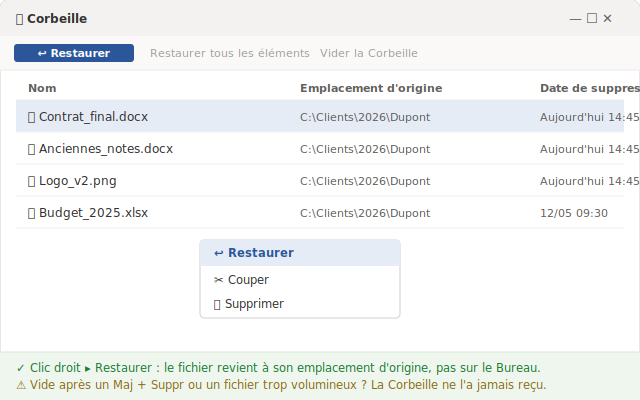
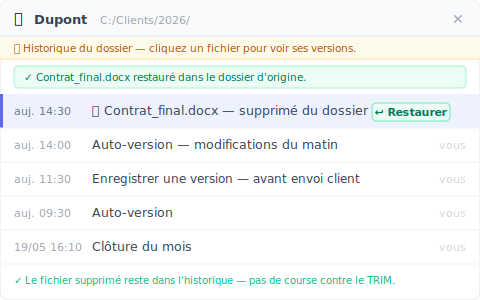

# Récupérer des fichiers supprimés de la corbeille : 4 méthodes, dans l'ordre du temps qui vous reste

> Le fichier est encore dans la Corbeille ? Cinq secondes. Vous l'avez déjà vidée ? Le chronomètre vient de démarrer.

Jeudi, 14 h 47. Vous faisiez le ménage dans le dossier d'un client : vous sélectionnez une pile de vieux fichiers et vous supprimez tout d'un coup pour y voir clair. Deux minutes plus tard, vous réalisez qu'au milieu du tas, il y avait aussi le contrat final que vous aviez retravaillé toute la matinée. Vous ouvrez la Corbeille. Vide — vous l'avez vidée dans la foulée, sans réfléchir. *[exemple fictif]*

À partir de là, ce qui décide si vous récupérez le fichier, ce n'est pas la méthode que vous choisissez. C'est **le temps qu'il vous reste**. Un fichier qui vient de tomber dans la Corbeille, c'est une récupération quasi garantie. Un fichier supprimé pour de bon, c'est une autre histoire : chaque minute qui passe, chaque chose nouvelle que l'ordinateur écrit sur le disque, fait baisser vos chances d'un cran.

C'est pour ça que ce guide ne classe pas les méthodes par « facile ou difficile ». Il les classe par **urgence** : la méthode 1 est pour quand le fichier est encore là, la méthode 4 pour quand il ne reste presque plus rien. Tentez de haut en bas.

## Méthode 1 : restaurer directement depuis la Corbeille

Si le fichier est toujours dans la Corbeille, c'est réglé en cinq secondes — et c'est là que finit bien la majorité des « j'ai supprimé sans faire exprès ». Quand vous appuyez sur la touche Suppr normale, Windows n'efface pas le fichier : il le déplace simplement dans la **Corbeille**. Le fichier y reste intact jusqu'à ce que vous la vidiez, ou qu'elle se purge d'elle-même.

Ouvrez la **Corbeille** sur le Bureau, trouvez le fichier, faites un clic droit dessus et choisissez **Restaurer**. Il revient à son **emplacement d'origine**, exactement dans le dossier d'où il avait été supprimé — pas sur le Bureau. Voilà.

Mais deux pièges laissent la Corbeille vide sans que vous ayez rien vidé :

- Vous avez supprimé avec **Maj + Suppr** — ce raccourci saute la Corbeille et efface directement.
- Le fichier dépassait la taille maximale de la Corbeille, alors Windows l'a supprimé d'un coup au lieu de le garder.

Si vous êtes dans l'un de ces cas, la Corbeille ne vous aidera pas. Descendez à la méthode suivante.

## Méthode 2 : annuler la suppression quand vous venez d'agir

Si vous avez supprimé à l'instant et que vous n'avez rien fait d'autre depuis, c'est le raccourci le plus rapide — plus rapide encore qu'ouvrir la Corbeille. Dans la fenêtre de l'Explorateur de fichiers, appuyez sur **Ctrl + Z**. Ou faites un clic droit dans un espace vide du dossier qui contenait le fichier et choisissez **Annuler la suppression**. Windows remet le fichier en place sur-le-champ.

Le bon côté : cette méthode replace le fichier au bon endroit, même s'il était déjà parti dans la Corbeille. Le mauvais : elle ne tient que sur quelques actions. Vous ouvrez d'autres fenêtres, vous copiez d'autres fichiers, vous éteignez l'ordinateur — et l'historique d'annulation s'efface.

En clair : Ctrl + Z, c'est le réflexe des deux premières minutes. Passé cette fenêtre, il vous faut une autre méthode.

## Méthode 3 : restaurer les versions précédentes, si vous l'aviez activé avant

À partir d'ici, la frontière est nette : récupérer ou non **dépend de quelque chose que vous avez fait — ou oublié de faire — avant le problème.**

Windows possède une fonction appelée **Historique des fichiers** (File History) qui enregistre automatiquement des copies antérieures des dossiers que vous lui désignez. Quand elle est activée, vous faites un clic droit sur le dossier qui contenait le fichier perdu, vous choisissez **Restaurer les versions précédentes**, et Windows liste les instantanés par date pour que vous choisissiez. C'est exactement le chemin que décrit Microsoft pour la [sauvegarde et restauration avec l'Historique des fichiers](https://support.microsoft.com/fr-fr/windows/sauvegarde-et-restauration-avec-l-historique-des-fichiers-7bf065bf-f1ea-0a78-c1cf-7dcf51cc8bfc).

Et voici le piège que presque aucun tutoriel n'énonce clairement : **l'onglet « Versions précédentes » n'affiche quelque chose que si l'Historique des fichiers était déjà activé avant.** Si vous ne l'avez jamais activé, la liste arrive vide — il n'y a rien à restaurer. Windows ne commence à enregistrer qu'après l'activation ; le passé, il ne le reconstruit pas.

Sur un ordinateur personnel, ou sur le PC d'un petit cabinet sans service informatique — le cas de bien des indépendants, experts-comptables et avocats — cette fonction n'est presque jamais activée d'origine. Si c'est votre situation, la liste arrive vide et vous êtes poussé vers la dernière méthode.

## Méthode 4 : logiciel de récupération, et arrêtez d'utiliser le disque tout de suite

Arrivé ici, le fichier a vraiment été supprimé pour de bon et aucune couche de sauvegarde ne l'a gardé. Il reste à balayer la partie physique du disque avec un logiciel de récupération de données — comme **Recuva** (gratuit, léger) ou **Disk Drill** (version payante, plus complète). Ce sont des outils qui lisent le disque pour tenter de récupérer les zones que le système a marquées comme « effacées » mais n'a pas encore réécrites.

Avant d'installer quoi que ce soit, il y a un geste plus important que le logiciel : **cessez immédiatement d'utiliser le disque où était le fichier.** Quand un fichier est supprimé pour de bon, les données ne disparaissent pas sur le coup — le système marque seulement leur espace comme libre. Microsoft le confirme dans sa documentation sur la [récupération de fichiers Windows](https://support.microsoft.com/fr-fr/windows/r%C3%A9cup%C3%A9ration-de-fichiers-windows-61f5b28a-f5b8-3cc2-0f8e-a63cb4e1d4c4) : « l'espace utilisé par un fichier supprimé est marqué comme espace libre, [et] les données du fichier peuvent toujours exister et être récupérées ». C'est pourquoi, dit la même page, pour augmenter vos chances vous devez « réduire ou éviter d'utiliser votre ordinateur » — chaque nouvelle écriture risque de tomber pile sur ce que vous voulez sauver.

Et voici la partie que peu de gens connaissent : **sur un SSD, la porte se referme beaucoup plus vite que sur un disque dur.** Le SSD possède un mécanisme appelé TRIM, qui nettoie de lui-même les blocs marqués comme effacés pour que le disque reste rapide. La page de Microsoft prévient justement qu'« il est possible que l'espace libre ait été remplacé, en particulier sur un disque SSD ». Une fois le TRIM passé — en général quelques minutes après la suppression — même un outil forensique ne récupère plus rien : il balaie, mais il n'y a plus de donnée à lire. Sur un disque dur, la fenêtre est plus large, mais le fichier peut déjà avoir été partiellement écrasé.

D'où les deux règles d'or : **n'installez pas le logiciel sur le disque du fichier perdu, et n'y enregistrez pas non plus le fichier récupéré** — les deux risquent d'écrire par-dessus exactement ce que vous essayez de sauver.

## Et si la suppression accidentelle n'était plus jamais un problème ?

Vous avez remarqué ce que les quatre méthodes ont en commun ? Plus on descend, plus vos chances dépendent de votre rapidité et du hasard. À la méthode 4, vous pariez que le TRIM n'a pas encore tourné et que le disque n'a pas encore réécrit — un pari qui coûte souvent cher.

Il existe une direction complètement différente, et elle n'est pas dans « récupérer plus vite ». Elle est dans **faire de la suppression accidentelle un non-événement.** L'idée est simple : au lieu d'espérer arracher le fichier au disque une fois qu'il est déjà parti, on garde à l'avance les versions d'un **dossier** entier. Du coup, un fichier supprimé ne disparaît pas — il reste dans l'historique, et vous le ramenez d'un clic.

C'est ce que fait [Keeply](https://keeply.work). Vous lui désignez un dossier — sur votre ordinateur ou sur un lecteur réseau de l'entreprise — et il en conserve les versions en arrière-plan, selon un rythme que **vous** réglez : toutes les 15, 30 ou 60 minutes, 30 par défaut. Quand un fichier est supprimé du dossier surveillé, il reste entier dans la chronologie des versions ; vous l'ouvrez, vous trouvez la dernière version avant la suppression, et vous restaurez.

La différence qui fait tout fonctionner : Keeply **ne** se déclenche **pas** à chaque Ctrl + S et **n'écoute pas** chacun de vos enregistrements. Il suit sa propre horloge, toujours en arrière-plan. Il y a aussi un bouton **« Enregistrer une version »** pour marquer à la main un moment important avec une note d'une ligne — « avant envoi au client », par exemple. Et comme les versions sont gardées dès avant la suppression, la récupération a lieu **avant** que les données ne redeviennent de l'espace libre réutilisable — sans course contre le TRIM, sans pari sur un logiciel de balayage.

Cette même couche de versions vous couvre contre un risque plus grand que la suppression accidentelle : **la panne du disque lui-même.** Avec un seul disque, s'il lâche, vous perdez tout. Keeply garde vos données selon un arrangement 3-2-1 — une copie locale, une copie principale et un miroir ailleurs — donc un disque mort n'emporte pas votre travail avec lui. (C'est la protection secondaire ; ici, le sujet reste de récupérer un fichier supprimé par erreur.) Sous le capot, chaque version enregistrée est figée et n'est jamais réécrite — mais c'est de la tuyauterie interne. Vous ne tapez jamais la moindre commande, et vous n'avez pas besoin de comprendre l'ingénierie pour vous en servir.

## Là où Keeply ne vous aidera pas (soyons honnêtes)

Aucun outil ne couvre tout, et prétendre le contraire ne ferait que vous faire compter sur le mauvais filet. Trois situations où Keeply n'est pas la réponse :

- **Un fichier qui n'a jamais été dans un dossier surveillé.** Si le fichier supprimé n'est jamais passé par le dossier que Keeply observe, il n'en existe aucune trace. Là, ce sont les méthodes 1 à 4 ci-dessus qui s'appliquent — et vous repartez dans la course contre la montre.
- **Un fichier perdu avant l'installation de Keeply.** Il conserve les versions à partir du moment où vous lui confiez le dossier. Un fichier supprimé pour de bon la semaine dernière, quand il n'y avait aucune couche, dépend encore d'un logiciel de récupération, avec tout le risque que cela comporte.
- **La corruption silencieuse.** Si le fichier était déjà endommagé au moment où une version a été capturée, Keeply conserve fidèlement la version endommagée. Garder des versions n'est pas réparer un fichier.

En résumé : Keeply s'occupe de l'**avenir** — pour que la prochaine suppression accidentelle ne soit plus un problème. Un fichier déjà perdu avant relève encore des quatre méthodes du haut.

## Quand les outils que vous avez déjà suffisent

Inutile d'ajouter une couche supplémentaire si vos fichiers sont déjà bien protégés. S'ils vivent dans **OneDrive** ou **SharePoint**, vous avez deux protections solides gratuitement.

La première, c'est la **corbeille dans le cloud**, qui garde le fichier supprimé un bon moment : pour un compte personnel, **30 jours** ; pour un compte professionnel ou scolaire, **93 jours**, d'après la [documentation de Microsoft sur la restauration de fichiers dans OneDrive](https://support.microsoft.com/fr-fr/office/supprimer-ou-restaurer-des-fichiers-et-dossiers-dans-onedrive-949ada80-0026-4db3-a953-c99083e6a84f). C'est une fenêtre bien plus large que celle de la suppression locale.

La seconde, c'est l'**historique des versions**, qui vous laisse revenir à d'anciennes versions du même fichier. Mais il a un plafond clair : sur un compte Microsoft personnel, vous récupérez seulement les **25 dernières versions**, selon la [page de support de Microsoft](https://support.microsoft.com/fr-fr/office/restaurer-une-version-pr%C3%A9c%C3%A9dente-d-un-fichier-stock%C3%A9-dans-onedrive-159cad6d-d76e-4981-88ef-de6e96c93893). Pour un fichier qui change tout le temps, 25 versions peuvent ne couvrir que les derniers jours.

Cette protection cloud est excellente — mais elle ne vaut que pour les fichiers **réellement** présents dans le dossier synchronisé avec le cloud. Pour bien des indépendants, experts-comptables ou avocats qui travaillent sur un ordinateur personnel ou sur un lecteur réseau d'entreprise — sans rien de synchronisé, sans service informatique pour activer l'Historique des fichiers — ni la corbeille du cloud ni cet historique de versions n'entrent en jeu. Et c'est précisément là qu'une couche de versions en arrière-plan montre toute sa valeur.

## Questions fréquentes

**Un fichier supprimé de la Corbeille (ou avec Maj + Suppr) va où ? Peut-on le récupérer ?**
Quand vous videz la Corbeille ou supprimez avec Maj + Suppr, Windows n'efface pas les données tout de suite : il marque seulement l'espace du disque comme libre. D'après Microsoft, les données du fichier peuvent toujours exister et être récupérées tant que rien de nouveau n'a été écrit par-dessus. Il reste donc une chance, mais elle baisse à chaque nouvelle écriture sur le disque — et plus vite encore sur un SSD à cause du TRIM.

**Comment récupérer des fichiers supprimés définitivement de la corbeille, une fois qu'elle est vidée ?**
Essayez dans l'ordre d'urgence : (1) si vous venez de supprimer, appuyez sur **Ctrl + Z** ou faites un clic droit dans le dossier et choisissez **Annuler la suppression** ; (2) clic droit sur le dossier d'origine puis **Restaurer les versions précédentes** — mais cela n'affiche quelque chose que si l'**Historique des fichiers** de Windows était activé avant la perte ; (3) en dernier recours, un logiciel de récupération de données comme Recuva ou Disk Drill, en cessant immédiatement d'utiliser le disque pour ne pas écraser le fichier.

**Un logiciel de récupération de données récupère-t-il toujours le fichier ?**
Non. Le taux de réussite est élevé si vous agissez tôt et que le disque n'a pas été réécrit, mais il chute avec le temps et à chaque nouvelle écriture. Sur un SSD, le TRIM efface les blocs marqués en quelques minutes ; passé ce délai, même un outil de niveau forensique ne récupère plus rien. N'installez pas le logiciel sur le disque du fichier perdu et n'y enregistrez pas non plus le fichier récupéré.

**Combien de temps OneDrive conserve-t-il un fichier supprimé ?**
D'après la documentation de Microsoft, la corbeille de OneDrive conserve le fichier **30 jours** pour un compte personnel et **93 jours** pour un compte professionnel ou scolaire. En plus, l'historique des versions d'un compte personnel garde les **25 dernières versions** de chaque fichier. Ces fenêtres ne valent que pour les fichiers réellement présents dans le dossier synchronisé avec le cloud.

**Keeply est-il un logiciel de récupération de données comme Recuva ou Disk Drill ?**
Non, ce sont deux couches différentes. Recuva et Disk Drill balaient la partie physique du disque pour tenter de récupérer des octets déjà marqués comme effacés — un pari contre la montre. Keeply conserve des versions intactes d'un dossier dès avant la suppression du fichier ; la récupération a donc lieu avant que les données ne redeviennent de l'espace réutilisable. Keeply est l'outil qui fait que vous n'avez jamais besoin de Recuva.

## Pour aller plus loin

- [Keeply](https://keeply.work) — une couche de versions qui photographie vos dossiers en arrière-plan, sur ordinateur personnel ou lecteur réseau, pour qu'un fichier supprimé par erreur reste entier dans l'historique et revienne d'un clic.
- [Récupération de fichiers Windows — Support de Microsoft](https://support.microsoft.com/fr-fr/windows/r%C3%A9cup%C3%A9ration-de-fichiers-windows-61f5b28a-f5b8-3cc2-0f8e-a63cb4e1d4c4) — l'outil en ligne de commande pour les fichiers déjà sortis de la Corbeille, avec l'avertissement sur l'écrasement et le SSD.
- [Sauvegarde et restauration avec l'Historique des fichiers — Support de Microsoft](https://support.microsoft.com/fr-fr/windows/sauvegarde-et-restauration-avec-l-historique-des-fichiers-7bf065bf-f1ea-0a78-c1cf-7dcf51cc8bfc) — le chemin complet de l'Historique des fichiers et de Restaurer les versions précédentes.
- [Supprimer ou restaurer des fichiers et dossiers dans OneDrive — Support de Microsoft](https://support.microsoft.com/fr-fr/office/supprimer-ou-restaurer-des-fichiers-et-dossiers-dans-onedrive-949ada80-0026-4db3-a953-c99083e6a84f) — la durée de conservation dans la corbeille du cloud (30 jours personnel / 93 jours professionnel).

*Par Ting-Wei Tsao, fondateur de Keeply, [LinkedIn](https://www.linkedin.com/in/ting-wei-tsao-b57480152)*
