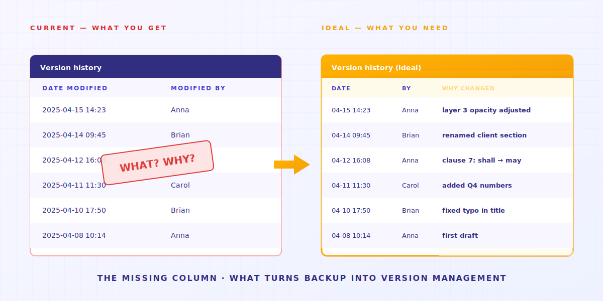
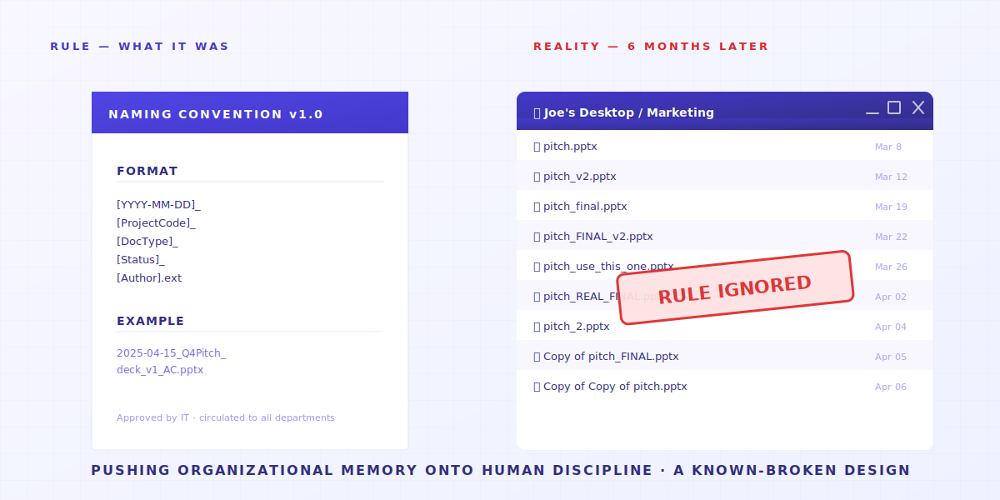

> यह आपका अनुशासन नहीं है। आपके टूल को यह काम करने के लिए बनाया ही नहीं गया था।

तीन लोगों को देखिए।

**व्यक्ति A** एक फ्रीलांस डिज़ाइनर हैं। उनके डेस्कटॉप पर है `_v3_final_FINAL.psd`।
**व्यक्ति B** एक लॉ फर्म में काम करती हैं। उनकी ड्राइव पर है `contract_v7_clientcopy_2025-04-15.docx`।
**स्क्रीन के पीछे आप**, इसे पढ़ते हुए, शायद अभी `thesis_chapter3_post-advisor_truly-final-v2.docx` खोले बैठे हैं।

अलग-अलग काम। अलग-अलग फ़ाइल नाम। **एक ही लक्षण**।

ये लोग कोई जुनूनी नहीं हैं। बल्कि अगर ऐसा नहीं करें, तो **फ़ाइलें एक बेतरतीब गड़बड़ बन जाती हैं**। और NAS पर तो एक बार डिलीट हुई फ़ाइल हमेशा के लिए चली जाती है। तो आप `old/` जैसा एक फ़ोल्डर बना लेते हैं, जिसमें सारे पुराने बदलाव पड़े रहते हैं।


---

> **TL;DR** —  साझा फ़ोल्डर, Dropbox, और NAS ड्राइव को **फ़ाइल इतिहास संभालने के लिए डिज़ाइन ही नहीं किया गया था**। इनमें 4 संरचनात्मक कमियाँ हैं, और हर एक काम वापस आप पर डाल देती है। यह लेख हर एक को अलग से खोलता है — और यह भी मानता है कि Keeply किसे हल करता है और किसे नहीं।

## लेख का नक्शा

1. ["पिछला वर्शन" बटन कभी था ही नहीं](#reason-1)
2. [30-दिन की वर्शन हिस्ट्री एक झूठ है](#reason-2)
3. [वर्शन हिस्ट्री बताती है "कब", "क्यों" नहीं](#reason-3)
4. [नामकरण नियम याददाश्त इंसानों पर डाल देते हैं](#reason-4)
5. [सीमाएं — Keeply कब जवाब नहीं है](#limitations)

---

## 1. "पिछला वर्शन" बटन कभी था ही नहीं {#reason-1}

आप कल वाला डिज़ाइन फ़ाइल का वर्शन ढूंढना चाहते हैं।

Dropbox या Google Drive खोलते हैं — सब कुछ लेटेस्ट है। वर्शन हिस्ट्री तीन मेनू की गहराई में छुपी है। कोई बताए तो पता चले।


कंपनी NAS खोलते हैं — वहाँ पड़े वे अव्यवस्थित नंबर ही आपकी वर्शन हिस्ट्री हैं।


**इस तरह के टूल को फ़ाइल इतिहास संभालने के लिए डिज़ाइन ही नहीं किया गया था**।

क्लाउड ड्राइव को सबसे ज़्यादा परवाह इस बात की है कि आपकी फ़ाइलें तीनों डिवाइस पर एक जैसी दिखें।
यह लक्ष्य "हर पुराना वर्शन रखो" से टकराता है।

तो टूल ने sync चुना। **बदलावों की टाइमलाइन आपको दिखाई नहीं जाती**।

> 2015 में, UCSD के लिंग्विस्टिक्स PhD Will Styler की थीसिस फ़ाइलें गायब हो गईं। उनके पास 7 अलग बैकअप प्लान थे। हर एक फेल हो गया। उन्होंने भविष्य के रिसर्च स्टूडेंट्स के लिए पूरा पोस्ट-मॉर्टम लिखा। आखिरी लाइन थी: "Redundancy doesn't prevent stupidity।" (कई बैकअप बेवकूफ़ी से नहीं बचाते।)
> [पूरी घटना](https://wstyler.ucsd.edu/posts/lost_dissertation_files.html)

→ और पढ़ें: [एक ही लैपटॉप पर थीसिस रखने का जुआ](/en/post/thesis-single-point-of-failure/)

---

## 2. 30-दिन की वर्शन हिस्ट्री एक झूठ है {#reason-2}

अच्छा। आपने पता लगाया कि Dropbox में सच में वर्शन हिस्ट्री है। थोड़ी राहत मिली?

रुकिए, अभी ख़त्म नहीं हुआ। अगली बुरी ख़बर इंतज़ार कर रही है: **30-दिन की सीमा**।


रोज़ की ज़िंदगी में समझें: आप पिछली तिमाही का क्लाइंट ब्रीफ़ ढूंढना चाहते हैं? जब तक एंटरप्राइज़ के लिए पैसे नहीं दे रहे, **वह पहले से ही चला गया है**।

यह 30-दिन की सीमा कोई तकनीकी मजबूरी नहीं है — यह एक बिज़नेस का फ़ैसला है। वर्शन हिस्ट्री को अपग्रेड का कारण बना दिया गया।
(Keeply में आपकी फ़ाइल हिस्ट्री हमेशा के लिए मुफ़्त है।)

> अप्रैल 2026, Hacker News। यूज़र julianozen ने पोस्ट किया: उनके पिताजी ने एक ऐसी फ़ाइल ओवरराइट कर दी जिसे 2 साल से छुआ नहीं था। दो दिन बाद उसे रिकवर करने की कोशिश की — नहीं हुई। Dropbox का जवाब: 30-दिन की retention window के बाहर है। julianozen की प्रतिक्रिया: "30-दिन की हिस्ट्री का यह मतलब नहीं होता।" जवाब में lazide: "Which is bonkers।" [पूरा thread](https://news.ycombinator.com/item?id=47772260)

30-दिन की विंडो उस सीन के लिए बनी है: "मैंने कल की फ़ाइल गलती से ओवरराइट कर दी।"
"मेरे क्लाइंट को अगले हफ़्ते पिछली तिमाही का pitch चाहिए" — **ग़लत टूल इस्तेमाल करने पर अक्सर वह नहीं मिलता जो चाहिए**।

→ और पढ़ें: [साझा फ़ोल्डर की छुपी हुई क़ीमत](/en/post/hidden-cost-shared-folders/)

---

## 3. वर्शन हिस्ट्री बताती है "कब", "क्यों" नहीं {#reason-3}

मान लीजिए आपने पहली दो समस्याएं हल कर लीं: हिस्ट्री चालू है, 30 दिन काफ़ी हैं।
एक और गहरी समस्या इंतज़ार कर रही है।

वर्शन हिस्ट्री कहती है "modified 2025-04-15 14:23"।
**यह नहीं बताती कि 14:23 पर क्या बदला। यह नहीं बताती कि क्यों बदला।**



कुछ कामों के लिए यह ठीक है। कुछ के लिए, यह घातक है:

- **एक डिज़ाइनर** ने एक लेयर की opacity 30% कर दी। हिस्ट्री कहती है "modified"। कौन-सी लेयर — नहीं बताती।
- **एक वकील** ने कॉन्ट्रैक्ट की एक धारा में "shall" बदलकर "may" कर दिया। एक शब्द। हिस्ट्री कहती है "modified"। कौन-सा शब्द — नहीं बताती।
- **एक रिसर्च स्टूडेंट** ने "but this argument has limitations" बदलकर "this argument clearly stands" कर दिया — सतर्क से दृढ़। हिस्ट्री कहती है "modified"। मतलब उलट गया — नहीं बताती।

> जनवरी 2025, Legal Cheek ने एक अनाम वकील की कहानी छापी: "मैंने ट्रेनी के रूप में एक ग़लत will, ग़लत मृतक के परिवार को enclosure में भेज दिया।" आपदा "कोई वर्शन नहीं बचाया" से नहीं थी — बल्कि "पता नहीं था कौन-सा वर्शन करेंट है" से थी। [पूरी कहानी](https://www.legalcheek.com/2025/01/courtroom-etiquette-email-blunders-and-document-mix-ups-lawyers-share-their-most-embarrassing-mistakes/)

यही वह जगह है जहाँ ज़्यादातर लोग ग़लत समझते हैं। है ना?

**बैकअप का मतलब है फ़ाइल को रखना।**
**वर्शन मैनेजमेंट का मतलब है फ़ाइल को रखना, *और साथ में* यह रिकॉर्ड भी कि आपने क्या बदला और क्यों।**

**बैकअप पहला देता है। मैनेजमेंट दूसरा देता है।**

तो आप intent फ़ाइल नामों में ठूंसने लगते हैं: `contract_v7_per_client_request_clause3.docx`।
नाम में जगह ख़त्म हो जाती है। स्प्रेडशीट खोलते हैं। स्प्रेडशीट साथ नहीं देती। Slack चैनल शुरू करते हैं।
**आखिर में आपका "वर्शन मैनेजमेंट सिस्टम" है — फ़ाइल नाम + स्प्रेडशीट + Slack + आपकी याददाश्त**। कोई एक टूटा, पूरी व्यवस्था बिखर गई।
तीन महीने बाद रिकॉर्ड खोलते हैं — खुद की पुरानी आदतें मौजूदा आदतों से मेल नहीं खातीं।

---

## 4. नामकरण नियम याददाश्त इंसानों पर डाल देते हैं {#reason-4}

ऊपर की तीनों समस्याओं से टकराने के बाद, हर कंपनी एक ही काम करती है — **एक 14-पेज की नामकरण नियम PDF बनाती है**।

आमतौर पर यह कुछ ऐसा दिखता है:

```text
[YYYY-MM-DD]_[ProjectCode]_[DocType]_[Status]_[Author].ext
```

बहुत साफ़-सुथरा।



फिर छह महीने बाद, कोई नहीं मानता।

इसलिए नहीं कि आपके सहकर्मी आलसी हैं।
**बल्कि इसलिए कि हम बेकाबू जीवों की एक आबादी को नियंत्रित करने की कोशिश कर रहे हैं — और इसका अंत लिखा हुआ है।**

> Asana फ़ोरम, जून 2023, "epic file-naming fails" पर एक thread। Becky_Caday: "एक ही फ़ाइल के कई वर्शन, क्योंकि किसी को नहीं पता था कि ओरिजिनल खोलकर एडिट कर सकते हैं — उन्होंने बस एक शब्द कैप्स में कर दिया। `List 2.0` बन गया `LIST 2.0`।" Arndt_Dienstbier: "वे whitespace से वर्शनिंग कर रहे थे" (कई `Document.docx` फ़ाइलें, फ़र्क़ सिर्फ़ अंत में trailing spaces का)। [पूरा thread](https://forum.asana.com/t/share-your-epic-file-naming-fails-and-lets-laugh-together/462366)

हर टीम मेंबर, हर save पर, नियम याद रखे + माने + उसके लिए वक़्त हो — तीनों चाहिए। कोई एक फेल, **बधाई हो — आपको फिर एक बेतरतीब गड़बड़ मिल गई**।

नामकरण नियम याद रखना वह काम है **जो एक टूल को ख़ुद ही करना चाहिए**।
हर किसी के अनुशासन पर नहीं डालना चाहिए।

→ और पढ़ें: [जब AutoCAD टीम ने ग़लत वर्शन लोड किया](/en/post/autocad-wrong-version-crew/)

---

## 5. सीमाएं — Keeply कब जवाब नहीं है {#limitations}

हमने Keeply इन 4 संरचनात्मक कमियों को भरने के लिए बनाया।
लेकिन कुछ सीन हैं **जहाँ Keeply जवाब नहीं है**:

- **लाइव collaborative मीटिंग नोट्स** → Notion / Google Docs इस्तेमाल करें। Keeply व्यक्तिगत और छोटी टीमों के लिए लंबे समय की वर्शन मेमोरी है, real-time collaboration टूल नहीं।
- **50GB+ वीडियो फुटेज** → Frame.io / PostHaste इस्तेमाल करें। Keeply का वर्शन लॉजिक (हर save पर फ़र्क़ रिकॉर्ड करना) बड़ी बाइनरी फ़ाइलों पर किफ़ायती नहीं है।
- **क्रॉस-ऑर्गेनाइज़ेशन लीगल साइनिंग** → DocuSign / Adobe Sign इस्तेमाल करें। अगर एक कॉन्ट्रैक्ट 10 बाहरी लॉ फर्मों को जाता है, Keeply उस compliance framework में नहीं है।

बाकी 80% नॉलेज वर्कर सीन के लिए — **डिज़ाइनर, लॉ फर्म के अंदर paralegals, अकाउंटेंट, रिसर्च स्टूडेंट, PM टीमें, फ्रीलांसर** — वे 4 संरचनात्मक कमियाँ आपको ज़रूर लगेंगी।
यही हम हल करने के लिए यहाँ हैं।

---

शुरुआत के उस सवाल पर वापस आते हैं: जिसने भी साझा फ़ोल्डर इस्तेमाल किया, उसने अपनी नामकरण योजना क्यों बनाई?

क्योंकि **वे असल में एक साफ़ संरचना चाहते थे, ताकि पुरानी जानकारी के आधार पर फ़ैसले न करें**।
तो उन्होंने वर्शन फ़ाइल नामों में डाले, स्प्रेडशीट में डाले, याददाश्त में डाले।

संगठन की याददाश्त को इंसानी अनुशासन पर डालना — यह एक जाना-पहचाना टूटा हुआ डिज़ाइन है।

**सवाल यह नहीं है कि नामकरण नियमों को बेहतर तरीके से कैसे लागू करें।
सवाल यह है कि आपका टूल यह काम आपके बजाय करता है या नहीं।**

---

> About the author: Ting-Wei Tsao, founder of Keeply.
> [LinkedIn](https://www.linkedin.com/in/ting-wei-tsao-b57480152/)
