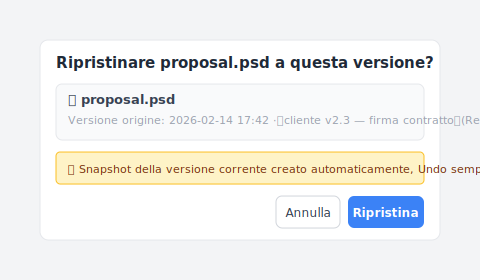

# 【2026 Gestione file】La regola 3-2-1 del backup: 20 anni dopo, basta ancora nel 2026?

> La regola 3-2-1 non è cambiata in 20 anni, ma quello che temi oggi non è più quello del 2005.

Nel 2005, il fotografo **Peter Krogh** definì la sua regola di backup: 3 copie, 2 supporti diversi, 1 fuori sede. Stava proteggendosi da nastri deteriorati, dischi rigidi caduti, incendi nelle sale server.

Vent'anni dopo, quello che tu temi è **premere ⌘+S una volta di troppo**.

La regola 3-2-1 non si è mai mossa, ma la tua vera minaccia sì.

## Punti chiave

La **regola 3-2-1 del backup** è necessaria: [tre copie, due tipi di supporto, una fuori sede](https://www.cisa.gov/audiences/small-and-medium-businesses/secure-your-business/back-up-business-data) (CISA la raccomanda ancora oggi come standard di backup). Protegge dai guasti hardware, incendi, ransomware, gli scenari di disastro. Ma fin dalla progettazione non gestisce l'**errore utente**: tu che sovrascrivi il tuo file, un collega che modifica la versione sbagliata, la sincronizzazione cloud che replica la versione errata in tutte e tre le copie. Questo articolo analizza cosa la 3-2-1 copre, cosa non copre, e cosa serve per quel livello mancante.

## Indice

1. Cos'è esattamente la regola 3-2-1?
2. Da cosa protegge la 3-2-1, e da cosa no?
3. Perché fai 3-2-1 e perdi comunque i file?
4. 3-2-1 + cronologia versioni, è possibile in un solo strumento?
5. Domande frequenti

---

## Cos'è esattamente la regola 3-2-1?

La **regola 3-2-1 del backup** significa: 3 copie dei tuoi dati, 2 tipi di supporto diversi, 1 copia conservata fuori sede. Viene da [*The DAM Book*](https://www.oreilly.com/library/view/the-dam-book/9780596008550/) del fotografo Peter Krogh (O'Reilly, 2005) e [CISA la raccomanda ancora oggi come standard di backup](https://www.cisa.gov/audiences/small-and-medium-businesses/secure-your-business/back-up-business-data):

- **3 copie** dei tuoi dati: l'originale più 2 backup
- **2 tipi di supporto**: ad es. disco locale + cloud, oppure NAS + SSD esterno
- **1 copia fuori sede**: separata fisicamente dalle altre

Nel 2005 i supporti dominanti erano nastri, CD/DVD, dischi rigidi meccanici. I tassi di guasto erano alti, i supporti invecchiavano in fretta. L'intento progettuale era chiaro: **fare in modo che nessun guasto hardware singolo, degrado del supporto o disastro nella struttura potesse cancellare i tuoi file**.

### Un esempio concreto per la PMI italiana

Come si traduce la 3-2-1 nella realtà quotidiana di uno studio professionale o di un'impresa artigianale italiana? Uno scenario tipico che vedo spesso: un geometra o uno studio di commercialisti lavora su `commessa_2026_v7.dwg` sul PC di lavoro (**copia 1 — disco locale**). Ogni sera, Windows sincronizza automaticamente la cartella su un NAS Synology in ufficio (**copia 2 — supporto NAS, diverso dal disco interno**). Una volta al giorno, il NAS fa una replica incrementale verso [Aruba Cloud](https://www.cloud.it/) o [Cubbit](https://www.cubbit.io/) — entrambi servizi cloud con data center in Italia che rispettano il GDPR e la normativa sulla residenza dei dati (**copia 3 — fuori sede, diverso dai primi due**). Il costo complessivo è nell'ordine di pochi euro al mese per lo storage cloud, con la NAS che può costare qualche centinaio di euro una tantum.

Questo setup risolve i guasti hardware e i disastri fisici. Ma se lunedì mattina il titolare sovrascrive per errore la commessa con il file sbagliato, tutte e tre le copie sincronizzano la versione errata nel giro di minuti. Ecco dove entra in gioco la cronologia versioni — il livello che la 3-2-1 non copre.

## Da cosa protegge la 3-2-1, e da cosa no?

La 3-2-1 protegge da tutto ciò che fa *sparire* un file — guasto del disco, incendio in ufficio, cifratura ransomware (secondo l'[indagine Sophos 2024](https://www.sophos.com/en-us/blog/the-state-of-ransomware-2024) su 5.000 responsabili IT in 14 paesi, nell'ultimo anno il 59% delle organizzazioni ha subito un attacco ransomware). Non protegge dal file che c'è ancora ma è sbagliato — tu che sovrascrivi la tua versione, un collega che modifica la cartella condivisa sbagliata, tu che hai bisogno della proposta di tre mesi fa. Gli scenari messi in fila:

E quella seconda categoria non è un caso limite. Nell'[indagine 2024 sulla perdita di dati di Handy Recovery](https://www.handyrecovery.com/data-loss-statistics/), circa tre proprietari di computer su quattro hanno dichiarato di aver cancellato dati importanti per sbaglio, e la cancellazione accidentale è risultata la singola causa più comune di perdita di dati — davanti al guasto hardware. La 3-2-1 tace su ognuno di quei momenti.

Per vedere dove la 3-2-1 regge, guarda come si presenta davvero "perdere un file":

| Scenario | La 3-2-1 ti salva? | Perché |
| --- | :---: | --- |
| Il disco si rompe | ✅ | 3 copie su supporti diversi |
| Incendio in ufficio | ✅ | 1 copia è fuori sede |
| Cifratura ransomware | ✅ (la copia offsite intatta) | Isolamento offsite |
| **Sovrascrivi la tua versione** | ❌ | Tutte e 3 le copie sincronizzano la nuova versione |
| **Collega modifica il file sbagliato** | ❌ | Stessa cosa |
| **Serve una versione di 3 mesi fa** | ❌ | La 3-2-1 non è cronologia versioni |

Sì, è proprio qui che si blocca. La 3-2-1 protegge da "il file è sparito". Non si occupa di "il file c'è ancora ma è sbagliato".

## Perché fai 3-2-1 e perdi comunque i file?

Ecco un punto cieco vecchio di 20 anni che nessuno nomina chiaramente: **il "3" in "3 copie" è ridondanza spaziale, non temporale.**

Nel 2005 le durate dei dischi erano brevi e i supporti fragili. Più copie combattevano il decadimento fisico. "3" era una risposta sensata.

Nel 2026 i dischi sono affidabili e la sincronizzazione cloud è istantanea. Quanto affidabili? Il [rapporto Drive Stats 2024 di Backblaze](https://www.backblaze.com/blog/backblaze-drive-stats-for-2024/), basato su oltre 300.000 dischi, registra un tasso di guasto annualizzato dell'1,57%, in calo dall'1,70% dell'anno precedente. Cosa diventa il "3"? Diventa lo stesso errore replicato in tre posti, in tempo reale.

Questo è lo scenario più comune.

A è un designer. Lunedì mattina alle 10:32, un cliente chiama chiedendo la versione della proposta firmata tre mesi fa. A apre il NAS. 12 versioni, tre copie cloud che mostrano tutte l'attuale "ultima".

Ma A non vuole l'ultima. Vuole la versione di tre mesi fa.

Ecco il peggio: si rende conto solo dopo il completamento del backup che "ultima" non è quella che gli serve. La 3-2-1 ha protetto diligentemente la versione sbagliata, tre volte.

## 3-2-1 + cronologia versioni, è possibile in un solo strumento?

Sì. [Keeply](https://keeply.work) integra la 3-2-1 nello strato di posizione:

- **Copia di lavoro locale**: la versione sul tuo computer (corrisponde alla "1 copia" di 3-2-1)
- **Posizione canonica del progetto**: il deposito canonico su NAS o cloud (conta come "2 supporti")
- **Posizione di backup**: l'intero progetto sincronizzato in un'altra posizione fisica (la "1 fuori sede")

Aggiungi la cronologia versioni — le versioni che salvi, più il salvataggio automatico opzionale ogni 15-30 min — più un meccanismo di "Release": uno snapshot che puoi marcare come "questa versione è andata al cliente" e che i salvataggi successivi non possono sovrascrivere. Uno strumento, tre livelli di protezione.

Tre mesi dopo, quando il cliente ti chiede "mandami la versione che ho approvato il 14 febbraio", basta selezionare quella versione dalla timeline e premere "Ripristina":

Prima che tu prema "Ripristina", Keeply salva automaticamente lo stato attuale come nuovo snapshot — così, anche se hai scelto la versione sbagliata, puoi tornare indietro immediatamente. Questo strato "anche il ripristino è versionato" ti evita di dover ricontrollare tre volte prima di cliccare. Qualsiasi delle tre posizioni 3-2-1 può fare da sorgente di ripristino.

Keeply non decide dove va la posizione di backup. Se tieni il computer e il backup nello stesso ufficio, un incendio prende entrambi. Nessuno strumento risolve questo. Il principio "fuori sede" rimane responsabilità tua.

Ma non hai bisogno di due strumenti separati: uno per la ridondanza spaziale e uno per la cronologia versioni. Un Keeply, dal portatile al backup, da questo secondo a settimana scorsa, tutto visibile e tutto recuperabile.

## Domande frequenti

**Q1: Cos'è la regola di backup 3-2-1?**

La regola 3-2-1 viene dal design di backup del fotografo Peter Krogh del 2005: 3 copie dei tuoi dati, 2 supporti di archiviazione diversi, 1 conservata fuori sede. L'obiettivo era far sì che nessun singolo guasto hardware, deterioramento del supporto o disastro della struttura potesse cancellare i tuoi file. È ridondanza spaziale — la stessa versione sbagliata, replicata diligentemente in 3 posti.

**Q2: Da cosa protegge la regola 3-2-1, e da cosa no?**

La 3-2-1 protegge da guasto del disco, incendio in ufficio, cifratura da ransomware — qualunque cosa faccia sparire il file. Non protegge dall'errore umano: tu che sovrascrivi la tua versione, un collega che modifica la cartella condivisa sbagliata, la sincronizzazione cloud che replica il file rovinato su tutte e tre le copie. Per quel livello ti serve la cronologia versioni (come [Keeply](https://keeply.work)).

**Q3: Perché perdi comunque dei file anche con un backup 3-2-1?**

Il «3» della 3-2-1 è ridondanza spaziale, non temporale. Nel 2005 i dischi morivano spesso, quindi più copie combattevano il deterioramento fisico. Nel 2026 la sincronizzazione cloud è istantanea — il «3» diventa lo stesso errore replicato in 3 posti in tempo reale. Non ti servono solo più copie, ti serve una cronologia versioni che ti permetta di tornare a un punto nel tempo.

**Q4: Il backup cloud conta come copia «fuori sede» nella 3-2-1?**

Sì. Ma iCloud, OneDrive e Google Drive sono sincronizzazione, non backup. Se cancelli o sovrascrivi localmente, il cloud sincronizza la stessa modifica in pochi secondi — non proteggono dall'errore utente. Il requisito fuori sede risolve solo l'isolamento fisico; la cronologia versioni è un livello a parte.

**Q5: Il NAS conta come 2 tipi di supporto?**

NAS più un disco locale possono contare come 2 supporti. Ma RAID non è un backup. RAID protegge dal guasto del disco. Non protegge dal fatto che cancelli il file sbagliato.

**Q6: Qual è la differenza tra la regola 3-2-1 e la 4-2-1-1-0?**

4-2-1-1-0 estende la 3-2-1: aggiunge un backup immutabile e zero errori di verifica. È sempre ridondanza spaziale alla base. Non risolve il problema della cronologia versioni.

**Q7: Anche i lavoratori autonomi hanno bisogno della 3-2-1?**

Dipende da quanto contano i tuoi file. Se perderli farebbe male, sì. Il criterio è «perderlo farebbe male». Non ha nulla a che fare con il fatto che tu sia individuo o azienda. Ma la 3-2-1 è necessaria, non sufficiente — gli scenari di errore utente richiedono in più la cronologia versioni.

**Q8: Keeply è già 3-2-1?**

Sì. Keeply integra la 3-2-1 nel suo strato di posizione (copia di lavoro locale + canonica + posizione di backup) e aggiunge cronologia versioni e la funzione «Release» (marca una versione come pietra miliare, così i salvataggi successivi non possono sovrascriverla). Uno strumento, tre livelli.

---

Nel 2005 Peter Krogh progettò la 3-2-1 per proteggere da dischi rigidi che cadono per terra.

Tu non sei Peter Krogh nel 2005. Hai paura di premere ⌘+S una volta di troppo.

Non hai bisogno di due strumenti, ne serve uno che gestisca tutti e tre i livelli.

---

> Sull'autore: Ting-Wei Tsao, fondatore di Keeply.
> [LinkedIn](https://www.linkedin.com/in/ting-wei-tsao-b57480152/)
