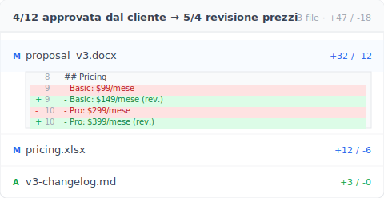

# 【2026 Gestione file】Word salva le versioni, non i ricordi di 3 mesi fa

> La cronologia versioni integrata è salvataggio a livello di archiviazione. Recuperare le versioni consegnate 3 mesi fa richiede uno strato strumentale.

Sabato sera, 23:23. Il tuo cliente ti scrive: "Puoi rimandarmi quella versione della proposta che mi avevi inviato a marzo?"

Apri la cronologia versioni di OneDrive. È rimasta solo l'ultima settimana. Word Salvataggio automatico si è cancellato quando hai chiuso il file. Hai 7 file `_v` sul portatile, nessuno corrisponde a quello che hai consegnato a marzo.

Tre mesi fa hai premuto ⌘+S su quella versione. Gli strumenti non l'hanno ricordata.

Dalle storie che gli utenti Keeply condividono, questo messaggio delle 11:23 di sera è lo scenario che sento più spesso.

## Punti chiave

La **cronologia versioni** di Microsoft Word, Salvataggio automatico e snapshot OneDrive sono tutti **meccanismi di salvataggio a livello di archiviazione**. Progettati per scenari "ho perso il documento durante una crash". La retention è breve: si cancella alla chiusura del file, fino a circa 500 versioni nella cronologia cloud. Questo è salvataggio per archiviazione, non tracciamento delle consegne. Per recuperare la versione che hai consegnato tre mesi fa, ti serve una cronologia versioni always-on indipendente a livello strumentale, più un timbro metadata al momento della consegna.

## Indice

1. Cosa fa effettivamente la cronologia versioni integrata di Word?
2. Salvataggio automatico, OneDrive, Time Machine: per quanto tempo conservano?
3. Perché questi meccanismi non arrivano a 3 mesi dopo
4. Recuperare la versione che hai consegnato 3 mesi fa
5. Domande frequenti

---

## Cosa fa effettivamente la cronologia versioni integrata di Word?

Word e l'ecosistema Office hanno tre meccanismi di "**recupero versione**" integrati:

- **Salvataggio automatico**: salva il contenuto non salvato durante una crash. Salva una versione temporanea ogni 10 minuti per impostazione predefinita. Si cancella quando il file si chiude normalmente.
- **AutoSave** (OneDrive / SharePoint Word online): scrive sul cloud mentre digiti.
- **Cronologia versioni OneDrive**: snapshot di ogni salvataggio, recuperabile per qualsiasi timestamp. La [documentazione SharePoint versioning](https://learn.microsoft.com/it-it/sharepoint/document-library-version-history-limits) di Microsoft indica 500 versioni principali di default (account Microsoft personali: 25).

L'intento progettuale è coerente: gestire "**ho avuto una crash a metà documento**" o "**ho appena salvato sopra qualcosa**". Incidenti di salvataggio a breve termine. Non sono progettati per "**il cliente chiede la versione v3 di tre mesi fa**".

## Salvataggio automatico, OneDrive, Time Machine: per quanto tempo conservano?

Per vedere se questi meccanismi reggono, guarda i numeri di retention:

| Meccanismo | Retention predefinita | Trigger di prune | Progettato per |
| --- | --- | --- | --- |
| Word Salvataggio automatico | Cancellato alla chiusura del file | Chiusura file, riavvio Word | Recupero da crash |
| OneDrive AutoSave | Scrittura in tempo reale | Sovrascrittura sync | Co-editing in tempo reale |
| Cronologia OneDrive | Circa [500 versioni](https://learn.microsoft.com/it-it/sharepoint/document-library-version-history-limits) (25 sugli account personali) | Le più vecchie cadono oltre 500 | Rollback a breve termine |
| Mac [Time Machine](https://support.apple.com/it-it/HT201250) | hourly 24h + daily 30 giorni + weekly fino a disco pieno | Disco pieno | Backup di sistema |
| Cronologia file Windows | Configurabile | Configurabile | Backup di sistema |

Esatto, è proprio il vincolo. Ogni meccanismo ha un soffitto. Dalla cancellazione alla chiusura fino a circa 500 versioni. Nessuno arriva oltre tre mesi.

Sui cantieri, ogni versione di file decide cosa viene consegnato alla fine. Non trovare la versione consegnata significa mettere alla prova il limite della memoria di un manager.

Una volta trovate entrambe le versioni, la domanda successiva è "cosa è cambiato esattamente tra le due?". Keeply le mette affiancate così non devi leggerle riga per riga:

Il contrasto rosso e verde rende il cambio di prezzo immediatamente leggibile — inoltra questo screenshot al cliente e risparmi il paragrafo di spiegazione.

## Perché questi meccanismi non arrivano a 3 mesi dopo

Ecco la distinzione che nessuno nomina chiaramente: **strato di archiviazione** vs **strato strumentale**.

La cronologia versioni integrata vive a livello di **archiviazione**. Lo scopo è "se l'ultima scrittura fallisce, fai rollback". Quindi la retention è breve. I punti di riferimento "500 versioni" o "30 giorni" si basano su "quanto spesso l'utente medio guarda indietro entro un mese". Tutto ciò che sta oltre tre mesi non è nello scopo; il pruning è intenzionale.

Marco è un commercialista. Sabato sera alle 23:23, il cliente lo chiama: la Guardia di Finanza ha richiesto la perizia estimativa allegata alla dichiarazione di marzo — quella versione specifica, non la revisione di aprile. Marco apre la cronologia OneDrive; la voce più vecchia è del 28 aprile. Salvataggio automatico era stato disabilitato da tempo. Ha 8 file `.docx` con prefisso `_v` localmente; nessuno dei timestamp corrisponde alla settimana in cui aveva compilato e inviato quella perizia tramite il portale Fattura PA.

Ecco il problema vero. Marco si rende conto solo dopo: a marzo aveva esportato un PDF firmato digitalmente per la trasmissione, non aveva conservato il `.docx` di origine. Il `.docx` originale è stato sovrascritto settimane fa con la revisione successiva. Il PDF è nella casella del cliente e nel cassetto fiscale. **Semplicemente non può tornare a quella versione del `.docx` per continuare a modificarla o per produrre una nuova perizia coerente con quella consegnata.**

## Recuperare la versione che hai consegnato 3 mesi fa

Ti servono due strati:

- **Cronologia versioni always-on**: ogni versione che salvi è preservata, mai prune. Indipendente dalla retention policy di Word o OneDrive.
- **Metadata della delivery-note**: quando esporti un file, vengono incorporati i metadata "chi, quando, quale versione sottostante". Riporta il file nello strumento tre mesi dopo, vedi l'origine completa.

[Keeply](https://keeply.work) fornisce entrambi gli strati.

Lisa usa Keeply da sei mesi. Lunedì mattina, il cliente chiede la versione di aprile di una presentazione. Trova l'allegato nella mail del cliente e trascina il `.pdf` in Keeply. Keeply mostra "**Questa è la presentazione v3 del 12-04-2026**". Hash commit `.docx` originale più tag scopo "approvato dal cliente". Clicca "vai a questa versione" e tre secondi dopo Word apre proprio quella versione del 12 aprile, pronta per essere modificata.

Detto questo, Keeply non sostituisce Salvataggio automatico. La crash a metà documento è ancora la prima linea di Salvataggio automatico. Keeply non può riscrivere la storia retroattivamente: deve essere in esecuzione al momento della consegna perché i metadata si incorporino. Per le consegne fatte prima di installare Keeply, questo articolo non aiuta. Per ogni consegna da oggi in poi, sì.

Ecco la parte che dovrebbe farti respirare.

## Domande frequenti

**Q1: Salvataggio automatico di Word è attivo per impostazione predefinita?**

Sì. Percorso: "File → Opzioni → Salva → Salva informazioni di salvataggio automatico ogni 10 minuti". Ma Salvataggio automatico si cancella alla chiusura normale del file. Non è retention a lungo termine.

**Q2: OneDrive Personal e Business conservano lo stesso numero di versioni?**

Non esattamente. OneDrive Personal predefinisce circa 500 versioni. OneDrive for Business (Microsoft 365) predefinisce anche 500 ma gli amministratori possono regolare il limite. Una volta raggiunto, la versione più vecchia viene prune.

**Q3: Time Machine è un backup o un gestore di versioni?**

Time Machine di Mac è backup a livello di sistema, non gestione versioni per file. Fa snapshot dell'intero disco, non "ogni salvataggio di proposal.docx". Recuperare un punto specifico nel tempo di un singolo file è tecnicamente possibile ma macchinoso.

**Q4: Per quanto tempo Google Docs conserva le revisioni?**

Google non pubblica un numero di retention chiaro. La loro [documentazione ufficiale](https://support.google.com/docs/answer/190843) nota che "revisioni più vecchie possono essere unite" per risparmiare spazio. In pratica, le revisioni più vecchie di tre mesi sono spesso unite o prune automaticamente.

**Q5: Keeply è nella stessa categoria di Git?**

No. Git è uno strumento di controllo versione costruito per ingegneri software — la sua interfaccia è un terminale nero, e devi imparare un vocabolario (branch, merge, commit) per usarlo. Keeply è costruito per non-ingegneri dal primo giorno: l'interfaccia è una finestra file, le parole che vedi sono "salva una versione / copia di lavoro / sincronizza alla posizione del progetto", e non c'è gergo ingegneristico. Entrambi risolvono un problema simile (conservare la storia dei file), ma il pubblico, l'interfaccia e il modello mentale sono diversi."

---

Quel messaggio delle 23:23 tornerà. Non sai quando.

Ma sai questo: il salvataggio post-evento ha limiti. La prevenzione a monte non dipende dal notare in tempo.

Per ogni consegna da oggi in poi. Puoi lasciare che lo strumento conservi quella versione per te?

---

> Sull'autore: Ting-Wei Tsao, fondatore di Keeply.
> [LinkedIn](https://www.linkedin.com/in/ting-wei-tsao-b57480152/)
