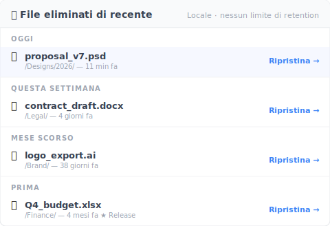

# 【2026 Gestione file】Prima di confrontare iCloud vs Dropbox: tutte e 4 le cloud condividono lo stesso strapiombo di cronologia versioni

> Spazio e prezzo sono l'asse sbagliato. La retention è dove ogni articolo di confronto smette di essere utile.

Venerdì pomeriggio, 16:23. Il cliente ti scrive: «Puoi mandarmi la versione v3 della proposta di due mesi fa? Quella prima del cambio prezzo.»

Apri Dropbox. La cronologia versioni torna indietro di 30 giorni. La versione che chiede è sepolta 60 giorni più in profondità.

Persa.

Non è un problema di una cloud sola. È un problema delle quattro cloud, di cui gli articoli di confronto non si sono mai presi la briga di parlare.

## La tabella della cronologia versioni che nessun articolo di confronto ti mostra

Spazio, condivisione, canone mensile — è dove finisce ogni articolo «iCloud vs Dropbox vs OneDrive vs Google Drive». Nessuno mette le regole di retention fianco a fianco. Eccole, in un posto solo:

| Cloud | Cronologia versioni per file generici | Forma della retention | Cap effettivo |
|---|---|---|---|
| **iCloud Drive** | ❌ Non esposta per file non Apple | Solo cartella Eliminati di recente | 30 giorni per eliminazioni; nessuna superficie cronologia versioni per PSD / Word / PDF |
| **Dropbox** | ✅ Sì | Basata sul tempo | [30 giorni (Basic / Plus / Family) / 180 giorni (Pro / Business) / 365 giorni (Enterprise)](https://help.dropbox.com/files-folders/restore-delete/version-history-overview) |
| **OneDrive** | ✅ Sì | Basata sul conteggio + finestra di eliminazione | [500 versione principale conservate](https://learn.microsoft.com/en-us/sharepoint/document-library-version-history-limits); Cestino 30 giorni personal / 93 giorni business |
| **Google Drive** (file non nativi) | ✅ Sì | Tempo + conteggio (chi scatta prima vince) | [30 giorni O 100 versioni](https://support.google.com/drive/answer/2409045), a meno che tu non clicchi «Keep forever» |

Guarda la tabella per dieci secondi. Non hanno la stessa forma. Non puoi confrontarle apple-to-apple anche volendo.

## Tre meccanismi di «retention» diversi, un solo punto cieco condiviso

Le tre cloud che espongono la cronologia versioni usano ciascuna un limite fondamentalmente diverso.

**Basata sul tempo (Dropbox)** — ti danno una finestra. 30 / 180 / 365 giorni. Fuori dalla finestra, la versione sparisce indipendentemente da quante ne hai. Un file toccato una volta due mesi fa è uguale a un file toccato cinquanta volte due mesi fa: spariscono entrambi.

**Basata sul conteggio (OneDrive)** — ti danno un numero di slot. 500 versione principale conservate. Dopo 500, la più vecchia viene eliminata per fare spazio alla nuova. Potrebbero essere 500 versioni distribuite su due anni. Oppure 500 versioni fatte in una sola settimana, con il file aperto a gennaio già sparito a febbraio.

**Ibrida (Google Drive)** — vince il limite che scatta prima. 30 giorni O 100 versioni. Un PSD modificato pian piano potrebbe perdere la cronologia al giorno 30 con solo 15 versioni. Un documento modificato intensamente potrebbe perdere la cronologia alla versione 100 in due settimane. Google offre un override «Keep forever» per versione — ma devi ricordarti di marcarla al momento del salvataggio.

**La quarta, iCloud Drive** — problema completamente diverso: **nessuna superficie di cronologia versioni per file generici**. Pages, Numbers e Keynote hanno browser di versioni nativi (Apple eredita questo dall'architettura documenti macOS). Word, PSD, PDF, qualsiasi altra cosa dentro iCloud Drive: solo l'ultima versione sincronizza. Le versioni precedenti non sono conservate. Apple non ha mai pubblicato una politica di retention chiara per i tipi di file non Apple perché non c'è una politica da pubblicare.

Il punto cieco condiviso dalle quattro: **ogni cloud ha un limite. La forma del limite differisce. Gli articoli di confronto non ti dicono nulla su quale forma si adatta al tuo lavoro.**

## Perché gli articoli di confronto non coprono la retention?

La retention è difficile da mostrare in una tabella di specifiche.

Lo spazio è un numero: GB. Il prezzo è un numero: $/mese. La UX di condivisione è uno screenshot.

La retention è un albero di condizioni: livello del piano, tipo di file, conteggio versioni, tempo trascorso, override manuali come «Keep forever». Quindi i siti di recensioni saltano. Non si adatta al formato.

Questo è il punto cieco dell'acquirente: comprare la retention cloud da un articolo di confronto è come comprare un'auto guardando solo le dimensioni del bagagliaio. Avrai un bagagliaio. Non avrai l'auto giusta.

La versione che ti serve non è prezzata nel confronto. La versione che ti serve si presenta due mesi dopo che hai già scelto.

## Lo strato di cronologia versioni che non è una feature cloud

Ecco la riformulazione: non cambi cloud per risolvere questo. La tua cloud va bene per la sincronizzazione. Il pezzo mancante è uno **strato separato** sopra di essa — cronologia versioni a livello di file, senza limite temporale: le versioni che salvi (manualmente, o tramite il salvataggio automatico opzionale ogni 15-30 min).

Concretamente:

- **Cloud (una qualsiasi delle 4)** gestisce sincronizzazione + copia offsite
- **Strato di cronologia versioni (Keeply o simile)** conserva le versioni che salvi (manuali + salvataggio automatico opzionale), nessun limite di tempo, nessun limite di conteggio, nessuna decisione «Keep forever» al momento del salvataggio

Non stai sostituendo Dropbox o iCloud. Stai aggiungendo uno strato che la cloud non era stata progettata per essere.

[Keeply](https://keeply.work) si combina con iCloud Drive, Dropbox, OneDrive, Google Drive, NAS Synology e QNAP, cartelle Finder semplici — non migri, aggiungi uno strato sopra a ciò che già c'è.

Keeply è l'implementazione di riferimento di questo strato: le versioni che salvi conservate in locale senza limite di tempo o conteggio, più un meccanismo di snapshot «Release» — marca una versione come «questa è quella che è andata al cliente» e quello snapshot sopravvive per sempre, anche dopo cinquanta salvataggi successivi. Recupero della versione di due mesi fa in circa due clic.

```
Keeply timeline — proposal.psd
────────────────────────────────
● 2026-05-12 14:23   (attuale)
● 2026-04-15 09:11   ◀ 27 giorni fa
● 2026-03-08 17:42   ◀ 65 giorni fa  ★ Release: client-signoff
● 2026-02-14 11:30
```

La marca Release sulla versione di 65 giorni fa significa che resta accessibile dopo il limite di 500 versioni di OneDrive, dopo la finestra di 30 giorni di Dropbox, dopo il conteggio di 100 versioni di Google Drive — perché Keeply non applica limite come fanno le cloud.

L'eliminazione funziona allo stesso modo. I cestini delle cloud si svuotano sul timer dei 30 giorni, ma il pannello "Eliminati di recente" di Keeply non ha quel timer — è conservato in locale:



Quel `logo_export.ai` sotto "Ultimo mese" è stato eliminato 38 giorni fa — la finestra di 30 giorni della cloud è già passata, Dropbox restituisce 410 Gone, OneDrive restituisce 410 Gone. È ancora nel pannello di Keeply, premi ripristina e torna. Il Q4 budget sotto "Prima" è una versione Release-frozen eliminata 4 mesi fa — nessuna retention cloud può salvarla, Keeply la conserva comunque.

## Quando questo articolo non basta

Questo pezzo non risolve ogni scenario di retention. Tre confini da chiarire:

**Solo recupero da eliminazione, non cronologia profonda**: Se la tua preoccupazione è «ho cancellato un file per sbaglio», il Cestino di 30 giorni di ogni cloud va bene. Non hai bisogno dello strato che questo articolo descrive.

**Archivio regolato (GDPR, SOX, HIPAA)**: La cronologia versioni non è un archivio immutabile. Se la conformità richiede «l'originale non può essere modificato», ti serve uno strumento di archivio adeguato — Veeam, Acronis o il provider certificato del tuo settore. Keeply e strumenti simili sono strati di versioni di lavoro, non sistemi di archivio.

**Workflow solo individuale cloud-native (Pages / Numbers / Sheets)**: Se il tuo lavoro vive interamente nei formati nativi Apple o nei Docs / Sheets nativi Google, la cronologia versioni integrata potrebbe bastarti. Il costo è il lock-in al tipo di file — non puoi aprire un file Pages in Word senza conversione. Vale la pena per alcuni, per altri no.

## Letture correlate

L'articolo pilastro [guida completa alla gestione versioni file](/it/post/file-version-management-complete-guide/) scompone 4 ragioni strutturali per cui il tuo strumento non è stato progettato per conservare la cronologia dei file.

[Regola 3-2-1 del backup](/it/post/3-2-1-backup-rule/) copre la metà della ridondanza spaziale — tre copie, due supporti, una fuori sede. Questo articolo è la metà della ridondanza temporale: cosa resta accessibile nel tempo.

[Cosa salva davvero Keeply? In cosa è diverso da backup e cloud](/it/post/what-keeply-saves-vs-backup-cloud/) confronta Keeply con strumenti di backup e storage cloud come tre strati diversi, non come tre prodotti in competizione.

---

L'inquadramento da articolo di confronto ti tiene in un loop: più spazio, condivisione migliore, più funzionalità. Ciò che davvero ti si rompe — la versione di 60 giorni fa — non appare mai nella scheda tecnica.

Scegli la cloud che si adatta alle tue esigenze di condivisione e prezzo. Poi aggiungi lo strato che chiude lo strapiombo.

Tra due mesi quando il cliente chiede, la risposta è «sì, ce l'ho» — non «aspetta, fammi controllare, ah, sparita».

---

> Sull'autore: Ting-Wei Tsao, fondatore di Keeply.
> [LinkedIn](https://www.linkedin.com/in/ting-wei-tsao-b57480152/)
