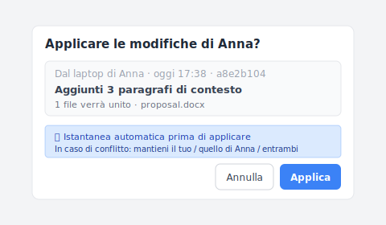
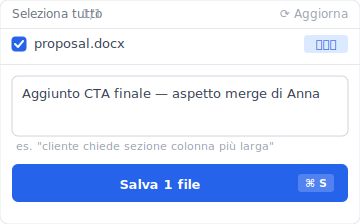
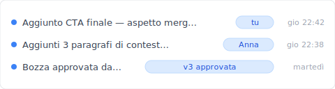

Giovedì sera, le 22:30. Tu e la tua collega Anna state entrambi modificando la stessa proposta in una cartella Dropbox condivisa. Lei ha aggiunto 3 paragrafi. Tu hai aggiunto la CTA finale nello stesso momento. Entrambi avete premuto Cmd+S. Apri la cartella la mattina dopo, c'è un file in più: `Proposta (Anna's conflicted copy 2026-05-02).docx`. Le sue modifiche non sono nelle tue. Le tue non sono nelle sue. Spendi un'ora a unirle a mano e altri 30 minuti a verificare che nulla sia andato perso.

Questo non è un bug. È il risultato di Dropbox senza un livello di rilevazione conflitti. Vediamo prima il vero mechanism dietro la copia in conflitto, poi tre design di sync che lo risolvono davvero.

## Indice

- [Quando appaiono le copie in conflitto](#when-it-happens)
- [Perché Dropbox l'ha progettato così](#why-dropbox-design)
- [Unire manualmente due file è cura del sintomo](#why-manual-merge-fails)
- [Tre design di sync che lo risolvono davvero](#three-designs)
- [Quando non è lo strumento giusto](#boundaries)

## Quando appaiono le copie in conflitto {#when-it-happens}

Apri "la copia in conflitto continua ad apparire" e trovi quattro scenari completamente diversi, ognuno la scatena:

| # | Scenario | Mechanism |
|---|---|---|
| 1 | **Due persone editano simultaneamente** | Entrambi premono Cmd+S, Dropbox non sa che il file è già stato cambiato |
| 2 | **Editing offline, poi sync** | Editi sul treno, sync su Wi-Fi, versione non corrisponde a cloud |
| 3 | **Cambio tra dispositivi** | Laptop a metà edit, passi al telefono per continuare, laptop sync dopo, collisione |
| 4 | **Ritardo sync cross-OS** | Mac vs Windows orologi sbagliati di secondi, Dropbox segna collisione |

Non è ovvio finché non ci sbatti: basta uno di questi a scatenare una copia in conflitto. **Il tuo flusso di lavoro normale probabilmente ne scatena almeno due.**

## Perché Dropbox l'ha progettato così {#why-dropbox-design}

Dropbox usa il meccanismo "l'ultimo writer vince + salva separatamente la versione precedente": due persone editano, l'upload successivo vince, la versione precedente è preservata come `(copia in conflitto)`.

Non è che la rilevazione conflitti sia tecnicamente difficile. È un trade-off commerciale:

- **Esperienza in tempo reale prima**: sync non può bloccarti. Far apparire "scegli una strategia di merge" ogni volta renderebbe Dropbox pesante.
- **Risoluzione conflitti spinta sull'utente**: salvare l'altra versione significa "te la tengo, decidi tu."
- **La scelta del progettista**: nessuno perde lavoro, ma fai tu il lavoro.

Sì, ecco la parte fastidiosa. Dropbox spinge quello che lo strumento dovrebbe fare (livello rilevazione conflitti) sulla disciplina dell'utente. E la disciplina non vince mai contro l'automazione.

Prima di creare Keeply, ci sono incappato io stesso con Dropbox centinaia di volte, e solo dopo ho capito che non era questione di essere più attenti: Dropbox è progettato così.

## Unire manualmente due file è cura del sintomo {#why-manual-merge-fails}

Il fix che Dropbox Help Center insegna: "Apri entrambi i file, confronta differenze, unisci nel principale a mano, cancella la copia in conflitto." Suona ragionevole.

Ma questo fix **non cambia il mechanism**. La prossima settimana avrai sync collision di nuovo, genererà nuova copia in conflitto, unirai a mano di nuovo. Un mese dopo l'hai fatto 4-5 volte.

Non sei scarso a unire. Stai usando uno strumento **progettato per non bloccare conflitti**. Il fix è cambiare il mechanism di sync, non allenarti a unire più velocemente.

Confrontato con i top 3 di Google (Dropbox Help / EaseUS / Wondershare): tutti guide cura-del-sintomo. Nessuno entra dall'angolo del mechanism. Questo articolo sì.

## Tre design di sync che lo risolvono davvero {#three-designs}

Tre pattern di design che sync può usare. Ognuno risolve scenari di collisione diversi:

### Design A: Rileva e chiedi (la sync ti chiede prima)

Due lati editano lo stesso file, la sync rileva la collisione e chiede all'utente: tieni A, tieni B, o unisci entrambi i cambiamenti. **Esempio**: gli strumenti di controllo versione usati dagli sviluppatori funzionano così. **Keeply** porta la stessa rilevazione negli strumenti d'ufficio — quando c'è una collisione, ti chiede in linguaggio piano ("la versione di Anna" / "la tua versione" / "combina entrambe") invece di buttarti addosso terminologia tecnica.

In pratica funziona così. Anna ha pushato una versione nel vault del progetto; Keeply apre una finestra di dialogo per farti decidere se applicare la sua modifica alla tua copia locale:

Prima che tu prema Applica, Keeply fa automaticamente uno snapshot della tua versione attuale (così anche un click sbagliato è recuperabile). Se entrambi avete modificato lo stesso paragrafo, parte un secondo prompt: tieni la tua / usa quella di Anna / tienile entrambe. **Risolve scenari #1 + #2.**

### Design B: File locking (chi apre per primo lo usa)

Apri il file, lo strumento lo blocca automaticamente. Il collega lo apre e vede "Anna sta editando", non può cambiare e deve aspettare. **Esempi**: SharePoint, Adobe Creative Cloud Files, Bentley ProjectWise (un sistema di project management usato in edilizia/ingegneria). **Risolve scenari #1 + #3 + #4**, trade-off: il collega deve aspettare.

### Design C: Copia locale + push manuale (modello Keeply)

La tua versione di lavoro vive sulla tua macchina, la sync è un push attivo che fai tu (non il mirror in tempo reale di Dropbox). Le collisioni sono rilevate al momento del push e mostrate in un'interfaccia in linguaggio piano. **Keeply** percorre questa strada: edita in locale, controlla la diff, poi pusha su NAS / SharePoint / cartella condivisa quando sei sicuro — niente sovrascritture a sorpresa.

Quando hai finito la CTA di chiusura, clicchi "Salva versione" nella finestra principale di Keeply e si apre questo dialogo:

Scrivi una riga tipo "Aggiunta CTA finale — aspetto la merge di Anna" e salvi la versione. Anna fa lo stesso dal suo lato. Entrambe le versioni atterrano separate nella timeline del vault condiviso, nessuna sovrascrive l'altra:

Due versioni affiancate, ognuna con una nota che spiega cosa è cambiato. Decidi tu come unirle — nessun filename `(conflicted copy)` silenzioso, nessuna sorpresa tre settimane dopo. **Risolve scenari #1-#4**, trade-off: non istantaneo come Dropbox.

Noterai che lo scenario #4 (disallineamento orologio cross-OS) è il più difficile, è puro problema di orologio. Design A e C possono rilevarlo, ma la risoluzione richiede ancora l'utente.

## Quando non è lo strumento giusto {#boundaries}

Keeply non risolve ogni scenario Dropbox:

- **Sync in tempo reale file grandi**: Premiere project edit-mentre-sync, il modello Local Clone di Keeply non è adatto (push richiede minuti).
- **Accesso da dispositivi mobili**: Keeply è desktop-first, l'app Dropbox sul telefono è molto più fluida.
- **Link di condivisione esterni**: Il "Share link" di Dropbox non ha equivalente Keeply.
- **Frequenza di collaborazione altissima** (multiple edit in un'ora): UX di Keeply più lenta di Dropbox, usa Google Docs co-edit per quello.

## Prima di vedere `(copia in conflitto)` la prossima volta

La prossima volta che un filename `(copia in conflitto)` appare nella tua cartella, non spenderai un'ora a unire a mano. Saprai che è un problema di mechanism, e che hai altre opzioni.

Vuoi vedere come Keeply gestisce i conflitti di sync? [Continua a leggere "Guida completa alla gestione versioni file".](/it/post/file-version-management-complete-guide/)

---

> A proposito dell'autore: Ting-Wei Tsao, fondatore di Keeply.
> [LinkedIn](https://www.linkedin.com/in/ting-wei-tsao-b57480152/)
