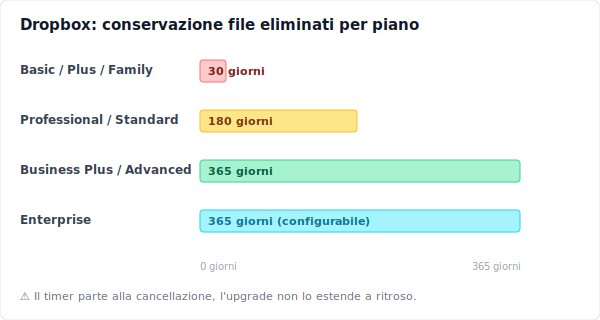
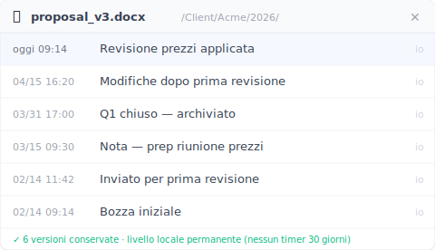
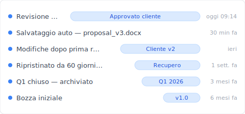

# 【2026 Gestione File】Dropbox recupera i file cancellati — fino al 31° giorno

> La finestra di 30 giorni di Dropbox salva gli errori di ieri. Non la versione che il tuo cliente ti chiederà tra 60 giorni. Cosa resta dopo il 31° giorno — e come fare in modo che non importi più.

Questa non è una guida al recupero. Sono tre persone in tre punti diversi dell'orologio dei 30 giorni di Dropbox, e cosa ciascuno di loro può ancora fare.

I loro nomi sono inventati. Le situazioni sono composite — costruite a partire dai pattern che si ripetono nelle discussioni della [Dropbox Community](https://community.dropbox.com/) sul recupero di file cancellati. Le meccaniche che scoprono lungo la strada sono reali.

## Sarah — cinque minuti fa

> **【Esempio sintetico】**Sarah è una designer freelance. Sono le 11:14 di un mercoledì. Ha appena premuto Cancella su `proposal_v3_FINAL.docx`, convinta che fosse il duplicato vecchio. Quello più recente era `proposal_v3_FINAL_FINAL.docx`. Si ferma un attimo. Aspetta — era davvero così?

Apre dropbox.com e clicca su **File eliminati** nella barra laterale a sinistra. Il suo file è lì, con il timestamp delle 11:14. Tre click: **⋯** → **Ripristina**. Fatto. Il file ricompare nel percorso originale. Il portatile lo sincronizza al volo. Il telefono si aggiorna due minuti dopo.

Il recupero di Sarah è stato facile perché lei era dentro la finestra. Sui piani Basic, Plus e Family, Dropbox conserva i file cancellati per 30 giorni. Fonte: [help.dropbox.com sul recupero di file cancellati](https://help.dropbox.com/delete-restore/recover-deleted-files-folders). Entro quei 30 giorni, il ripristino è una questione di tre click dal client web.

Quello che Sarah non si rende conto: il suo recupero è andato a buon fine nonostante tre cose fatte giuste per puro caso.

Ha usato dropbox.com, non il gestore file del suo desktop. Se `proposal_v3_FINAL.docx` fosse stato in una cartella esclusa da [Selective Sync (sincronizzazione selettiva)](https://help.dropbox.com/sync/selective-sync-overview) — l'opzione Dropbox che permette di tenere alcune cartelle fuori dalla macchina locale per risparmiare spazio su disco — la cancellazione sarebbe avvenuta lato cloud senza mai passare dal suo Cestino locale. Ci si scivola dentro tutti i giorni: si guarda prima in locale, non si vede niente, e si dà per scontato che il file non sia mai esistito.

Inoltre, ha ripristinato un file, non una versione specifica. Se Sarah avesse voluto la `proposal_v3` di tre martedì fa — non quella di oggi — le sarebbe servito il livello di cronologia versioni, che è un albero separato dalla cronologia delle cancellazioni. Il ripristino riporta indietro il file così com'era nell'istante della cancellazione. I tre salvataggi precedenti di ieri sono già incollati lì dentro.

E non aveva mai visto una copia in conflitto in quella cartella. Se ce ne fosse stata una — `proposal (Marco's conflicted copy 2026-04-15).docx`, il marker che Dropbox crea durante le [collisioni di sincronizzazione](../dropbox-conflicted-copy/) — e il suo collaboratore l'avesse eliminata pensando fosse ridondante, lei starebbe cercando il nome file sbagliato nei File eliminati.

Sarah non pensa a nessuna di queste cose. Riprende il suo file. Pranza. Il pomeriggio prosegue tranquillo.

## Marco — trentacinque giorni fa

> **【Esempio sintetico】**Marco è un consulente B2B su Dropbox Plus. Oggi un suo cliente gli ha scritto chiedendogli la proposta "di prima che cambiassimo il prezzo — circa un mese fa". Marco apre File eliminati. Vuoto. Ordina per data. Niente neanche nell'ultimo mese. Controlla la posta inviata, le bozze, il desktop. Poi gli torna in mente: cinque settimane fa aveva fatto pulizia in quella cartella. Deve aver cancellato proprio quello che gli serve adesso.

Marco apre un ticket di supporto. Quarantotto ore dopo arriva la risposta: Dropbox non può recuperare file oltre la finestra dei 30 giorni sugli account Plus. L'agente gli suggerisce di passare al piano Professional per avere d'ora in poi una finestra di 180 giorni. Marco fa l'upgrade comunque, con un filo di speranza. Controlla. Il file resta sparito.

Questa è la parte della storia sulla conservazione di Dropbox di cui il marketing non parla in apertura. La finestra di conservazione del tuo piano vale per il piano su cui eri **al momento della cancellazione**. Cancellazione su Plus = finestra di 30 giorni, indipendentemente dal piano su cui sarai una settimana dopo. L'orologio è partito al momento della cancellazione e ignora gli upgrade successivi. Resoconti di utenti che sbattono contro questo pattern compaiono ripetutamente nei [thread della Dropbox Community](https://community.dropbox.com/en/discussion/477149/can-i-recover-files-deleted-more-than-30-days-ago-if-i-upgrade-my-account).

A Marco restano tre opzioni reali.

La prima è l'escalation al supporto Dropbox. Per i clienti Business ed Enterprise, entro qualche giorno oltre la finestra, il supporto qualche volta trova un modo. Secondo la policy ufficiale di Dropbox, si tratta di valutazioni caso per caso, non di una garanzia. Marco è su Plus. Il ticket viene chiuso con cortesia.

La seconda è verificare se il file era stato sincronizzato sul suo vecchio portatile. Se una copia locale esiste ancora nella cache di sincronizzazione del sistema operativo — e se il sistema non ha già recuperato lo spazio di quella cache — potrebbe trovarne un'ombra lì dentro. Marco scava fra `~/Dropbox/.dropbox.cache/` e `~/Library/Application Support/`. Nulla di utile. La cache si era svuotata al riavvio.

La terza è quella che Marco finisce davvero per fare: riscrive la sezione sulla revisione dei prezzi a memoria e a partire dalle email mandate in quella settimana. Non è la stessa proposta. Il cliente se ne accorge. La firma slitta di tre giorni.

Qui sotto la storia della conservazione su tutti i piani Dropbox, in forma condensata:

I numeri arrivano dalle stesse pagine ufficiali: [panoramica della cronologia versioni](https://help.dropbox.com/files-folders/restore-delete/version-history-overview) e [policy di conservazione dei dati](https://help.dropbox.com/account-settings/data-retention-policy). La finestra di recupero di Marco era di 30 giorni perché il suo piano era Plus al momento della cancellazione. Nessuno degli upgrade fatti dopo cambia ciò che è successo prima.

## Linh — settantacinque giorni fa

> **【Esempio sintetico】**Linh è una dottoranda che sta scrivendo la tesi. La sua relatrice le manda un'email: "Mi piacerebbe rivedere la sezione metodologica nella versione che mi avevi inviato a metà febbraio — quella di prima che restringessimo la coorte". Erano due mesi e mezzo fa. Linh aveva cancellato quella bozza sei settimane fa, una volta finalizzato il capitolo 4. È su un piano Dropbox Family perché lo condivide con il compagno. Finestra di 30 giorni. Da un pezzo passata.

Linh ha esaurito le opzioni lato Dropbox. Quello che resta è locale.

Apre [Recuva](https://www.ccleaner.com/recuva) (gratis) sulla sua macchina Windows e scansiona l'SSD. Compaiono centinaia di frammenti di file; nessuno corrisponde alla data che le serve. Prova [Disk Drill](https://www.cleverfiles.com/) (89 USD in versione trial) per una scansione forense più profonda. Stesso risultato. Il problema non è il software. È TRIM.

TRIM è una funzione degli SSD moderni. Il sistema operativo comunica al controller dell'SSD, in anticipo, quali blocchi sono stati cancellati, e l'SSD cancella in modo proattivo quei blocchi prima delle scritture successive. [Microsoft Learn documenta l'API](https://learn.microsoft.com/en-us/windows/win32/w8cookbook/new-api-allows-apps-to-send--trim-and-unmap--hints-to-storage-media): "Gli hint TRIM informano l'unità che certi settori precedentemente allocati non sono più necessari all'applicazione e possono essere ripuliti". macOS attiva TRIM in modo predefinito sugli SSD Apple a partire da OS X 10.10.4; sugli SSD di terze parti lo si abilita con `sudo trimforce enable`. Risultato: una volta che TRIM è passato su un settore — di solito entro pochi minuti dalla cancellazione — il software di recupero non trova più nulla. La bozza della tesi di Linh era stata ripulita a livello di silicio sei settimane fa. Nessuno strumento ci arriva.

Il grafico qui sotto mostra le quattro strade che Linh ha esplorato, ordinate per esito realistico:

Tre su quattro richiedono un setup che esiste **prima** della cancellazione. La quarta — far girare Recuva o Disk Drill dopo il fatto — è la strada che tutti tentano per prima e quella che quasi mai funziona su un portatile moderno.

Linh scrive alla sua relatrice che ricostruirà la sezione metodologica a partire dai suoi appunti e dalle bozze precedenti. Ci passa un sabato che non aveva previsto di perdere.

## Perché tutti e tre sono caduti qui

Sarah, Marco e Linh avevano lavori diversi, file diversi, timestamp diversi. La cosa che avevano in comune era trattare il recupero dalle cancellazioni di Dropbox come se fosse un livello di cronologia versioni. Non lo è. È una **rete di ultima istanza**, progettata per riprendere il file che hai cancellato ieri perché hai buttato via il duplicato sbagliato.

Le reti di ultima istanza devono scadere. Lo spazio di archiviazione costa. Un cloud che conservasse ogni cancellazione per sempre o avrebbe un prezzo diverso, o metterebbe in silenzio un tetto agli account. La finestra di 30 giorni non è un bug; è il prodotto che funziona come è stato progettato. Il marketing enfatizza ciò che viene preso al volo. Non enfatizza ciò che invece sfugge.

Quello che cattura ciò che le reti di ultima istanza non catturano è un livello di cronologia versioni che vive da un'altra parte — da qualche parte che non cerca di essere un motore di sincronizzazione, non cerca di costare poco, non cerca di fare dodici cose in una. Un livello che esiste per un solo mestiere: tenere le versioni che salvi, a tempo indefinito, sul tuo disco, dove lo spazio costa poco e il tempo non è un nemico.

## Un universo parallelo

> Adesso riavvolgi. Stessa Sarah, stesso Marco, stessa Linh. Ciascuno di loro ha installato Keeply lo stesso giorno in cui ha aperto il suo Dropbox.

Sarah preme Cancella sul duplicato sbagliato. Il suo recupero è identico — Dropbox lo prende dentro i 30 giorni, tre click, fatto. Keeply girava in background; questa volta non le è servito.

Il cliente di Marco gli scrive 35 giorni dopo che la bozza con la revisione dei prezzi è sparita da Dropbox. Marco apre il pannello di cronologia file di Keeply per quella proposta. La versione di cinque settimane fa è lì, con una nota che lui stesso aveva scritto al momento: "Revisione prezzi applicata". La copia fuori. Undici secondi.

La relatrice di Linh le scrive a proposito della versione precedente al restringimento della coorte. Linh apre la timeline a livello di progetto di Keeply. Trova la voce taggata "Metodologia iniziale — coorte completa" di metà febbraio. Ripristina. Fatto. Il sabato torna ad essere suo.

Il meccanismo è lo stesso in tutti e tre i casi. Keeply gira a monte di Dropbox — ogni versione che salvi in locale viene conservata in una cronologia permanente, con il messaggio che hai scritto al momento come etichetta ricercabile. Dropbox continua a occuparsi di sincronizzazione fra dispositivi, link di condivisione, copia off-site. Niente di tutto questo cambia. Quello che cambia è che l'orologio dei 30 giorni non decide più se la versione che ti serve è ancora in giro. È sul tuo disco. È sempre lì.

**Funziona a fianco del tuo cloud esistente.** Keeply sta a monte di Dropbox, OneDrive, Google Drive, iCloud o di qualunque cartella tu sincronizzi. Non devi migrare. Non devi scegliere una parte. Il livello locale tiene la cronologia; il cloud tiene la sincronizzazione. La stessa storia per chi è già passato dalla [scogliera della cronologia versioni cloud](../cloud-version-history-cliff/).

## Cosa Keeply non fa (e cosa puoi fare oggi)

Elenco onesto di ciò che Keeply non risolve:

- **Sincronizzazione in tempo reale fra dispositivi**: è il mestiere di Dropbox, non di Keeply.
- **Accesso da mobile alle versioni storiche**: non è una funzione di Keeply; è un'app desktop.
- **Link di condivisione esterni** per inviare l'ultima versione a un cliente — ci pensa Dropbox.
- **Dashboard di amministrazione team e log di audit** — Dropbox Business.
- **Ridondanza off-site** se il disco muore — tieni Dropbox in funzione anche per questo.

Keeply non è un sostituto di Dropbox. È il livello sotto Dropbox: ogni versione che salvi in locale conservata, in modo permanente, così che l'orologio dei 30 giorni non sia quello che decide se la proposta che ti servirà fra 60 giorni sopravvive.

Se in questo momento sei oltre il 30° giorno, le tue opzioni sono quelle che ha tentato Linh; nessuna ha grandi probabilità di funzionare. La versione che puoi ancora salvare è la prossima. Il giorno giusto per installare un livello locale di cronologia versioni è quello prima di averne bisogno. Anche tra due minuti va bene.

---

**Autore**: Ting-Wei Tsao è il fondatore di [Keeply](https://keeply.work), un livello locale di cronologia versioni per chi non vuole imparare Git. [LinkedIn](https://www.linkedin.com/in/ting-wei-tsao/)
