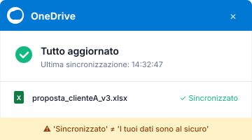
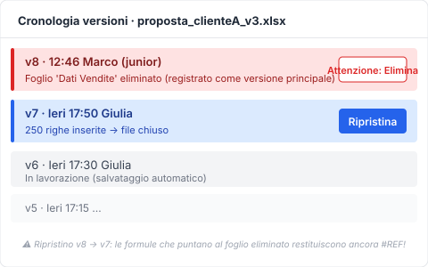
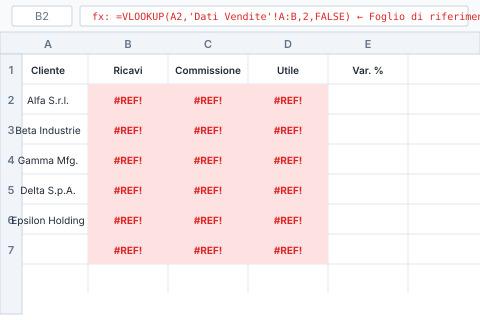
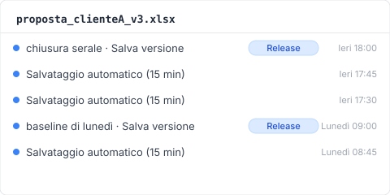
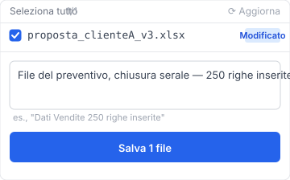

> Martedì, 14:32. Giulia, una commerciale (**caso composito**), apre `proposta_clienteA_v3.xlsx` da OneDrive, il file su cui lavora da lunedì. Mancano 19 ore e 28 minuti alla presentazione dal cliente di domani alle 10. Nell'istante in cui il file si apre, lo schermo si blocca. Il foglio "Dati Vendite" è vuoto. Le schede ci sono ancora, le intestazioni di colonna dalla A alla AZ ci sono ancora, i numeri di riga da 1 a 250 ci sono ancora. Ma ogni cella è bianca. Nel foglio collegato "Preventivi" la colonna dei totali è tutta `#REF!` fino in fondo. L'indicatore di sincronizzazione di OneDrive è una spunta verde. Excel mostra nella barra in alto "Un'altra persona sta modificando il file". Marco, il junior del team, aveva aperto il file durante la pausa pranzo.

Cerca "recupero dati Excel" e ti ritrovi davanti un muro di pubblicità di software di recupero. EaseUS, 4DDiG, Recoverit, iMyFone: tutti basati sulla scansione dei settori dell'SSD per un recupero a livello di disco. Ma quello che è successo davvero non era un problema di disco. Un collega ha cancellato un foglio durante l'editing collaborativo, e quella cancellazione è stata spinta nel cloud. Questo è il resoconto che ho ricostruito, ripercorrendo un incidente di questo tipo minuto per minuto.

## Cosa compare sullo schermo quando l'editing collaborativo divora il tuo foglio

14:32:17, Giulia apre `proposta_clienteA_v3.xlsx`. Excel si carica. Clicca sul foglio "Dati Vendite". Caricamento per 0,4 secondi, poi tutto bianco. Schede presenti, intestazioni di colonna dalla A alla AZ presenti, numeri di riga da 1 a 250 presenti. Ogni cella vuota. Nella barra in alto Excel mostra "Un'altra persona sta modificando il file", con accanto l'avatar di Marco. 15 secondi prima, Marco stava ancora modificando il file. Quello che Giulia stava vedendo era lo stato cloud della sessione di Marco delle 14:32, durante la pausa pranzo.

Cosa è successo davvero:

- **Ieri 17:50** — Giulia inserisce 250 righe di dati cliente in "Dati Vendite" e chiude il file.
- **Oggi 12:31** — Marco (il junior) apre il file (Giulia gli aveva scritto della "presentazione di domani").
- **Oggi 12:46** — Marco fa clic destro sulla scheda "Dati Vendite" e sceglie "Elimina foglio" (clic sbagliato; dirà poi "credevo di eliminare il foglio di prova").
- **Oggi 12:46:03** — Excel spinge la modifica su SharePoint, la cancellazione viene riflessa nel cloud come versione principale v8, il Salvataggio automatico la tratta come "normale modifica".
- **Oggi 12:46–14:32** — Per 1 ora e 46 minuti, il file esiste nel cloud nello stato "foglio Dati Vendite, sparito".
- **Oggi 14:32** — Giulia apre il file; lo stato cloud (foglio eliminato) viene applicato.

Perché Excel non l'ha avvertita? La co-creazione di Office 365 applica una logica in cui vince l'ultimo che salva per le eliminazioni a livello di foglio ([Microsoft Learn: Co-authoring in Office](https://learn.microsoft.com/en-us/office365/servicedescriptions/office-online-service-description/sharing-and-collaboration)). L'eliminazione di un foglio conta come "normale modifica"; nessuna finestra di conferma.

Ma questo è solo il sintomo in superficie.

## Perché l'indicatore di sincronizzazione di OneDrive è rimasto verde

14:32:47, Giulia prova a capirci qualcosa e la prima cosa che guarda è l'icona di OneDrive. Spunta verde. Tutto sincronizzato, nessun errore. Davvero?

La spunta di sincronizzazione di OneDrive significa "il tuo file locale corrisponde a quello nel cloud". Non significa "i tuoi dati sono intatti". Marco ha eliminato il foglio alle 12:46:03, la cancellazione è stata spinta nel cloud, il PC di Giulia (in ufficio, acceso solo nel pomeriggio) era in attesa di sincronizzazione. Nell'istante in cui Giulia apre il file alle 14:32, la sincronizzazione di OneDrive scarica lo stato cloud e sovrascrive il file locale con la versione "foglio eliminato". Spunta verde: operazione riuscita.

"Sincronizzato" non equivale a "il tuo lavoro è al sicuro". In un contesto di editing collaborativo, si sincronizzano anche le cancellazioni degli altri.

## Perché il ripristino dalla cronologia versioni di SharePoint lascia comunque `#REF!`

14:37, Giulia apre OneDrive nel browser, fa clic destro sul file e sceglie "Cronologia versioni". Compare l'elenco: v8 (12:46, Marco) / v7 (ieri 17:50, Giulia) / v6 (ieri 17:30, Giulia)...

Clicca su "Ripristina v7".

Pochi secondi. Il file viene riscaricato. Controlla "Dati Vendite": le 250 righe sono tornate. Sollievo.

Poi controlla "Preventivi". Tutto `#REF!`. Il motivo: la v7 ha ripristinato l'intera cartella di lavoro, ma nel momento temporale della v7 le formule del foglio "Preventivi" facevano riferimento alle celle di "Dati Vendite" così com'erano nella v6. Le formule che puntano al foglio eliminato dalla v8 restituiscono `#REF!` anche dopo aver ripristinato la v7. La cronologia versioni di SharePoint è un'istantanea a livello di cartella di lavoro, non un confronto foglio per foglio ([SharePoint version history limits](https://learn.microsoft.com/en-us/sharepoint/document-library-version-history-limits)). Registra l'"eliminazione del foglio" come evento di versione principale, ma non annulla i danni a cascata che la cancellazione del foglio provoca sulle formule.

**Passaggi di riparazione manuale delle formule a cascata dopo il ripristino**:

1. Apri il foglio "Preventivi" ripristinato (vedrai `#REF!` su molte celle)
2. Nella barra della formula, individua i riferimenti di cella originali che puntavano a "Dati Vendite"
3. Riscrivi uno per uno ogni riferimento al nuovo indirizzo di cella
4. Se il foglio ha troppe formule, usa CERCA.VERT / CERCA.X per la sostituzione in blocco

Tempo perso finora: 3 ore e 28 minuti. Mancano 15 ore e 60 minuti alla presentazione di domani.

## Perché chiudere Excel disabilita Ctrl+Z (la pila di annullamento per sessione)

15:32, Giulia si arrende e chiude Excel. Lo riapre pensando "lasciami provare a ripristinare un'altra versione".

Si accorge: Ctrl+Z non funziona. "Annulla" è in grigio. La pila di annullamento di Excel è per sessione: chiudi il file e l'intera cronologia di annullamento (le tue azioni e la traccia visibile delle azioni del tuo collaboratore) si azzera. La sessione di editing che avrebbe potuto annullare l'eliminazione del foglio da parte di Marco è scomparsa alle 14:46, quando il file è stato chiuso.

La pila di annullamento vive in memoria come struttura per sessione, non viene mai resa permanente su file o nel cloud. È una specifica valida per tutta la suite Microsoft Office.

## Perché Time Machine non può salvare la versione del foglio di ieri

La mattina dopo alle 9, Giulia si ricorda che "il Mac aziendale ha Time Machine" e scrive all'IT. 30 minuti dopo: "Istantanee Time Machine, sì, ogni ora, in automatico".

Apre l'istantanea delle 15 di ieri. Apre "Dati Vendite". Vuoto.

Perché? Time Machine fa un'istantanea dello stato del file locale nella cartella di sincronizzazione di OneDrive ([Apple Support: esegui il backup dei file con Time Machine sul Mac](https://support.apple.com/it-it/104984)). Alle 14:32 OneDrive aveva già sovrascritto il file locale con lo stato "foglio eliminato". L'istantanea Time Machine delle 15 ha catturato ciò che a quel punto era su disco: l'edizione locale del file già contaminata dallo stato cloud. Time Machine ha registrato "l'ultima versione scesa dal cloud", non la cronologia di editing locale.

Sono passate 4 ore dall'incidente. Giulia non ha recuperato nulla.

## Come recuperare i dati persi nell'editing collaborativo con Keeply

Se, in una linea temporale parallela, Keeply fosse stato sul PC di Giulia, cosa sarebbe successo alle 14:32?

Keeply conserva istantanee indipendenti in un archivio locale: percorso separato da OneDrive, spazio di archiviazione separato. Keeply non sa nulla della co-creazione di Office 365; proprio perché non lo sa, la cancellazione di Marco non si propaga nell'archivio di Keeply.

Nella configurazione di Giulia, Keeply esegue il salvataggio automatico ogni 15 minuti in background. Subito dopo che Giulia ha chiuso il file ieri alle 17:50, l'ultimo salvataggio automatico di Keeply alle 18:00 ha catturato: "Dati Vendite" con 250 righe, formule di "Preventivi" tutte intatte. Oggi alle 12:46 la cancellazione di Marco è avvenuta sul lato cloud; il PC d'ufficio di Giulia era spento, Keeply non ha fatto nulla. Alle 14:32 Giulia accende il PC, la sincronizzazione di OneDrive scarica lo stato cloud, ma l'archivio di Keeply vive su un percorso separato da OneDrive, intatto.

14:33, Giulia apre Keeply:

1. Nella cronologia a sinistra, clicca sul salvataggio automatico delle 18:00 di ieri di `proposta_clienteA_v3.xlsx`
2. Clicca su "Ripristina questa versione"
3. Keeply produce un nuovo nome file (`proposta_clienteA_v3_RIPRISTINATO.xlsx`)

Apre il file: "Dati Vendite" 250 righe ✅, formule di "Preventivi" ✅. Giulia scrive a Marco: "Quello su cui stavi facendo prove, rifallo a partire da questo nuovo file. Questo è quello buono". 30 secondi.

Keeply esegue il salvataggio automatico in background (scegli tu l'intervallo: ogni 15, 30 o 60 minuti, 30 di default; il computer di Giulia è impostato su 15) + puoi premere tu stesso "Salva versione" nei momenti importanti + ogni istantanea vive nel proprio archivio senza sovrascrivere le altre. L'intero flusso non passa mai vicino alla co-creazione o alla sincronizzazione cloud: è un mondo parallelo sul tuo disco locale.

## Tre perdite da editing collaborativo che nemmeno Keeply può recuperare

Keeply non fa miracoli. In un ambiente di editing collaborativo, ecco tre situazioni che nemmeno Keeply può salvare.

1. **Il file vive su un'unità di rete condivisa, senza copia locale sul PC di Giulia.** Keeply sorveglia solo i file locali: non vede cosa fanno gli altri su un'unità condivisa. Le unità condivise richiedono un archivio Keeply mirror separato, gestito dal team.
2. **Marco accede direttamente al PC di Giulia (per esempio via desktop remoto) ed elimina il file.** Ora la cancellazione è un evento locale che Keeply registra. Il ripristino dall'archivio di Keeply funziona, ma in quel momento il ripristino spinge anche nel cloud, e la sincronizzazione remota si complica.
3. **L'ora dell'incidente cade fuori dal punto ottimale di salvataggio automatico di Keeply.** Per esempio: salvataggio programmato alle 14:30, incidente alle 14:32, l'istantanea delle 14:31 è troppo vecchia, oppure il salvataggio delle 14:15 aveva già catturato il foglio "Dati Vendite" mezzo vuoto. Premere "Salva versione" manualmente nei momenti importanti chiude questo punto cieco.

Il resoconto forense finisce qui. Prevenire un incidente del genere la prossima volta è un altro discorso.

---

**Autore**: [Ting-Wei Tsao](https://www.linkedin.com/in/ting-wei-tsao-b57480152), fondatore di Keeply. Sto costruendo il tuo guardiano per la gestione dei file.

## FAQ {#faq}

**D. Come colma Keeply il vuoto quando l'editing collaborativo cancella i tuoi dati?**

R. Tenendo l'archivio locale separato da OneDrive, così le modifiche sul lato cloud non toccano direttamente il tuo spazio di archiviazione locale. Keeply esegue il salvataggio automatico in background (intervallo di 15, 30 o 60 minuti, a tua scelta) + puoi premere "Salva versione" manualmente nei momenti importanti + ogni istantanea è conservata nel proprio archivio senza sovrascrivere le altre. Quando un collega elimina un foglio sul lato cloud, quella cancellazione non raggiunge l'archivio di Keeply. Quando capita un incidente, apri Keeply, scegli la versione precedente, premi "Ripristina questa versione": 30 secondi. I quattro strati visti sopra (sincronizzazione OneDrive / cronologia versioni SharePoint / Time Machine / software di recupero) dipendono tutti dallo stato cloud per il salvataggio a posteriori e sono particolarmente deboli contro i conflitti da editing collaborativo. Keeply è uno strato di difesa preventiva disaccoppiato dallo stato cloud.

**D. Come recupero i dati Excel persi?**

R. Dipende. Per una sovrascrittura Ctrl+S di un singolo utente, usa la cronologia versioni di SharePoint (se le versioni principali ci sono ancora) o il pulsante Cronologia versioni integrato in Excel. Per dati eliminati da qualcun altro durante l'editing collaborativo, puoi ripristinare a livello di cartella di lavoro di SharePoint, ma le formule a cascata vanno ricostruite a mano. Per i file solo locali con la Copia shadow di Windows disattivata, è praticamente irrecuperabile.

**D. Posso recuperare un foglio eliminato per errore da un collega durante l'editing collaborativo?**

R. La cronologia versioni di SharePoint può ripristinare a livello di cartella di lavoro, a patto che il pacchetto precedente alla cancellazione sia stato registrato come versione principale. Con il Salvataggio automatico che scrive di continuo, gli stati intermedi non vengono sempre registrati singolarmente. Gli altri fogli con formule a cascata che puntano al foglio eliminato mostreranno comunque `#REF!` dopo il ripristino della v7: vanno ricostruiti a mano. Se prima dell'incidente avevi predisposto uno strato di istantanee locali (come Keeply), potresti ripristinare dall'originale non toccato dalla cancellazione lato cloud.

**D. Posso recuperare un file Excel chiuso senza salvare?**

R. Il Salvataggio automatico di ripristino (intervallo predefinito di 10 minuti) può conservare "lo stato più recente non salvato". Apri Excel e guarda in File → Informazioni → Gestisci cartella di lavoro → Cartelle di lavoro non salvate. Ma i file temporanei del ripristino automatico vengono cancellati nell'istante in cui il file si chiude normalmente: chiudi senza controllare e sono spariti. Keeply gira in background indipendentemente dal fatto che tu salvi o no, quindi anche dopo una chiusura senza salvataggio l'archivio conserva comunque uno stato recente.

**D. Un software di recupero può recuperare i dati a livello di cella?**

R. Quasi mai. Il software di recupero lavora a livello di settore del disco per salvare "i byte appena cancellati", presupponendo che tu stia cercando di riportare indietro un intero file eliminato. Per un file ancora vivo con i dati delle celle svaniti (cancellazione collaborativa o cascata di `#REF!`), il software di recupero non è strutturalmente attrezzato. E su SSD + TRIM, anche il recupero a livello di settore ha una percentuale di successo inferiore al 5% ([NIST SP 800-88r1: Guidelines for Media Sanitization](https://nvlpubs.nist.gov/nistpubs/SpecialPublications/NIST.SP.800-88r1.pdf)). La perdita di dati da editing collaborativo è qualcosa che il software di recupero non può risolvere per come è progettato: la tua unica opzione è uno strato di istantanee locali predisposto in anticipo.

## Articoli correlati

- 📚 Pilastro: [Gestione delle versioni dei file: la guida completa al perché la maggior parte degli strumenti non ci riesce](/it/post/file-version-management-complete-guide/)
- 📊 Stesso tema: [Perché il pulsante Cronologia versioni di Excel è in grigio: 4 condizioni che non soddisfi](/it/post/excel-version-history-limits/)
- 🔄 Stesso tema: [Copia in conflitto di Dropbox: 4 scenari che la innescano](/it/post/dropbox-conflicted-copy/)

## Fonti

1. [Microsoft Learn: Co-authoring in Office](https://learn.microsoft.com/en-us/office365/servicedescriptions/office-online-service-description/sharing-and-collaboration)
2. [SharePoint version history limits: Microsoft Learn](https://learn.microsoft.com/en-us/sharepoint/document-library-version-history-limits)
3. [Apple Support: Back up your files with Time Machine on Mac](https://support.apple.com/en-us/104984)
4. [NIST SP 800-88r1: Guidelines for Media Sanitization (SSD TRIM behavior)](https://nvlpubs.nist.gov/nistpubs/SpecialPublications/NIST.SP.800-88r1.pdf)
