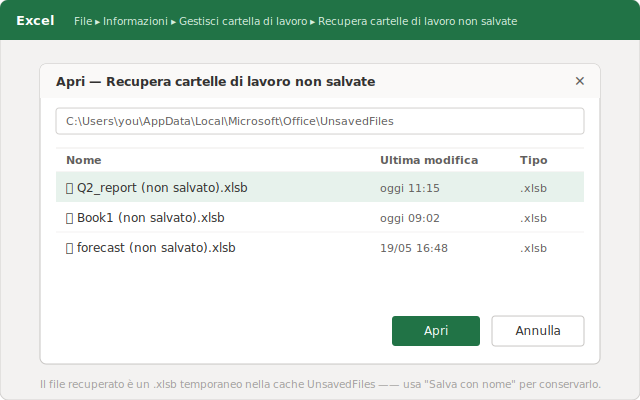
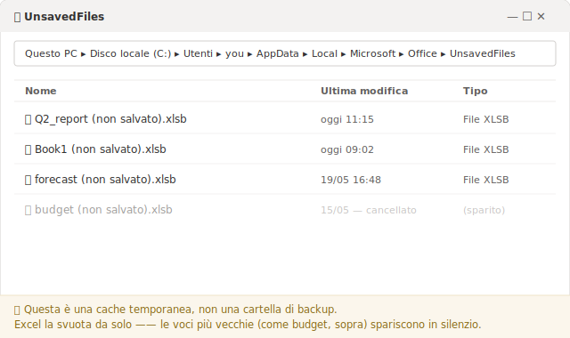
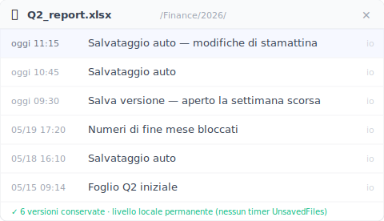

# 【2026 Gestione file】Recuperare un file Excel non salvato, e perché quello appena salvato può sparire di nuovo

*"Recupera cartelle di lavoro non salvate" ripesca un file mai salvato da una cache nascosta, `UnsavedFiles`, dove vive come `.xlsb` temporaneo che Excel cancella secondo un suo calendario. Per questo un file appena recuperato può non esserci più dopo qualche giorno. La soluzione non è recuperare più in fretta: è uno strato di versioni che in quella cache non ci sta proprio.*

Martedì hai recuperato il foglio non salvato e hai tirato il fiato. Nel weekend non c'era più. Excel non l'ha perso: quella cache di recupero ha sempre avuto un timer.

Se hai appena chiuso Excel senza salvare e ti si è stretto lo stomaco, parti da qui. Il recupero è reale e richiede una trentina di secondi. Però conviene sapere *dove* vive davvero il file che stai per recuperare, perché è lo stesso motivo per cui può sparire di nuovo.

## Riportalo indietro adesso: Recupera cartelle di lavoro non salvate {#h2-1}

Fai prima questo, prima di toccare qualunque altra cosa:

- **File → Informazioni → Gestisci cartella di lavoro → Recupera cartelle di lavoro non salvate.** (Oppure **File → Apri → Recupera cartelle di lavoro non salvate**, il pulsante in fondo all'elenco dei file recenti.)
- Si apre una cartella. Vedrai file con nomi criptici che finiscono in `.xlsb`: sono le tue cartelle di lavoro non salvate.
- Apri quella con la data e l'ora giuste, poi **Salva con nome** subito, dandole un nome e una posizione veri.

Quell'elenco di `.xlsb` non arriva da una procedura guidata di recupero. Excel sta leggendo una cartella sul tuo disco: `%LocalAppData%\Microsoft\Office\UnsavedFiles`. È lì che Excel mette di nascosto una copia del lavoro che non hai mai salvato, così ha qualcosa da restituirti quando chiudi senza salvare o quando va in crash.

Hai ritrovato il file? Bene. Adesso la parte che nessuno ti dice.

## Perché il file appena salvato può non esserci più nel weekend {#h2-2}

La cartella `UnsavedFiles` è un'area di transito, non una cassaforte. La gestisce Excel per te, il che vuol dire che Excel la svuota anche per te, secondo un suo calendario, senza chiedere.

**Microsoft non pubblica una durata di conservazione fissa**; questa cache viene svuotata automaticamente e molti riferiscono che sparisce entro pochi giorni o dopo un riavvio. Il famoso "quattro giorni" che gira in rete non è qualcosa che Microsoft documenta. [La guida ufficiale](https://support.microsoft.com/it-it/office/recuperare-una-versione-precedente-di-un-file-di-office-169cb166-e7e2-438e-8f39-9a8927828121) ti mostra come aprire Recupera cartelle di lavoro non salvate, e si ferma lì. Non promette mai che domani il file ci sarà ancora.

Quindi "l'ho recuperato" e "l'ho conservato" sono due eventi diversi. Se hai aperto la cartella di lavoro recuperata, le hai dato un'occhiata e l'hai richiusa senza fare **Salva con nome** in una cartella vera, non l'hai salvata: hai solo guardato una copia temporanea che ha ancora il suo timer acceso. Torna venerdì e potrebbe non esserci più, e stavolta nella cartella non ci sarà niente da recuperare.

Il passo del recupero risolve i prossimi dieci minuti. Non risolve la settimana prossima.

## Due disastri "non salvato" diversi che Excel tratta con una sola cache {#h2-3}

Quello che inganna è che "ho perso il file Excel non salvato" sono in realtà due problemi diversi che usano le stesse parole, ed Excel li fa passare entrambi dalla stessa porta, Recupera cartelle di lavoro non salvate.

**Problema A. Non l'hai mai salvato nemmeno una volta.** Cartella di lavoro nuova di zecca, tre ore di formule, poi un crash o un "Non salvare" finito lì per sbaglio. Sul disco non c'è mai stato un file vero, quindi la cache `UnsavedFiles` è davvero la tua opportunità migliore, e l'unica. È esattamente il suo compito, e il passo qui sopra di solito te lo riporta indietro.

**Problema B. L'avevi già salvato, poi hai perso le modifiche fatte dopo.** È il report di fine mese che hai aperto cento volte. Ci hai lavorato tutta la mattina, non hai salvato, l'hai chiuso. Il file esiste ancora: sono solo le *ultime ore* a essere sparite. Qui la cache spesso non ha niente di utile, perché Excel teneva traccia delle tue modifiche come sessione recuperabile, non come versione permanente del file.

> Hai lavorato al report di fine mese tutta la mattina senza salvare, l'hai chiuso alle 12:40 di corsa per la riunione. Il file è ancora lì sul disco, intatto. Ma le tre ore di stamattina no.

Il Problema B ha qualche parente, e la cache non ne raggiunge nessuno: hai aperto il file su un **computer diverso**, dove quella cache locale non esiste; oppure il Salvataggio automatico di OneDrive ha sovrascritto in silenzio la copia sincronizzata (una trappola a sé, con una sua soluzione: vedi [quando i dati di un Excel co-modificato spariscono](/it/post/excel-data-vanished-postmortem/)). Superficie diversa, stessa radice: ciò che doveva salvarti era temporaneo, locale, o tutti e due.

Una cache costruita per sopravvivere a un crash non è mai stata costruita per essere la storia del tuo file.

## Lo strato che non vive in una cache temporanea {#h2-4}

Per il Problema B la risposta non è un modo più rapido di frugare in `UnsavedFiles`. È avere la storia del file da qualche parte che Excel non possa spazzare via: uno strato di versioni che sorveglia la cartella dove i tuoi fogli vivono davvero e ne conserva copie con data e ora man mano che procedi, non in un buffer che Excel ricicla.

È il buco per cui è nato [Keeply](https://keeply.work). Lo punti sulla cartella dove vivono i tuoi fogli e tiene una versione in background, secondo un intervallo che imposti tu. Ogni 15, 30 o 60 minuti, 30 di default. Più un pulsante manuale **Salva versione**, con una nota per segnare una tappa. Quando le modifiche di stamattina sono sparite, non vai a pescare in una cache che potrebbe essersi già svuotata: apri la cronologia del file e scegli la versione delle 11:15.

La cache `UnsavedFiles` è la rete di sicurezza a breve termine di Excel per i file in lavorazione. Una cronologia di versioni è la memoria a lungo termine del file. Una scade. L'altra no. Se vuoi il quadro completo di come questi strati si incastrano e dove ciascuno si ferma, [la guida completa alla gestione delle versioni dei file](/it/post/file-version-management-complete-guide/) lo spiega passo per passo.

## Dove uno strato di versioni comunque non può salvarti {#h2-5}

Sarebbe disonesto far finta che copra tutto, quindi ecco dove non arriva:

- **Una cartella di lavoro nuova di zecca mai salvata in una cartella monitorata.** Se il file non è mai stato scritto nella cartella sorvegliata, non c'è nessuna versione da tenere: resta un compito della cache `UnsavedFiles` di Excel (Problema A), e resta sul suo timer breve.
- **Corruzione silenziosa.** Se un file si rovina senza dare segnali e una versione apparentemente pulita viene salvata sopra una buona, una cronologia conserva fedelmente anche la copia rotta.
- **File che vivono fuori dalla cartella monitorata.** Uno strato di versioni conosce solo le cartelle su cui lo punti. Il foglio su una chiavetta USB che non hai mai aggiunto non è coperto.

Una cronologia di versioni risolve "ce l'avevo e ho perso le modifiche". Non fa comparire dal nulla un file che non è mai stato salvato da nessuna parte.

## Quando bastano gli strumenti integrati di Excel {#h2-6}

Non serve sempre un altro strato. Salta tutto questo quando:

- È un calcolo usa-e-getta che rifaresti volentieri.
- **I tuoi file vivono in OneDrive o SharePoint con il Salvataggio automatico attivo.** Copre parecchio: la cronologia versioni nel cloud intercetta la maggior parte delle sovrascritture mentre lavori. Sappi solo cosa non fa: è legata alla copia sincronizzata, la cronologia conservata ha un limite, e il Salvataggio automatico sovrascrive man mano invece di chiederti prima. Se hai letto questi limiti e non ti toccano, un altro strato non ti serve.
- Perdere il lavoro di una mattina è una seccatura che puoi assorbire, non una scadenza che salteresti.

Se è il tuo caso, impara la strada di Recupera cartelle di lavoro non salvate, salva presto così che un file esista, e vai avanti con la giornata. Lo strato in più si guadagna il suo posto solo quando il lavoro in quel foglio è di quelli che non puoi ricostruire a cuor leggero.

## Domande frequenti {#faq}

**Avevo già salvato il file Excel, ci ho lavorato tutta la mattina senza salvare, poi l'ho chiuso. Posso riavere la mattinata?**

Spesso non dalla cache di Excel. Recupera cartelle di lavoro non salvate è pensato per i file che non hai mai salvato; una volta che un file è stato salvato, le modifiche non salvate della sessione non vengono conservate lì in modo affidabile. Riavere "le ultime ore di un file esistente" è il compito di uno strato di versioni permanente (come Keeply): tiene versioni del file stesso con data e ora, così apri la sua cronologia e scegli la copia di tarda mattina.

**Per quanto tempo Excel conserva i file non salvati?**

Microsoft non pubblica una durata di conservazione fissa. Le copie non salvate stanno in una cache temporanea che Excel svuota da solo: molti riferiscono che spariscono entro pochi giorni, dopo un riavvio, o quando si accumulano voci più recenti. Tratta un file recuperato come temporaneo finché non fai Salva con nome in una cartella vera.

**Dove vengono salvati i file Excel non salvati?**

Nella cache UnsavedFiles di Excel, in %LocalAppData%\Microsoft\Office\UnsavedFiles, come file che finiscono in .xlsb. Ci arrivi da File → Informazioni → Gestisci cartella di lavoro → Recupera cartelle di lavoro non salvate.

**Ho recuperato il file ma è sparito dopo qualche giorno. Perché?**

Perché Recupera cartelle di lavoro non salvate legge una cache temporanea, non una copia permanente. Se hai aperto il file recuperato senza fare Salva con nome in una posizione vera, è rimasto nella cache ed è stato cancellato dopo. Fai sempre Salva con nome subito dopo il recupero.

**Attivare il Salvataggio automatico risolve il problema?**

Il Salvataggio automatico (OneDrive/SharePoint) aiuta per i file nel cloud, ma sovrascrive man mano e la sua cronologia versioni ha limiti propri. Non copre i file che tieni in locale, e non è la stessa cosa di una cronologia di versioni del file consultabile e conservata nel tempo.

## Letture correlate {#related}
- [La guida completa alla gestione delle versioni dei file](/it/post/file-version-management-complete-guide/) (pilastro)
- [Recuperare un documento Word non salvato. E i 5 casi in cui il ripristino automatico non aiuta](/it/post/word-unsaved-recovery/)
- [Cronologia versioni di Excel: i limiti Microsoft che nessuno cita](/it/post/excel-version-history-limits/)
- [Quando i dati di un Excel co-modificato spariscono](/it/post/excel-data-vanished-postmortem/)

---
*Di Ting-Wei Tsao, fondatore di Keeply ,  [LinkedIn](https://www.linkedin.com/in/ting-wei-tsao-b57480152)*
