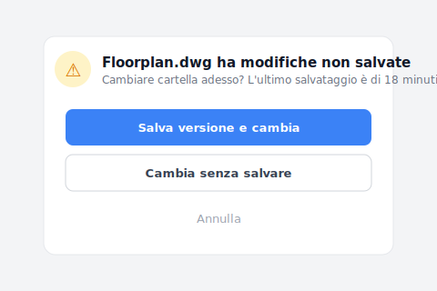

# 【2026 Gestione file】Gestione versioni dei file in cartelle condivise: non lasciare che _v8 rubi 83 ore l'anno al tuo team

> Giovedì, 17:30. Hai finito la planimetria, ma la tua mano resta sospesa sul nome del file. Il costo delle cartelle condivise + nomi manuali v1/v7/FINAL: 83 ore di tassa difensiva all'anno. Perché le regole di denominazione collassano sempre, e cosa fa al loro posto il controllo automatico delle versioni.

Giovedì, 17:30. L'ufficio si fa via via più silenzioso. In realtà hai già finito la planimetria del cortile interno; potresti uscire in orario per una cena come si deve. Ma la tua mano è ferma sopra il mouse, fissi la cartella sullo schermo.

Dentro ci sono `Planimetria_v6.dwg`, `Planimetria_v7_Cliente.dwg`, e una `Planimetria_v7_FINALE_non_toccare.dwg`.

Inspiri profondamente, fai clic destro sul file appena salvato, e con cura lo rinomini `Planimetria_v8_per_revisione_0423.dwg`. Poi apri WhatsApp e scrivi al collega di fronte: "Senti… ho appena salvato la v8. Se modifichi i prospetti prendi questa, non sovrascrivere la mia."

Non stai salvando un file, stai comprando un'assicurazione. E il costo di quell'assicurazione è la tua concentrazione e le tue ore serali, consumate poco a poco ogni giorno.

## Indice

- [La fattura invisibile, pagata in ansia](#anxious-bill)
- [Perché le regole di denominazione delle cartelle condivise crollano sempre](#naming-failure)
- [Controllo automatico delle versioni nelle cartelle condivise: fa sparire _v8](#auto-versioning)
- [Stai progettando, o facendo la guardia ai file?](#designer-or-guard)

---

## La fattura invisibile, pagata in ansia {#anxious-bill}

Secondo lo studio Asana《[Anatomy of Work](https://asana.com/resources/why-work-about-work-is-bad)》, i knowledge worker passano 83 ore all'anno in "lavoro sul lavoro" (work about work): confermare, riconfermare, inseguire l'avanzamento, cercare l'ultima versione. Ma 83 ore è solo un numero freddo, non descrive la sensazione.

Il vero costo è quel **micro-panico persistente**.

È quando hai mandato i disegni all'impresa edile e all'improvviso ti corre un brivido lungo la schiena. Riapri la cartella di corsa per controllare: "Aspetta, ho mandato il `v7_FINALE` o il `v7_definitivo_davvero`?". È quando il capo ti chiede "è questa l'ultima versione?", e tu non riesci ad annuire subito; dici "fammi controllare" e parte un gioco a indovinelli tra i suffissi.

Non è un problema di gestione. Non è il tuo team che è pigro. È che gli strumenti che usate scaricano la responsabilità di proteggere il vostro lavoro sulla vostra memoria fragile.

---

## Perché le regole di denominazione delle cartelle condivise crollano sempre {#naming-failure}

Ogni volta che il disegno di qualcuno viene sovrascritto, l'azienda lancia un'"iniziativa di riordino cartelle" che pretende che tutti seguano alla lettera `Data_Progetto_Versione_Nome`.

Io stesso ho provato questa strada nel mio vecchio studio. Per le prime due settimane, tutto il reparto si comporta bene. Alla sesta settimana, qualcuno con una scadenza addosso salva al volo un `_NEW`; un collega a valle prende la versione sbagliata per la produzione e ci passa una serata a rifare. Tre mesi dopo, la cartella è di nuovo una discarica. Guardando quei nomi a caso, ti viene perfino un senso di colpa: forse non hai gestito bene la squadra.

Non te la prendere, va contro la natura umana. Quando hai la testa piena di tracciati impianti, verifiche normative e varianti progettuali, la mano battezza `_FINAL` per pura paura di essere sovrascritta. Le regole di denominazione travestono un **problema di meccanismo** da **problema di disciplina**: la disciplina viene schiacciata dalle scadenze, il meccanismo no.

C'è anche un secondo livello: basta che una persona del team si rilassi e salvi un `_NEW`, e l'intera catena di riferimenti a valle salta. `.dwg`, `.psd`, `.indd`, `.xlsx`, i rimandi tra file puntano tutti dove non devono. Una persona scivola, tutto il team rifà.

---

## Controllo automatico delle versioni nelle cartelle condivise: fa sparire _v8 {#auto-versioning}

Domani mattina apri la cartella e dentro c'è solo una `Planimetria.dwg`, una `Brand_Brief.psd`, un `Budget.xlsx` pulitissimi. Nessun suffisso `_v7_FINALE_non_toccare`.

Apri il file, modifichi, salvi, chiudi. Nessuna esitazione, niente rinominare, niente backup sulla scrivania, niente annunci in chat. Il sistema sotto ha già ricordato in silenzio ogni modifica. Se un subappaltatore per errore sovrascrive il design di ieri, non devi andare nel panico. Apri la timeline e in tre secondi recuperi la versione.

Quando passi a un'altra cartella di progetto senza aver salvato, Keeply ti avvisa, così il lavoro del pomeriggio non resta appeso solo a un salvataggio automatico di 18 minuti fa:

Premi "Salva una versione poi cambia" e le modifiche del pomeriggio vengono congelate come versione con nome, invece di restare in balia del prossimo salvataggio automatico.

Metti uno accanto all'altro i metodi che il tuo team sta usando, e vedi che ognuno copre un livello completamente diverso:

| Metodo | Cosa risolve | Cosa non risolve | Adatto a un team? |
|---|---|---|---|
| Regole di denominazione rigide (`Data_Progetto_v1_Nome.dwg`) | Mantiene una forma di versioni | Contro la natura umana, qualcuno scivola entro la 4ª settimana | Sì nel breve, no nel lungo |
| Strumenti di sincronizzazione (Dropbox / OneDrive / Google Drive) | Condivisione in tempo reale, i file non spariscono in locale | Un collega sovrascrive la tua versione, nessuna notifica | A metà |
| Cronologia Office cloud (Word / Google Docs) | Chi ha cambiato quale frase nei file di testo | File di design (.dwg / .psd / .indd) non supportati | OK per i testi, non per il design |
| Versionamento automatico a livello strumento ([Keeply](https://keeply.work)) | Ogni salvataggio conservato, chi-quando-cosa è visibile | Guasto fisico dell'intero disco (da abbinare alla [regola di backup 3-2-1](/it/post/3-2-1-backup-rule/)) | Sì |

Ogni strumento ha il suo contesto giusto. Il problema è che la collaborazione di team richiede **contemporaneamente** "ogni salvataggio conservato automaticamente" + "i riferimenti tra file non si rompono", e nessuno strumento tradizionale è progettato specificamente per quel livello.

- ✅ **Segnale di fiducia**: una settimana dopo aver installato Keeply, la cartella mostra solo `Planimetria.dwg`, `Brand_Brief.psd`, `Budget.xlsx`. Nessun suffisso `_v8_FINALE_davvero_ultimo`. La versione della settimana scorsa è a un clic sulla timeline.
- ❌ **Punto di fallimento**: dopo una settimana ancora non te la senti di cancellare i file con suffisso `_v6 _v7 _final`. Significa che Keeply non ti ha costruito la fiducia che "lo recuperi". Lo strumento o il flusso non combaciano.

L'industria del software ha integrato "lascia che lo strumento ricordi ogni versione" nel proprio flusso di lavoro più di dieci anni fa; ma quel livello non è mai stato trasferito ai settori dell'edilizia, dell'architettura, del design, della ricerca. Continuiamo ad aggiungere `_v7` a mano per combattere i disastri. Costruire Keeply era per riempire proprio quel buco.

Detto questo, devo essere onesto: Keeply non sostituisce la [regola di backup 3-2-1](/it/post/3-2-1-backup-rule/). Un intero SSD che muore, un incendio in ufficio, un account cloud bloccato, quegli scenari appartengono agli strumenti di backup, non agli strumenti di cronologia versioni. Keeply è "guardiano delle versioni nel lavoro quotidiano", non "disaster recovery".

---

## Stai progettando, o facendo la guardia ai file? {#designer-or-guard}

Questa tassa difensiva di 83 ore all'anno l'hai pagata abbastanza a lungo. La prossima volta che la mano ti corre istintivamente verso `_v8`, fermati e chiediti:

**Sto progettando, o sto facendo la guardia ai file?**

---

Ricordi le 17:30 di giovedì, la mano sospesa sul nome del file? Non devi più fare la guardia ai file. **Keeply: il guardiano della tua cronologia dei file**, ricorda al posto tuo ogni modifica. La cronologia versioni vive dentro le cartelle che usi già, nessuna migrazione, nessun cambio di strumento.

[Conosci meglio Keeply →](https://keeply.work)

## Lettura correlata

L'articolo pilastro [Guida completa alla gestione delle versioni dei file](/it/post/file-version-management-complete-guide/) scompone le 4 ragioni strutturali per cui gli strumenti semplicemente non sono progettati per quello di cui hai davvero bisogno.

---

## Fonti

- [Asana, Anatomy of Work — Why Work About Work Is Bad](https://asana.com/resources/why-work-about-work-is-bad)
- Lettura correlata: [IDC, The High Cost of Not Finding Information (2012)](https://computhink.com/wp-content/uploads/2015/10/IDC20on20The20High20Cost20Of20Not20Finding20Information.pdf) · [McKinsey Global Institute, The Social Economy (2012)](https://www.mckinsey.com/industries/technology-media-and-telecommunications/our-insights/the-social-economy)

---

> Riguardo all'autore: Ting-Wei Tsao, fondatore di Keeply.
> [LinkedIn](https://www.linkedin.com/in/ting-wei-tsao-b57480152/)
