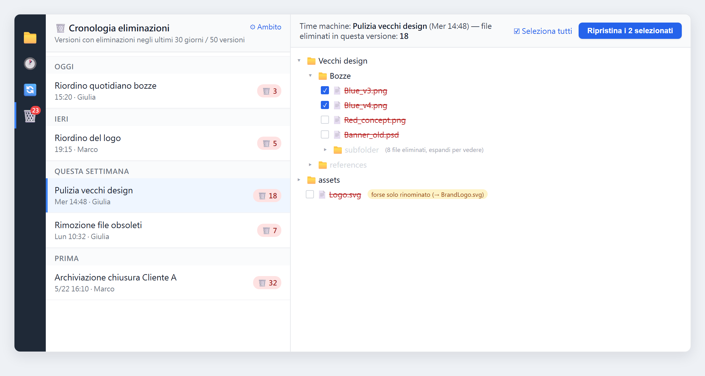
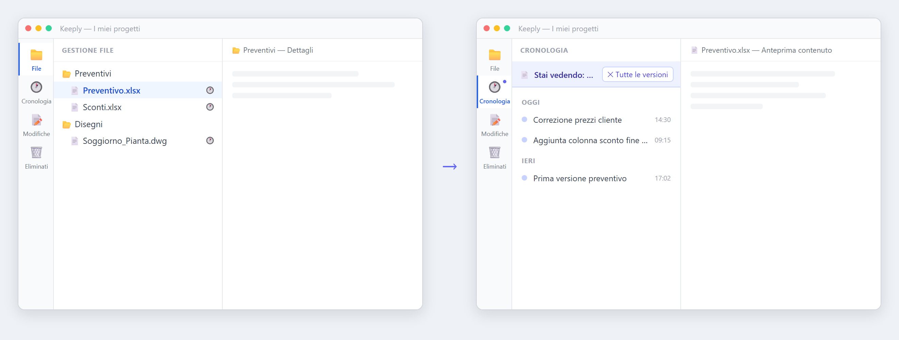
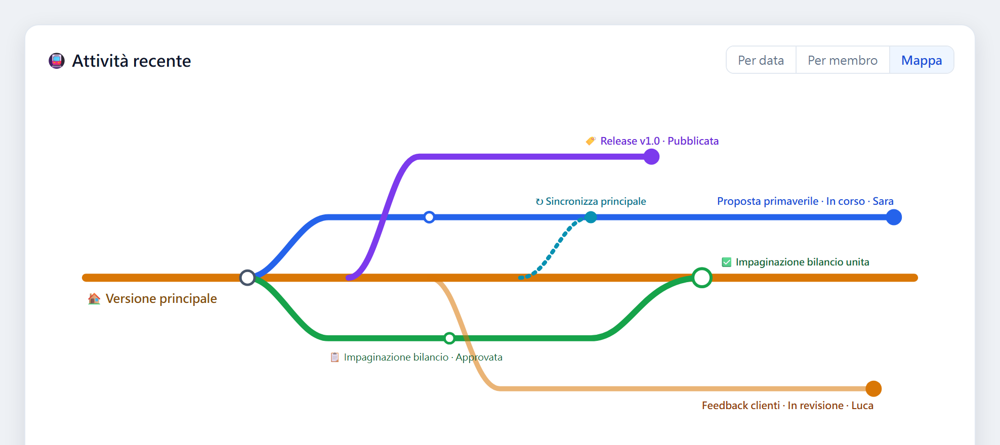

Dalla 1.0.12 alla 1.0.13 abbiamo concentrato gran parte delle energie su una cosa sola: trasformare il recupero dei file cancellati per sbaglio in un pannello di cui fidarti davvero. Nel frattempo la collaborazione di team, che covavamo da un po', è ormai quasi pronta: con questa versione te la mostriamo in anteprima.

Quando apri Keeply ritrovi la schermata di cartelle che conosci: una griglia di file e cartelle, e sulla sinistra una linea temporale che tiene traccia di ogni versione che salvi. Anche le novità di questa release seguono la stessa logica: clicchi un file e ne vedi la storia, cancelli qualcosa per errore e lo ritrovi nella linea temporale.

## 🆕 Nuove funzioni

### La time machine delle eliminazioni: recupera i file cancellati per errore

Una volta, se cancellavi un file per sbaglio e non era più nel cestino, di solito non restava che farsene una ragione. Con questa versione abbiamo creato un pannello dedicato: clicchi la 🗑️ nella barra degli strumenti a sinistra e compare una "linea temporale delle eliminazioni", raggruppata per oggi / ieri / questa settimana / prima. Ogni voce riporta a destra un "🗑️ N": quanti file sono stati eliminati in quel momento.

Clicchi una voce e, sulla destra, si apre come in una time machine l'albero dei file a quel preciso istante, posizionandosi in automatico dove si trovava il file cancellato. I file davvero eliminati sono evidenziati con una barratura rossa; se invece era solo un cambio di nome, accanto compare un piccolo avviso "forse è solo un nome diverso", così non perdi tempo a cercare a vuoto.

Spunti i file che ti servono (puoi selezionare in un colpo solo tutti quelli eliminati in quella versione), premi "Ripristina gli N file selezionati", scegli una cartella di destinazione (per impostazione predefinita il desktop) e Keeply li ripristina rispettando la struttura di cartelle originale. In caso di nomi in conflitto, viene aggiunto in automatico il suffisso `_restored`, così non sovrascrivi i file che hai già.

### Clicca un file e vedi solo la sua cronologia versione

Finora la linea temporale ha sempre mostrato le versioni dell'intera cartella. Ma spesso vuoi sapere solo una cosa: "questo singolo file, quante volte è stato modificato?". Ora basta un clic sul file e la linea temporale principale a sinistra mostra solo la storia di quel file; quando hai finito, premi "Torna a tutte le versioni" e torni alla linea temporale completa.

### Un explorer più bello e più pratico

- **Capisci a colpo d'occhio quali file sono cambiati**: nella scheda "Modifiche", i file invariati appaiono in grigio e quelli modificati vengono messi in risalto, senza doverli confrontare uno per uno.
- **Cartelle a scheda + stato di selezione**: le cartelle diventano icone in stile scheda, con uno stile di selezione ben visibile.
- **Menu contestuale uniforme**: in qualsiasi vista, sia su un file sia su una cartella, il menu del tasto destro è sempre lo stesso.
- **Aggiorni con un tasto, F5**: come sei abituato a fare, premi F5 e la schermata corrente si ricarica.

## 🔭 In arrivo: la collaborazione di team (anteprima)

Mettiamo subito le cose in chiaro: la collaborazione di team in questa versione **non è ancora disponibile**. Vogliamo solo darti un assaggio della direzione che prenderemo. È la parte su cui abbiamo lavorato di più all'interno della 1.0.13: abbiamo completato l'intero flusso di collaborazione fino a renderlo un percorso continuo, e quando sarà ben rifinito lo apriremo a tutti.

Ecco cosa arriverà:

- **Dall'invio in revisione all'unione, tutto d'un fiato**: un membro invia la propria copia di lavoro al responsabile per la revisione, allegando una spiegazione; il responsabile lascia commenti file per file, approva o rifiuta (indicando il motivo del rifiuto); dopo l'approvazione si esegue l'unione e il membro chiude tutto con un clic. La cronologia delle revisioni si sincronizza tra i dispositivi, senza restare confinata su un solo computer.
- **Assegnazione e monitoraggio dei compiti**: il responsabile assegna il lavoro e il membro lo avvia con un clic; ogni compito può essere suddiviso in sotto-attività da spuntare per seguirne l'avanzamento; invio, approvazione e rifiuto aggiornano in automatico lo stato del compito.
- **La "mappa della metropolitana" dell'attività di team**: un grafico simile a una mappa delle linee metro, con la linea principale che rappresenta la versione master e la copia di lavoro di ciascun membro come una diramazione; vedi a colpo d'occhio chi sta lavorando, quali rami sono già stati uniti e quali sono ancora in revisione.
- **Trasforma una cartella esistente in "originale di team"**: una cartella che già gestisci con Keeply può diventare direttamente l'originale del team, e i membri ereditano i permessi quando entrano, senza che ognuno debba acquistare di nuovo.

Non abbiamo ancora fissato una data di apertura: ti avviseremo quando tutto sarà pronto. Se è proprio la collaborazione di team quello che stai aspettando, dicci da "Segnala un problema" quale parte vorresti avere per prima.

## ✨ Miglioramenti all'esperienza

- Salvataggio di una versione, sincronizzazione e ripristino ora avvengono in background: la schermata non si blocca mentre l'operazione è in corso.
- Gli avvisi di notifica si spostano in un riquadro fluttuante in basso a destra, senza più comprimere la schermata principale.
- I testi dei filtri della linea temporale abbandonano il gergo tecnico, a favore di un linguaggio comprensibile a chiunque.
- Quando segnali un problema, Keeply allega in automatico il numero di versione corretto, così individuiamo più in fretta a quale versione si riferisce la situazione.

## 🛡️ Correzioni e sicurezza

- Risolti i problemi emersi dall'uso reale dopo il rilascio della funzione di eliminazione.
- Posizione di backup: nella conversione di una lettera di unità in percorso di rete, corretti il "blocco al raggiungimento del limite" e il "falso allarme in rosso quando la vecchia posizione non esiste più".
- Controlli più rigorosi sul salvataggio sicuro delle versioni: se lo snapshot preliminare fallisce davvero, l'operazione a rischio viene interrotta invece di proseguire forzatamente.
- Aggiornamento ordinario dei componenti di base e correzione di una serie di vulnerabilità di sicurezza note.

## 🔒 Sulla privacy

Questa versione introduce un'impostazione di consenso per le "statistiche d'uso anonime": solo dopo il tuo consenso invierà segnali d'uso privi di dati personali, per aiutarci a capire quali funzioni vengono effettivamente usate. È disattivata per impostazione predefinita e puoi spegnerla in qualsiasi momento dalle impostazioni. E soprattutto, **entrerà davvero in funzione solo il 15 luglio 2026** (2026-07-15): prima di allora pubblicheremo un avviso nell'app con 30 giorni di anticipo, non partiremo in sordina.

## ⬇️ Download e aggiornamento

Vai su [keeply.work](https://keeply.work) per scaricare la 1.0.13; se l'hai già installato, riceverai l'aggiornamento in automatico.

Questa versione aggiunge anche la **versione per Mac Intel**: oltre ad Apple Silicon, ora anche i Mac con processore Intel hanno un proprio file di installazione.

Il recupero dei file cancellati e la cronologia per singolo file sono già nelle tue mani, e la collaborazione di team è ormai vicina. Cosa faremo dopo dipende in buona parte dai tuoi riscontri. Se usandolo ti viene in mente qualcosa, diccelo direttamente da "Segnala un problema" dentro Keeply: lo leggerò.

---

> Sull'autore: Ting-Wei Tsao, fondatore di [Keeply](https://keeply.work). [LinkedIn](https://www.linkedin.com/in/ting-wei-tsao-b57480152/)
