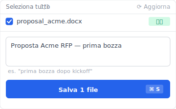
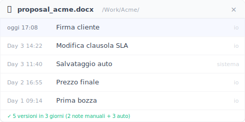
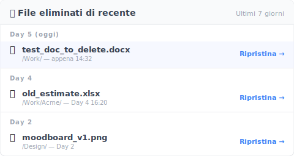
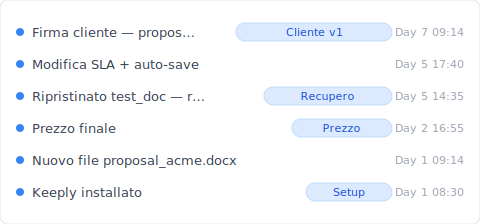

# 【2026 Gestione file】Guida Keeply: nella prima settimana non fai niente, 3 segnali reali nei giorni 1, 3, 5

> Non correre alla procedura guidata dopo aver installato Keeply. Usa la prima settimana di lavoro vero come banco di prova per i tre segnali: tracciamento versioni automatico, ritmo delle modifiche, recupero delle cancellazioni. Non ti convince al Day 7? Disinstalla, zero rischio.

## Indice

- [Perché le procedure guidate a più passi fanno mollare i nuovi utenti al Day 1](#setup-fatigue)
- [La scommessa di Keeply: lascia che il tuo flusso reale generi le prove in 7 giorni](#core-bet)
- [Day 1: aggiungi un file e guarda come Keeply lo registra](#day-1)
- [Day 3: modifica un file e vedi quante versioni Keeply tiene](#day-3)
- [Day 5: cancella un file e vedi se riesci a recuperarlo](#day-5)
- [Day 7 verdetto: hai visto tutte e tre le cose?](#day-7)
- [Limiti onesti: tre situazioni in cui non dovresti usare Keeply](#limits)
- [Dopo il Day 7](#next-week)

---

Puoi installare Keeply e correre attraverso la checklist di configurazione, oppure non fare niente e vivere la tua settimana normale.

Il secondo percorso è quello per cui Keeply è progettato. La maggior parte dei software, finita l'installazione, ti accoglie con "Benvenuto! Iniziamo la configurazione in 5 passi". Keeply è diverso: lo apri e quasi non ti chiede nulla. Niente procedura guidata, niente "scegli la tua modalità di lavoro", niente checklist.

Prima di costruire Keeply ho provato anch'io tanti strumenti. Il dolore della prima settimana è sempre lo stesso: apri l'app e arrivano video tutorial, opzioni di integrazione, passi di configurazione che si accumulano. Sei già stanco prima di iniziare a usarlo, e il momento in cui hai più bisogno dello strumento capita proprio quando sei stanco.

Quindi la scommessa di Keeply è questa: la prima settimana lascia che il tuo lavoro quotidiano scorra da solo. Ogni 2-3 giorni dai un'occhiata a Keeply per vedere cosa ha registrato in silenzio. Al Day 7 hai 7 giorni di prove reali.

Quali giorni nello specifico? Le tre cose che farai:

- **Day 1**: **aggiungi** un file
- **Day 3**: **modifichi** un file
- **Day 5**: **cancelli** un file

Queste tre cose sono ciò che uno strumento di gestione delle versioni dovrebbe trattare. Se lo strumento non le vede, tenerselo non ha senso. Se le vede e le gestisce in modo naturale, al Day 7 hai la tua risposta.

---

## Perché le procedure guidate a più passi fanno mollare i nuovi utenti al Day 1 {#setup-fatigue}

Quando ho costruito la prima versione di Keeply, anch'io avevo previsto una procedura guidata in 5 passi. Dopo tre giri di test con nuovi utenti, ho tolto via tutta la procedura.

Il problema non è che la procedura era scritta male. Il problema è che al Day 1 i nuovi utenti **non hanno ancora il context** per rispondere alle domande della procedura:

- "Scegli la tua modalità di lavoro": come faccio a sapere che modalità sono, ho appena installato.
- "Scegli quali cartelle tracciare": come so quali contano, non ho ancora messo nulla in questo strumento.
- "Imposta la frequenza degli snapshot giornaliera / settimanale / per ogni salvataggio": non ho una baseline per giudicare cosa è ragionevole.
- "Imposta la lista di esclusioni": non so quali file spazzatura salverò per sbaglio in futuro.
- "Connetti il tuo account cloud": ho appena installato, perché dovrei darti l'account?

Una procedura in 5 passi è 5 decisioni senza contesto. La maggior parte dei nuovi utenti chiude la finestra al passo 1, e nelle 24 ore successive questa app diventa un'altra icona di installazione incompiuta.

Il percorso di osservazione passiva è esattamente il contrario: tu non rispondi a niente. Keeply ti guarda per 7 giorni, e al Day 7 **sei tu ad avere il contesto** per decidere se continuare, se aprire le impostazioni.

---

## La scommessa di Keeply: lascia che il tuo flusso reale generi le prove in 7 giorni {#core-bet}

Quali giorni nello specifico? Le tre cose che farai: aggiungere, modificare, cancellare. Ogni evento corrisponde a un giorno di osservazione, con 2 giorni di intervallo per non doverti aprire Keeply tutti i giorni.

Dopo ogni evento ti do due righe di checklist: "✅ Segnale di fiducia" dice "se vedi X, lo strumento passa"; "❌ Punto di fallimento" dice "se vedi Y, lo strumento non fa per te". Contano entrambi: il primo è pubblicità, il secondo è quello che ti dà una condizione di uscita pulita.

---

## Day 1: aggiungi un file e guarda come Keeply lo registra {#day-1}

Nel primo giorno lavorativo dopo aver installato Keeply, aggiungerai almeno un file. Magari un nuovo report Word, un PDF appena salvato, un nuovo file di design. È il primo banco di prova di uno strumento di gestione delle versioni.

Non devi fare niente. Salva il file dove lo salveresti normalmente. Desktop, Documenti, cartella condivisa, cartella di sincronizzazione cloud — Keeply li vede tutti.

Prima di pranzo, apri Keeply per un'occhiata veloce. Quel file dovrebbe comparire nell'interfaccia di Keeply, con accanto un timestamp. Nessun menu complesso, nessun popup "vuoi tracciare questo file?". L'ha visto da solo.

Se vuoi fare un passo in più, clicca "Salva versione" e scrivi una nota di una riga. Keeply apre un pannello laterale apposito:

Nel campo nota va bene qualsiasi cosa — "prima bozza dopo il kickoff" o "revisione dopo la visita al cliente" in linguaggio piano è la cosa più utile. Sei mesi dopo, quella riga è l'àncora della tua memoria quando scorri la cronologia versioni.

- ✅ **Segnale di fiducia**: il file aggiunto non deve essere "aggiunto" a Keeply; compare automaticamente con il timestamp.
- ❌ **Punto di fallimento**: il file aggiunto non si trova nell'interfaccia di Keeply. Significa che lo strumento non fa per il tuo ambiente. Una risposta al Day 1 è meglio della sorpresa al Day 30.

---

## Day 3: modifica un file e vedi quante versioni Keeply tiene {#day-3}

L'osservazione del Day 3 è un po' più difficile del Day 1: modifichi il file di ieri.

Un file viene modificato di solito così: lo apri la mattina, cambi una parte, Cmd+S; continui a modificare, Cmd+S di nuovo; un salvataggio a pranzo, ultimo salvataggio prima di andare via la sera. In una giornata lavorativa, sullo stesso file potresti aver premuto salva 10-20 volte.

Domanda: quante versioni dovrebbe tenere lo strumento? Troppe (una per ogni Cmd+S) e la sera ti ritrovi a guardare 17 versioni quasi identiche — inutili. Troppo poche (una sola versione finale al giorno) e le tue modifiche del mattino svaniscono, come se non avessi versioning. Il design di Keeply è di decidere da solo quali salvataggi sono "significativi". Il salvataggio prima di pranzo è una versione, il salvataggio prima di andare via è un'altra. Le modifiche minute in mezzo non vengono salvate ciascuna a parte.

Al Day 3 sera, quando apri il pannello versioni di quel file, dovresti vedere 2-4 versioni, non 17. Ognuna con il timestamp. Puoi cliccarne una qualsiasi per tornare a quello stato.

Aperto, ha questo aspetto — `proposal_acme.docx` dalla prima bozza del Day 1 fino al sign-off del cliente di oggi, 5 versioni accumulate in 3 giorni (2 con note scritte da te, 3 salvataggi automatici):

Le righe "auto" sono Keeply che salva in silenzio in background; le righe "tu" sono i momenti che hai marcato attivamente. Tra sei mesi ti basta leggere la colonna della nota per capire quale versione è quale — senza affidarti alla memoria.

- ✅ **Segnale di fiducia**: il pannello versioni mostra 2-4 versioni chiave con timestamp, ognuna cliccabile per ripristinare, non 17 registrazioni banali.
- ❌ **Punto di fallimento**: 17 versioni quasi identiche, oppure solo 1 versione rimasta. Significa che non corrisponde al tuo ritmo di modifica.

Per la teoria più profonda del design della cronologia delle versioni, vedi il [Pillar: guida completa alla gestione delle versioni dei file](/it/post/file-version-management-complete-guide/).

---

## Day 5: cancella un file e vedi se riesci a recuperarlo {#day-5}

L'osservazione del Day 5 è la più brutale: cancelli un file.

La cancellazione è inevitabile. Quando riordini la scrivania, quando svuoti il cestino, quando trascini per errore nel cestino, quando riordini una cartella. In una settimana cancellerai almeno una volta. Io stesso ho visto diversi designer su Mac svuotare il cestino e poi accorgersi che un file importante era stato trascinato dentro insieme — un intero pomeriggio buttato.

Il design di Keeply tiene la sua lista delle cancellazioni separata dal cestino di sistema. I file che cancelli da Finder o Esplora file mantengono comunque la loro cronologia versioni in Keeply. Anche se il cestino di sistema viene svuotato, non importa.

Al Day 5, cancella di proposito un file di test non importante. Poi apri Keeply, trova l'area "file cancellati" (la posizione esatta varia un po' tra i sistemi operativi). Il file dovrebbe essere ancora lì, e cliccando "ripristina" lo riprendi.

La lista è ordinata per fascia temporale, quindi quello che hai appena cancellato sta in cima:

Ogni voce è conservata per almeno 30 giorni — non scompare come il Cestino del Mac quando viene svuotato. Clicchi "Ripristina" e il file torna alla sua cartella originale.

Confrontalo con gli strumenti a cui sei abituato: cestino Mac svuotato — sparito. Cestino Windows svuotato — sparito. OneDrive oltre i 30 giorni di conservazione — sparito. Time Machine che non ha fatto backup di quel momento — sparito. Keeply non si appoggia a queste conservazioni sottostanti. È una cronologia versioni a livello dello strumento, registrata in modo indipendente.

- ✅ **Segnale di fiducia**: il file di test cancellato compare nella lista "file cancellati" di Keeply, e "ripristina" lo riporta.
- ❌ **Punto di fallimento**: il file appena cancellato non è nella lista. Significa che Keeply non sta guardando la cartella in cui lavori davvero, oppure l'evento di cancellazione è stato saltato.

---

## Day 7 verdetto: hai visto tutte e tre le cose? {#day-7}

Il Day 7 è il giorno del verdetto. Apri Keeply e ripensa a questa settimana:

- Quanti file ho aggiunto. Keeply li ha visti?
- Quali file ho modificato. Keeply ha tenuto un numero ragionevole di versioni?
- Quali file ho cancellato. Keeply riesce ancora a recuperarli?

Apri la timeline principale di Keeply e i 7 giorni appaiono così:

Ogni voce ha una nota e ogni voce è cliccabile per ripristinare. Ripensandoci, non devi ricordare date o nomi di file — la timeline ti dice cosa hai fatto questa settimana.

Tutte e tre le risposte "sì" — puoi lasciare Keeply in background con tranquillità. Ha superato la prova della prima settimana. Il tuo lavoro reale ha generato in 7 giorni le prove se può fare il lavoro. Ti dice più di qualsiasi checklist di setup da 30 voci.

Una risposta che zoppica — il Day 7 è un buon momento per andarsene. Lasciar perdere onestamente vale più che accumulare altre impostazioni. È il bello del percorso di osservazione passiva: 7 giorni fa, non avevi ancora investito niente in questo strumento.

---

## Limiti onesti: tre situazioni in cui non dovresti usare Keeply {#limits}

Devo essere onesto sugli scenari in cui Keeply non ti aiuterà nella prima settimana:

- **Backup di immagine dell'intero disco**: Keeply è uno strumento di cronologia versioni, non un backup di immagine del disco. Ti serve comunque Time Machine, Carbon Copy o un disco esterno con la [regola di backup 3-2-1](/it/post/3-2-1-backup-rule/).
- **Materiale video oltre i 50GB**: la gestione di file singoli di media molto grandi è ancora in fase di pianificazione in Keeply. Gli studi video dovrebbero affiancare strumenti LFS o un NAS dedicato.
- **Compliance audit pesante (finanza, sanità)**: Keeply offre una cronologia versioni personale o per piccoli team, non registrazioni di audit immutabili di livello SOX o HIPAA.

---

## Dopo il Day 7 {#next-week}

Se decidi di restare, il lavoro della settimana successiva è integrare gradualmente Keeply nelle abitudini di lavoro esistenti. Questo articolo non lo apre — vedi il capitolo "Settimana 2" del [Pillar: Keeply da zero](/it/post/keeply-getting-started-from-zero/).

Se decidi di non restare, disinstallare Keeply non lascia file intermedi sul computer. È sempre stato passivo.

---

> Riguardo all'autore: Ting-Wei Tsao, co-fondatore di Keeply.
> Trovami su [LinkedIn](https://www.linkedin.com/in/ting-wei-tsao-b57480152/).
