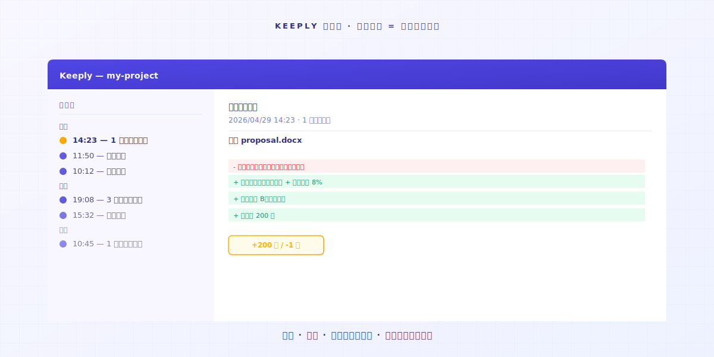

# 【2026 Gestione file】Come usare Keeply: salta 30 funzioni, parti con 2 azioni

> Non devi diventare prima un esperto. Trascina dentro una cartella, continua a lavorare. La cronologia delle versioni è già attiva.

## Indice

1. [Perché ti opponi ai nuovi strumenti?](#why-resist-new-tools)
2. [Perché molli uno strumento?](#why-give-up-a-tool)
3. [Quindi quali sono le 2 azioni?](#what-are-the-two-actions)
4. [Lascia che ti racconti cosa vivrai](#first-week-natural)
5. [Quando Keeply non fa per te](#when-keeply-isnt-right)

---

Il signor A si destreggia tra molti progetti e usa un quaderno ogni giorno per tracciare quello che ha fatto. Ha appena sentito dire che Keeply è un ottimo software per note sui file. Apre la home page e vede "Inizia in 3 passi" e "prova gratuita di 7 giorni". L'ultimo strumento che ha provato, al giorno 14 era ancora perso. La pazienza è finita prima che si vedesse qualche valore. **Questa volta vuole 10 minuti per decidere.**

Non è che sei lento. È che la curva di apprendimento del software tradizionale dà per scontato che tu sia disposto a mollare tutto oggi e diventare studente per 14 giorni.

---

## Perché ti opponi ai nuovi strumenti? {#why-resist-new-tools}

Ti opponi ai nuovi strumenti perché la maggior parte di loro presuppone che tu possa fermare il lavoro di oggi e diventare uno studente per 14 giorni. Ma domani consegni un progetto. Non hai 14 giorni di buco da spendere su nulla.

Ieri hai provato a installare uno strumento. La documentazione è di 50 pagine. Ci sono 30 termini nuovi. Domani consegni un progetto.

Pensi: "Ci tornerò la prossima settimana e me la prenderò comoda." Poi non lo riapri più.

La maggior parte delle aziende di software tratta "imparalo in 14 giorni" come l'ordine naturale delle cose. La [ricerca di settore](https://userpilot.com/blog/time-to-value-benchmark-report-2024/) mostra che gli utenti che completano meno della metà dell'onconsiglioing abbandonano entro 14 giorni a un tasso **3 volte** superiore rispetto agli utenti che lo completano tutto.

In altre parole: il software dà per scontato che tu abbia 14 giorni liberi. Dà per scontato che il tuo lavoro possa aspettare finché non l'hai imparato.

Il tuo prossimo progetto non rientra in quel presupposto dei 14 giorni.

---

## Perché molli uno strumento? {#why-give-up-a-tool}

Imparare un nuovo strumento richiede di solito circa 14 giorni — e per la maggior parte di quei giorni stai ancora brancolando.

A metà di quella fase, la maggior parte delle persone vorrà chiudere la scheda.

Prima di costruire Keeply, ho provato io stesso un sacco di nuovi strumenti. Molti mi sono sembrati una rottura il primo giorno, e in silenzio ricadevo nel mio modo vecchio di fare le cose.

Più tardi ho capito: gli strumenti con cui ho effettivamente continuato avevano una cosa in comune — **erano abbastanza intuitivi da poter essere semplicemente usati**.

Una volta stavo usando l'AI per scrivere codice e l'AI è andata fuori dai binari. Avevo già perso traccia di dove fosse arrivata. **Per fortuna avevo tenuto note dei file per tutto il tempo.**

Apro la cronologia. **Torno a uno stato che potevo controllare.**

È stato lì che ho capito: un buon strumento non è quello con più funzioni, è **quello abbastanza semplice da padroneggiare**. Non avevo imparato nemmeno una funzione, e solo per aver tranquillamente recuperato quel file, lo strumento si era già ripagato.

Lo strumento non è il problema. **Questa categoria di software semplicemente non dovrebbe essere progettata intorno a "impara prima, usa dopo".**

---

## Quindi quali sono le 2 azioni? {#what-are-the-two-actions}

Sono solo due: **trascina una cartella dentro Keeply, poi salva una versione quando conta**. Nessun comando da imparare, nessuna documentazione di 30 pagine. Salvare una versione è un click — il pulsante "Salva una versione" di Keeply (o Cmd+S dentro Keeply) — e se preferisci non pensarci, attiva il salvataggio automatico opzionale e Keeply registra le modifiche ogni 15-30 min.

### Azione 1: trascina una cartella dentro Keeply

La trascini dentro e basta, letteralmente. **Non rinominare, non categorizzare, non pensare alla struttura.**

### Azione 2: salva una versione quando conta

Quello che avresti fatto oggi, fallo. Quando finisci una sezione, quando un cliente approva una versione, prima di una modifica rischiosa — clicca "Salva una versione" di Keeply e aggiungi una nota di una riga (es. "approvata dal cliente"). Quel momento finisce nella Timeline a sinistra.

Non vuoi ricordarti di cliccare? Attiva il salvataggio automatico opzionale e Keeply registra le tue modifiche ogni 15/30/60 min (a tua scelta) — i salvataggi manuali portano la tua nota, quelli automatici sono marcati con l'orario, entrambi sulla stessa timeline.

Non devi nemmeno rinominare i tuoi file. Quel `_v3_davvero_definitivo.docx` mantiene il suo nome. Keeply non tocca le tue abitudini.

Fine del giorno 1, hai 1 giorno di note dei file. **Fine del giorno 7, hai una settimana intera.**

Uso intuitivo, è tutto qui il trucco.

---

## Lascia che ti racconti cosa vivrai {#first-week-natural}

### Giorno 1

Trascini dentro un progetto. Salvi.

### Giorno 2-3

Modifichi 200 parole in un file esistente. Salvi.

Attraverso la Timeline guardi le tue stesse note dei file iniziare ad accumularsi. **Clicca dentro una nota, vedi cosa hai cancellato e cosa hai aggiunto.**

### Giorno 4-7

Stai accumulando sempre più note dei file.

Un giorno te ne accorgerai — **che bello avere questo software**.

---

## Quando Keeply non fa per te {#when-keeply-isnt-right}

Keeply non combatte per ogni scenario. In 4 casi, un altro strumento è la scelta migliore.

- **Se ti serve la sincronizzazione cloud tra dispositivi**: scegli [IDrive](https://www.idrive.com/) o [Backblaze](https://www.backblaze.com/). Keeply vive sul tuo computer. Non è cloud-native.
- **Se ti serve il ripristino di sistema o il backup completo del disco**: scegli [Acronis True Image](https://www.acronis.com/). Keeply non fa quello.
- **Se sei un professionista IT che gestisce 50+ macchine**: scegli [MSP360](https://www.msp360.com/). Keeply è per individui e piccoli team.
- **Se semplicemente non vuoi perdere documenti personali**, la «Cronologia file» (File History) integrata in Windows è più che sufficiente. Non devi installare nulla.

Scegliere uno strumento è come scegliere un collega. Ognuno ha il suo scenario forte. Sii onesto su questo, e brucerai meno prove di 14 giorni.

---

## Per chiudere

Vuoi provare un nuovo strumento, e non vuoi perderci 14 giorni. È giusto.

Trascina una cartella dentro [Keeply](https://keeply.work/). Continua a fare il lavoro di oggi.

Al giorno 7, apri la Timeline e dai un'occhiata. **Capirai.**

---

## Letture correlate

- [La guida completa alla gestione delle versioni dei file](/it/post/file-version-management-complete-guide/) (PILLAR 1, perché la gestione delle versioni conta)
- [La prima settimana con Keeply: diario di osservazione di 7 giorni](/it/post/keeply-first-week-workflow/) (cosa fare davvero dopo l'installazione)
- [Cosa salva Keeply rispetto a backup e strumenti cloud](/it/post/what-keeply-saves-vs-backup-cloud/) (Keeply vs Dropbox / Time Machine — la differenza pratica)
- [Vibe coding fuori controllo? Un solo gesto per tornare all'ultima versione funzionante](/it/post/vibe-coding-rollback/) (il classico scenario "l'AI mi ha rotto il file")

---

> Sull'autore: Ting-Wei Tsao, fondatore di Keeply.
> [LinkedIn](https://www.linkedin.com/in/ting-wei-tsao-b57480152/)
