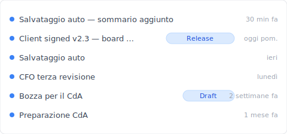
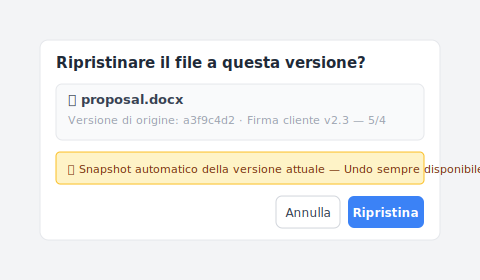

# 【2026 Gestione file】La cronologia versioni di OneDrive non è illimitata — Limite di 500 + finestra di 30 giorni nei documenti Microsoft

> Microsoft Learn lo dice chiaramente: 500 + 30 giorni. Ma il 90% degli articoli how-to insegna la funzione, non dove si rompe.

"OneDrive ti ha salvato 200 volte. Poi al 501°, ha silenziosamente eliminato la tua versione più vecchia — senza dirtelo."

Non è un bug. È il limite di 500 versioni principali che [Microsoft Learn](https://learn.microsoft.com/en-us/sharepoint/document-library-version-history-limits) ha dichiarato fin dall'inizio. Ma il 90% dei tutorial sulla cronologia versioni di OneDrive insegna **come usarla**, non **dove si rompe**. Questo articolo colma questo divario: prima spiega i tre meccanismi di OneDrive (cronologia versioni 500 limite / Cestino finestra 30 giorni / Salvataggio automatico) che vengono spesso scambiati per uno, poi mostra come [Keeply](https://keeply.work) cattura gli scenari post-limite.

## Contenuti

1. [I tre meccanismi di OneDrive: 500 / 30 giorni / Salvataggio automatico — cose diverse](#three-mechanisms)
2. [Il limite di 500 versioni: il numero ufficiale di Microsoft e quando lo raggiungi](#500-limite)
3. [Cestino 30 / 93 giorni: una finestra temporale di eliminazione, non cronologia versioni](#recycle-bin)
4. [Salvataggio automatico: buffer di crash di Office, completamente separato dalla cronologia versioni](#autorecover)
5. [Come Keeply impedisce alla cronologia OneDrive di scomparire al 501° salvataggio](#keeply-timeline)
6. [Keeply colma il divario: Blocco Release + nota per file dopo il limite](#keeply-fills)
7. [3 scenari in cui non hai bisogno di Keeply con OneDrive](#when-not-needed)
8. [FAQ](#faq)

---

## I tre meccanismi di OneDrive: cose diverse, spesso confuse {#three-mechanisms}

Quando OneDrive dice "cronologia versioni", in realtà sono tre cose diverse fuse in un unico termine. **Separiamole**:

| Meccanismo | Cos'è | Limite | Trigger |
|---|---|---|---|
| **Cronologia versioni** | Ogni versione di un file cloud | **500 versioni principali** ([MS Learn](https://learn.microsoft.com/en-us/sharepoint/document-library-version-history-limits)) | Automatico ad ogni salvataggio |
| **Cestino** | Finestra dopo l'eliminazione del file | 30 giorni personale / 93 giorni lavoro o scuola ([MS Support](https://support.microsoft.com/en-us/office/restore-deleted-files-or-folders-in-onedrive-949ada80-0026-4db3-a953-c99083e6a84f)) | Eliminazione manuale / sync |
| **Salvataggio automatico** | Buffer di crash del client Office | Intervallo predefinito 10 min | Crash app / chiusura forzata |

Tre cose diverse — confuse come una sola, cercherai nel livello sbagliato. "Non riesco a trovare il mio file di 6 mesi fa" potrebbe essere il limite di 500 della Cronologia versioni che entra in gioco, la finestra di 30 giorni del Cestino scaduta, o il Salvataggio automatico sovrascritto da tempo. Problemi diversi, soluzioni diverse.

## Il limite di 500 versioni: il numero ufficiale di Microsoft {#500-limite}

[Microsoft Learn](https://learn.microsoft.com/en-us/sharepoint/document-library-version-history-limits) lo afferma chiaramente: le librerie documenti SharePoint / OneDrive conservano fino a **500 versioni principali** per file (con il controllo versione principale/secondaria abilitato, fino a 511 versioni secondarie in più).

**Cosa succede dopo**: la versione più vecchia viene eliminata automaticamente per fare spazio alla nuova. Nessuna notifica. Nessuna opzione di annullamento.

**Chi raggiunge il limite**:

- **Consulenti** — 3 salvataggi/giorno su una proposta × 22 giorni lavorativi = ~66 versioni/mese → limite in **7-8 mesi**
- **Designer** — 5-8 salvataggi/giorno su un file di design → limite in **3-4 mesi**
- **Scrittori / avvocati** — 10+ salvataggi/giorno su un manoscritto → limite in **meno di 3 mesi**

Alta frequenza di salvataggio + progetto pluri-mensile = alta probabilità di raggiungere il limite. Microsoft non ti avvisa. L'interfaccia non lo segnala. Te ne accorgi quando vai a cercare.

## Cestino 30 / 93 giorni {#recycle-bin}

Il Cestino è una **finestra di recupero da eliminazione**, non un'estensione della cronologia versioni. Confusione comune: "Ho 30 giorni per recuperare i file eliminati" ≠ "Posso tornare a una versione di 6 mesi fa".

Per [MS Support](https://support.microsoft.com/en-us/office/restore-deleted-files-or-folders-in-onedrive-949ada80-0026-4db3-a953-c99083e6a84f):

- **Account personale**: 30 giorni di conservazione
- **Account aziendale o scolastico**: 93 giorni di conservazione

Dopo la scadenza, gli elementi vengono eliminati definitivamente dal Cestino di seconda fase.

Cronologia versioni e Cestino sono **due sistemi separati**. Modifica `proposal.docx` da v200 a v201 — la vecchia versione va nella Cronologia versioni (non nel Cestino). Elimina `proposal.docx` — l'intero file va nel Cestino (insieme alla sua cronologia versioni). Il primo raggiunge il limite di 500; il secondo il limite di 30/93 giorni.

## Salvataggio automatico ≠ cronologia versioni {#autorecover}

Il Salvataggio automatico salva file temporanei `.asd` nei client desktop Word / Excel / PowerPoint — intervallo predefinito **10 minuti** — utile solo in:

- Crash dell'app (schermata blu / hang)
- Chiusura forzata / interruzione di corrente del sistema
- Chiusura senza salvare, poi un prompt "vuoi recuperare?" alla prossima apertura

Completamente separato dalla cronologia versioni cloud di OneDrive.

Per un pattern correlato, vedi [Photoshop salvataggio automatico non è cronologia versioni](/it/post/photoshop-salvataggio automatico-not-version-history/) — la confusione parallela di Adobe nello spazio design.

Chiariti i tre meccanismi e i loro limiti, vediamo come evitare concretamente di trovarsi senza la versione che serve.

## Come Keeply impedisce alla cronologia OneDrive di scomparire al 501° salvataggio {#keeply-timeline}

Ecco cosa succede. Tina è una consulente. Archivia `proposal.docx` su OneDrive — 200+ versioni accumulate in sei mesi. Il cliente firma oggi. Il prossimo marzo vorrà rivedere la versione della proposta originale — OneDrive l'avrà ancora?

In [Keeply](https://keeply.work), la timeline di questo progetto appare così:

"Client signed v2.3 — approvato dal consiglio" ha la propria riga con un tag Release — è lei oggi pomeriggio, dopo che il cliente ha firmato, premendo "Salva versione" nella finestra principale di Keeply e scrivendo una nota:

Scrivi "Client signed v2.3 — approvato dal consiglio", salva la versione. Il prossimo marzo quando consulterà la timeline, il tag è lì — non influenzato dal limite di 500 di OneDrive, mai eliminato automaticamente.

Due azioni in totale:

1. **Salva** — Ctrl+S in Word come al solito. OneDrive sincronizza al cloud (come prima). Keeply controlla in background entro 30 min, vede il cambiamento, salva automaticamente una versione nella propria timeline.
2. **Segna milestone** — dopo che il cliente firma, premi "Salva versione" nella finestra principale di Keeply, scrivi una nota di una riga.

## Keeply colma il divario — dopo il limite di OneDrive {#keeply-fills}

Il `proposal.docx` di Tina ha raggiunto il limite di 500. Il cliente improvvisamente vuole la versione della proposta di 8 mesi fa — OneDrive non ce l'ha più.

In [Keeply](https://keeply.work), tre cose atterrano in un unico strumento:

- **Blocco Release**: il 14 febbraio quando il cliente ha firmato, Tina ha premuto "Salva versione" e l'ha taggata come "Client signed v2.3" — quella versione diventa uno snapshot separato, mai sovrascritto dai prossimi 500 salvataggi, conservato per sempre. Il limite di 500 di OneDrive non si applica.
- **Nota per file**: ogni versione può portare una nota di una riga. Tre mesi dopo, Tina scorre la timeline e vede "CFO terza revisione", "Client signed", "Preparazione CdA" — nessun bisogno di scavare in 12 file `_FINAL` cercando di indovinare quale è quale.
- **Portabilità tra strumenti**: Keeply non dipende da OneDrive. Passa a Dropbox / NAS / un nuovo laptop — la timeline vive ancora localmente + nella propria posizione di backup di Keeply. Nessun limite di vendor cloud ti blocca.

Quando arriva la mail del cliente, Tina apre la timeline di Keeply, trova la riga del 14 febbraio "Client signed v2.3" e fa clic destro per ripristinare — compare questa finestra:

Clicca "Ripristina". Tre secondi e `proposal.docx` torna allo stato di febbraio; la versione corrente è stata automaticamente catturata come snapshot, quindi l'Annulla è sempre a un clic. OneDrive continua a fare ciò in cui è forte (sincronizzazione collaborativa). Keeply ti dà cronologia versioni illimitata per file.

## 3 scenari in cui non hai bisogno di Keeply con OneDrive {#when-not-needed}

Per essere chiari — Keeply non è per tutti:

**Archivio conformità aziendale**. SOX, HIPAA, GDPR richiedono catena di audit + crittografia + gestione periodi di conservazione — usa [Microsoft 365 Backup](https://www.microsoft.com/en-us/microsoft-365/business/microsoft-365-backup), Veeam o Acronis. Keeply è per la gestione versioni quotidiana, non per la conformità.

**Firma contratti / audit legale**. Serve firme + registri immutabili — usa DocuSign o Adobe Sign. Keeply traccia le versioni ma non certifica le firme.

**Meno di 1 salvataggio al giorno, uso personale**. Se il tuo `notes.docx` viene modificato una volta a settimana — non raggiungerai mai il limite di 500 di OneDrive in 10 anni. Keeply non è urgente.

## FAQ {#faq}

**Q1: Quante versioni conserva OneDrive?**

500 versioni principali ([Microsoft Learn](https://learn.microsoft.com/en-us/sharepoint/document-library-version-history-limits)). La più vecchia viene eliminata automaticamente dopo, senza notifica.

**Q2: Per quanto tempo OneDrive conserva la cronologia versioni?**

La cronologia versioni in sé non ha limiti di tempo (limitata dal limite di 500). Limitato nel tempo è il Cestino: 30 giorni personale, 93 giorni lavoro.

**Q3: La cronologia versioni di OneDrive è uguale al Salvataggio automatico?**

No. La cronologia versioni è la conservazione per versione lato cloud di OneDrive. Il Salvataggio automatico è il buffer di crash desktop di Office (intervallo 10 min). Livelli di archiviazione diversi.

**Q4: Perché non riesco a trovare il mio file OneDrive di 6 mesi fa?**

Due possibilità: (a) superato il limite di 500, eliminato automaticamente; (b) hai cercato nel Cestino invece, finestra di 30 giorni chiusa. Gli utenti pesanti raggiungono il limite in 7-8 mesi.

**Q5: Cosa succede dopo aver superato 500 versioni?**

OneDrive elimina silenziosamente la più vecchia. Nessun avviso. Per risolvere, serve uno strumento senza limite — [Keeply](https://keeply.work) Blocco Release per esempio.

**Q6: Keeply è in conflitto con OneDrive?**

No. Funziona insieme. OneDrive per sincronizzazione collaborativa, Keeply per cronologia versioni illimitata per file + note + Blocco Release.

## Vedi anche

Il pilastro [Guida completa alla gestione delle versioni dei file](/it/post/file-version-management-complete-guide/) — 4 motivi strutturali per cui i tuoi strumenti non sono mai stati progettati per mantenere la cronologia dei file.

Lettura parallela:
- [Limiti della cronologia versioni di Excel](/it/post/excel-version-history-limits/) — meccanismo parallelo di Excel 500 + scenari fratelli
- [Cosa salva Keeply rispetto agli strumenti di backup e cloud](/it/post/what-keeply-saves-vs-backup-cloud/) — tre cose diverse, confronto completo
- [Il cliente chiede quale versione è quella finale](/it/post/client-asked-which-version/) — cronologia versioni di Word + scena "il cliente vuole quella versione"

---

Il `proposal.docx` di Tina ha raggiunto il limite di 500 su OneDrive. Il cliente vuole la proposta di 8 mesi fa il prossimo mese — secondo la regola di Microsoft, eliminata, scomparsa.

Ma in Keeply ha taggato "Client signed v2.3" come Release. Sei mesi dopo, il cliente chiede — tre secondi per trovarla.

Microsoft ha il numero 500 nei documenti. Non hai bisogno che OneDrive non invecchi — hai bisogno di uno strumento che ti catturi quando lo fa.

---

> Sull'autore: Ting-Wei Tsao, fondatore di [Keeply](https://keeply.work).
> [LinkedIn](https://www.linkedin.com/in/ting-wei-tsao-b57480152/)
