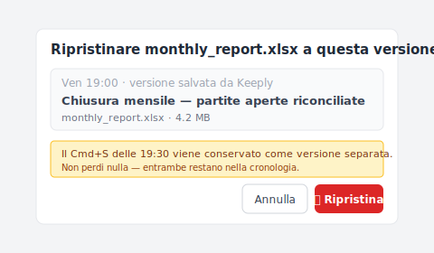

# 【2026 Gestione file】Il limite del recupero file sovrascritto: dove Salvataggio automatico non arriva

> Salvataggio automatico è per il salvataggio da crash. Quello che serve dopo un sovrascrittura è la prevenzione a monte.

Venerdì sera, 19:30. Stai lavorando alla chiusura mensile in Excel e accidentalmente salvi sopra il foglio precedente.

Ctrl+Z non funziona più (hai già chiuso il file). Anche il file Salvataggio automatico è scomparso.

Hai fino a lunedì mattina per recuperarlo. Ma farai in tempo?

## Punti chiave

La maggior parte delle persone che cercano "**recupero file sovrascritto**" vogliono salvataggio post-evento. Ma Microsoft Salvataggio automatico è per il recupero da crash, e la finestra di successo del software di recupero dati è di pochi minuti dopo la sovrascrittura. Nessuno di questi arriva allo scenario "sovrascritto dopo un salvataggio normale". **Il salvataggio post-evento non è la risposta. La prevenzione a monte sì.** Con una cronologia versioni always-on a livello strumentale, una sovrascrittura smette di essere un'azione distruttiva.

## Indice

1. A cosa serve davvero Salvataggio automatico?
2. Salvataggio automatico / Versioni precedenti / software di recupero: cosa può salvare ognuno?
3. Perché "dopo il salvataggio sovrascritto" è già troppo tardi
4. Oltre il salvataggio post-evento: l'opzione cronologia versioni always-on
5. Domande frequenti

---

## A cosa serve davvero Salvataggio automatico?

Microsoft Office ha tre meccanismi di "**recupero versione**" integrati:

- **Salvataggio automatico**: salva il contenuto non salvato durante una crash. Intervallo di salvataggio automatico predefinito di 10 minuti. **Cancellato quando il file si chiude normalmente.**
- **Versioni precedenti** (Windows): torna a snapshot passati tramite copie shadow. Richiede configurazione preventiva.
- **Cronologia versioni OneDrive**: snapshot di ogni salvataggio. La [documentazione Microsoft](https://learn.microsoft.com/it-it/sharepoint/document-library-version-history-limits) nota 500 versioni principali di default (account Microsoft personali: 25).

L'intento progettuale è chiaro: questi tre sono per "**recupero da crash**" o "**incidenti di salvataggio recenti**". Non per lo scenario "**mi rendo conto di averlo sovrascritto dopo aver chiuso il file**".

## Salvataggio automatico / Versioni precedenti / software di recupero: cosa può salvare ognuno?

Per vedere il limite di ogni meccanismo, confrontali fianco a fianco:

| Meccanismo | Ti salva in… | Non ti salva in… | Note |
| --- | --- | --- | --- |
| Salvataggio automatico | Crash a metà documento | Sovrascrittura dopo chiusura normale | Cancellato alla chiusura |
| OneDrive [cronologia versioni](https://learn.microsoft.com/it-it/sharepoint/document-library-version-history-limits) | Entro le 500 versioni precedenti (25 sugli account personali) | Oltre 500, file solo locali | Salvataggio cloud richiesto |
| Versioni precedenti Windows | Se esiste copia shadow | Senza setup, ambienti SSD | Setup necessario |
| Software di recupero dati | Subito dopo sovrascrittura, settori intatti | Ore dopo, dopo SSD TRIM | Tasso successo dipende da ambiente |
| Mac [Time Machine](https://support.apple.com/it-it/HT201250) | Snapshot recente | Tra gli intervalli di snapshot | Setup separato |

Esatto, è proprio il vincolo. Nessuno di questi meccanismi arriva strutturalmente al tipico scenario "sovrascritto dopo un salvataggio normale".

Quello che gli utenti Keeply riportano più spesso è quasi sempre questo scenario.

## Perché "dopo il salvataggio sovrascritto" è già troppo tardi

Ecco una distinzione che nessuno nomina chiaramente: **strato di archiviazione** vs **strato strumentale**.

Questi meccanismi vivono allo strato di **archiviazione**. L'obiettivo progettuale è "se l'ultima scrittura fallisce, fai rollback". Quindi la retention è breve. I punti di riferimento "500 versioni" o "30 giorni" si basano su "quanto spesso l'utente medio guarda indietro entro un mese". Oltre i tre mesi non è nello scopo; il pruning è intenzionale.

Sam è contabile. Venerdì sera alle 19:30, salva sopra il report di chiusura mensile in Excel per errore. Va a cercare il file Salvataggio automatico ma non lo trova. Prova il software di recupero dati; restituisce "il settore è già stato sovrascritto". Sessanta ore fino a lunedì mattina.

Ecco il problema vero. Sam se ne rende conto solo dopo. Se avesse sovrascritto prima nel pomeriggio, l'intervallo di 30 minuti di Salvataggio automatico avrebbe potuto catturarlo. **Ma quando se n'è accorto, era già troppo tardi. Il salvataggio post-evento dipende dal notare in tempo. La prevenzione a monte non dipende dal notare per niente. Ogni salvataggio preserva già una versione.**

## Oltre il salvataggio post-evento: l'opzione cronologia versioni always-on

Superare il limite del salvataggio post-evento significa **prevenzione a monte**. Collocare una cronologia versioni always-on a livello strumentale.

Ogni salvataggio = una versione preservata. Nessun pruning. Indipendente dalla retention policy di Word o OneDrive.

[Keeply](https://keeply.work) lo fa in background sulla cartella di lavoro che gli indichi: ogni pressione di Salva aggiunge una versione con timestamp alla cronologia — due click per aprire quella che vuoi. Una "sovrascrittura" smette di essere un'**azione distruttiva**; la versione precedente è sempre preservata.

Lisa usa Keeply da sei mesi. Lunedì mattina, nota che il report di chiusura mensile è stato sovrascritto con il foglio precedente. Apre Keeply. Il foglio delle 19:00 di venerdì, il foglio delle 19:15, il foglio sovrascritto delle 19:30 sono tutti conservati come versioni. Clicca "vai al foglio delle 19:00" e la finestra di ripristino appare così:

Nota la riga blu di suggerimento — la sovrascrittura delle 19:30 non viene buttata, resta come versione indipendente nella cronologia. Tre secondi dopo Excel apre il foglio delle 19:00 di venerdì. Non serve più tirare tardi la domenica per rifare tutto prima del lunedì mattina.

Detto questo, Keeply non sostituisce Salvataggio automatico. Il salvataggio da crash a metà documento è ancora la prima linea di Salvataggio automatico. Keeply non può nemmeno riscrivere la storia retroattivamente: deve essere in esecuzione al momento della sovrascrittura. Per le sovrascritture prima di installare Keeply, questo articolo non aiuta. Per ogni salvataggio da oggi in poi, sì.

Ecco la parte che dovrebbe farti respirare.

## Domande frequenti

**Q1: Salvataggio automatico è attivo per impostazione predefinita?**

Sì. Percorso: "File → Opzioni → Salva → Salva informazioni di salvataggio automatico ogni 10 minuti". Ma Salvataggio automatico si cancella alla chiusura normale del file. Non è retention a lungo termine.

**Q2: Quanto è efficace il software di recupero dati?**

Può avere successo nei minuti subito dopo la sovrascrittura, ma sugli SSD (la maggior parte dei PC moderni), TRIM cancella immediatamente i settori sovrascritti, quindi i tassi di successo sono inferiori agli HDD. Anche sugli HDD, il successo cala bruscamente dopo qualche giorno. Per i file cancellati la stessa struttura di limiti vale — vedi [i 4 casi in cui il software di recupero non arriva](/it/post/restore-without-panic/).

**Q3: OneDrive Personal e Business conservano lo stesso numero di versioni?**

Non esattamente. OneDrive Personal predefinisce circa 500 versioni. OneDrive for Business (Microsoft 365) predefinisce anche 500 ma gli amministratori possono regolare. Una volta raggiunto il limite, la versione più vecchia viene prune.

**Q4: E Time Machine?**

Time Machine di Mac è backup a livello di sistema. Le sovrascritture che avvengono tra gli intervalli di snapshot (predefinito 1 ora) non vengono catturate. Non è nemmeno gestione versioni per file. Recuperare un punto specifico di un singolo file è macchinoso.

**Q5: Keeply è un sostituto di Salvataggio automatico?**

No. Salvataggio automatico gestisce il salvataggio da crash; Keeply gestisce la conservazione versioni dopo un salvataggio normale. I due sono complementari. Keeply deve essere in esecuzione preventivamente (nessun recupero retroattivo).

---

Il momento "Oh no, ho appena sovrascritto" delle 19:30 tornerà di nuovo. Non sai quando.

Ma ecco cosa dovresti sapere: il salvataggio post-evento ha limiti. La prevenzione a monte non dipende dal notare in tempo.

Per ogni salvataggio da oggi in poi. Puoi lasciare che lo strumento conservi quella versione per te?

---

> Sull'autore: Ting-Wei Tsao, fondatore di Keeply.
> [LinkedIn](https://www.linkedin.com/in/ting-wei-tsao-b57480152/)
