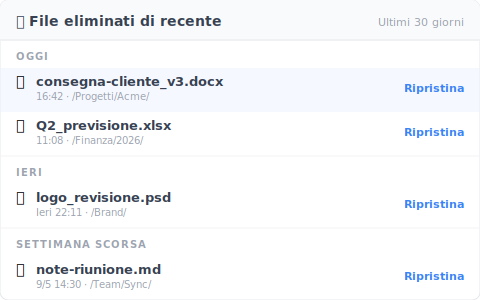

# 【2026 Gestione file】Recuperare file cancellati: 4 casi in cui il software di recupero fallisce

> Hai premuto Delete e il Cestino è vuoto? Smonta il meccanismo SSD TRIM e i punti ciechi dei software di recupero, e scopri perché la prevenzione batte la forense ogni volta.

## Indice

- [Il colpo letale che il software di recupero non ammette: SSD + TRIM](#trim)
- [4 casi in cui il file non è mai finito nel Cestino](#scenarios)
- [Il recupero davvero affidabile vive a livello del file](#file-layer)
- [Limiti onesti: quello che Keeply non fa](#limits)

---

Hai premuto Delete. Apri il Cestino. È vuoto.

Cerchi "recuperare file cancellati" su Google. La prima pagina ti dice di scaricare Recoverit o Disk Drill. Aspetta un attimo. Prima di costruire Keeply ho comprato anch'io una licenza di Recoverit, cercando di salvare foto di famiglia che avevo cancellato per sbaglio. Salto subito alla conclusione: nella maggior parte dei casi, quei 60 dollari di licenza non te li riportano indietro.

La maggior parte delle volte, il sistema operativo non ha lasciato alcuna traccia da cui recuperare.

---

## Il colpo letale che il software di recupero non ammette: SSD + TRIM {#trim}

Quello che fa il software di recupero è una "scansione dei settori (Sector Scanning)" — spazza il disco alla ricerca di byte non sovrascritti per provare a riassemblare i file. Dieci anni fa nell'era HDD aveva senso. Sui computer moderni, quella strada è praticamente chiusa.

La maggior parte dei computer moderni usa SSD (Solid-State Drive), e da Windows 7 in poi TRIM è abilitato per impostazione predefinita. Quando cancelli un file, il sistema operativo invia immediatamente il comando TRIM all'SSD per marcare quel blocco come riutilizzabile.

Quindi quando il software di recupero fa la scansione, vede solo zeri. La società di recupero dati Hetman lo ha detto senza giri di parole: "Se una società di recupero afferma di poter tirare fuori file cancellati da un SSD con TRIM attivo, o è incompetente o sta mentendo al cliente." ([articolo ufficiale di Hetman](https://hetmanrecovery.com/recovery_news/data-recovery-is-impossible-ssd-cloud-and-online-services.htm)) Io stesso ne ho poi parlato con vari ingegneri del recupero dati, e la risposta è sempre stata la stessa.

A questo si aggiunge che Windows Update, la sincronizzazione cloud e la cache del browser scrivono ogni minuto nuovi dati sui settori. Ogni ora che aspetti dopo la cancellazione, la probabilità che i settori siano stati sovrascritti sale a picco. Se sul disco è attivo anche BitLocker, la probabilità di recupero è sostanzialmente zero.

---

## 4 casi in cui il file non è mai finito nel Cestino {#scenarios}

Oltre ai limiti hardware, ci sono 4 scenari quotidiani in cui il file bypassa completamente il Cestino e svanisce sul posto:

1. **La trappola del disco condiviso**: hai cancellato il file su un NAS, SharePoint o un disco di rete aziendale. Il sistema lo cancella direttamente — non torna nel Cestino locale ([documento ufficiale Microsoft](https://learn.microsoft.com/en-us/windows/win32/shell/recycle-bin)). Il disastro classico del team: "Pensavo di poterlo riprendere dal Cestino, l'IT mi ha detto che è sparito direttamente dal NAS."
2. **Hai sbagliato e premuto Shift+Canc**: è il design nativo del sistema operativo. Con quella scorciatoia è cancellazione fisica senza traccia.
3. **Il cestino del cloud è scaduto**: OneDrive 30 giorni di default, Google Drive 30 giorni, Dropbox Basic 30 giorni. Superata la finestra, anche l'endpoint cloud lo cancella ([documento ufficiale OneDrive](https://support.microsoft.com/en-us/office/restore-deleted-files-or-folders-in-onedrive-949ada80-0026-4db3-a953-c99083e6a84f)).
4. **Hai svuotato il Cestino ieri**: per il sistema operativo il comando di pulizia è finito, e quel file è completamente fuori dal tracciamento.

In sintesi: i software di recupero funzionano nella finestra stretta "vecchio HDD + appena cancellato + nessuna nuova scrittura". In ufficio non incontri quella condizione.

---

## Il recupero davvero affidabile vive a livello del file {#file-layer}

Smetti di rincorrere la "forense del disco" a posteriori. La vera risposta è stendere un silenzioso "livello di registrazione delle versioni" sopra il file system.

È qui che si colloca Keeply. Non si appoggia al cloud né a dischi esterni — ogni volta che premi salva, tiene in silenzio una versione in background.

- **Resiste ai dischi condivisi**: anche se lavori su NAS o SharePoint, la cronologia rimane.
- **Offline-first**: non serve sincronizzazione sempre attiva.
- **Niente scogliera dei 30 giorni**: nessun tetto rigido di conservazione cloud; la versione di tre mesi fa è ancora sulla timeline.

Non solo cronologia versioni. Keeply ha anche un pannello separato "Eliminati di recente" che elenca i file che hai cancellato negli ultimi 30 giorni, raggruppati per quando li hai eliminati:

Non devi prima ricordare quando hai cancellato qualcosa — apri il pannello, scorri i nomi, clicca "Ripristina" a destra e il file torna al suo posto originale. Rispetto a scavare nel cestino di sistema, questa via ti prende prima che tu finisca per premere Cmd+S in preda al panico su qualcos'altro.

Per la teoria più profonda del design della cronologia delle versioni, vedi il [Pillar: guida completa alla gestione delle versioni dei file](/it/post/file-version-management-complete-guide/).

---

## Limiti onesti: quello che Keeply non fa {#limits}

Come sempre, devo essere onesto sui limiti di Keeply:

- **Non recupera schede SD o foto del telefono**: è un altro dominio; cerca un'app specializzata.
- **Non protegge dal guasto fisico dell'intero disco**: è il compito dei tool di backup — compra un disco esterno e segui la [regola di backup 3-2-1](/it/post/3-2-1-backup-rule/).
- **Non recupera i file cancellati prima dell'installazione**: Keeply è uno strumento di prevenzione, non un software forense. Quello che è stato cancellato prima dell'installazione resta irraggiungibile.

Prima che il prossimo Delete causi un disastro, [installa Keeply oggi](/it/post/install-keeply-windows-mac/).

---

> Riguardo all'autore: Ting-Wei Tsao, fondatore di Keeply.
> [LinkedIn](https://www.linkedin.com/in/ting-wei-tsao-b57480152/)
