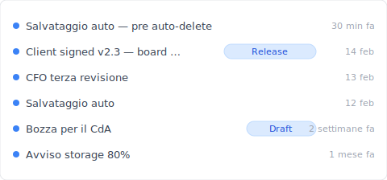
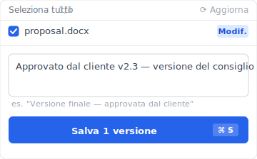
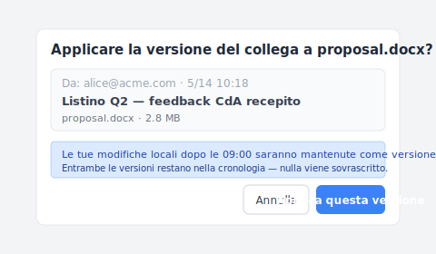

# 【2026 Gestione file】SharePoint cronologia versioni: limite di 500 + costo nascosto del eliminazione automatica

> Microsoft ha dato agli IT admin un pulsante salva-storage nel 2024. Conviene sapere cosa si perde prima di premerlo.

"Hai appena impostato eliminazione automatica a 100 su SharePoint ieri. Oggi il cliente chiede 'quella versione di 3 mesi fa'. Apri la cronologia — restano solo le ultime 100 versioni. Le altre 250 sono sparite, Microsoft le ha già eliminate per te."

Non è un bug. È il meccanismo descritto chiaramente in [Microsoft Learn](https://learn.microsoft.com/en-us/sharepoint/document-library-version-history-limits): limite di 500 versioni principali + le impostazioni eliminazione automatica (500 / 100 / 50 / cutoff in 4 livelli) lanciate a fine 2024. Questo articolo analizza i 3 meccanismi di SharePoint cronologia versioni + **cosa si perde dopo aver attivato l'eliminazione automatica**, poi come [Keeply](https://keeply.work) intercetta gli scenari post-cap.

## Contenuti

1. [I 3 meccanismi di cronologia versioni SharePoint](#three-mechanisms)
2. [Limite di 500 versioni principali](#500-cap)
3. [Eliminazione automatica a 4 livelli: 500 / 100 / 50 / cutoff costo reale](#auto-delete)
4. [Quota storage SharePoint: ridurre a 100 quanto risparmia davvero?](#storage-quota)
5. [Come Keeply evita che la cronologia SharePoint venga mangiata dall'eliminazione automatica](#keeply-timeline)
6. [Keeply colma il divario: Blocco Release + note per file](#keeply-fills)
7. [3 scenari in cui non hai bisogno di Keeply con SharePoint](#when-not-needed)
8. [FAQ](#faq)

---

## I 3 meccanismi di cronologia versioni SharePoint {#three-mechanisms}

SharePoint dice "cronologia versioni" ma in realtà sono 3 cose diverse mescolate:

| Meccanismo | Cos'è | Limite | Trigger |
|---|---|---|---|
| **Versione principale** | Versione completa per salvataggio | **500** ([MS Learn](https://learn.microsoft.com/en-us/sharepoint/document-library-version-history-limits)) | Automatico ad ogni salvataggio |
| **Versione secondaria** | Stato bozza | 511 (pool aggiuntivo) | Salvataggio bozza |
| **Impostazione eliminazione automatica** | IT admin imposta limite più stringente | 500 / 100 / 50 / cutoff | Centro amministrativo |

3 cose diverse — confuse come una, cerchi nel livello sbagliato.

## Limite di 500 versioni principali {#500-cap}

[Microsoft Learn](https://learn.microsoft.com/en-us/sharepoint/document-library-version-history-limits): le librerie documenti SharePoint Online mantengono fino a **500 versioni principali** per file. Con versioning principale/secondario, fino a 511 secondarie in più.

**Chi raggiunge il limite**:

- Team di 5 alternato su una proposta, 3 salvataggi/giorno = ~66 versioni/mese → **circa 7-8 mesi** al limite
- IT admin che fa pulizia riducendo a 100 = velocità di raggiungimento × 5

## Eliminazione automatica a 4 livelli: costo reale {#auto-delete}

Microsoft ha lanciato a fine 2024 le [impostazioni eliminazione automatica](https://learn.microsoft.com/en-us/sharepoint/document-library-version-history-limits). Gli IT admin scelgono:

| Livello | Versioni mantenute | Adatto a | Cosa si perde |
|---|---|---|---|
| **500 (predefinito)** | Ultime 500 | Storage abbondante | 1 versione più vecchia dopo il 501° |
| **100** | Ultime 100 | Storage compresso | Auto-elim. dopo 101° |
| **50** | Ultime 50 | Storage in crisi | Perdita storico massiccia |
| **Cutoff temporale** | Oltre N giorni eliminato | Conformità retention | Pre-cutoff irrecuperabile |

**Il rischio non documentato**: l'eliminazione automatica è impostazione a livello site-collection. Gli end user non lo vedono né vengono notificati. 3 mesi dopo, quando non trovano una versione, pensano che SP sia rotto.

## Quota storage SharePoint: ridurre a 100 quanto risparmia? {#storage-quota}

`proposal.docx` medio 1.5 MB × 500 versioni principali = 750 MB / file. 500 documenti attivi × 750 MB = 375 GB → vicino al limite 1 TB tenant.

**Dopo eliminazione automatica 100**: 1.5 MB × 100 = 150 MB / file → 500 file × 150 MB = 75 GB → 7.5% tenant. 5× risparmio storage.

**Ma**: hai perso l'80% dello storico. La versione approvata dal consiglio 3 mesi fa potrebbe essere tra le 400 eliminate.

## Come Keeply evita che la cronologia SharePoint venga mangiata dall'eliminazione automatica {#keeply-timeline}

James è l'IT admin part-time di una piccola azienda. Un team di 5 persone usa SharePoint Online per collaborare su `proposal.docx`. In 6 mesi hanno accumulato oltre 200 versioni, la quota storage SharePoint è all'80%, ha appena impostato eliminazione automatica a 100 nel centro amministrativo — il prossimo mese la quota tornerà nella fascia di sicurezza.

Ma oggi il cliente chiede improvvisamente "la versione approvata dal consiglio del 14 febbraio". Apre la cronologia SP. Solo le ultime 100 versioni, quella del 14 febbraio è già auto-eliminata.

Con [Keeply](https://keeply.work) non sarebbe successo. Lo stesso `proposal.docx` nella timeline Keeply:

"Client signed v2.3 — approvato dal consiglio" ha la propria riga con tag Release — è James il 14 febbraio, dopo l'approvazione del consiglio, premendo "Salva versione" in Keeply e scrivendo una nota:

Scrivi "Client signed v2.3 — approvato dal consiglio", salva la versione. 6 mesi dopo nella timeline Keeply il tag è lì — **non influenzato dall'eliminazione automatica SP, mai eliminato automaticamente**.

Due azioni in totale:

1. **Salva** — Ctrl+S in Word come al solito. SharePoint sincronizza al cloud (normale). Keeply controlla in background entro 30 min, vede la modifica, salva una versione nella **propria timeline**.
2. **Segna milestone** — nei momenti importanti (approvazione consiglio / cliente / rilascio), premi "Salva versione" in Keeply e scrivi una nota.

## Keeply colma il divario {#keeply-fills}

La situazione di James: team di 5 + storage SP stretto + vuole pulizia ma teme di perdere versioni importanti.

[Keeply](https://keeply.work) gli dà 3 cose in un unico strumento:

- **Blocco Release**: il giorno dell'approvazione del consiglio, James preme Keeply "Salva versione" e tagga "Client signed v2.3" — quella versione è bloccata su **locale + propria posizione di backup Keeply**, non influenzata dall'eliminazione automatica SP, conservata per sempre
- **Note per file**: ogni versione porta 1-2 righe di nota. 3 mesi dopo nella timeline vede "CFO terza revisione", "approvazione consiglio" tag — niente indovinare tra 100 versioni SP
- **Portabilità tra strumenti**: Keeply non dipende da SP. Passando a Dropbox / NAS la timeline resta locale + nella posizione di backup Keeply

SP continua a fare sincronizzazione collaborativa + storage compresso a 100, Keeply offre cronologia versioni illimitata per file + blocco versioni importanti.

Un'altra mossa che spunta spesso nella collaborazione a 5: un collega ha modificato lo stesso `proposal.docx` su SP e tu vuoi applicare la sua versione sopra alla tua copia modificata in locale. La finestra "applica versione del collega" di Keeply appare così:

Nota la riga blu di suggerimento — le tue modifiche locali dopo le 09:00 non vengono sovrascritte, vengono salvate come versione separata e restano entrambe nella cronologia. Niente più "ultima_versione.docx" che gira via email, niente paura di schiacciare le tue modifiche con la copia sbagliata.

## 3 scenari in cui non hai bisogno di Keeply con SharePoint {#when-not-needed}

**Archivio conformità aziendale**. SOX, HIPAA, GDPR — usa [Microsoft 365 Backup](https://www.microsoft.com/en-us/microsoft-365/business/microsoft-365-backup) / Veeam / Acronis.

**Sotto 500 versioni + nessun bisogno di eliminazione automatica, team piccolo**. Se la quota storage non è nemmeno a metà, l'eliminazione automatica non serve — il 500 predefinito di SP è sufficiente, Keeply è eccessivo.

**Flusso 100% mobile**. Keeply è desktop-first, leggero su mobile.

## FAQ {#faq}

**Q1: Quante versioni mantiene SharePoint per file?** 500 principali + 511 secondarie.

**Q2: Cos'è l'eliminazione automatica SharePoint?** Funzione Microsoft di fine 2024, 4 livelli IT admin.

**Q3: Uguale alla cronologia versioni OneDrive?** Storage di base/meccanismo identici, scenari d'uso diversi.

**Q4: Versione di 6 mesi fa dopo eliminazione automatica?** Strumenti esterni per preservare versioni chiave — [Keeply](https://keeply.work) Blocco Release.

**Q5: Quota stretta senza eliminazione automatica?** Acquista storage / strumenti esterni.

**Q6: Conflitto con SharePoint?** No, funziona in parallelo.

## Vedi anche

- [Guida completa alla gestione versioni dei file](/it/post/file-version-management-complete-guide/)
- [Cronologia versioni OneDrive: limite 500 + finestra 30 giorni](/it/post/onedrive-version-history/) — controparte cloud personale della stessa famiglia MS
- [Limiti cronologia versioni Excel](/it/post/excel-version-history-limits/)

---

James ha impostato eliminazione automatica 100 nel centro amministrativo SP. Il prossimo mese lo storage tornerà nella zona sicura.

Ma oggi il cliente chiede la versione approvata dal consiglio — SP l'ha già eliminata per lui.

Microsoft ha messo il trade-off nei documenti. Non hai bisogno che SharePoint non invecchi — hai bisogno di uno strumento che catturi lo storico quando SP inizia a comprimere lo storage.

---

> Sull'autore: Ting-Wei Tsao, fondatore di [Keeply](https://keeply.work).
> [LinkedIn](https://www.linkedin.com/in/ting-wei-tsao-b57480152/)
